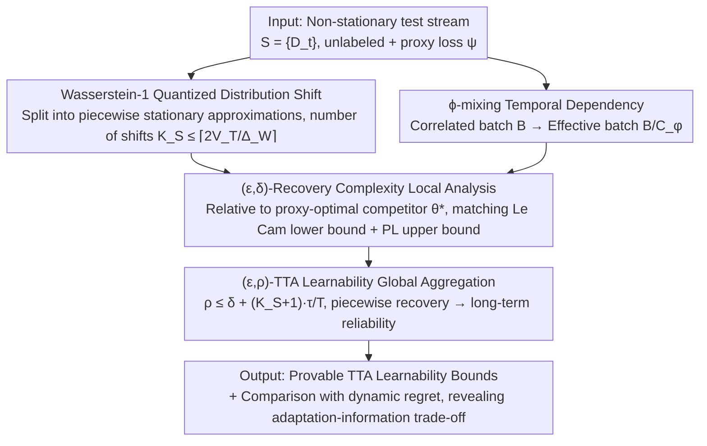

# On the Learnability of Test-Time Adaptation: A Recovery Complexity Perspective

**Conference**: ICML 2026  
**arXiv**: [2605.28057](https://arxiv.org/abs/2605.28057)  
**Code**: None  
**Area**: Learning Theory / Test-Time Adaptation / Non-stationary Online Learning  
**Keywords**: TTA learnability, recovery complexity, Wasserstein quantization, $\phi$-mixing, minimax lower bounds

## TL;DR
This paper establishes the first theoretical framework for Test-Time Adaptation (TTA) learnability. It introduces $(\epsilon, \delta)$-Recovery Complexity to measure the time required to reduce excess risk to $\epsilon$ after a distribution shift. By extending local recovery to non-stationary test streams via $(\epsilon, \rho)$-TTA Learnability, the authors derive matching minimax upper and lower bounds, revealing the "adaptation speed vs. information constraint" trade-off in TTA.

## Background & Motivation

**Background**: TTA has achieved empirical success in vision, tabular, and NLP tasks (e.g., Tent, CoTTA, NOTE, ODS). The paradigm involves updating models online using only unlabeled test data via a proxy loss $\psi$. However, these methods often fail under complex distribution shifts, leading the community to question the conditions under which TTA remains reliable.

**Limitations of Prior Work**: Existing online learning theories (regret frameworks) characterize cumulative performance rather than instantaneous reliability (e.g., "how long to recover after a shift"). Existing TTA theoretical analyses (e.g., AdaNPC or ATTA) impose restrictive assumptions, such as memory-based architectures or access to active labels, which do not hold in general unlabeled streaming scenarios.

**Key Challenge**: The goal of TTA is essentially to maintain acceptable instantaneous risk at every time step. Current theoretical frameworks fail to model either post-shift recovery or the information constraints imposed by the mismatch between the proxy loss and the true loss on unlabeled streams.

**Goal**: To construct a unified framework capable of expressing (i) continuous and abrupt distribution shifts, (ii) temporal correlations, (iii) proxy-task mismatch, and (iv) post-shift recovery speed, while providing matching minimax bounds under a stochastic proxy-gradient oracle.

**Key Insight**: Discretize the test stream into "piecewise stationary" approximations using the Wasserstein-1 distance. Analyze each segment as an independent recovery problem, characterize intra-batch temporal dependencies using $\phi$-mixing coefficients, and derive information-theoretic lower bounds using Le Cam’s method.

**Core Idea**: Transform instantaneous reliability into an analyzable metric called "recovery complexity" $\tau(\epsilon, \delta)$. Aggregate multi-segment recovery behaviors into a global $(\epsilon, \rho)$-TTA Learnability, reducing the TTA learnability problem to sample/batch complexity analysis in classic stochastic optimization.

## Method

### Overall Architecture
The framework consists of four connected components: (1) Test stream formalization using Wasserstein-1 quantized distribution shifts and $\phi$-mixing temporal dependencies; (2) Definition of the competitive target $\theta_t^\star \in \arg\min_{\theta\in\mathcal{N}_r(\theta_1)} \psi_t(\theta)$ and its true task risk $R_t:=\ell_t(\theta_t^\star)$; (3) Local analysis of minimax bounds for $(\epsilon, \delta)$-recovery complexity; (4) Global aggregation of recovery behavior into $(\epsilon, \rho)$-TTA Learnability compared against dynamic regret. The input is a non-stationary stream $\mathcal{S}=\{D_t\}_{t=1}^{T}$, and the output is a provable bound regarding TTA learnability parameters ($\alpha$-alignment, $\zeta$-mismatch bias, batch size $B$, mixing constant $C_\phi$, and drift magnitude $\Delta_W$).

### Key Designs

**1. Wasserstein-1 Quantized Distribution Shift Approximation**
The authors discretize the trajectory $\{\mathcal{P}_t\}$ into piecewise stationary approximations $\{\tilde{\mathcal{P}}_t\}$ such that the approximation error is bounded by $\Delta_W/2$. A greedy algorithm maintains an anchor; if the $W_1$ distance between $\mathcal{P}_t$ and the anchor is $\le \Delta_W/2$, the anchor is retained. Otherwise, a shift is declared ($\tilde{S}_t=1$) and the anchor is reset. The total number of shifts satisfies $\tilde{K}_S(T) \le \lceil 2V_T/\Delta_W\rceil$, where $V_T$ is the total variation. This reduction simplifies global non-stationary analysis into "per-segment recovery analysis + shift counting."

**2. $\phi$-mixing Temporal Dependency and Effective Batch Size**
Sample dependencies within a batch (e.g., video frames) are modeled using $\phi$-mixing coefficients. For a batch of size $B$ with geometric decay $\phi(i)\le \varrho^i$, the variance of the batch-mean gradient is equivalent to an i.i.d. batch of size $B_{\text{eff}} = B/C_\phi$, where:
$$C_\phi = 1 + \frac{4\varrho^{1/2}}{1-\varrho^{1/2}}$$
This condenses stochastic process properties into a single scalar $C_\phi$ for complexity bounding.

**3. Minimax Bounds for $(\epsilon,\delta)$-Recovery Complexity**
Recovery complexity is defined as $\tau(\epsilon,\delta):=\inf\{t: \sup_{u\ge t}\mathbb{P}(\mathcal{E}_u>\epsilon)\le \delta\}$, where $\mathcal{E}_t$ is the excess risk. Using Le Cam’s method with two points at distance $\Delta_W$, the authors prove that any stochastic proxy-gradient oracle requires $\tau \ge \Omega\big(\frac{C_\phi}{B}\cdot\frac{1}{\alpha(\sqrt{\zeta+2\alpha\epsilon}+\sqrt{\zeta})^2}\big)$. An upper bound for a simple TTA baseline under $L$-smooth and PL conditions matches this order. This reveals that $\zeta > 0$ (proxy mismatch) creates an error floor, and $\tau$ scales with $1/\alpha^2$.

**4. $(\epsilon,\rho)$-TTA Learnability**
To ensure long-term reliability, the authors define learnability as the proportion of time steps where excess risk exceeds $\epsilon$:
$$\frac{1}{T}\sum_{t=1}^{T}\mathbb{P}\big(\ell_t(\theta_t)-R_t>\epsilon\big)\le\rho$$
Theorem 4.3 shows that if an algorithm has $(\epsilon', \delta)$-recovery complexity $\tau$ on each segment, the stream is $(\epsilon, \rho)$-learnable with:
$$\rho\le\delta+\frac{(\tilde{K}_S(T)+1)\,\tau(\epsilon',\delta)}{T}$$
This connects local recovery speed to global reliability and provides a contrast to dynamic regret, which may grow linearly under persistent shifts.

### Loss & Training
The study is theoretical and focuses on a TTA baseline using stochastic proxy-gradient descent on $\psi$ with step size $\eta$ within a local neighborhood $\mathcal{N}_r(\theta_1)$. Key assumptions include $(\alpha, \zeta)$-Alignment (Assump. 2.1), $L$-smoothness + PL condition + bounded variance (Assump. 2.2), and Wasserstein quantization + $\phi$-mixing (Assump. 2.4/2.7).

## Key Experimental Results

### Main Results
The following table compares the proposed framework's expressivity against existing theoretical tools across key TTA dimensions.

| Framework | Instantaneous Reliability | Unlabeled Proxy Mismatch | Stream Morphology | Time-correlated Batch | Minimax Bounds |
| :--- | :---: | :---: | :---: | :---: | :---: |
| Static Regret (Shalev-Shwartz) | No | No | Fixed comparator | No | No |
| Dynamic Regret (Zhao et al.) | Partial | No | Arbitrary variation | Weak | No |
| AdaNPC (Zhang et al.) | No | Memory-based only | Covariate only | No | No |
| ATTA (Gui et al.) | Partial | Requires active label | General | No | No |
| **Ours** | **Yes** | **$\alpha, \zeta$ Explicit** | **$W_1$ Quantized** | **$\phi$-mixing ($C_\phi$)** | **Le Cam Match** |

### Ablation Study
Impact of various factors on the recovery complexity lower bound (based on Remark 3.4–3.7).

| Configuration | Lower Bound Magnitude | Description |
| :--- | :--- | :--- |
| Full bound | $\Omega\big(\frac{C_\phi}{B\alpha}(\sqrt{\zeta+2\alpha\epsilon}+\sqrt{\zeta})^{-2}\big)$ | Full matching order lower bound |
| $\zeta=0$ (Perfect alignment) | $\Omega(C_\phi/(B\alpha^2\epsilon))$ | Matches classic stochastic optimization |
| $\varrho=0$ (Independent batch) | $\Omega(1/(B\alpha^2\epsilon))$ | Temporal correlation term disappears |
| Decreasing $\alpha$ | $\tau \propto 1/\alpha^2$ | Weaker alignment leads to slower recovery |
| Changing $\Delta_W$ | Unchanged | Drift magnitude triggers recovery but not difficulty |

### Key Findings
- **Proxy mismatch $\zeta$ creates an error floor**: Complexity does not vanish as $\epsilon \to 0$, implying an irreducible minimum risk for unlabeled TTA.
- **Batch size $B$ and $\phi$-mixing $C_\phi$**: Increasing batch size cannot compensate for high temporal correlation; the effective batch $B/C_\phi$ is the governing factor.
- **Quadratic impact of alignment $\alpha$**: Better proxy loss design (e.g., improved entropy or auxiliary supervision) yields high returns in adaptation speed.
- **Learnability vs. Dynamic Regret**: Learnability requires recovery below $\epsilon$ per segment, whereas regret tracks cumulative performance.

## Highlights & Insights
- The use of Wasserstein-1 quantization to reduce non-stationary analysis to piecewise stationary recovery is a powerful technique applicable to other streaming learning scenarios like continual learning or online RL.
- Condensing temporal dependencies into a single scalar $C_\phi$ allows time correlation to be directly compared with batch size and alignment strength.
- The existence of the $\zeta$-induced error floor provides a formal explanation for the failure of self-training or pseudo-labeling in TTA under high distribution shift.

## Limitations & Future Work
- Analysis is restricted to a local neighborhood $\mathcal{N}_r(\theta_1)$ and assumes local PL conditions, which may not hold under catastrophic shifts.
- The upper bound relies on a simplified TTA baseline, leaving a gap between theory and advanced methods like teacher-student or BN-only updates.
- Lacks verification on standard TTA benchmarks (e.g., CIFAR-C/ImageNet-C) to quantify complexity factors empirically.

## Related Work & Insights
- **vs. Dynamic Regret**: While dynamic regret tracks total loss, TTA Learnability focuses on the fraction of time steps spent in a high-risk state.
- **vs. AdaNPC**: Moves beyond memory-based non-parametric classifiers to a general algorithm-class level using stochastic gradient oracles.
- **vs. ATTA**: Avoids the requirement for active labels, explicitly modeling the proxy-task mismatch $\zeta$ as the primary source of difficulty in unlabeled settings.

## Rating
- **Novelty**: ⭐⭐⭐⭐⭐ First theoretical framework for TTA learnability; elegant reduction of non-stationary streams.
- **Experimental Thoroughness**: ⭐⭐ Purely theoretical; lacks empirical validation.
- **Writing Quality**: ⭐⭐⭐⭐ Clear structure with logical flow from definitions to theorems.
- **Value**: ⭐⭐⭐⭐ Provides a formal language for the TTA community to design better proxy losses or reset strategies.

<!-- RELATED:START -->

## Related Papers

- [\[ICML 2026\] MMD-Balls as Credal Sets: A PAC-Bayesian Framework for Epistemic Uncertainty in Test-Time Adaptation](mmd-balls_as_credal_sets_a_pac-bayesian_framework_for_epistemic_uncertainty_in_t.md)
- [\[ICML 2026\] Semi-Supervised Noise Adaptation: Transferring Knowledge from Noise Domain](semi-supervised_noise_adaptation_transferring_knowledge_from_noise_domain.md)
- [\[ICML 2025\] Positional Attention: Expressivity and Learnability of Algorithmic Computation](../../ICML2025/learning_theory/positional_attention_expressivity_and_learnability_of_algorithmic_computation.md)
- [\[NeurIPS 2025\] The Parameterized Complexity of Computing the VC-Dimension](../../NeurIPS2025/learning_theory/the_parameterized_complexity_of_computing_the_vc-dimension.md)
- [\[NeurIPS 2025\] The Structural Complexity of Matrix-Vector Multiplication](../../NeurIPS2025/learning_theory/the_structural_complexity_of_matrix-vector_multiplication.md)

<!-- RELATED:END -->
