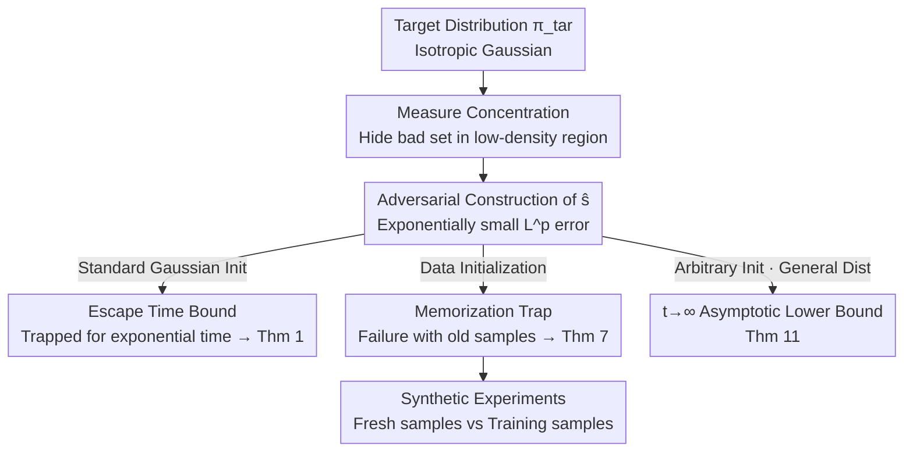

# On the Robustness of Langevin Dynamics to Score Function Error

**Conference**: ICML 2026  
**arXiv**: [2603.11319](https://arxiv.org/abs/2603.11319)  
**Code**: None (Theory + Synthetic Experiments)  
**Area**: Learning Theory / Generative Models / Score-based Sampling  
**Keywords**: Langevin Dynamics, Diffusion Models, Score Estimation Error, Total Variation Distance, Data Initialization

## TL;DR
This paper proves a counter-intuitive negative result: even when the $L^2$ (or even $L^p$) estimation error of the score function is arbitrarily small, Langevin dynamics in high dimensions may fail to sample from the target distribution in any polynomial time (with a Total Variation distance as high as $1-e^{-\Omega(d)}$). Conversely, diffusion models succeed in polynomial time under similar conditions—arguing from a new perspective that "diffusion models are more reliable than Langevin dynamics" and providing a practical warning: when using data initialization, one must use fresh samples not involved in training the score.

## Background & Motivation
**Background**: A massive number of sampling algorithms in statistics and machine learning are "score-based"—driving a random process via the score function $\nabla\log\pi_{\rm tar}$ to approximate the target distribution $\pi_{\rm tar}$. Two representatives are: Langevin dynamics (the classic SDE $\mathrm dX_t=\nabla\log\pi_{\rm tar}(X_t)\mathrm dt+\sqrt2\,\mathrm dB_t$, which converges to $\pi_{\rm tar}$ under mild conditions in continuous time) and diffusion models (performing time reversal using a sequence of annealed scores $\nabla\log\pi_0,\dots,\nabla\log\pi_k$).

**Limitations of Prior Work**: In practice, the score function is unknown and must be estimated as $\hat s$ from data using score matching, which only guarantees accuracy in the $L^2$ (or $L^p$) sense. For diffusion models, this problem has been elegantly solved: if the weighted average $L^2$ error of all annealed scores $\varepsilon_{\rm score}$ is small, then $\mathrm{TV}(\pi_{\rm tar},\widehat{\pi_{\rm tar}})\lesssim\varepsilon_{\rm score}$, succeeding in polynomial time. However, for Langevin dynamics, the **Key Challenge** of whether "small $L^2$ score error is sufficient for success" remained unanswered. Existing works either studied $L^\infty$ error (which is much harsher and inconsistent with score matching) or provided $L^2$ error bounds (Lee et al. 2022) that often require exponentially small errors in terms of dimension.

**Key Challenge**: The success of diffusion models relies on "accuracy of **all annealed scores**," whereas Langevin dynamics only uses the "accuracy of the **target score itself** $\nabla\log\pi_{\rm tar}$." The latter is often easier to learn for certain distributions. The question is: is a precise $L^2/L^p$ estimate of $\nabla\log\pi_{\rm tar}$ alone enough for successful sampling via Langevin dynamics?

**Goal**: To answer this core question—with a **strong negative** response. The authors demonstrate that Langevin dynamics fails even when the target distribution is a simple isotropic Gaussian, $\hat s$ is Lipschitz, and initialization is natural.

**Core Idea**: Use high-dimensional measure concentration to "hide a bad set"—tampering with $\hat s$ in a region where the mass of $\pi_{\rm tar}$ is exponentially small (directing the gradient field toward a false attractor). Thus, the $L^p$ error (weighted by $\pi_{\rm tar}$) remains arbitrarily small, but Langevin trajectories starting from natural initializations are trapped in the incorrect region for exponentially long, keeping the TV distance extremely far from $\pi_{\rm tar}$.

## Method

### Overall Architecture
This is a constructive lower-bound paper: the core approach is to **adversarially construct a score estimate $\hat s$** that satisfies two seemingly contradictory conditions: (a) the $L^p$ error relative to $\pi_{\rm tar}$ is exponentially small $e^{-\Omega(d)}$; (b) the Langevin SDE running on it maintains a TV distance $\geq 1-e^{-\Omega(d)}$ within any $\mathrm{poly}(d)$ time. The entire argument is driven by high-dimensional measure concentration: in high dimensions, almost all mass of the target distribution $\pi_{\rm tar}=N(\mu,I_d)$ is concentrated on a thin spherical shell of radius $\sqrt d$. Thus, a bad set in the "interior low-density region" contributes almost nothing to the $L^p$ error but can trap trajectories.

The paper provides three lower bounds according to the initialization method: **Standard Gaussian Initialization (Thm 1)** is the cleanest counterexample; **Data Initialization (Thm 7)** is the most practically significant result, revealing the danger of "memorizing training samples"; **Arbitrary Initialization + General Target (Thm 11)** generalizes the negative conclusion to the $t\to\infty$ asymptotic limit. Finally, synthetic experiments (Section 4) verify the practical prescription.

### Key Designs

**1. Hiding the "Bad Set": Making $L^p$ error small yet failing (Thm 1)**

To address whether small $L^2$ error is sufficient, the authors provide a clean counterexample under standard Gaussian initialization. Let $\pi_{\rm tar}=N(\mu,I_d)$ where $\|\mu\|=7\sqrt d$. Define the score estimate $\hat s$ via a partition: $\hat s(x)=-\alpha x$ (directing to a false attractor at the origin, with a large constant $\alpha$) for $\|x\|\leq 4\sqrt d$, and $\hat s(x)=-(x-\mu)$ (the correct score) for $\|x\|\geq 5\sqrt d$, using a Lipschitz bump function $\psi$ for smooth transition. The key insight is that under $\pi_{\rm tar}$, the mass of $\{x:\|x\|\leq 5\sqrt d\}$ is **exponentially small** (as mass is concentrated at $\|x\|\approx 7\sqrt d$), while inside this bad set, $\|\hat s-\nabla\log\pi_{\rm tar}\|$ is at most polynomial. Thus, the $L^p$ error $\mathbb E_{\pi_{\rm tar}}[\|\hat s-\nabla\log\pi_{\rm tar}\|^p]^{1/p}\leq e^{-\Omega(d)}$ is arbitrarily small. However, starting from $X_0\sim N(0,I_d)$ (where $\|x_0\|\leq 1.1\sqrt d$ with exponentially high probability inside the bad set), the trajectory follows a scaled OU process $\mathrm d\bar X_t=-\alpha\bar X_t\mathrm dt+\sqrt2\mathrm dB_t$ with stationary distribution $N(0,\frac1\alpha I_d)$ until it escapes. Since $\alpha$ is large, the escape time $\tau(x_0)$ is exponential in $d$ (Lemma 4). For any $T\leq e^{c\,d/2}$, $\mathrm{TV}(\mathcal L(X_T),\pi_{\rm tar})\geq 1-e^{-\Omega(d)}$. The failure mechanism lies in **initialization from a low-density region**, where small $L^2$ error imposes almost no constraint on $\hat s$.

**2. The Memorization Trap in Data Initialization (Thm 7, Main Result)**

Standard Gaussian initialization might be critiqued as "unnatural." In practice, **Data Initialization**—starting from the empirical distribution $\frac1n\sum_i\delta_{x_i}$ of $n=\mathrm{poly}(d)$ i.i.d. samples from $\pi_{\rm tar}$—is more common. Thm 7 reveals that the robustness of this method (proven by Koehler & Vuong 2024) **only holds when using "fresh" samples (samples not used to learn $\hat s$)**. The authors construct an $\hat s$ that "memorizes training samples": when $x$ is far from all $x_i$, $\hat s(x)=-x$; when $x$ is near a training point $x_i$, $\hat s(x)=-\alpha(x-x_i)$ (trapping $x$ at $x_i$). Since $n$ samples are in "general position" (Definition 6), these small trapping regions are disjoint and lie in the low-density interior, keeping the $L^p$ error $\leq e^{-\Omega(d)}$. Starting from a training sample $x_i$ itself traps the trajectory for exponential time. This corresponds to the real-world phenomenon of overparameterized networks "memorizing training samples" in score matching. The practical warning is: **never initialize Langevin with samples used during score training.**

**3. Asymptotic Lower Bound for General Distributions (Thm 11)**

To show these are not Gaussian-specific artifacts, the authors generalize the negative result to a broad class of target distributions (Assumption 10: Lipschitz $\nabla\log\pi_{\rm tar}$, finite second moments, strictly positive density, dissipative conditions) and **arbitrary initialization**. Thm 11 proves that for any $\varepsilon_{\rm score},\varepsilon_{\rm TV}>0$, there exists a piecewise Lipschitz $\hat s$ such that $\mathbb E_{\pi_{\rm tar}}[\|\hat s-\nabla\log\pi_{\rm tar}\|^2]\leq\varepsilon_{\rm score}^2$, but for any initial distribution $\pi_0$, $\liminf_{t\to\infty}\mathrm{TV}(\pi_{\rm tar},\pi_t)\geq 1-\varepsilon_{\varepsilon_{\rm TV}}$. This is an **asymptotic** lower bound showing that small $L^2$ error is fundamentally insufficient to guarantee Langevin success.

### Mechanism: Why "Memorization" Kills Sampling
Suppose $\pi_{\rm tar}=N(0,I_d)$. 1000 training samples are used to learn $\hat s$, which overfits and memorizes each point. To generate new samples: (a) Starting from 30 **fresh** samples (not used in training), which lie in the "good region" of the $\sqrt d$ shell, $\hat s \approx -x$ is correct, and Langevin succeeds. (b) Starting from 30 **training** samples, each point falls into its "memorization trap," $\hat s$ sucks it in, and the trajectory cannot escape for exponential time. The same $\hat s$ and $L^2$ error lead to opposite outcomes based on initialization—this is the practical implication of Thm 7.

## Key Experimental Results

Synthetic experiments verify the qualitative predictions of Thm 7. Target distributions include $N(\mathbf 1,2I_d)$ ($d=50$) and a GMM $\frac12N(-\mathbf1,2I_d)+\frac12N(4\mathbf1,2I_d)$ ($d=25$). A 3-layer MLP is trained for 150,000 epochs on 1000 samples (duplicated 10 times to induce overfitting/memorization) using score matching with low DDPM noise. Langevin runs for 1000 steps.

### Main Results

| Algorithm | Initialization | Gaussian $\pi_{\rm tar}$ (KL) | GMM $\pi_{\rm tar}$ (Wasserstein) |
|-----------|----------------|--------------------------|---------------------------------|
| vanilla (Alg.1) | $N(0,I_d)$ Standard Gaussian | Close to fresh | Worst (poor GMM spectral gap) |
| fresh (Alg.2)   | 30 Fresh Samples | Best | Best |
| train (Alg.3)   | 30 Training Samples | Significantly worse than fresh | Still worse than fresh |

### Key Findings
- **Fresh vs. Training samples is the watershed**: As Thm 7 predicted, initializing from the training set (Alg.3) is consistently worse than fresh samples (Alg.2), especially under Gaussian targets.
- **Failure triggered by "Memorization"**: Overfitted scores turn training points into attractors; thus, trajectories only get trapped when starting from these points.
- **Vanilla fails on GMM**: Standard Gaussian initialization performs poorly on GMM due to spectral gap issues, showing dependence on target geometry.
- **Robustness to discretization**: Thm 1 and 7 extend to discrete algorithms like ULA via Girsanov's theorem (Remark 3, 8) and apply to strongly log-concave targets (Remark 5, 9).
- **Mixing time bottleneck**: Corollary 2 notes that for any $\|x_0\|\leq 1.1\sqrt d$, the mixing time to $\pi_{\rm tar}$ is at least $e^{c\,d/2}$. Failure is not just slowness; it is reachable impossibility in poly-time.

## Highlights & Insights
- **"Hidden Bad Sets" as a high-dimensional attack template**: Using measure concentration to hide errors in low-density regions allows the weighted $L^p$ error to remain small while trapping trajectories—a template reusable for other score-based/Markov chain algorithms.
- **Translating theoretical bugs into practical prescriptions**: Thm 7 provides an actionable suggestion (use fresh samples for data initialization) and maps to the real phenomenon of overparameterized networks memorizing training samples.
- **Endorsing Diffusion Models**: For the same $L^2$ error and poly-time, diffusion models succeed where Langevin fails because diffusion requires accuracy across all annealed scores, explaining the reliability gap.

## Limitations & Future Work
- **Adversarial/Worst-case focus**: $\hat s$ is manually constructed; it does not guarantee that actual score matching estimates are always this bad.
- **Idealized continuous time**: While Girsanov arguments extend to ULA, the claim that "most discretizations are TV-close to SDE" is evidence rather than a rigorous proof for all solvers.
- **Theoretical dimension threshold**: The theorem requires $d$ to be sufficiently large ($d \geq d_0$); while effects appear at $d=50, 200$, the precise quantitative relationship remains coarse.

## Related Work & Insights
- **vs. Diffusion Convergence (Chen 2023b/Benton 2024)**: They proved $\mathrm{TV}\lesssim\varepsilon_{\rm score}$ for diffusion models. This paper provides the negative counterpart for Langevin when "only the target score is accurate."
- **vs. Lee et al. (2022)**: Confirms their intuition that previous $L^2$ error bounds for Langevin are tight in the exponential constant.
- **vs. Koehler & Vuong (2024)**: Their success conclusion for data initialization is shown here to strictly require **fresh** samples.

## Rating
- Novelty: ⭐⭐⭐⭐⭐ First strong negative answer to $L^2$ robustness of Langevin.
- Experimental Thoroughness: ⭐⭐⭐⭐ Synthetic tests cover GMM and multiple inits.
- Writing Quality: ⭐⭐⭐⭐⭐ Strong narrative with clear mechanical explanations.
- Value: ⭐⭐⭐⭐⭐ Practical warnings for model training vs. sampling.

<!-- RELATED:START -->

## Related Papers

- [\[ICLR 2026\] Improved High-Dimensional Estimation with Langevin Dynamics and Stochastic Weight Averaging](../../ICLR2026/learning_theory/improved_high-dimensional_estimation_with_langevin_dynamics_and_stochastic_weigh.md)
- [\[ICLR 2026\] Convergence Dynamics of Over-Parameterized Score Matching for a Single Gaussian](../../ICLR2026/learning_theory/convergence_dynamics_of_over-parameterized_score_matching_for_a_single_gaussian.md)
- [\[ICML 2026\] Robustness of Mixtures of Experts to Feature Noise](robustness_of_mixtures_of_experts_to_feature_noise.md)
- [\[ICML 2026\] Catastrophic Forgetting is Low-Rank: A Function-Space Theory for Continual Adaptation](catastrophic_forgetting_is_low-rank_a_function-space_theory_for_continual_adapta.md)
- [\[ICML 2026\] Provably Data-driven Multiple Hyper-parameter Tuning with Structured Loss Function](provably_data-driven_multiple_hyper-parameter_tuning_with_structured_loss_functi.md)

<!-- RELATED:END -->
## Related Papers

- [\[ICML 2026\] Revenue Guarantees of No-Swap-Regret Dynamics in First Price Auctions](revenue_guarantees_of_no-swap-regret_dynamics_in_first_price_auctions.md)
- [\[ICML 2026\] Robustness of Mixtures of Experts to Feature Noise](robustness_of_mixtures_of_experts_to_feature_noise.md)
- [\[ICML 2026\] Towards Optimal Robustness in Learning-Augmented Paging](towards_optimal_robustness_in_learning-augmented_paging.md)
- [\[NeurIPS 2025\] On Agnostic PAC Learning in the Small Error Regime](../../NeurIPS2025/learning_theory/on_agnostic_pac_learning_in_the_small_error_regime.md)
- [\[ICML 2026\] Catastrophic Forgetting is Low-Rank: A Function-Space Theory for Continual Adaptation](catastrophic_forgetting_is_low-rank_a_function-space_theory_for_continual_adapta.md)

<!-- RELATED:END -->
