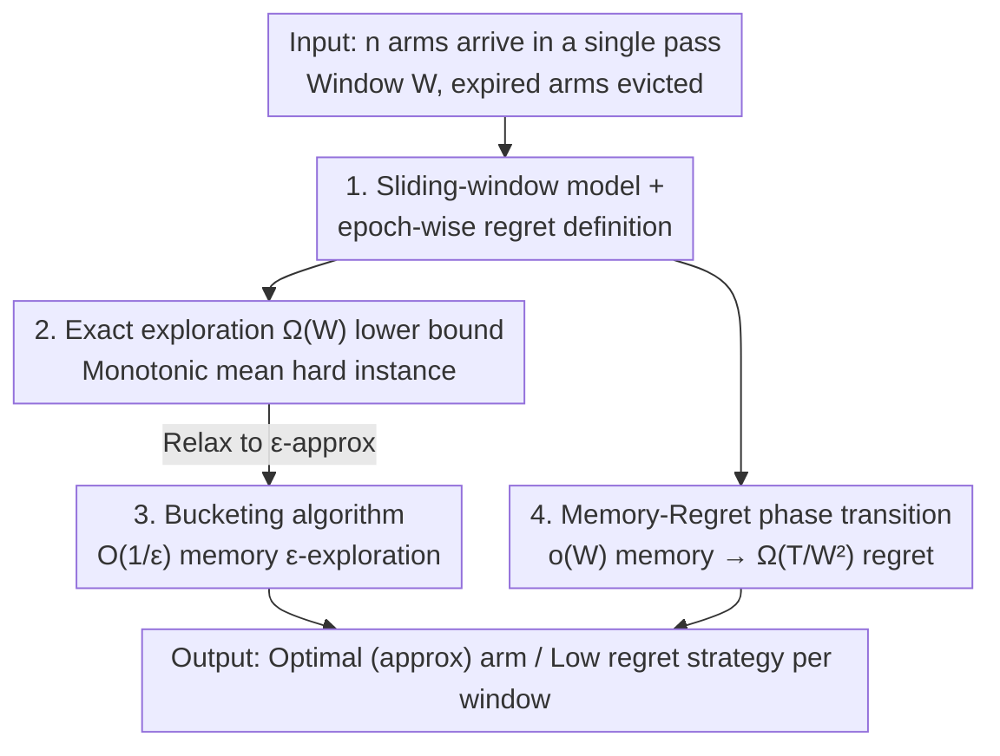

# Online Learning with Recency: Algorithms for Sliding-window Streaming Multi-armed Bandits

**Conference**: ICML 2026  
**arXiv**: [2606.08977](https://arxiv.org/abs/2606.08977)  
**Code**: https://github.com/jhwjhw0123/sliding-window-streaming-MABs  
**Area**: Learning Theory / Online Learning / Streaming Algorithms  
**Keywords**: Multi-armed Bandits, Sliding Window, Streaming Algorithms, Memory-Regret Trade-off, Pure Exploration

## TL;DR
This paper introduces the "recency effect" into streaming multi-armed bandits (MABs) by proposing a **sliding-window streaming MAB** model—where only the most recent $W$ arms are valid. It systematically characterizes the memory complexity bounds for pure exploration and regret minimization: exact identification of the optimal arm requires $\Omega(W)$ memory (essentially storing the entire window), while findig an $\varepsilon$-optimal arm requires only $O(1/\varepsilon)$ memory. Furthermore, regret minimization exhibits a sharp phase transition at $\Theta(W)$ memory.

## Background & Motivation

**Background**: Streaming multi-armed bandits (streaming MABs) have become a focal point in recent years. In this setting, $n$ arms arrive sequentially in a single pass, and algorithms operates under memory constraints (number of arms stored) significantly smaller than $n$. The objective is to perform pure exploration (finding the best arm) or regret minimization under these constraints. Existing work has provided near-tight trade-offs for memory-sample and memory-regret complexities.

**Limitations of Prior Work**: Existing streaming MABs almost exclusively target "global objectives"—finding the globally optimal arm in the entire stream. However, many real-world scenarios exhibit a strong **recency effect**, where only the most recently arrived arms are relevant. For example, movie recommendations must quickly adapt to trends; privacy compliance (GDPR requiring data retention only for "necessary duration," Apple's 6-month retention, or Google's 9-month limit on anonymous ad data) forces systems to actively discard expired data. In these contexts, current streaming pure exploration algorithms might output an arm that arrived early and is already "deprecated," while regret minimization algorithms might lock onto an arm that has already shifted out of the window.

**Key Challenge**: To characterize the recency effect, the most natural model is the **sliding-window stream**, where only the $W$ most recent items are valid, and expired items are evicted from memory. However, current streaming MAB techniques cannot be easily transferred to sliding windows. Algorithms based on "amortized sample complexity" (e.g., AW20, JHT+21) provide guarantees only for the global optimum; once the window moves and the optimal arm changes, their analyses collapse. Elimination-based algorithms lack efficient versions in the streaming setting. In other words, there is a fundamental separation between sliding windows and standard streaming.

**Goal**: To establish a complete theoretical framework for sliding-window streaming MABs: (1) Is pure exploration possible with sublinear memory? (2) How should regret be defined in a sliding window, and what is the trade-off between memory and regret?

**Key Insight**: The authors observe that streaming MAB algorithms fall into two categories: "amortized sampling" and "bucketing by empirical mean." The former is fragile to window shifts, while the latter is naturally compatible with sliding windows (expired arms can be dropped while bucket invariants still maintain $\varepsilon$-optimality). Consequently, the bucketing philosophy becomes the lever for positive results, while adversarial constructions of "monotonically decreasing means" serve as the basis for lower bounds.

**Core Idea**: Injecting "recency" constraints into MABs. The authors propose an $O(1/\varepsilon)$ memory approximate pure exploration algorithm using **bucketing + retaining only the newest arm per bucket**. They also prove that both exact exploration and low regret require $\Omega(W)$ memory through **hard instances with monotonically decreasing means**.

## Method

### Overall Architecture

This paper is not just "one algorithm" but a "theoretical characterization" consisting of four components: ① Formalization of the sliding-window streaming MAB model (including pure exploration and a new **epoch-wise regret** definition); ② An $\Omega(W)$ memory lower bound for exact pure exploration; ③ An efficient algorithm for $\varepsilon$-pure exploration (upper bound) with matching sample lower bounds; ④ The memory-regret phase transition for regret minimization. The input is a stream of $n$ arms arriving in a single-pass adversarial order with a window size $W$. The algorithm only accesses arms in memory and the current incoming arm; expired arms are immediately deleted. The output is either "return the (approximate) optimal arm at each window position" or "a sampling strategy with low regret."

The logic flows as follows: first, prove that exact exploration is nearly hopeless (requiring the window to be stored), then **relax** to $\varepsilon$-approximation to achieve positive results. Finally, shift focus to regret, first solving the definition problem (epoch-wise regret) and then demonstrating the sharp phase transition at $\Theta(W)$.

### Key Designs

**1. Decoupling Data Arrival & Sampling: Stripping "Environment Changes" from the Bandit**

This is the most critical conceptual difference compared to existing "evolving" bandits (non-stationary bandits, mortal bandits). In those models, the environment changes only due to the "pulling" action. In this paper, **the environment change is controlled by the data stream and is independent of pulling**. Formally, when the $t$-th arm arrives, the set of valid arms is $\{\texttt{arm}_i\}_{i=t-W+1}^{t}$. The window advances with arrivals, regardless of how many times the algorithm pulls an arm. This decoupling mirrors reality—a trending movie stays on the screen for a fixed duration regardless of how many times it is "sampled." It also makes "spatial complexity" a first-class citizen, which is vital for privacy retention scenarios. This decoupling creates the fundamental separation: while standard streaming pure exploration can be solved with single-arm memory, sliding windows require $\Omega(W)$.

**2. Monotonically Decreasing Mean Hard Instances: Forcing Memory to Store the Whole Window**

The core of the exact pure exploration lower bound is a clever adversarial construction. Let $n=2W$ and arm means $\mu_i = 1 - \frac{i}{3W}$ decrease monotonically. In such an instance, the optimal arm in the window is always the **oldest unexpired arm** $\texttt{arm}_{t-W+1}$. The dilemma is that when the window is at position $t$, an arm might be "useless," but when the window moves to $t+1$, it becomes the optimum. Thus, to return the correct answer at every moment, the algorithm must keep almost all arms in the window in memory. Using Yao's minimax principle, the paper shows that to be correct with $99/100$ probability in the second half $\{W+1,\dots,2W\}$, an algorithm must identify $49/50$ of the window's optimal arms. Since these arms have already arrived at $t=W+1$, they must be stored simultaneously, leading to an $|A|-1 = \frac{49}{50}W - 1$ arm residency requirement, resulting in an $\Omega(W)$ bound—even with infinite pulls. The regret lower bound follows similar logic by thickening the distribution.

**3. Bucketing + Retaining the Newest Arm per Bucket: $O(1/\varepsilon)$ Memory for $\varepsilon$-Approximation (Weak Exploration)**

Since exact exploration is unfeasible, the objective is relaxed to $(\varepsilon, \delta)$-PAC: returning an arm with mean $\mu \geq \mu^\ast - \varepsilon$. The algorithm partitions $[0,1]$ into $N = 3/\varepsilon$ equal buckets. Each sampled arm is pulled $s = \frac{9}{2\varepsilon^2}\ln\frac{6W}{\delta}$ times to estimate an empirical mean $\widehat{\mu}_i$, falling into bucket $j$ if $(j-1)\frac{\varepsilon}{3} < \widehat{\mu}_i \leq j\frac{\varepsilon}{3}$. **To save memory, only the most recently arrived arm is kept per bucket** (and expired arms are discarded). The algorithm returns the arm from the highest non-empty bucket. This approach bypasses the fragility of "amortized sampling": bucket invariants are naturally compatible with sliding windows—when an arm expires, the remaining arm in the highest bucket is still $\varepsilon$-optimal. Ultimately, weak $\varepsilon$-exploration is achieved with $O(\frac{n}{\varepsilon^2}\log\frac{W}{\delta})$ samples and $O(\frac{1}{\varepsilon})$ memory. Since the samples per arm $O(\frac{1}{\varepsilon^2}\log\frac{W}{\delta})$ is independent of $n$, the algorithm does not need to know $n$ beforehand.

**4. Epoch-wise Regret + $\Theta(W)$ Phase Transition: Defining Regret and Sharp Boundaries**

Defining regret in a sliding window has a trap: if defined as the sum of differences between the window-optimal $\mu^\ast(t,W)$ and the mean of the pulled arm, regret becomes a function of the algorithm's decisions since the **algorithm controls when the window moves relative to its pulls**. The authors' solution is to partition the total pulls $T$ into $n-W+1$ epochs. Each epoch $j$ corresponds to a fixed window position and is pre-allocated $T_j$ pulls such that $\sum_j T_j = T$. The regret for epoch $j$ is $R^E(j) = \sum_{\tau=1}^{T_j}(\mu^\ast(W,j) - \mu_{i(\tau)})$. This makes the optimal reward sequence independent of the algorithm's sampling decisions, making regret well-defined and fitting scenarios like "recommending the hottest movie every 1-2 months." Under this definition, the authors prove a sharp phase transition: any algorithm with $o(W)$ memory incurs at least $\Omega(T/W^2)$ regret, while $O(W)$ memory can achieve $O(\sum_j \sqrt{W T_j})$ regret. For specific budgets, this reaches $O(\sqrt{WT})$, which is **better** than the $O(\sqrt{nT})$ in infinite-memory centralized settings because the algorithm only competes with $W$ arms rather than $n$.

### Loss & Training
This is a theoretical work and involves no training. The core "mechanism" is Algorithm 1 (bucket-based exploration). The sample budget for weak exploration is $s = \frac{9}{2\varepsilon^2}\ln\frac{6W}{\delta}$, and for strong exploration, it is $s = \frac{9}{2\varepsilon^2}\ln\frac{6n}{\delta}$. The difference lies only in whether $W$ or $n$ is used in the confidence term, which is the source of the $\log W$ vs. $\log n$ sample separation.

## Key Experimental Results

Experiments were conducted to validate theoretical trade-offs (not to beat SOTA), grouped into pure exploration and regret minimization.

### Main Results

| Task | Configuration | Key Phenomenon | Corresponding Theory |
|------|------|----------|----------|
| Pure Exploration | $n\in\{1000,2000,5000\}$, $W\in\{10,20,50\}$ | Error $>0.6$ at $0.05W$ memory; Error $<0.3$ at $0.3W$ | $O(1/\varepsilon)$ memory improves smoothly |
| Regret Minimization | $n\in\{500,1000,2000\}$, $W\in\{10,20,50\}$, $T_j=1000$ per epoch | Total regret drops $>50\%$ as memory goes from $0.05W$ to $W$ | Sharp phase transition at $\Theta(W)$ |

### Key Findings
- **Smooth Trade-off in Pure Exploration**: As memory increases from $0.05W$ to $0.3W$, the error decreases from $>0.6$ to $<0.3$, effectively cutting error by $50\%$ with $0.3W$ memory. Existing (non-sliding-window) algorithms reach $0.6$ error in this setting (Appendix E), highlighting the necessity of recency awareness.
- **Phase Transition in Regret at $W$**: The decrease in regret becomes sharp near memory $\approx W$. This empirically validates that $\Omega(W)$ is the critical memory for low regret—below this, regret explodes ($\Omega(T/W^2)$).
- **Exact vs. Approximate Dichotomy**: Exact exploration requires storing nearly the entire window ($\Omega(W)$), whereas approximate exploration with constant $\varepsilon$ requires only constant memory. This is the strongest conceptual contrast in the paper.

## Highlights & Insights
- **"Data Arrival / Sampling Decoupling" is the True Innovation**: By separating environment evolution from bandit actions, the model fits "fixed-duration content" reality and creates a fundamental gap from standard streaming. This perspective is transferable to any online learning scenario where the environment changes independently of decisions.
- **Monotonic Mean Hard Instances are Minimalistic yet Powerful**: The insight that "the optimal arm is always the oldest" forces window-wide storage. It is the key to understanding all lower bounds in the paper.
- **Bucketing + Retaining Newest**: A simple engineering trick (keeping only the latest) ensures bucketing is compatible with sliding windows, avoiding the fragility of amortized sampling.
- **The Counter-intuitive $O(\sqrt{WT}) < O(\sqrt{nT})$**: Being restricted to a window actually allows for smaller regret than centralized models because the competitor set is smaller ($W$ instead of $n$). It reminds us that "recency constraints" are dividends as much as they are limits.

## Limitations & Future Work
- **Strong Adversarial Order Assumption**: Lower bounds rely on adversarial arrival orders. Whether $\Omega(W)$ is required under random or benign orders is not fully explored.
- **Fixed Epoch Pulling Budgets $\{T_j\}$**: This is the price paid for a well-defined regret. In reality, budgets often need to be adaptive based on observations; adaptive versions remain an open problem.
- **Sub-Gaussian / $[0,1]$ Rewards**: Heavy-tailed rewards or non-stationary distribution drifts within the window are not covered.
- **Strong $\varepsilon$-exploration Gap**: While the $\log W$ vs. $\log n$ sample separation is provided, whether the strong exploration upper bound ($O(\frac{n}{\varepsilon^2}\log\frac{n}{\delta})$) is perfectly tight remains to be seen.

## Related Work & Insights
- **vs. Standard Streaming MAB (AW20 / JHT+21 / MPK21)**: These focus on the global optimum and allow exact exploration with single-arm memory. Ours shows that adding the sliding-window recency constraint raises exact exploration to $\Omega(W)$, proving it is a fundamentally harder setting.
- **vs. Non-stationary / Mortal Bandits (WHI88 / CKR+08)**: Their environment shifts are triggered by pulls, and they ignore memory constraints. Ours is driven by independent data streams and prioritizes spatial complexity.
- **vs. Sliding-window Streaming Algorithms (Frequency Estimation / Clustering)**: This paper systematically applies the "expire-on-exit" memory model of streaming algorithms to MABs for the first time, contributing the unique epoch-wise regret definition.

## Rating
- Novelty: ⭐⭐⭐⭐⭐ First to systematically introduce sliding-window recency into streaming MABs; decoupling and epoch-wise regret are original concepts.
- Experimental Thoroughness: ⭐⭐⭐ Theoretical focus; experiments confirm trade-offs/transitions clearly but at a limited scale.
- Writing Quality: ⭐⭐⭐⭐ Clear pairing of upper/lower bounds; hard instances are intuitive. Table 1 provides an excellent overview.
- Value: ⭐⭐⭐⭐ Establishes theoretical baselines and algorithmic guides for recency-sensitive online learning like privacy retention and trend-based recommendation.

<!-- RELATED:START -->

## Related Papers

- [\[NeurIPS 2025\] Learning-Augmented Streaming Algorithms for Correlation Clustering](../../NeurIPS2025/learning_theory/learning-augmented_streaming_algorithms_for_correlation_clustering.md)
- [\[AAAI 2026\] Streaming Generated Gaussian Process Experts for Online Learning and Control: Extended Version](../../AAAI2026/learning_theory/streaming_generated_gaussian_process_experts_for_online_learning_and_control_ext.md)
- [\[ICML 2026\] Parsimonious Learning-Augmented Online Metric Matching](parsimonious_learning-augmented_online_metric_matching.md)
- [\[ICML 2026\] A Perturbation Approach to Unconstrained Linear Bandits](a_perturbation_approach_to_unconstrained_linear_bandits.md)
- [\[ICML 2026\] Quantum Algorithms for Triangle Cut Sparsification](quantum_algorithms_for_triangle_cut_sparsification.md)

<!-- RELATED:END -->
