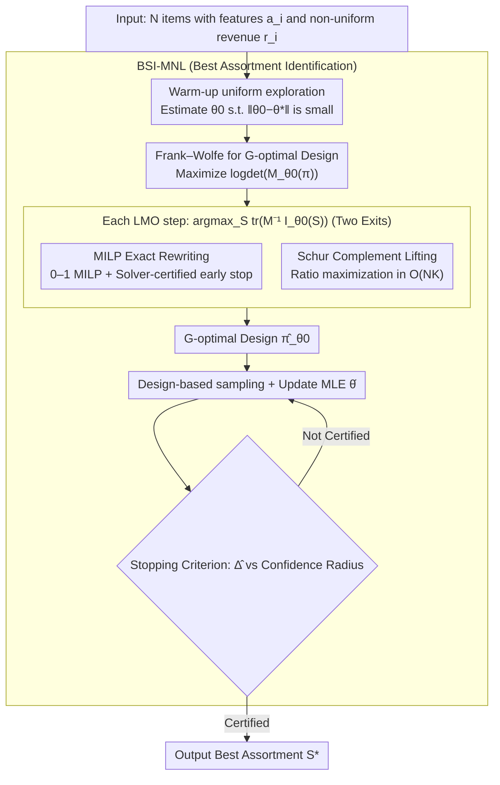

# Optimal Design for Multinomial Logit Model with Applications to Best Assortment Identification

**Conference**: ICML2026  
**arXiv**: [2605.25592](https://arxiv.org/abs/2605.25592)  
**Code**: To be confirmed  
**Area**: others (Multinomial Logistic Bandits / Experimental Design / Pure Exploration)  
**Keywords**: MNL bandits, G-optimal design, Frank-Wolfe, Mixed Integer Programming, Best Assortment Identification

## TL;DR
This paper provides the first **computationally feasible** G-optimal experimental design for the combinatorial action space of Multinomial Logit (MNL) bandits—formulating the Frank–Wolfe linear maximization oracle (LMO) as a 0–1 MILP or a polynomial-time Schur complement relaxation—and constructs the first best assortment identification algorithm for "linear utility + non-uniform revenue" with a sample complexity of $\tilde{\mathcal{O}}(d\log N / \Delta^2)$.

## Background & Motivation

**Background**: In online advertising, recommendation systems, and dynamic pricing, decision-makers present a **subset/assortment** $S$ (at most $K$ items) to users at each step. Users select one item (or none) according to the MNL model. While recent MNL bandit literature has established robust results for regret minimization (Agrawal 2019, Oh 2021, Perivier 2022, Lee 2024), **pure exploration/best assortment identification** remains largely unexplored—especially when items feature vector representations and linear utilities $\mathbf{a}_i^\top \theta^*$, where no sample complexity bounds have been established.

**Limitations of Prior Work**: Directly applying standard tools from linear bandits—G-optimal design + Frank–Wolfe + KW Equivalence Theorem—faces immediate obstacles: (1) The MNL Fisher information $\mathbf{I}_\theta(S) = \sum_{i\in S} p(i|S,\theta)(\mathbf{a}_i - \bar{\mathbf{a}}_\theta(S))(\mathbf{a}_i - \bar{\mathbf{a}}_\theta(S))^\top$ **cannot be decomposed** into a sum of single-arm contributions; it depends on the entire subset through MNL probability coupling. (2) The design space is no longer $N$ arms but $|\mathcal{S}|=\mathcal{O}(N^K)$ combinations, making the LMO in each Frank–Wolfe step an NP-hard combinatorial optimization problem. (3) The only related work, DopeWolfe (Thekumparampil 2024), uses random sampling to approximate the LMO, but theoretically still requires $\mathcal{O}(N^K)$ samples to guarantee approximation error, leaving the core problem unsolved.

**Key Challenge**: Experimental design requires **statistical efficiency** (ensuring the Fisher information matrix $\mathbf{M}$ provides good "coverage" in all directions), while combinatorial action spaces demand **computational efficiency**. No ready-made bridge exists between these two requirements.

**Goal**: (i) Formulate the MNL G-optimal design as a 0–1 MILP or a polynomial-time solvable relaxation that can be handled by modern solvers; (ii) Construct a best assortment identification algorithm with sample complexity guarantees using the resulting design.

**Key Insight**: The authors observe that MNL Fisher information $\mathbf{I}_\theta(S)$ can be represented as the Schur complement of a **lifted** simple second moment $\widetilde{\mathbf{I}}_\theta(S) = \sum_{i\in S} p(i|S,\theta) \tilde{\mathbf{a}}_i \tilde{\mathbf{a}}_i^\top$ (where $\tilde{\mathbf{a}}_i = (\mathbf{a}_i^\top, 1)^\top$). This transforms the nonlinear centralization term into a linear block of a higher-dimensional matrix, clarifying the combinatorial optimization structure.

**Core Idea**: Provide two "exits" for the difficult nonlinear LMO: an exact 0–1 MILP (NP-hard but with solver-certified early stopping) for precision, and a ratio optimization after Schur complement relaxation (polynomial time with bounded error) for speed.

## Method

### Overall Architecture

The entire pipeline revolves around a **local G-optimal design**: (1) Given nominal parameters $\theta_0$ (estimated during a warm-up phase); (2) Run Frank–Wolfe to maximize the D-optimal objective $f_{\theta_0}(\pi) = \log\det(\mathbf{M}_{\theta_0}(\pi))$ (the KW Equivalence Theorem guarantees this shares the same optimal solution as G-optimal design); (3) Solve the LMO $S_m \in \arg\max_S \text{tr}(\mathbf{M}_m^{-1} \mathbf{I}_{\theta_0}(S))$ in each iteration—using either MILP exact rewriting or Schur complement lifting; (4) Encapsulate the design into the BSI-MNL (Best aSsortment Identification for MNL) algorithm: warm-up to estimate $\theta_0$ → sample from the design support and update MLE → output the best assortment $S^*$ once the stopping criterion is met.

### Key Designs

**1. MILP Exact Rewriting + Certified Early Stopping: A "theoretically feasible and practical" exit for combinatorial LMO**

The LMO $\arg\max_S\text{tr}(\mathbf{M}_m^{-1}\mathbf{I}_{\theta_0}(S))$ involves optimization over $\mathcal{O}(N^K)$ combinations, which is naturally NP-hard. This work provides an exact 0–1 MILP formulation (Theorem 3.3) where the number of variables and constraints is polynomial in $N$. By introducing auxiliary variables for the denominator of the MNL probability $p(i|S,\theta_0)=w_i/\sum_{j\in S}w_j$ and using big-M constraints, the $\text{tr}(\cdot)$ objective is expressed as a linear function of 0–1 indicator variables. The centralization term $\bar{\mathbf{a}}_\theta(S)\bar{\mathbf{a}}_\theta(S)^\top$ is linearized using McCormick envelopes. While MILP is NP-hard in the worst case, industrial branch-and-bound solvers maintain upper and lower bounds; the solver-certified optimality gap allows safe early stopping at a user-specified $\epsilon_{\text{LMO}}$. Combined with the Frank–Wolfe iteration complexity $\tilde{\mathcal{O}}(d/\tilde\epsilon)$ in Proposition 3.4, the overall design remains $\epsilon$-accurate even with early-stopped LMOs.

**2. Schur Complement Lifting + Ratio Maximization: Trading statistical efficiency for strict polynomial time**

For very large $N$, the authors provide a second exit. The key observation is that MNL Fisher information is the Schur complement of a lifted matrix: defining $\tilde{\mathbf{a}}_i=(\mathbf{a}_i^\top,1)^\top\in\mathbb{R}^{d+1}$ and the lifted Fisher $\widetilde{\mathbf{I}}_{\theta_0}(S)=\sum_{i\in S}p(i|S,\theta_0)\tilde{\mathbf{a}}_i\tilde{\mathbf{a}}_i^\top$. Replacing the original LMO with the lifted version reduces the objective to a ratio form:

$$\text{tr}(\widetilde{\mathbf{M}}_m^{-1}\widetilde{\mathbf{I}}_{\theta_0}(S))=\frac{\sum_{i\in S}w_i s_i}{\sum_{j\in S}w_j},\quad s_i=\tilde{\mathbf{a}}_i^\top\widetilde{\mathbf{M}}_m^{-1}\tilde{\mathbf{a}}_i,\ w_i=\exp(\mathbf{a}_i^\top\theta_0)$$

This is a classic MNL ratio-of-sums assortment optimization problem solvable in $\mathcal{O}(NK)$ time. The cost is a mismatch between the lifted and true design, but this is controlled by the mismatch matrix $\Delta_{\theta_0}(\pi)=\widehat{\mathbf{M}}_{\theta_0}(\pi)-\mathbf{M}_{\theta_0}(\pi)$, for which the paper provides an explicit PSD upper bound.

**3. BSI-MNL: Design-based Best Assortment Identification**

With a solvable LMO, the classic G-optimal pure exploration template for linear bandits is extended to the MNL setting to identify the assortment with maximum revenue $S^*=\arg\max_S R(S,\theta^*)$ (where $R(S,\theta)=\sum_{i\in S}r_ip(i|S,\theta)$ includes non-uniform revenues $r_i$). The algorithm consists of three phases: short uniform exploration for nominal parameters $\theta_0$, sampling assortments based on the G-optimal design $\hat\pi_{\theta_0}$, and a stopping criterion based on the gap $\hat\Delta$ between the best and second-best assortments compared against a confidence radius $\|\cdot\|_{\mathbf{M}^{-1}}$. The resulting sample complexity is $\tilde{\mathcal{O}}(d\log(N/\delta)(\Delta_{\min}^{-2}+(\kappa\Delta_{\min})^{-1}))$, which simplifies to $\tilde{\mathcal{O}}(d\log N/\Delta_{\min}^2)$ in the small-gap regime (Theorem 4.4).

### Loss & Training
The parameters are estimated via Maximum Likelihood Estimation (MLE) by minimizing the negative log-likelihood $\ell_t(\theta) = -\sum_{i\in S_t} y_{ti}\log p(i|S_t,\theta)$. The stopping rule utilizes a GLRT-style statistic $\|\hat\theta - \theta\|_{\mathbf{V}_t}^2$, where $\mathbf{V}_t$ is the cumulative Fisher information. No neural network training is required; the algorithm relies on convex optimization and design solvers.

## Key Experimental Results

### Main Results: Sample Complexity Comparison

| Setting | Algorithm | Sample Complexity | Features | Non-uniform Revenue |
|------|------|------------|-----------|--------------------|
| MNL bandit, context-free | Saure & Zeevi (2013), Yang (2021) | $\tilde{\mathcal{O}}(N/\Delta_{\min}^2)$ | No | Partial |
| Linear bandit pure exploration | Soare et al. (2014) | $\tilde{\mathcal{O}}(d\log N/\Delta_{\min}^2)$ | Yes | N/A |
| MNL bandit, linear utility | **BSI-MNL (Ours)** | $\tilde{\mathcal{O}}(d\log N/\Delta_{\min}^2)$ | Yes | Yes |

### Ablation Study: LMO Implementation Comparison

| LMO Implementation | Per-step Complexity | FW Iterations | Guarantee | Practical Performance |
|----------|------------|-----------|--------------|----------|
| Enumeration | $\mathcal{O}(N^K)$ | $\tilde{\mathcal{O}}(d/\epsilon)$ | Exact | Infeasible for $N>30$ |
| DopeWolfe (Thekumparampil 2024) | Sample $\mathcal{O}(N^K)$ | Fixed | $\epsilon$-accurate (w.h.p.) | Bottlenecked by combinations |
| **MILP + Early Stop (Ours)** | NP-hard (Secs in practice) | $\tilde{\mathcal{O}}(d/\tilde\epsilon)$ | Exact or $\epsilon_{\text{LMO}}$ | Scalable to $N\sim 10^3$ |
| **Schur Relaxation (Ours)** | $\mathcal{O}(NK)$ | $\tilde{\mathcal{O}}(d/\epsilon)$ | $\epsilon$-accurate + Bounded bias | Scalable to very large $N$ |

### Key Findings
- **$\log N$ is the victory of contextualization**: Reducing dependency from $\mathcal{O}(N)$ (context-free) to $\mathcal{O}(\log N)$ is entirely due to the feature structure.
- **Dual LMO paths trade-off**: MILP provides the precision limit, while the relaxation provides the scalability limit.
- **Bounded support size**: Proposition 3.2 proves an optimal design exists with $|\text{supp}(\pi^*_{\theta_0})| \le d(d+1)/2$, meaning few assortments are needed in rotation.

## Highlights & Insights
- **Lifting + Schur complement is highly transferable**: This approach can be applied to any Fisher structure where $\mathbf{I} = \text{Second Moment} - \text{Mean Outer Product}$ (e.g., softmax, Plackett–Luce), facilitating linearization for ranking bandits.
- **Serious treatment of solver-certified stopping**: Integrating industrial solver dual bounds into theoretical guarantees is a robust strategy for bridging theory and practice.
- **Matching linear bandit optimality**: Achieving $\tilde{\mathcal{O}}(d\log N/\Delta_{\min}^2)$ proves that "combinatorial + MNL feedback" incurs no extra sample cost over standard linear bandits.

## Limitations & Future Work
- **Dependency on $\theta_0$**: If the initial warm-up estimation is poor, the G-optimal design may be biased.
- **MILP Scalability**: While practical for $N \sim 10^3$, MILP may struggle with extremely large $N$ or $K$.
- **Subset Constraints**: Future work could extend the framework to handle cardinality, compatibility, or diversity constraints natively within the MILP.

## Related Work & Insights
- **vs DopeWolfe (2024)**: This paper breaks the $\mathcal{O}(N^K)$ sample barrier for LMO through MILP and relaxation.
- **vs Soare et al. (2014)**: Extends G-optimal pure exploration from linear bandits to the more complex MNL feedback model.
- **vs Faury et al. (2022)**: Consistent with the handling of the $\kappa$ term (intrinsic to logistic-style feedback) in sample complexity.

## Rating
- Novelty: ⭐⭐⭐⭐⭐ 
- Experimental Thoroughness: ⭐⭐⭐ 
- Writing Quality: ⭐⭐⭐⭐⭐ 
- Value: ⭐⭐⭐⭐ 

## Related Papers

## Related Papers

- [\[ICML 2025\] Near Optimal Best Arm Identification for Clustered Bandits](../../ICML2025/others/near_optimal_best_arm_identification_for_clustered_bandits.md)
- [\[ICML 2026\] Optimal Regularization for Performative Learning](optimal_regularization_for_performative_learning.md)
- [\[ICML 2026\] Conditional KRR: Injecting Unpenalized Features into Kernel Methods with Applications to Kernel Thresholding](conditional_krr_injecting_unpenalized_features_into_kernel_methods_with_applicat.md)
- [\[ICML 2026\] Comprehensive AI Governance Requires Addressing Non-Model Gains](comprehensive_ai_governance_requires_addressing_non-model_gains.md)
- [\[ICML 2025\] Optimal Auction Design in the Joint Advertising](../../ICML2025/others/optimal_auction_design_in_the_joint_advertising.md)

<!-- RELATED:END -->

<!-- RELATED:START -->

## 相关论文

- [\[ICML 2025\] Near Optimal Best Arm Identification for Clustered Bandits](../../ICML2025/learning_theory/near_optimal_best_arm_identification_for_clustered_bandits.md)
- [\[ICML 2026\] Conditional KRR: Injecting Unpenalized Features into Kernel Methods with Applications to Kernel Thresholding](conditional_krr_injecting_unpenalized_features_into_kernel_methods_with_applicat.md)
- [\[ICML 2026\] Towards Optimal Robustness in Learning-Augmented Paging](towards_optimal_robustness_in_learning-augmented_paging.md)
- [\[ICML 2026\] Simple Algorithms for Bad Triangle Transversals with Applications to Correlation Clustering](simple_algorithms_for_bad_triangle_transversals_with_applications_to_correlation.md)
- [\[ICML 2025\] Provably Efficient Algorithm for Best Scoring Rule Identification in Online Principal-Agent Information Acquisition](../../ICML2025/learning_theory/provably_efficient_algorithm_for_best_scoring_rule_identification_in_online_prin.md)

<!-- RELATED:END -->
