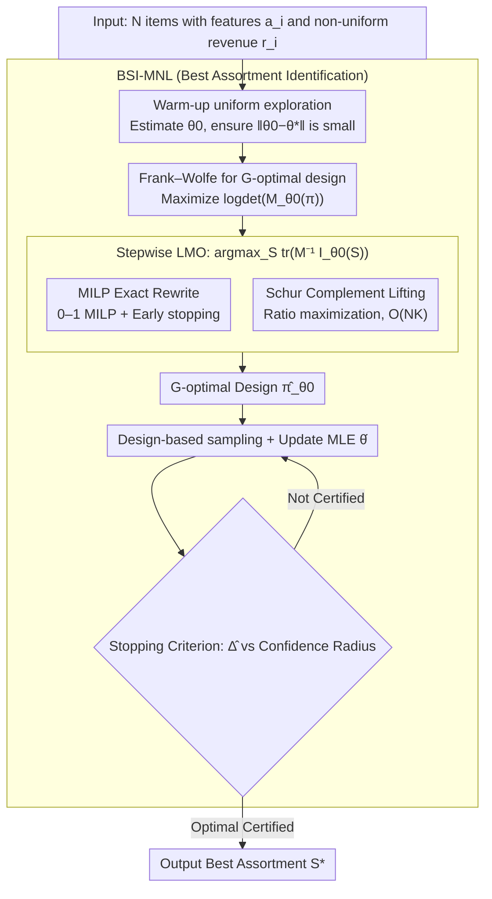

# Optimal Design for Multinomial Logit Model with Applications to Best Assortment Identification

**Conference**: ICML2026  
**arXiv**: [2605.25592](https://arxiv.org/abs/2605.25592)  
**Code**: To be confirmed  
**Area**: others (Multinomial Logit Bandits / Experimental Design / Pure Exploration)  
**Keywords**: MNL bandits, G-optimal design, Frank-Wolfe, Mixed-Integer Linear Programming, Best Assortment Identification

## TL;DR
This work provides the first **computationally feasible** G-optimal experimental design in combinatorial MNL bandit action spaces—reformulating the Frank–Wolfe Linear Maximization Oracle (LMO) as a 0–1 MILP or a polynomial-time Schur complement relaxation—and construct the first best assortment identification algorithm for "linear utility + non-uniform revenues" with sample complexity $\tilde{\mathcal{O}}(d\log N / \Delta^2)$.

## Background & Motivation

**Background**: In online advertising, recommendation systems, and dynamic pricing, decision-makers present a **subset** $S$ (up to $K$ items) to users, who select one item (or none) according to the MNL model. While MNL bandit literature has matured regarding regret minimization over the last five years (Agrawal 2019, Oh 2021, Perivier 2022, Lee 2024), **pure exploration/best assortment identification** remains largely unexplored—especially when items have feature vectors with linear utilities $\mathbf{a}_i^\top \theta^*$, where no sample complexity bounds were previously established.

**Limitations of Prior Work**: Standard tools for linear bandits—G-optimal design, Frank–Wolfe, and the Kiefer-Wolfowitz (KW) equivalence theorem—fail in this context: (1) The MNL Fisher information $\mathbf{I}_\theta(S) = \sum_{i\in S} p(i|S,\theta)(\mathbf{a}_i - \bar{\mathbf{a}}_\theta(S))(\mathbf{a}_i - \bar{\mathbf{a}}_\theta(S))^\top$ **cannot be decomposed** into a sum of individual arms; it depends on the entire subset through MNL probability coupling; (2) The design space is not $N$ arms but $|\mathcal{S}|=\mathcal{O}(N^K)$ combinations, making the LMO in each Frank–Wolfe step an NP-hard combinatorial problem; (3) The only related work, DopeWolfe (Thekumparampil 2024), uses random sampling to approximate the LMO, but theoretically requires $\mathcal{O}(N^K)$ samples to guarantee accuracy, leaving the core problem unsolved.

**Key Challenge**: Experimental design requires **statistical efficiency** (ensuring the Fisher information matrix $\mathbf{M}$ "covers" all directions), whereas combinatorial action spaces require **computational efficiency**. No existing bridge connects these two requirements for MNL.

**Goal**: (i) Reformulate the MNL G-optimal design as a 0–1 MILP or a polynomially solvable relaxation compatible with modern solvers; (ii) Construct a best assortment identification algorithm with provable sample complexity guarantees using the resulting design.

**Key Insight**: The authors observe that the MNL Fisher information $\mathbf{I}_\theta(S)$ can be represented as the Schur complement of a simple second-moment matrix after **lifting**: $\widetilde{\mathbf{I}}_\theta(S) = \sum_{i\in S} p(i|S,\theta) \tilde{\mathbf{a}}_i \tilde{\mathbf{a}}_i^\top$ (where $\tilde{\mathbf{a}}_i = (\mathbf{a}_i^\top, 1)^\top$). This transforms the nonlinear centralization term of "subtracting the mean" into a linear block of a higher-dimensional matrix, clarifying the combinatorial optimization structure.

**Core Idea**: Two solutions are proposed for the "nonlinear LMO": an exact 0–1 MILP (NP-hard but with solver-certified early stopping) and a Schur complement relaxation based on ratio-of-sums optimization (polynomial-time with bounded error).

## Method

### Overall Architecture

The entire pipeline centers on **local G-optimal design**: (1) Given nominal parameters $\theta_0$ (estimated in a warm-up phase); (2) Execute Frank–Wolfe to maximize the D-optimal objective $f_{\theta_0}(\pi) = \log\det(\mathbf{M}_{\theta_0}(\pi))$, which shares the same optimal solution as G-optimal design per the KW theorem; (3) Solve an LMO $S_m \in \arg\max_S \text{tr}(\mathbf{M}_m^{-1} \mathbf{I}_{\theta_0}(S))$ at each iteration—this work contributes two methods (MILP exact rewrite / Schur complement lifting); (4) Integrate the design into the BSI-MNL (Best aSsortment Identification for MNL) algorithm: warm-up estimation → sample according to the design and update MLE → terminate upon verification and output $S^*$.

### Key Designs

**1. MILP Exact Rewrite + Solver-Certified Early Stopping**:
The LMO $\arg\max_S \text{tr}(\mathbf{M}_m^{-1}\mathbf{I}_{\theta_0}(S))$ is a combinatorial optimization over $\mathcal{O}(N^K)$ sets. The authors reformulate this as a 0–1 MILP with a polynomial number of variables and constraints (Theorem 3.3). By introducing auxiliary variables for the MNL denominator and using big-M constraints, $\text{tr}(\cdot)$ is expressed as a linear function of 0–1 indicators. The centralization term is linearized using McCormick envelopes. While MILP is NP-hard, industrial branch-and-bound solvers maintain dual bounds, allowing for "solver-certified" stopping at a specified $\epsilon_{\text{LMO}}$. Combined with the total iteration bound $\tilde{\mathcal{O}}(d/\tilde\epsilon)$ (Proposition 3.4), the design remains $\epsilon$-accurate even with early stopping.

**2. Schur Complement Lifting + Ratio Maximization**:
For larger $N$, the authors provide a strictly polynomial-time alternative. MNL Fisher information is revealed as the Schur complement of a lifted matrix: let $\tilde{\mathbf{a}}_i=(\mathbf{a}_i^\top,1)^\top$ and $\widetilde{\mathbf{I}}_{\theta_0}(S)=\sum_{i\in S}p(i|S,\theta_0)\tilde{\mathbf{a}}_i \tilde{\mathbf{a}}_i^\top$. The lifted LMO simplifies to a ratio:

$$\text{tr}(\widetilde{\mathbf{M}}_m^{-1}\widetilde{\mathbf{I}}_{\theta_0}(S))=\frac{\sum_{i\in S}w_i s_i}{\sum_{j\in S}w_j},\quad s_i=\tilde{\mathbf{a}}_i^\top\widetilde{\mathbf{M}}_m^{-1}\tilde{\mathbf{a}}_i,\ w_i=\exp(\mathbf{a}_i^\top\theta_0)$$

This is a classic MNL ratio-of-sums assortment problem solvable in $\mathcal{O}(NK)$ (Rusmevichientong 2010). Although lifting introduces a mismatch $\Delta_{\theta_0}(\pi)=\widehat{\mathbf{M}}_{\theta_0}(\pi)-\mathbf{M}_{\theta_0}(\pi)$, the paper provides explicit PSD upper bounds for this error.

**3. BSI-MNL Algorithm**:
The algorithm integrates G-optimal design into a pure exploration template to identify $S^*=\arg\max_S R(S, \theta^*)$ with non-uniform revenues $r_i$. It consists of: a brief warm-up phase to obtain $\theta_0$; sampling using the G-optimal design $\hat\pi_{\theta_0}$; and a stopping criterion based on the revenue gap and confidence radius. The final sample complexity is $\tilde{\mathcal{O}}(d\log(N/\delta)(\Delta_{\min}^{-2}+(\kappa\Delta_{\min})^{-1}))$, which reduces to $\tilde{\mathcal{O}}(d\log N/\Delta_{\min}^2)$ in the small-gap regime (Theorem 4.4).

### Loss & Training
The parameters are updated using Maximum Likelihood Estimation (MLE) with the negative log-likelihood $\ell_t(\theta) = -\sum_{i\in S_t} y_{ti}\log p(i|S_t,\theta)$. The stopping rule utilizes GLRT-style statistics $\|\hat\theta - \theta\|_{\mathbf{V}_t}^2$, where $\mathbf{V}_t$ is the cumulative Fisher information.

## Key Experimental Results

### Main Results: Sample Complexity Comparison

| Setting | Algorithm | Sample Complexity | Features Required | Non-uniform Revenue |
|------|------|------------|-----------|--------------------|
| MNL bandit, context-free | Saure & Zeevi (2013) | $\tilde{\mathcal{O}}(N/\Delta_{\min}^2)$ | No | Partial |
| Linear bandit pure exploration | Soare et al. (2014) | $\tilde{\mathcal{O}}(d\log N/\Delta_{\min}^2)$ | Yes | N/A |
| MNL bandit, linear utility | **BSI-MNL (Ours)** | $\tilde{\mathcal{O}}(d\log N/\Delta_{\min}^2)$ | Yes | Yes |

### Ablation Study: LMO Implementation Comparison

| LMO Implementation | Step Complexity | FW Iterations | Worst-case Guarantee | Performance |
|----------|------------|-----------|--------------|----------|
| Enumeration | $\mathcal{O}(N^K)$ | $\tilde{\mathcal{O}}(d/\epsilon)$ | Exact | Infeasible for $N>30$ |
| DopeWolfe (2024) | Sampling $\mathcal{O}(N^K)$ | Pre-fixed | $\epsilon$-accurate (w.h.p.) | Bottlenecked by $N^K$ |
| **MILP + Early Exit (Ours)** | NP-hard (Secs) | $\tilde{\mathcal{O}}(d/\tilde\epsilon)$ | Exact or Solver-certified | Suitable for $N\sim 10^3$ |
| **Schur Relaxation (Ours)** | $\mathcal{O}(NK)$ | $\tilde{\mathcal{O}}(d/\epsilon)$ | Bounded mismatch | Scalable to large $N$ |

### Key Findings
- **$\log N$ is the victory of contextualization**: Reducing dependency from $\mathcal{O}(N)$ to $\mathcal{O}(\log N)$ is achieved through the feature structure, consistent with linear bandit intuition.
- **LMO paths balance precision and scalability**: The MILP route provides the accuracy limit, while relaxation handles the scale limit.
- **Bounded support for optimal design**: Proposition 3.2 proves an optimal design exists with support size $|\text{supp}(\pi^*_{\theta_0})| \le d(d+1)/2$, facilitating practical deployment.

## Highlights & Insights
- **Transferability of the lifting + Schur complement technique**: Any "Fisher = Second Moment - Outer Product of Means" structure (e.g., softmax, Plackett–Luce) can use this to linearize optimization.
- **Engineering significance of solver-certified gaps**: By binding solver dual bounds to theoretical approximation accuracy (Proposition 3.4), the bridge between "theoretically sound" and "practically runnable" is established.
- **Asymptotic optimality**: Achieving $\tilde{\mathcal{O}}(d\log N/\Delta_{\min}^2)$ in MNL bandits indicates no additional sample cost for combinatorial MNL feedback compared to standard linear bandits in best arm identification.
- **Honest treatment of $\kappa$**: The inclusion of $(\kappa\Delta_{\min})^{-1}$ reflects the inherent difficulty of logistic-type feedback in "hard-to-distinguish" regions.

## Limitations & Future Work
- **Dependency on nominal $\theta_0$**: If the warm-up phase fails to provide a sufficiently accurate $\theta_0$, the G-optimal design may be severely sub-optimal.
- **MILP Scalability**: While solvers are efficient, there is no polynomial-time guarantee for $N > 10^4$ or large $K$.
- **Schur Mismatch**: The relaxation error depends on parameter ranges, which might be loose under heavy-tailed features.
- **Constraint Complexity**: The ability to handle cardinality, compatibility, or diversity constraints within the MILP framework remains to be verified.

## Related Work & Insights
- **vs DopeWolfe (2024)**: This work breaks the $\mathcal{O}(N^K)$ complexity barrier that DopeWolfe's sampling approach struggled with.
- **vs Soare et al. (2014)**: Extends G-optimal pure exploration from linear bandits to the nonlinear MNL combinatorial setting while preserving structural advantages.
- **vs Yang et al. (2021)**: Contextualization reduces $N$ dependency to $\log N$ compared to context-free MNL methods.

## Rating
- Novelty: ⭐⭐⭐⭐⭐ (First computationally feasible G-optimal design for MNL combinatorial spaces).
- Experimental Thoroughness: ⭐⭐⭐ (Mainly theoretical; main text lacks wall-clock comparisons).
- Writing Quality: ⭐⭐⭐⭐⭐ (Rigorous logic linking algorithm to MILP/relaxation).
- Value: ⭐⭐⭐⭐ (Provides actionable design for pure exploration in recommender/advertising systems).

## Related Papers

- [\[ICML 2025\] Near Optimal Best Arm Identification for Clustered Bandits](../../ICML2025/others/near_optimal_best_arm_identification_for_clustered_bandits.md)
- [\[ICML 2026\] Optimal Regularization for Performative Learning](optimal_regularization_for_performative_learning.md)
- [\[ICML 2026\] Conditional KRR: Injecting Unpenalized Features into Kernel Methods with Applications to Kernel Thresholding](conditional_krr_injecting_unpenalized_features_into_kernel_methods_with_applicat.md)
- [\[ICML 2026\] Comprehensive AI Governance Requires Addressing Non-Model Gains](comprehensive_ai_governance_requires_addressing_non-model_gains.md)
- [\[ICML 2025\] Optimal Auction Design in the Joint Advertising](../../ICML2025/others/optimal_auction_design_in_the_joint_advertising.md)

<!-- RELATED:END -->

<!-- RELATED:START -->

## 相关论文

- [\[ICML 2025\] Near Optimal Best Arm Identification for Clustered Bandits](../../ICML2025/learning_theory/near_optimal_best_arm_identification_for_clustered_bandits.md)
- [\[ICLR 2026\] An Improved Model-free Decision-estimation Coefficient with Applications in Adversarial MDPs](../../ICLR2026/learning_theory/an_improved_model-free_decision-estimation_coefficient_with_applications_in_adve.md)
- [\[ICLR 2026\] A Near-Optimal Best-of-Both-Worlds Algorithm for Federated Bandits](../../ICLR2026/learning_theory/a_near-optimal_best-of-both-worlds_algorithm_for_federated_bandits.md)
- [\[ICLR 2026\] Best-of-Majority: Minimax-Optimal Strategy for Pass@k Inference Scaling](../../ICLR2026/learning_theory/best-of-majority_minimax-optimal_strategy_for_passk_inference_scaling.md)
- [\[ICML 2026\] Conditional KRR: Injecting Unpenalized Features into Kernel Methods with Applications to Kernel Thresholding](conditional_krr_injecting_unpenalized_features_into_kernel_methods_with_applicat.md)

<!-- RELATED:END -->
