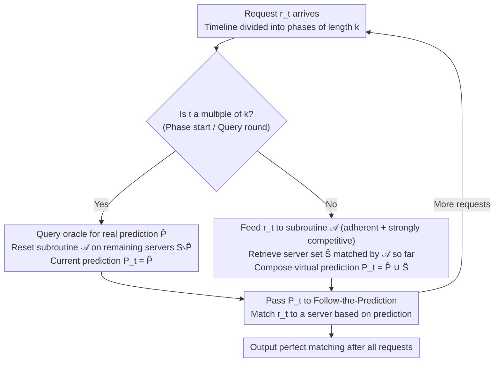

# Parsimonious Learning-Augmented Online Metric Matching

**Conference**: ICML 2026  
**arXiv**: [2605.26886](https://arxiv.org/abs/2605.26886)  
**Code**: None (Theoretical + Numerical experiments)  
**Area**: Online Optimization / Learning-Augmented Algorithms / Online Metric Matching  
**Keywords**: Online Metric Matching, Learning-Augmented Algorithms, Parsimonious Prediction, Follow-the-Prediction, Competitive Ratio

## TL;DR
This paper addresses an open problem posed by Im et al. (2022) by bringing "action-predicted" Online Metric Matching (OMM) into a "parsimonious prediction" framework—where predictions are expensive and provided only every $k$ steps. Using the Follow-the-Prediction (FtP) framework combined with a meta-algorithm that automatically fills in "virtual predictions," the authors provide deterministic and randomized competitive ratio upper bounds that essentially match existing lower bounds.

## Background & Motivation

**Background**: Online Metric Matching (OMM) is a classic problem in online optimization: $n$ server locations are known, and $n$ requests arrive sequentially. Each request must be immediately and irrevocably matched to an unoccupied server to minimize the total matching distance. Thirty years ago, Kalyanasundaram–Pruhs and Khuller provided a $(2n-1)$ deterministic competitive ratio. Bansal et al. (2014) improved the randomized algorithm to $O(\log^2 n)$, and these bounds are tight (within constant factors).

**Limitations of Prior Work**: The gap between classic upper and lower bounds primarily arises from "knowing nothing about the future." The learning-augmented framework aims to break worst-case scenarios using predictions. The Follow-the-Prediction (FtP) algorithm by Antoniadis et al. (2023b) queries an oracle for an action prediction $P_t$ in every round, ensuring a bound of $9 \cdot \min\{\text{cost}(\text{OPT}) + 2\eta, (2n-1)\text{cost}(\text{OPT})\}$. The problem is that generating predictions often requires running large-scale models, and the cost of per-round calls is prohibitive.

**Key Challenge**: While good predictions can significantly narrow the gap between bounds, each prediction query incurs a high inference cost. How can the value of used predictions be maximized under "limited or sparse prediction" constraints? This direction was initiated by Im et al. (2022) in the caching scenario; this paper extends it to OMM.

**Goal**: Design OMM algorithms and provide competitive ratio upper and lower bounds under two "parsimonious" mechanisms: (i) well-separated queries (queried every $k$ rounds) and (ii) bounded budget (total predictions $\le B$).

**Key Insight**: FtP requires a prediction $P_t$ in every round. Can an algorithm synthesize "virtual predictions" between two real predictions? If this synthesizer guarantees the quality of intermediate matching, the FtP analysis can be extended.

**Core Idea**: Define two new algorithmic properties—adherence (intermediate matching "set distance" is close to the optimal maximum matching) and strong competitiveness (intermediate matching cost is close to the optimal maximum matching). Any subroutine satisfying these two properties can "interpolate" usable virtual predictions, thereby extending the utility of a single prediction over $k$ rounds.

## Method

### Overall Architecture

The overall algorithm is a "parsimonious" wrapper for FtP. The timeline is divided into phases of length $k$. In the first round of each phase, a real prediction $\widehat P = P_{ik}$ is queried from the oracle. For the remaining $k-1$ rounds in the phase, an auxiliary subroutine $\mathcal A$ runs on the "remaining servers $S \setminus \widehat P$ and requests arriving within the phase." The set of servers matched by $\mathcal A$, denoted $\widehat S$, is combined with $\widehat P$ to form the "virtual prediction" $P_t = \widehat P \cup \widehat S$ for that round. The sequence $\{P_t\}_t$ is then fed into standard FtP. Intuitively, $\widehat P$ provides the "global direction" while $\mathcal A$ refines details locally using real arrival information.

### Key Designs

**1. Adherence + Strong Competitiveness: Characterizing Subroutines for Virtual Prediction**

To extend the value of a single real prediction over $k$ rounds, one must define the conditions under which algorithmically synthesized intermediate matchings can be absorbed by FtP analysis. The paper proposes two structural properties for the subroutine $\mathcal A$. For an instantaneous matching $\mathcal A_t$ (let $S_t$ be the set of matched servers and $R_t$ be the set of requests, where $\mathcal M_t$ is the set of all maximum matchings matching $R_t$): $\mathcal A$ is $\gamma$-adherent if for any $t$, $\mathsf{dist}(S_t,R_t)\le\gamma\cdot\min_{M\in\mathcal M_t}\mathsf{cost}(M)$; and $\mathcal A$ is strongly $\rho$-competitive if $\mathbb E[\mathsf{cost}(\mathcal A_t)]\le\rho(t)\cdot\min_{M\in\mathcal M_t}\mathsf{cost}(M)$. These control the proximity of the intermediate state to the optimum at the set level and cost level, respectively. Classic algorithms like Kalyanasundaram–Pruhs and Bansal actually maintain high-quality partial matches at every moment; by making this "process-friendliness" explicit, they can act as plug-and-play virtual predictors.

**2. Parsimonious FtP Meta-algorithm: Filling the $k-1$ Missing Predictions**

FtP requires a prediction $P_t$ every round; applying it directly to parsimonious settings without the $k-1$ missing predictions would lead to unbounded costs. The meta-algorithm splits the timeline into phases of $k$. In the first round of each phase, it fetches $\widehat P$ and resets an instance of $\mathcal{A}$ on $S \setminus \widehat P$. In non-query rounds, it uses the server set $\widehat S$ matched by $\mathcal A$ to construct $P_t = \widehat P \cup \widehat S$. This construction ensures $|P_t|=t$ and $P_t \subseteq S$, making it a valid prediction. The analysis uses Lemma 3.2 to bound FtP cost by $\sum_t \mathsf{dist}(P_t, P_{t-1} \cup \{r_t\})$. By splitting the sum by phases and applying adherence/triangle inequalities (Lemma 3.5) and strong competitiveness (Lemma 3.4), a unified bound is achieved:

$$(1+\gamma+\rho(k-1))\,\text{cost}(\text{OPT}) + (2+\gamma+\rho(k-1))\,\eta(Q)$$

**3. Lower Bounds: Extending Classic Hard Instances on Star Metrics**

The paper constructs adversary sequences on star metrics with $n$ leaves. Even with a deterministic algorithm and perfect predictions, a budget of $B$ queries incurs a loss of at least $\frac{2n}{B+1}-1$ (Theorem 4.1). Under well-separated queries, the loss is at least $2k-1$ (Theorem 4.2). For randomized algorithms, lower bounds of $\Omega(\log k)$ (well-separated) and $1+o(\frac{\log(n/B)}{B})$ (bounded budget) are provided (Theorems 4.3–4.4). This aligns the upper and lower bounds, showing that the $2k-1$ factor in Theorem 1.1 is nearly tight for deterministic settings with perfect prediction.

### Loss & Training

To handle cases where predictions are completely erroneous, the authors adopt the combination trick from Fiat–Rabani–Ravid: combining "Ours" (with predictions) with a "no-prediction" baseline (deterministic $(2n-1)$-competitive or Greedy) using a 9-fold min-combination (Theorem 2.3). This ensures global robustness and is the source of the factor $9$ in the bound $9 \cdot \min\{\cdot, \cdot\}$.

## Key Experimental Results

### Main Results: Parsimonious Gains on Synthetic & Real Data (Perfect Prediction, $k$ from 1 to 20)

| Instance Class | Metric | Goal | Performance of Ours |
| :--- | :--- | :--- | :--- |
| Line | 1D Absolute Diff | Approximation ratio vs. $k$ | Monotonic increase with $k$, but much lower than Comp/Greedy |
| Plane | 2D Euclidean | Same as above | Outperforms other baselines; Comb series degrades slower |
| Taxi (Chicago 2013–2023) | Manhattan | Real car-hailing data | Ours leads throughout; Comb-Greedy occasionally surpassed by Greedy |

Note: All instances fix $n=100$ servers and $100$ requests. Results are averages over 100 independent instances. The configuration $k=1$ is verified to match FtP from Antoniadis et al. (2023b).

### Ablation Study: Noise Robustness under Noise Radius $r$

| Configuration | Near Accurate Prediction | Under High Noise | Explanation |
| :--- | :--- | :--- | :--- |
| Ours ($k=1$, Eq. FtP) | Near Optimal | Sharpest degradation | Uses predictions every round; noise amplification is maximum |
| Ours (Large $k$) | Slightly worse than $k=1$ | Significantly slower degradation | Lower prediction frequency reduces sensitivity to single errors |
| Comb-Comp / Comb-Greedy | Close to Ours | Slowest degradation | Robustness provided by fallback algorithms |
| Comp / Greedy | Same or slightly worse than Ours | Independent of noise | Does not read predictions |

### Key Findings

- The real cost of parsimony under perfect prediction is shifting the "competitive ratio from the magnitude of 9 to $\Theta(k)$," but this reduces prediction calls from $n$ to $\lceil n/k \rceil$, which is highly attractive for high-inference-cost models.
- The randomized upper bound $O(\log n \cdot \log k)$ reveals an interesting decomposition: $\log n$ comes from HST embedding distortion, and $\log k$ comes from the randomized matching of the subroutine within the phase.
- In experiments, combination algorithms sometimes perform worse than the standalone fallback (e.g., Comb-Greedy vs. Greedy on Plane/Taxi), suggesting the factor of 9 is not tight and switching overhead can outweigh gains.

## Highlights & Insights

- Explicitly defining two "process-friendly" properties (adherence + strong competitiveness) provides a plug-and-play list of subroutines and a template for migrating the parsimonious framework to other online problems like $k$-server or metrical task systems.
- The idea of "using an algorithm as a virtual predictor" is clever: a classic online algorithm is essentially the best guess in the absence of future information. Using it as a predictor means the system degrades to the classic algorithm when no real prediction is available and applies corrections when it is.
- Well-matched upper and lower bounds are relatively rare in learning-augmented literature. By generalizing star metric adversarial constructions, the $2k-1$ factor is shown to be essentially tight for the deterministic case.

## Limitations & Future Work

- The randomized upper bound still contains a $\log n$ factor, while the lower bound is only $\Omega(\log k)$. Whether $\log n$ is avoidable remains an open question.
- The 9x multiplicative constant for the combination algorithm is large, and experimental evidence shows some robustness-consistency trade-offs are not yet tight.
- The current prediction model uses "action prediction" (the set of servers used by OPT). Whether weaker, cheaper prediction semantics (e.g., predicting only the next server) can be utilized remains to be explored.
- Experimental validation was limited to synthetic data and Chicago Taxi data; complex resource allocation scenarios like CDN or ad auctions need further testing.

## Related Work & Insights

- **vs Antoniadis et al. (2023b) (FtP)**: This work is a strict extension; it recovers FtP at $k=1$ and provides a usable form for non-dense prediction scenarios via virtual prediction construction.
- **vs Im et al. (2022) (Parsimonious Caching)**: Also works within the parsimonious framework for online problems, but where caching states are "sets," OMM states are "matchings." This paper innovates by defining specific process metrics (adherence/strong competitiveness) for matchings.
- **vs Bansal et al. (2014) (Randomized OMM)**: The authors directly utilize Bansal’s 2-HST algorithm as a strongly $O(\log t)$-competitive subroutine, serving as a prime example of converting existing online algorithms into parsimonious subroutines.

## Rating
- Novelty: TBD
- Experimental Thoroughness: TBD
- Writing Quality: TBD
- Value: TBD

<!-- RELATED:START -->

## Related Papers

- [\[NeurIPS 2025\] Learning-Augmented Online Bipartite Fractional Matching](../../NeurIPS2025/learning_theory/learning-augmented_online_bipartite_fractional_matching.md)
- [\[ICML 2026\] Towards Optimal Robustness in Learning-Augmented Paging](towards_optimal_robustness_in_learning-augmented_paging.md)
- [\[ICLR 2026\] Better Learning-Augmented Spanning Tree Algorithms via Metric Forest Completion](../../ICLR2026/learning_theory/better_learning-augmented_spanning_tree_algorithms_via_metric_forest_completion.md)
- [\[ICLR 2026\] Online Rounding and Learning Augmented Algorithms for Facility Location](../../ICLR2026/learning_theory/online_rounding_and_learning_augmented_algorithms_for_facility_location.md)
- [\[ICML 2025\] Near-Optimal Consistency-Robustness Trade-Offs for Learning-Augmented Online Knapsack Problems](../../ICML2025/learning_theory/near-optimal_consistency-robustness_trade-offs_for_learning-augmented_online_kna.md)

<!-- RELATED:END -->
