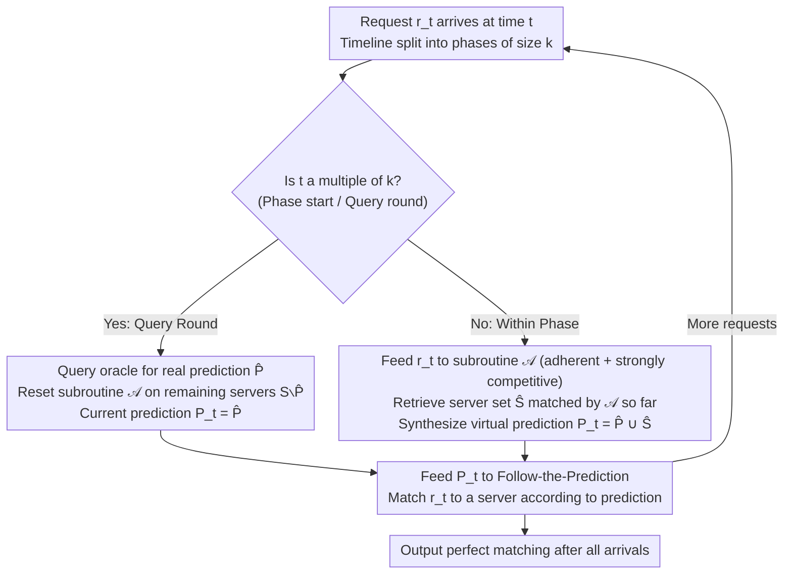

# Parsimonious Learning-Augmented Online Metric Matching

**Conference**: ICML 2026  
**arXiv**: [2605.26886](https://arxiv.org/abs/2605.26886)  
**Code**: None (Theoretical + Numerical experiments)  
**Area**: Online Optimization / Learning-Augmented Algorithms / Online Metric Matching  
**Keywords**: Online Metric Matching, Learning-Augmented Algorithms, Parsimonious Prediction, Follow-the-Prediction, Competitive Ratio

## TL;DR
This paper addresses the open problem posed by Im et al. (2022): extending "action-based" Online Metric Matching (OMM) into the "parsimonious prediction" framework—where predictions are provided expensively once every $k$ steps. By utilizing the Follow-the-Prediction (FtP) framework combined with a meta-algorithm that automatically completes "virtual predictions," the authors provide deterministic and randomized competitive ratio upper bounds that essentially match established lower bounds.

## Background & Motivation

**Background**: Online Metric Matching (OMM) is one of the classic problems in online optimization: $n$ server locations are known in advance, $n$ requests arrive sequentially, and each request must be immediately and irrevocably matched to an unoccupied server. The goal is to minimize the total matching distance. Thirty years ago, Kalyanasundaram–Pruhs and Khuller established a $(2n-1)$ deterministic competitive ratio, while Bansal et al. (2014) pushed the randomized algorithm to $O(\log^2 n)$. These bounds are tight within constant factors.

**Limitations of Prior Work**: The gap between classic upper and lower bounds mainly stems from "knowing nothing about the future." The learning-augmented framework aims to break through worst-case scenarios using predictions. The Follow-the-Prediction (FtP) algorithm by Antoniadis et al. (2023b) requests an action prediction $P_t$ from an oracle in every round, guaranteeing a cost of $9 \cdot \min\{\text{cost}(\text{OPT}) + 2\eta, (2n-1)\text{cost}(\text{OPT})\}$. The issue is that generating predictions often requires running a large model, making per-round calls prohibitively expensive.

**Key Challenge**: While good predictions can significantly narrow the gap between bounds, each prediction query incurs inference costs. How can the value of available predictions be maximized under "restricted or sparse prediction" constraints? This was the gap opened by Im et al. (2022) in the caching context, which this paper extends to OMM.

**Goal**: Design OMM algorithms and provide competitive ratio upper and lower bounds under two "parsimonious" mechanisms: (i) well-separated queries: querying once every $k$ rounds; (ii) bounded budget: total predictions not exceeding $B$.

**Key Insight**: FtP requires a prediction $P_t$ in every round. Can an algorithm "self-synthesize virtual predictions" between two real predictions? As long as this synthesizer guarantees the quality of intermediate matches, the analysis of FtP can be extended.

**Core Idea**: The authors define two new algorithmic properties—adherence (the "set distance" of intermediate matches is close to the optimal maximum matching) and strong competitiveness (the intermediate matching cost is close to the optimal maximum matching). They prove that any subroutine satisfying both properties can "interpolate" usable virtual predictions, effectively extending the utility of a single prediction over $k$ rounds.

## Method

### Overall Architecture

The overall algorithm is a "parsimonious" wrapper for FtP. The timeline is divided into phases of length $k$. In the first round of each phase, a real prediction $\widehat P = P_{ik}$ is obtained from the oracle. For the remaining $k-1$ rounds in the phase, an auxiliary subroutine $\mathcal A$ runs on the "remaining servers $S \setminus \widehat P$ and requests arriving within the phase." The set of servers $\widehat S$ matched by $\mathcal A$ is combined with $\widehat P$ to form the "virtual prediction" $P_t = \widehat P \cup \widehat S$ for the current round. The sequence $\{P_t\}_t$ is then fed into the standard FtP. Intuitively, $\widehat P$ provides the "global direction," while $\mathcal A$ refines details locally using real arrival information.

### Key Designs

**1. Adherence + Strong Competitiveness: Characterizing Subroutines as Virtual Predictors**

To exploit a single real prediction over $k$ rounds, one must clarify what conditions the "algorithmically synthesized intermediate matches" must satisfy to be absorbed by FtP analysis. This paper proposes two structural properties for the subroutine $\mathcal A$. Let $\mathcal A_t$ be the instantaneous matching (with matched server set $S_t$, request set $R_t$, and $\mathcal M_t$ as the set of all maximum matchings for $R_t$): $\mathcal A$ is $\gamma$-adherent if for any $t$, $\mathsf{dist}(S_t, R_t) \le \gamma \cdot \min_{M \in \mathcal M_t} \mathsf{cost}(M)$; $\mathcal A$ is strongly $\rho$-competitive if $\mathbb E[\mathsf{cost}(\mathcal A_t)] \le \rho(t) \cdot \min_{M \in \mathcal M_t} \mathsf{cost}(M)$. The former controls "set-level proximity to optimal," while the latter controls "cumulative cost proximity to optimal." These are useful because traditional OMM algorithms (like Kalyanasundaram–Pruhs, Nayyar–Raghvendra, or Bansal) "incidentally" maintain good partial matchings at every moment—by making this friendliness explicit, they can be used as plug-and-play virtual predictors.

**2. Parsimonious Meta-Algorithm for FtP: Completing $k-1$ Missing Predictions**

FtP requires a prediction $P_t$ every round; applying it directly to parsimonious scenarios would lead to unbounded costs due to $k-1$ missing predictions. The meta-algorithm splits the timeline into phases of size $k$. In the first round of a phase, it fetches $\widehat P$ and resets a new instance of $\mathcal A$ on $S \setminus \widehat P$. In non-query rounds, it feeds requests to $\mathcal A$, reads the matched set $\widehat S$, and constructs $P_t = \widehat P \cup \widehat S$. This construction ensures $|P_t| = t$ and $P_t \subseteq S$, making it a valid prediction. The analysis relies on Lemma 3.2, which bounds FtP cost by $\sum_t \mathsf{dist}(P_t, P_{t-1} \cup \{r_t\})$. Using adherence + triangle inequality (Lemma 3.5) for cross-phase transitions and strong competitiveness (Lemma 3.4) within phases, a unified bound is obtained:

$$(1+\gamma+\rho(k-1))\,\text{cost}(\text{OPT}) + (2+\gamma+\rho(k-1))\,\eta(Q)$$

**3. Lower Bounds: Generalizing Classic Hard Instances on Star Metrics**

The paper proves that the parsimonious cost is essentially tight by constructing adversarial sequences on a star metric with $n$ leaves. For deterministic algorithms with perfect predictions: at least a factor of $\frac{2n}{B+1}-1$ with budget $B$ (Theorem 4.1), and at least $2k-1$ under the well-separated mechanism (Theorem 4.2). For randomized algorithms: lower bounds of $\Omega(\log k)$ (well-separated) and $1+o(\frac{\log(n/B)}{B})$ (bounded budget) are established (Theorems 4.3–4.4).

### Loss & Training

To handle cases where predictions are completely erroneous, the authors adopt the combination trick from Fiat–Rabani–Ravid: combining "Ours" (prediction-heavy) with a "no-prediction" baseline (deterministic $(2n-1)$-competitive or Greedy) using a 9-fold min combination (Theorem 2.3). This achieves global robustness, providing the factor 9 in the upper bound $9 \cdot \min\{\cdot, \cdot\}$ and forming the basis for Comb-Comp / Comb-Greedy in experiments.

## Key Experimental Results

### Main Results: Parsimonious Gains on Synthetic & Real Data (Perfect Prediction, $k$ from 1 to 20)

| Instance Type | Metric | Evaluation Goal | Ours Performance |
| :--- | :--- | :--- | :--- |
| Line | 1D Absolute Diff | Approximation ratio vs $k$ | Increases with $k$ but remains far below Comp/Greedy |
| Plane | 2D Euclidean | Same as above | Outperforms other baselines; Comb series degrades slower |
| Taxi (Chicago 2013–2023) | Manhattan | Real ride-hailing data | Ours leads consistently; Comb-Greedy occasionally surpassed by Greedy |

*Note: Instances fixed at $n=100$ servers and $100$ requests; results are averages over 100 independent instances. The $k=1$ case is verified to match FtP from Antoniadis et al. (2023b).*

### Ablation Study: Degradation Curves under Noise Radius $r$

| Configuration | Near Accurate Prediction | Under High Noise | Explanation |
| :--- | :--- | :--- | :--- |
| Ours ($k=1$, equivalent to FtP) | Near optimal | Sharpest degradation | Uses predictions every round; noise amplification is maximum |
| Ours (large $k$) | Slightly worse than $k=1$ | Slower degradation slope | Lower prediction frequency reduces sensitivity to single errors |
| Comb-Comp / Comb-Greedy | Close to Ours | Slowest degradation | Robustified by fallback algorithms |
| Comp / Greedy | Equal or slightly worse | Unaffected by noise | Does not consume predictions |

### Key Findings

- Under perfect prediction, the parsimonious cost shifts the competitive ratio from magnitude $9$ to $\Theta(k)$, but reduces prediction calls from $n$ to $\lceil n/k \rceil$, which is highly attractive for high-inference-cost models.
- The $O(\log n \cdot \log k)$ randomized upper bound reveals an interesting decomposition: $\log n$ comes from HST embedding distortion, and $\log k$ comes from the phase-internal randomized matching.
- In experiments, combination algorithms occasionally performed worse than a standalone fallback (e.g., Comb-Greedy vs. Greedy on Plane/Taxi), suggesting the 9x factor isn't tight and switching overhead can outweigh gains.

## Highlights & Insights

- By formalizing "process-friendly" properties (adherence + strong competitiveness), the paper provides a list of plug-and-play subroutines and a template for porting parsimonious frameworks to other online problems like $k$-server or MTS.
- The "algorithm as virtual predictor" idea is clever: a classic online algorithm is essentially an "optimal guess under no information." Using it as a predictor results in a system that defaults to classic behavior without predictions and refines it when predictions are available.
- Matching upper and lower bounds is relatively rare in learning-augmented literature; by generalizing star metric adversarial constructions, the $2k-1$ factor is shown to be essentially tight for the deterministic case.
- The two-stage design (parsimonious mechanism + virtual predictor) is highly portable to other online resource allocation problems, provided adherence and strong competitiveness can be defined.

## Limitations & Future Work

- The randomized upper bound still contains a $\log n$ factor, while the lower bound is $\Omega(\log k)$; the authors aim to remove $\log n$ or prove its necessity.
- The 9x multiplicative constant in the combination algorithm is large, and experimental "reverse-performance" suggests the robust-consistent tradeoff is not yet tight.
- Currently, the model relies on "action prediction." Whether weaker or cheaper prediction semantics (e.g., predicting only the next server) can be utilized remains an open question.
- Evaluation is limited to synthetic and one real dataset (Chicago Taxi); validation in more complex resource allocation scenarios (e.g., CDN, ad auctions) is needed.

## Related Work & Insights

- **vs. Antoniadis et al. (2023b) (FtP)**: This work is a strict extension; it identifies the "virtual prediction construction" needed for FtP to function in non-dense scenarios.
- **vs. Im et al. (2022) (Parsimonious Caching)**: Also operates in the parsimonious framework, but OMM deals with matching states rather than set states. This paper's innovation lies in defining adherence/strong competitiveness as process-based metrics for matching.
- **vs. Sadek & Eliás (2024) (Parsimonious MTS/Caching)**: Follows the well-separated query form, but OMM requires explicit construction of virtual predictions rather than direct reuse, presenting a higher analyzed complexity.
- **vs. Bansal et al. (2014) (Randomized OMM)**: The authors directly utilize Bansal’s 2-HST algorithm as a strongly $O(\log t)$-competitive subroutine, providing a prime example of transforming existing online algorithms into parsimonious subroutines.

## Rating
- Novelty: TBD
- Experimental Thoroughness: TBD
- Writing Quality: TBD
- Value: TBD

<!-- RELATED:START -->

## Related Papers

- [\[NeurIPS 2025\] Learning-Augmented Online Bipartite Fractional Matching](../../NeurIPS2025/learning_theory/learning-augmented_online_bipartite_fractional_matching.md)
- [\[ICML 2026\] Towards Optimal Robustness in Learning-Augmented Paging](towards_optimal_robustness_in_learning-augmented_paging.md)
- [\[ICML 2026\] Realizable Bayes-Consistency for General Metric Losses](realizable_bayes-consistency_for_general_metric_losses.md)
- [\[AAAI 2026\] A Switching Framework for Online Interval Scheduling with Predictions](../../AAAI2026/learning_theory/a_switching_framework_for_online_interval_scheduling_with_pr.md)
- [\[ICML 2025\] Learning-Augmented Algorithms for MTS with Bandit Access to Multiple Predictors](../../ICML2025/learning_theory/learning-augmented_algorithms_for_mts_with_bandit_access_to_multiple_predictors.md)

<!-- RELATED:END -->
