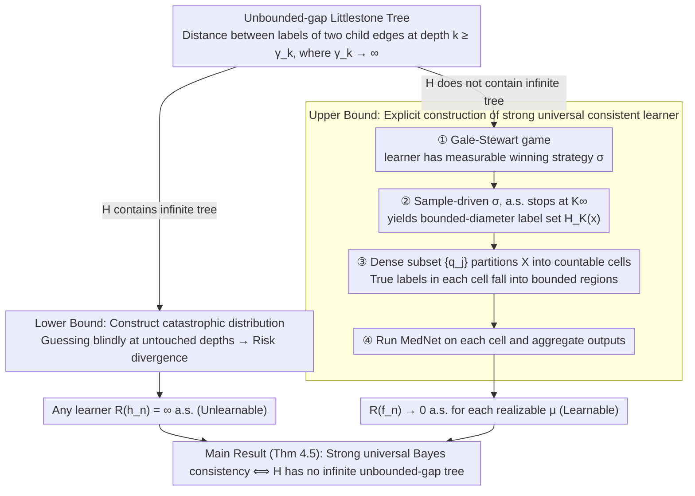

# Realizable Bayes-Consistency for General Metric Losses

**Conference**: ICML 2026  
**arXiv**: [2605.03823](https://arxiv.org/abs/2605.03823)  
**Code**: None  
**Area**: Learning Theory / Metric Losses / Bayes Consistency  
**Keywords**: Learnability, Metric Losses, Littlestone tree, Universal Consistency, Gale-Stewart game

## TL;DR
This paper provides a sharp characterization of the open problem regarding when a hypothesis class $\mathcal{H}$ admits a distribution-free strong universal Bayes-consistent learning algorithm under general (potentially unbounded) metric losses in the realizable setting. The necessary and sufficient condition is that $\mathcal{H}$ does not contain a new combinatorial obstacle termed an "unbounded-gap Littlestone tree."

## Background & Motivation

**Background**: Universal consistency is a classic objective in statistical learning theory—whether a distribution-free algorithm can be constructed such that its risk converges almost surely to the optimum for any data distribution. For 0-1 classification, Bousquet et al. (2020) provided a complete characterization using Littlestone trees and Gale-Stewart games; multiclass classification was generalized by Hanneke et al. (2023); and real-valued regression (absolute loss) was characterized by Attias et al. (2024b) using scaled Littlestone trees. This line of research follows the "combinatorial obstacle $\leftrightarrow$ unlearnability" paradigm.

**Limitations of Prior Work**: Previous results focus on bounded losses or fixed scales. However, many practical tasks (structured output, edit distance, cost-sensitive prediction) naturally occur in metric label spaces $(\mathcal{Y}, \ell)$ where $\ell$ may be unbounded. Under unbounded losses, even the "strong" assumption of realizability cannot suppress the catastrophic rare events of "small probability + high cost"—a learner might err on an event with probability decaying at $1/n$, but if the loss scale grows faster than $n$, the expected risk still diverges to infinity.

**Key Challenge**: Under unbounded metric losses, there is a decoupling between "few errors in probability" and "low risk." Tsir Cohen & Kontorovich (2022) proposed the MedNet algorithm but required a BIE (bounded-in-expectation) condition, leaving an open problem: what is the true necessary and sufficient condition for distribution-free Bayes consistency on $\mathcal{H}$? A naive conjecture might be $R^* < \infty$, but Section 3 of this paper provides a counter-example: with $\mathcal{X} = (0,1)$, $\mathcal{Y} = \mathbb{N}_0$, and $\mathcal{H}$ restricted to $\{0, 2^{2k+1}\}$ on each interval $I_k = (2^{-k}, 2^{-(k-1)})$, $R^* = 0$ holds yet no learner can achieve strong consistency.

**Goal**: In the realizable setting, identify the necessary and sufficient combinatorial characterization for strong universal Bayes consistency under general metric losses (potentially unbounded), closing the open problem by Tsir Cohen & Kontorovich (2022) for the realizable case.

**Key Insight**: Extend the scaled Littlestone tree concept from Attias et al. to metric losses and allow the gap to diverge with depth—essentially, "if a learner is forced to guess blindly between two labels whose distance grows indefinitely in certain regions, they must fail." Combinatorially, this corresponds to a "non-decreasing $(\gamma_k)$-Littlestone tree with $\gamma_k \to \infty$."

**Core Idea**: Realizable strong universal Bayes consistency $\iff \mathcal{H}$ contains no infinite non-decreasing $(\gamma_k)$-Littlestone tree (where $\gamma_k \to \infty$).

## Method

### Overall Architecture

Theorem 4.5 (Main Result): For Polish $(\mathcal{X}, \rho)$, $(\mathcal{Y}, \ell)$, and $\mathcal{H}$ with a compact parameter space $\Theta$ where $h$ is continuous in $\theta$, the following are equivalent: (1) There exists a distribution-free learning rule $\mathcal{A}$ such that $R_\mu(h_n) \to 0$ a.s. for every realizable $\mu$; (2) $\mathcal{H}$ contains no infinite non-decreasing $(\gamma_k)$-Littlestone tree ($\gamma_k \to \infty$). The proof revolves around a combinatorial dichotomy—whether $\mathcal{H}$ contains this "unbounded-gap tree": if yes $\implies$ lower bound, constructing a catastrophic distribution that forces the risk of any learner to diverge; if no $\implies$ upper bound, implementing a winning strategy for the learner as an explicit, countably localized learner.

### Key Designs

**1. Unbounded-gap Littlestone Tree: Coupling "adversarial capability" with "catastrophe scale" for unbounded metric losses.**

Previous scaled Littlestone trees (Attias et al.) treated the gap as a fixed scale parameter, characterizing adversarial complexity under bounded losses. The key insight here is that under unbounded losses, adversarial capability alone is insufficient; one must capture the potential cost of an adversary. Thus, binary labels are generalized to "label distance $\geq \gamma_k$" with $\gamma_k \uparrow \infty$. Internal nodes at depth $k$ are labeled with instance $x_{k,i}$, and the labels of the two outgoing edges satisfy $\ell(y_{k,i,1}, y_{k,i,2}) \geq \gamma_k$. "Realizable infinite" further requires every infinite path to be realized by a single $h \in \mathcal{H}$. The bridging Lemma 4.3 proves that under compact $\Theta$ and continuous $h$, realizability of finite prefixes implies realizability of infinite paths. Gaps diverging with depth corresponds to the phenomenon where adversaries can cause larger costs at greater depths.

**2. Lower Bound: Constructing catastrophic distributions where risk diverges for any learner.**

This is an upgrade of the classic Littlestone argument (where an adversary forces a learner to guess) to the metric-loss setting. Since $\gamma_k \to \infty$, depths $k_1 < k_2 < \cdots$ can be chosen such that $\gamma_{k_m} \geq m^2$. Probabilities $p_m \propto 1/m^2$ are assigned to nodes at depth $k_m$, and independent fair coins $(B_k)$ determine which edge carries the true label. For any fixed sample size $n$, $S_n$ encounters at most $n$ depths $k_m$, leaving infinitely many $k_m$ where $B_{k_m}$ remains a fresh coin for the learner. At these unseen depths, the learner blindly guesses between labels at distance $\geq m^2$, yielding a conditional expected loss $\geq m^2/2$ via the triangle inequality. This contributes $\Theta(1)$ when multiplied by $p_m \cdot 1/2$. The second Borel-Cantelli lemma ensures that "bad events" occur infinitely often, so $R(h_n) = \infty$ a.s.

**3. Upper Bound: Gale-Stewart game + dictionary partition + nested MedNet.**

Handling unbounded metric losses directly is difficult; however, if the problem can be "localized"—proving that for each $x$, the true label almost surely falls within a bounded region—one can reuse existing bounded-range algorithms. The process involves four steps: **First**, translate the existence of an infinite tree into a Gale-Stewart game; the absence of a tree is equivalent to the learner having a measurable winning strategy $\sigma$. **Second**, use samples to drive $\sigma$; since $\sigma$ is a winning strategy, it almost surely stops at some $K_\infty < \infty$. **Third**, define a history-conditional label set $H_k(x)$ with $\text{diam}(H_k(x)) \leq \gamma_{k+1}$ and proof that $\Pr(Y \in H_{K_\infty}(X)) = 1$. **Fourth**, partition $\mathcal{X}$ into countable cells using a dense subset $\{q_j\}$ of $\mathcal{Y}$, such that the true label in each cell resides in a bounded region. MedNet is run on each cell, using sample splitting to drive the game and learn predictors.

### Loss & Training

This is a theoretical paper with no specific training loss. The algorithm described in Section 6.5 uses sample splitting: the first half drives the Gale-Stewart game to stabilize $K$, and the second half runs MedNet (restricted to $\mathcal{Y}_{K,j}$) within each partition bucket. The output is $\hat{f}_n(x) = \hat{f}_{n, j_K(x)}(x)$.

## Key Experimental Results

As a theoretical paper, there are no experiments. The core quantitative results are theorems:

### Main Results

| Result | Content |
|------|------|
| Theorem 4.5 (Main Characterization) | Realizable strong universal Bayes consistency ⟺ absence of infinite non-decreasing-$\gamma_k$ Littlestone tree ($\gamma_k \to \infty$) |
| Section 3 (Counter-example) | $R^* < \infty$ is insufficient for learnability—construction with $\mathcal{X} = (0,1)$, $\mathcal{Y} = \mathbb{N}_0$, and $\mathcal{H}$ mapping to $\{0, 2^{2k+1}\}$ shows $R(h_n) = \infty$ is possible for any learner. |

### Lower / Upper Bound Mapping

| Direction | Key lemma / theorem |
|------|---------------------|
| Lower Bound (Theorem 5.1) | Existence of tree ⟹ for any $\mathcal{A}$, there exists realizable $\mu$ s.t. $\mathbb{E}_{S_n}[R(\mathcal{A}(S_n))] = \infty$ |
| Bridging lemma (4.3) | Compact $\Theta$ + continuity ⟹ finite prefix realizability implies infinite path realizability |
| Upper Bound (Theorem 6.5) | Absence of tree ⟹ explicit sample-split + Gale-Stewart + MedNet learner achieves $R_\mu(\hat{f}_n) \to 0$ a.s. |
| Diameter lemma (6.2) | $\text{diam}(H_k(x)) \leq \gamma_{k+1}$, formalizing the "local boundedness" |

### Key Findings
- Distributional conditions like $R^* < \infty$ (finite Bayes risk) and BIE (bounded-in-expectation) **cannot** uniquely characterize learnability under metric losses; the combinatorial structure of $\mathcal{H}$ must be examined.
- The compact parameterization assumption is mild but necessary; Appendix A.4 provides a counter-example where "finite prefix" and "infinite path" realizability diverge without it.
- The upper-bound algorithm, while explicit, is heavy—requiring a measurable winning strategy, sample splitting, dense subset partitioning, and nested MedNet. Computational complexity is not discussed.
- The agnostic case (where $\inf_h R_\mu(h) = 0$ is not required) remains open.

## Highlights & Insights
- **"Unbounded gap" is the core new dimension** distinguishing metric loss from 0-1 or real-valued regression. This paper couples adversarial capability with catastrophe scale into a combinatorial obstacle for the first time.
- **Lower bound via Borel-Cantelli + independent fair coins** elegantly amplifies "failure to learn in probability" into "infinite risk."
- **Localized bounded regions via history-conditional label sets** serves as a powerful template for handling unbounded target spaces by converting them into countable independent bounded sub-problems.
- **Closing the realizable case** provides significant progress on the open problem from Tsir Cohen & Kontorovich (2022) and identifies the remaining obstacles for the agnostic case.

## Limitations & Future Work
- Only addresses the realizable case; the agnostic extension involving "approximately realizable history" is not directly compatible with the current Gale-Stewart framework.
- Compact $\Theta$ and continuous $h$ are technical assumptions; without them, the tree definitions bifurcate.
- The upper-bound algorithm is theoretically existent but indirect, relying on the Jankov-von Neumann selection theorem for measurable strategies.
- No rates of convergence are provided, only a.s. convergence.
- The Polish space assumption excludes certain pathological settings.

## Related Work & Insights
- **vs Bousquet et al. (2020)**: Foundational work for 0-1 classification using Littlestone trees; Ours is a direct generalization to metric losses and unbounded label spaces.
- **vs Attias et al. (2024a, b)**: Scaled Littlestone trees treat gap as a fixed parameter; Ours allows $\gamma_k$ to diverge with depth to capture catastrophic risk.
- **vs Tsir Cohen & Kontorovich (2022)**: Proposed MedNet under BIE; Ours proves BIE/$R^*<\infty$ is insufficient and provides a true combinatorial characterization, using MedNet as a local component.
- **vs Brukhim et al. (2022)**: DS-dimension for multiclass PAC learnability; Ours focuses on universal/strong consistency, which depends on infinite trees rather than finite dimensions.

## Rating
- Novelty: ⭐⭐⭐⭐⭐ Resolves half of a 4-year-old open problem with a clean new combinatorial object.
- Experimental Thoroughness: N/A (Theoretical paper; counter-examples are sufficient).
- Writing Quality: ⭐⭐⭐⭐ Clear arguments for lower bounds; long but mapped-out upper bound proof.
- Value: ⭐⭐⭐⭐ Significant progress in universal consistency theory, though the lack of agnostic results limits immediate practical application.

<!-- RELATED:START -->

## Related Papers

- [\[ICML 2026\] Parsimonious Learning-Augmented Online Metric Matching](parsimonious_learning-augmented_online_metric_matching.md)
- [\[ICML 2026\] Expectation Consistency Loss: Rethink Confidence Calibration under Covariate Shift](expectation_consistency_loss_rethink_confidence_calibration_under_covariate_shif.md)
- [\[ICML 2025\] Near-Optimal Consistency-Robustness Trade-Offs for Learning-Augmented Online Knapsack Problems](../../ICML2025/learning_theory/near-optimal_consistency-robustness_trade-offs_for_learning-augmented_online_kna.md)
- [\[ICML 2026\] Estimating Correlation Clustering Cost in Node-Arrival Stream](estimating_correlation_clustering_cost_in_node-arrival_stream.md)
- [\[ICML 2026\] Towards Optimal Robustness in Learning-Augmented Paging](towards_optimal_robustness_in_learning-augmented_paging.md)

<!-- RELATED:END -->
