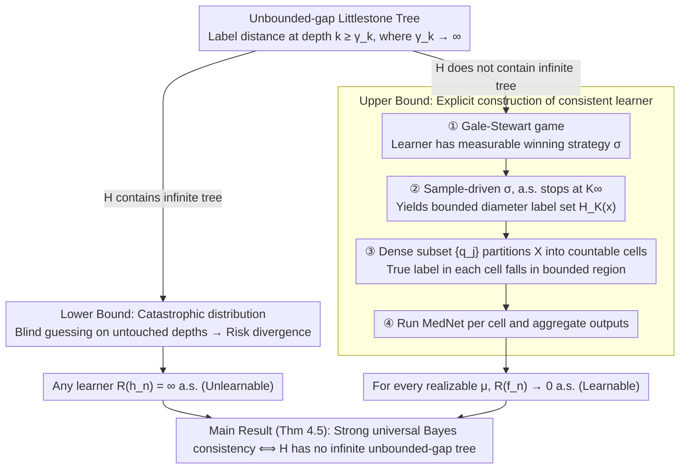

# Realizable Bayes-Consistency for General Metric Losses

**Conference**: ICML 2026  
**arXiv**: [2605.03823](https://arxiv.org/abs/2605.03823)  
**Code**: None  
**Area**: Learning Theory / Metric Losses / Bayes Consistency  
**Keywords**: Learnability, Metric loss, Littlestone tree, Universal consistency, Gale-Stewart game

## TL;DR
This paper provides a sharp characterization of the open problem regarding when a hypothesis class $\mathcal{H}$ admits a distribution-free strong universal Bayes-consistent learning algorithm under general (possibly unbounded) metric losses in the realizable setting. The necessary and sufficient condition is that $\mathcal{H}$ does not contain a new combinatorial obstacle called an "unbounded-gap Littlestone tree."

## Background & Motivation

**Background**: Universal consistency is a classic goal in statistical learning theory—designing a distribution-free algorithm such that its risk converges almost surely to the optimum for any data distribution. For 0-1 classification, Bousquet et al. (2020) provided a complete characterization using Littlestone trees and Gale-Stewart games; multiclass classification was generalized by Hanneke et al. (2023); and real-valued regression (absolute loss) was characterized via scaled Littlestone trees by Attias et al. (2024b). This line of research follows the "combinatorial obstacle $\leftrightarrow$ unlearnability" paradigm.

**Limitations of Prior Work**: The aforementioned results focus on bounded losses or fixed scales. However, many practical tasks (structured output, edit distance, cost-sensitive prediction) naturally occur in metric label spaces $(\mathcal{Y}, \ell)$ where $\ell$ may be unbounded. Under unbounded losses, even the "strong" assumption of realizability cannot suppress catastrophic rare events—a learner might fail on an event whose probability decays at $1/n$, but if the loss scale grows faster than $n$, the expected risk will still diverge to infinity.

**Key Challenge**: Under unbounded metric losses, there is a decoupling between "few errors in probability" and "small risk." Tsir Cohen & Kontorovich (2022) proposed the MedNet algorithm but required the BIE (bounded-in-expectation) condition, leaving an open problem: what is the true necessary and sufficient condition for distribution-free Bayes consistency on $\mathcal{H}$? A naive conjecture might be $R^* < \infty$, but Section 3 of this paper provides a counterexample: a construction on $\mathcal{X} = (0,1)$, $\mathcal{Y} = \mathbb{N}_0$, where $\mathcal{H}$ can only take $\{0, 2^{2k+1}\}$ on each interval $I_k = (2^{-k}, 2^{-(k-1)})$. In this case, $R^* = 0$, yet no learner can achieve strong consistency.

**Goal**: In the realizable setting, find the necessary and sufficient combinatorial characterization for strong universal Bayes consistency under general (possibly unbounded) metric losses, effectively closing the open problem by Tsir Cohen & Kontorovich (2022) for the realizable case.

**Key Insight**: Extend Attias et al.'s scaled Littlestone tree concept to metric losses and allow the gap to diverge with depth—essentially, "if the learner is forced to guess blindly between two labels whose distance grows indefinitely in some regions, they must lose." Combinatorially, this corresponds to a "non-decreasing $(\gamma_k)$-Littlestone tree with $\gamma_k \to \infty$."

**Core Idea**: Realizable strong universal Bayes consistency $\iff$ $\mathcal{H}$ does not contain an infinite non-decreasing-$(\gamma_k)$ Littlestone tree (where $\gamma_k \to \infty$).

## Method

### Overall Architecture

Theorem 4.5 (Main Result): Under a Polish space $(\mathcal{X}, \rho)$, $(\mathcal{Y}, \ell)$, and $\mathcal{H}$ with a compact parameter space $\Theta$ where $h$ is continuous in $\theta$, the following are equivalent: (1) There exists a distribution-free learning rule $\mathcal{A}$ such that for every realizable $\mu$, $R_\mu(h_n) \to 0$ a.s.; (2) $\mathcal{H}$ does not contain an infinite non-decreasing $(\gamma_k)$-Littlestone tree ($\gamma_k \to \infty$). The proof centers on a combinatorial dichotomy—whether $\mathcal{H}$ contains this "unbounded-gap tree": if it does $\implies$ lower bound, constructing a catastrophic distribution that forces the risk of any learner to diverge; if it does not $\implies$ upper bound, realizing the learner's winning strategy as an explicit, countably localized learner.

### Key Designs

**1. Unbounded-gap Littlestone Tree: Characterizing the "Adversarial Capacity $\times$ Catastrophe Scale" obstacle unique to unbounded metric losses.**

Previous scaled Littlestone trees (Attias et al.) treated the gap as a fixed scale parameter, characterizing adversarial complexity under bounded losses. The key insight here is that under unbounded losses, adversarial capacity alone is insufficient; one must also capture "how much cost the adversary can inflict." Thus, binary labels are generalized to "label distance $\geq \gamma_k$," allowing $\gamma_k \uparrow \infty$. Internal nodes at depth $k$ are labeled with instance $x_{k,i}$, and outgoing edges have labels satisfying $\ell(y_{k,i,1}, y_{k,i,2}) \geq \gamma_k$. "Realizable infinite" further requires every infinite path to be realized by a single $h \in \mathcal{H}$. Lemma 4.3 (Bridging Lemma) proves that under compact $\Theta$ and continuous $h$, finite prefix realizability automatically implies infinite path realizability (using the finite intersection property of compact spaces). Gaps diverging with depth correspond to the phenomenon where the adversary can cause larger costs at deeper levels.

**2. Lower Bound: Constructing catastrophic distributions from an unbounded-gap tree.**

This is an upgrade of the classic Littlestone argument (where an adversary forces the learner to choose blindly). Since $\gamma_k \to \infty$, one can pick depths $k_1 < k_2 < \dots$ such that $\gamma_{k_m} \geq m^2$, assign probabilities $p_m \propto 1/m^2$ to nodes at depth $k_m$, and use independent fair coins $(B_k)$ to determine which branch is the true label. For any fixed $n$, the sample $S_n$ touches at most $n$ depths $k_m$. For the remaining infinite depths $k_m$, the coins $B_{k_m}$ remain "fresh" to the learner. On these unseen depths, the learner guesses between labels with distance $\geq m^2$; the triangle inequality gives a conditional expected loss $\geq m^2/2$, which, when multiplied by $p_m \cdot 1/2 = \Theta(1/m^2)$, contributes $\Theta(1)$ per depth. The Second Borel-Cantelli Lemma ensures that infinite "bad events" occur almost surely, so $R(h_n) = \infty$ a.s. The key upgrade is that the cost of guessing itself diverges with $\gamma_k$.

**3. Upper Bound: Gale-Stewart game + Dictionary partitioning + MedNet nesting.**

Handling unbounded metric losses directly is difficult, but if the problem can be "localized"—showing that for each $x$, the true label almost surely falls into some bounded region—then existing bounded-range algorithms can be reused. The four steps are: **Step 1:** Translate the absence of an infinite tree into a Gale-Stewart game where the learner has a measurable winning strategy $\sigma$. **Step 2:** Use samples to drive $\sigma$; because $\sigma$ is a winning strategy, the game stops at $K_\infty < \infty$ almost surely. **Step 3:** Define a history-conditional label set $H_k(x)$; Lemma 6.2 proves $\text{diam}(H_k(x)) \leq \gamma_{k+1}$, and Lemma 6.3 proves $\Pr(Y \in H_{K_\infty}(X)) = 1$ a.s. **Step 4:** Use a countable dense subset $\{q_j\}$ of $\mathcal{Y}$ to partition $\mathcal{X}$ into countable cells, where the true labels in each cell inhabit a bounded region $\mathcal{Y}_{k,j} = \{y : \ell(y, q_j) \leq 2\gamma_{k+1}\}$. MedNet is run on each cell, using a sample-split approach (one half for the game, one half for the predictor).

### Loss & Training

A theoretical paper, no specific training loss. The algorithm described in Section 6.5 uses sample splitting: the first half drives the Gale-Stewart game to stabilize at $K$, and the second half targets the bucket $j_K(x)$ to run MedNet (restricted to $\mathcal{Y}_{K,j}$). The output is $\hat{f}_n(x) = \hat{f}_{n, j_K(x)}(x)$.

## Key Experimental Results

Theoretical paper, no experiments. Core quantitative results are the theorems:

### Main Results

| Result | Content |
|------|------|
| Theorem 4.5 (Main Characterization) | Realizable strong universal Bayes consistency ⟺ Absence of infinite non-decreasing-$\gamma_k$ Littlestone tree ($\gamma_k \to \infty$) |
| Section 3 (Counterexample) | $R^* < \infty$ is insufficient for learnability—constructed $\mathcal{X} = (0,1)$, $\mathcal{Y} = \mathbb{N}_0$, $\mathcal{H}$ values $\{0, 2^{2k+1}\}$ on $I_k$; realizable but any learner risk is $\infty$ |

### Lower / Upper Bound Pairings

| Direction | Key Lemma / Theorem |
|------|---------------------|
| Lower Bound (Theorem 5.1) | Existence of tree ⟹ $\forall \mathcal{A}, \exists$ realizable $\mu$ such that $\mathbb{E}_{S_n}[R(\mathcal{A}(S_n))] = \infty$ |
| Bridging Lemma (4.3) | Compact $\Theta$ + continuous $h$ ⟹ Finite prefix realization $\implies$ Infinite path realization |
| Upper Bound (Theorem 6.5) | Absence of tree ⟹ Explicit sample-split + Gale-Stewart + MedNet learner achieves $R_\mu(\hat{f}_n) \to 0$ a.s. |
| Diameter Lemma (6.2) | $\text{diam}(H_k(x)) \leq \gamma_{k+1}$, making "local boundedness" concrete |

### Key Findings
- Distributional conditions like $R^* < \infty$ (finite Bayes risk) and BIE (bounded-in-expectation) **cannot** alone characterize learnability under metric losses—one must look at the combinatorial structure of $\mathcal{H}$.
- The compact parameterization assumption is mild but necessary: Appendix A.4 provides a counterexample showing that finite prefix realizability and infinite path realizability can diverge without it.
- While the upper-bound algorithm is explicit, it is heavy—requiring a measurable winning strategy, sample splitting, dense set partitioning, and nested MedNet.
- The agnostic setting remains unsolved; Appendix A.5 lists major obstacles, such as the difficulty of defining "approximately realizable history."

## Highlights & Insights
- **"Unbounded gap" is the core new dimension** distinguishing metric losses from 0-1 or real-valued regression. Previous scaled Littlestone trees used fixed scales; this paper allows scales to diverge with depth, coupling "adversarial capacity" with "catastrophe scale."
- **Lower bound proof using Borel-Cantelli + independent fair coins** elegantly amplifies "inability to learn probability" into "infinite risk."
- **History-conditional label sets + Polish dense partitions** serve as a bridge to transform "local boundedness" into "countable learnable subproblems." This is a powerful template for handling unbounded target spaces.

## Limitations & Future Work
- Only addresses the realizable case; agnostic generalization involves the complex concept of "approximate realizability" in game-theoretic frameworks.
- Compact $\Theta$ and continuous $h$ are technical assumptions; removing them splits the tree definitions.
- The upper-bound algorithm is theoretically existent but practically indirect, requiring measurable winning strategies (via Jankov-von Neumann selection) that are difficult to implement on real data.
- Provides a.s. convergence but no rates of convergence.

## Related Work & Insights
- **vs Bousquet et al. (2020)**: Foundational work for 0-1 classification. This paper is a direct generalization to metric losses and unbounded label spaces.
- **vs Attias et al. (2024a, b)**: Scaled Littlestone trees used fixed scale parameters for bounded regression. This paper's core difference is $\gamma_k \to \infty$.
- **vs Tsir Cohen & Kontorovich (2022)**: They proposed MedNet under the BIE condition. This paper proves BIE/$R^*<\infty$ is insufficient and provides a true combinatorial characterization, using MedNet as a local component.

## Rating
- Novelty: ⭐⭐⭐⭐⭐ Resolves half of a 4-year-old open problem and introduces the "unbounded-gap tree."
- Experimental Thoroughness: N/A (Theoretical paper; counterexample construction is sufficient).
- Writing Quality: ⭐⭐⭐⭐ Clear main theorems and lower bound proofs; the upper bound is long but well-mapped.
- Value: ⭐⭐⭐⭐ Significant advancement in universal consistency theory, though the agnostic gap limits immediate practical application.

<!-- RELATED:START -->

## Related Papers

- [\[ICLR 2026\] Robust Amortized Bayesian Inference with Self-Consistency Losses on Unlabeled Data](../../ICLR2026/learning_theory/robust_amortized_bayesian_inference_with_self-consistency_losses_on_unlabeled_da.md)
- [\[ICLR 2026\] On the Bayes Inconsistency of Disagreement Discrepancy Surrogates](../../ICLR2026/learning_theory/on_the_bayes_inconsistency_of_disagreement_discrepancy_surrogates.md)
- [\[ICML 2026\] Parsimonious Learning-Augmented Online Metric Matching](parsimonious_learning-augmented_online_metric_matching.md)
- [\[ICLR 2026\] Bi-Criteria Metric Distortion](../../ICLR2026/learning_theory/bi-criteria_metric_distortion.md)
- [\[ICLR 2026\] Semi-Parametric Contextual Pricing with General Smoothness](../../ICLR2026/learning_theory/semi-parametric_contextual_pricing_with_general_smoothness.md)

<!-- RELATED:END -->
