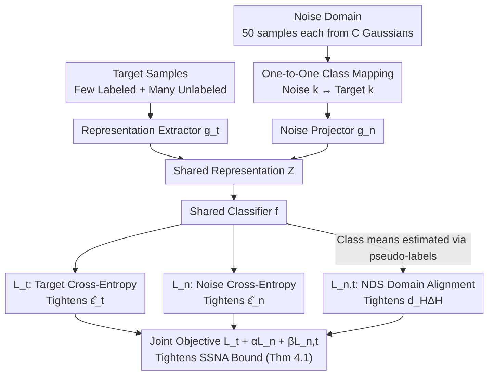

# Semi-Supervised Noise Adaptation: Transferring Knowledge from Noise Domain

**Conference**: ICML 2026  
**arXiv**: [2606.00558](https://arxiv.org/abs/2606.00558)  
**Code**: https://github.com/AIResearch-Group/SSNA  
**Area**: Transfer Learning / Semi-Supervised Learning  
**Keywords**: Semi-supervised noise adaptation, alternative source domain, generalization bound, domain alignment, NDS

## TL;DR
The authors treat a "synthetic domain generated from Gaussian noise" as an alternative source domain in semi-supervised transfer learning. They demonstrate that such "non-semantic but discriminatively structured" noise provides quantifiable improvements to the generalization bound of the target domain. They implement a three-loss Noise Adaptation Framework (NAF) to jointly optimize risks across both domains and distribution differences, achieving a 12.35% improvement over ERM on 4-shot ResNet-18 (CIFAR-10).

## Background & Motivation

**Background**: Dominant semi-supervised transfer learning paradigms transfer knowledge from a "semantically related, richly labeled" source domain (e.g., ImageNet) to a "few-labeled, same-semantic" target domain. Analysis typically utilizes the $\mathcal H\Delta\mathcal H$-divergence generalization bound from Ben-David et al. (2010). Recently, Yao et al. (2025) presented the counter-intuitive finding that noise sampled from simple distributions (e.g., Gaussian) can also serve as a source domain, provided discriminability and transferability are maintained.

**Limitations of Prior Work**: (i) The work by Yao 2025 relies on empirical observations and lacks a generalization bound to explain "why noise helps"; (ii) their experiments avoided standard benchmarks like CIFAR-10/100 or ImageNet-1K, leaving the range of applicability in doubt; (iii) in real-world scenarios, available source data is often restricted by privacy, copyright, or confidentiality, creating an urgent need for "fully self-synthetic, freely constructible" source domain alternatives.

**Key Challenge**: Noise itself contains no semantic information—how can it "teach" anything to the target domain? The answer lies in the representation space: while noise lacks semantics, by establishing a one-to-one mapping between noise class indices and target class indices and training a classifier to distinguish noise classes in a shared representation space, a "ready-made discriminative structure" is induced for the target domain. A small amount of labeled target samples serves as a bridge to align the class indices between the two domains.

**Goal**: (i) Formalize the use of noise as an alternative source domain as the SSNA problem; (ii) derive a generalization bound under the SSNA setting that does not include the "joint optimal error $\lambda$" term; (iii) design an algorithm that directly minimizes the three controllable components of this bound and perform comprehensive validation on standard vision and text benchmarks.

**Key Insight**: The assumption in Ben-David 2010's semi-supervised transfer bound that the "source domain must be semantic data" is relaxed to allow for synthetic noise. The discrete class indices $\{0,\dots,C-1\}$ of the noise are shared with the target domain, bypassing the traditional premise of semantic relevance.

**Core Idea**: The three components $\hat\epsilon_t,\hat\epsilon_n,\hat d_{\mathcal H\Delta\mathcal H}$ derived from the generalization bound can be explicitly minimized in a shared representation space $\mathcal Z$. These correspond to the "target classification loss," "noise classification loss," and "domain alignment loss." Thus, a weighted three-term objective function transforms the "theoretically tighten-able bound" into a "practically optimizable loss."

## Method

### Overall Architecture

SSNA Setting: The target domain $\mathcal D_t=\mathcal D_l\cup\mathcal D_u\cup\mathcal D_e$ consists of a few labeled samples $\mathcal D_l$ ($n_l$), many unlabeled samples $\mathcal D_u$ ($n_u\gg n_l$), and a test set $\mathcal D_e$. The noise domain $\mathcal D_n=\{(\mathbf n_i,y_i)\}$ is sampled from $C$ distinct Gaussian distributions (one mean + identity covariance per class), where the class indices $y_i\in\{0,\dots,C-1\}$ are purely integer identifiers without semantics. A one-to-one mapping is fixed before training, binding noise class 0 to target class "cat," noise class 1 to "dog," etc.

NAF consists of three components: a representation extractor $g_t:\mathcal X\to\mathcal Z$ (processing target pixels, using ResNet-18/50 backbones), a noise projector $g_n:\mathcal E\to\mathcal Z$ (mapping 1024-dimensional Gaussian noise to the same representation space), and a shared classifier $f:\mathcal Z\to\{0,\dots,C-1\}$. Target and noise features are supervisedly pulled toward clusters of their corresponding class indices in $\mathcal Z$, while the distributions of these clusters are aligned across domains. The three losses correspond to the controllable terms in the generalization bound.

### Key Designs

**1. SSNA Generalization Bound (Theorem 4.1): Formulating the influence of noise on target generalization as an inequality that dictates what should be minimized.**

To justify the counter-intuitive use of noise as a source domain, a theoretical foundation is required. This paper extends the Ben-David 2010 framework to the shared representation space $\mathcal{Z}$. Since noise does not exist in the original pixel space, it is first mapped into $\mathcal{Z}$ before measuring divergence. The core inequality is formulated as $\epsilon_t(\hat f)\le\epsilon_t(f_t^*)+\mathcal{O}(\gamma\sqrt{(d\log m+\log(1/\delta))/m})+2(1-\alpha)[\tfrac12\hat d_{\mathcal H\Delta\mathcal H}(\mathbb U_n,\mathbb U_t)+\hat\epsilon_n(\hat f)+\hat\epsilon_t(\hat f)+\dots]$, where $\gamma=\sqrt{\alpha^2/\beta+(1-\alpha)^2/(1-\beta)}$. Compared to traditional transfer bounds, the most critical feature of this bound is that it **does not contain** the joint optimal error term $\lambda$—while $\lambda$ is small for semantic sources, it could be very large and uncontrollable for semantically unrelated sources. By replacing the "semantic relevance" assumption with "alignability in $\mathcal{Z}$," the use of noise as a source is validated.

**2. NAF Three-Loss Joint Optimization: Mapping controllable terms of the generalization bound to specific losses for end-to-end training.**

The terms $\hat\epsilon_t,\hat\epsilon_n,\hat d_{\mathcal H\Delta\mathcal H}$ derived from the bound are assigned specific differentiable losses. In the optimization objective $\min_{g_t,g_n,f}\mathcal L_t+\alpha\mathcal L_n+\beta\mathcal L_{n,t}$: $\mathcal L_t$ is the cross-entropy for labeled target samples; $\mathcal L_n$ is the cross-entropy for noise samples, forcing them into $C$ compact and separable clusters in $\mathcal{Z}$; $\mathcal L_{n,t}$ measures distribution differences. Among five implementations, the authors empirically chose Negative Domain Similarity (NDS)—calculating the average negative cosine similarity between global and class-wise means of both domains. Target class indices for unlabeled samples are estimated online via the classifier $f$'s pseudo-labels. Converting theoretical terms into explicit losses is a key step from abstraction to engineering; using NDS with pseudo-labels avoids the instability of adversarial alignment while capturing class-conditional alignment rather than just marginal alignment.

**3. One-to-One Class Mapping + Pseudo-label Self-update: Establishing a "semantic bridge" between domains without a shared pixel space.**

Noise contains no semantics, so how does it "teach"? The answer lies in the fixed one-to-one class mapping: before training, noise classes $\{0,\dots,C-1\}$ are randomly but uniquely paired with target classes $\{0,\dots,C-1\}$ (e.g., noise 0 $\leftrightarrow$ "cat," noise 1 $\leftrightarrow$ "dog"). The "noise clusters" serve as a "pre-formed skeleton" for the target clusters. During training, the classifier $f$ generates pseudo-labels for unlabeled target samples to estimate target class means for NDS, which are updated iteratively. A few labeled target samples (e.g., 4 per class) are sufficient to roughly align the classifier with the correct class indices, while unlabeled samples are pushed toward the corresponding noise clusters via NDS. Ablation Q6 confirms that without this labeled "bridge," a classifier trained solely on noise is no better than random guessing on the target domain, as noise and target data share no pixel space.

### Loss & Training
The total objective is $\mathcal L=\mathcal L_t+\alpha\mathcal L_n+\beta\mathcal L_{n,t}$. Noise construction: 50 samples per class are drawn from $C$ distinct 1024-dimensional Gaussians (means sampled from a standard normal, identity covariance). For vision datasets, 4 labeled samples are used per class (100 per class for ImageNet-1K), with the remainder as unlabeled target data. Backbones used are ResNet-18/50. The AG News-4 text dataset is separately adapted.

## Key Experimental Results

### Main Results

| Dataset | Backbone | ERM Top-1 | NAF Top-1 | Gain |
|--------|---------|-----------|-----------|------|
| CIFAR-10 | ResNet-18 | 55.55 | 67.90 | +12.35 |
| CIFAR-10 | ResNet-50 | 58.83 | 73.98 | +15.15 |
| CIFAR-100 | ResNet-18 | 41.43 | 49.04 | +7.61 |
| CIFAR-100 | ResNet-50 | 46.71 | 52.82 | +6.11 |
| DTD-47 | ResNet-18 | 45.80 | 50.18 | +4.38 |
| Caltech-101 | ResNet-18 | 79.20 | 81.94 | +2.74 |
| CUB-200 | ResNet-18 | 41.92 | 50.86 | +8.94 |
| OxfordFlowers-102 | ResNet-18 | 81.07 | 86.58 | +5.51 |
| StanfordCars-196 | ResNet-18 | 28.01 | 35.75 | +7.74 |
| ImageNet-1K (100/cls) | ResNet-18 | — | — | +0.99 |

### Complementary Gain with SSL Methods

| Base Method | Dataset | Base Acc (Avg) | +NAF | Gain |
|---------|--------|------------------|------|------|
| UDA | CIFAR-10 | 54.80 | 75.79 | +20.99 |
| UDA | CIFAR-100 | 43.66 | 45.61 | +1.95 |
| FixMatch | CIFAR-10 | 68.31 | 77.93 | +9.62 |
| FixMatch | CIFAR-100 | 41.15 | 43.31 | +2.16 |

### Key Findings
- While $\mathcal L_n$ and $\mathcal L_{n,t}$ are not explicitly optimized in ERM, their training values are consistently higher than in NAF. This aligns with the theoretical expectation that NAF "tightens" the generalization bound, leading to significant accuracy gains and proving that synthetic noise **indeed** facilitates positive transfer.
- t-SNE visualizations show that NAF's noise representations form clearly separable clusters aligned with corresponding target classes, whereas ERM's target representations remain disorganized—verifying that "noise discriminative structure + alignment" is the root cause of the performance boost.
- NAF provides significant gains when combined with established SSL methods like UDA or FixMatch (e.g., UDA+NAF improves CIFAR-10 by nearly 21 points), indicating that it addresses a different generalization bottleneck—representation structure separability—orthogonal to pseudo-label-based SSL.
- A small number of labeled target samples (Ablation Q6) is indispensable: without supervision, the one-to-one mapping cannot be established, and the noise-trained classifier performs at chance level on the target domain.

## Highlights & Insights
- Validating the counter-intuitive practice of "using Gaussian noise as a source domain" with a clean generalization bound—excluding the joint optimal error $\lambda$ provides the theoretical justification for using "semantically unrelated" sources.
- The NDS alignment design, based on cosine similarity of class means, is simple, non-adversarial, and explicitly utilizes class-conditional information. It preserves interpretability while serving as a plug-in that can be combined with existing SSL frameworks.
- Since noise distribution is entirely controlled by the developer (Gaussian parameters, dimensions, number of classes), this approach bypasses privacy, copyright, and compliance issues inherent in collecting real source data—a feature particularly attractive for industrial deployment.
- The "noise discriminative structure $\to$ target discriminative structure" mechanism reveals a universal insight: a source domain does not need to share semantics with the target; as long as it provides a "structural skeleton" in the representation space, the target domain can benefit. This path could be extended to extreme data-scarcity scenarios like robotics or medicine.

## Limitations & Future Work
- The noise distribution is fixed to isotropic Gaussian with identity covariance and randomly sampled class means; the paper does not systematically study the impact of other distributions (e.g., heavy-tailed, multimodal) or inter-class distances on transfer results.
- The one-to-one class mapping is assigned randomly; the authors did not analyze whether the "pairing strategy" affects convergence or final accuracy—for instance, whether pairing noise class 0 with a visually simple versus a complex target class results in asymmetric transfer.
- Large-scale experiments are limited to ImageNet-1K with 100 labeled samples per class, which is relatively lenient compared to common "extreme few-shot" scenarios; performance gains in 1-shot or 5-shot settings remain to be verified.
- NDS relies on pseudo-labels to estimate class means; if the initial classifier quality is poor, cumulative errors may be introduced. The paper does not provide robustness strategies for early-stage pseudo-label noise (e.g., confidence thresholding or EMA smoothing).

## Related Work & Insights
- **vs. Yao et al. 2025**: This paper builds upon the key observation that "noise can act as a source," but completes the picture by providing (i) a theoretical generalization bound, (ii) validation on standard CIFAR/ImageNet benchmarks, and (iii) NAF, a clean, reproducible algorithm.
- **vs. Baradad Jurjo et al. 2021**: That work uses noise for contrastive pre-training as a "self-supervised alternative" for representation learning; this paper integrates noise into the role of a source domain in semi-supervised transfer, featuring entirely different theoretical analysis and training objectives.
- **vs. SSL methods (FixMatch/UDA)**: Traditional SSL relies on unlabeled target samples and consistency across strong/weak augmentations; NAF is orthogonal, adding a "heterogeneous noise source" as an additional discriminative structure.
- **vs. Classic Domain Adaptation (DANN)**: DANN uses adversarial training to align marginal distributions; NAF uses NDS class means for explicit class-conditional alignment without adversarial training, avoiding GAN-style optimization instability and leveraging the strong prior of the one-to-one class mapping.

## Rating
- Novelty: ⭐⭐⭐⭐⭐ Formally justifying and engineering the counter-intuitive "noise-as-source" concept is a first.
- Experimental Thoroughness: ⭐⭐⭐⭐ Covers CIFAR/DTD/Caltech/CUB/Flowers/Cars/ImageNet/AG News with various backbones; however, noise distribution comparisons are restricted to Gaussian.
- Writing Quality: ⭐⭐⭐⭐ Clear reasoning chain; the relationship between the generalization bound and the algorithm is well-explained.
- Value: ⭐⭐⭐⭐ Provides a plug-and-play strong baseline for transfer scenarios where real source data is inaccessible, and can be freely combined with SSL methods.

<!-- RELATED:START -->

## Related Papers

- [\[NeurIPS 2025\] Prediction-Powered Semi-Supervised Learning with Online Power Tuning](../../NeurIPS2025/learning_theory/prediction-powered_semi-supervised_learning_with_online_power_tuning.md)
- [\[ICML 2025\] Theoretical Performance Guarantees for Partial Domain Adaptation via Partial Optimal Transport](../../ICML2025/learning_theory/theoretical_performance_guarantees_for_partial_domain_adaptation_via_partial_opt.md)
- [\[ICML 2026\] On the Learnability of Test-Time Adaptation: A Recovery Complexity Perspective](on_the_learnability_of_test-time_adaptation_a_recovery_complexity_perspective.md)
- [\[ICML 2026\] MMD-Balls as Credal Sets: A PAC-Bayesian Framework for Epistemic Uncertainty in Test-Time Adaptation](mmd-balls_as_credal_sets_a_pac-bayesian_framework_for_epistemic_uncertainty_in_t.md)
- [\[NeurIPS 2025\] Keep It on a Leash: Controllable Pseudo-label Generation Towards Realistic Long-Tailed Semi-Supervised Learning](../../NeurIPS2025/learning_theory/keep_it_on_a_leash_controllable_pseudo-label_generation_towards_realistic_long-t.md)

<!-- RELATED:END -->
