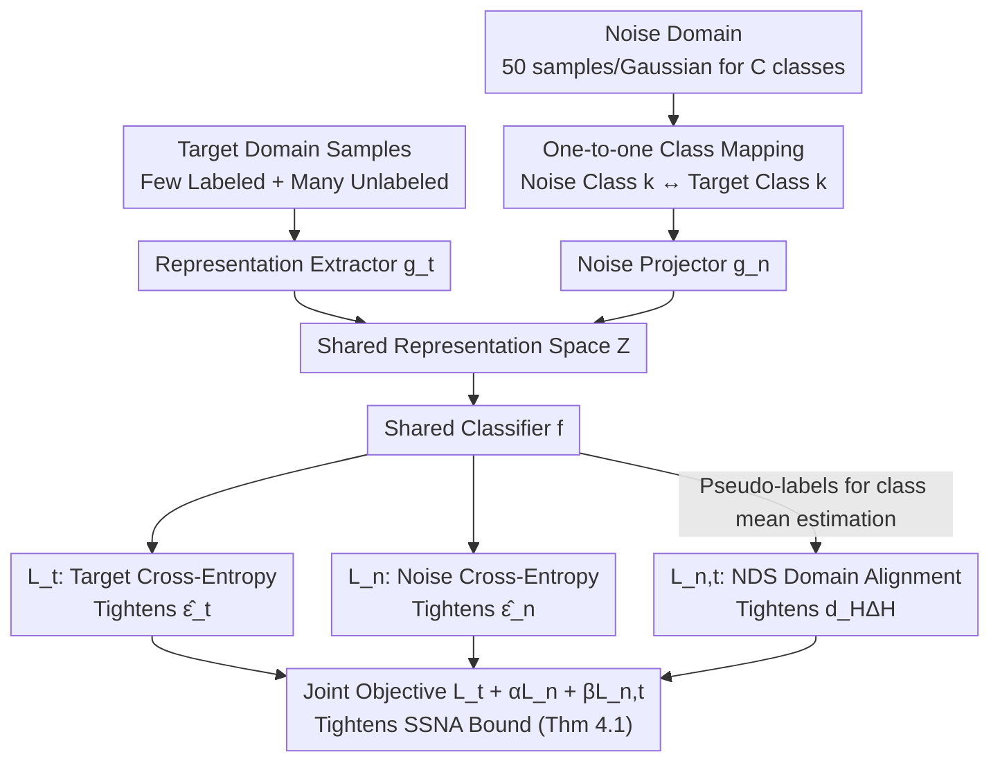

# Semi-Supervised Noise Adaptation: Transferring Knowledge from Noise Domain

**Conference**: ICML 2026  
**arXiv**: [2606.00558](https://arxiv.org/abs/2606.00558)  
**Code**: https://github.com/AIResearch-Group/SSNA  
**Area**: Transfer Learning / Semi-Supervised Learning  
**Keywords**: Semi-supervised noise adaptation, surrogate source domain, generalization bound, domain alignment, NDS

## TL;DR
The authors treat a "synthetic domain generated from Gaussian noise" as a surrogate source domain in semi-supervised transfer learning. They demonstrate that such "non-semantic but discriminatively structured" noise provides a quantifiable improvement in generalization bounds for the target domain. They introduce the Noise Adaptation Framework (NAF) to jointly optimize risks and distribution discrepancies across both domains, achieving a 12.35% improvement over ERM on 4-shot ResNet-18 for CIFAR-10.

## Background & Motivation

**Background**: Mainstream semi-supervised transfer learning transfers knowledge from a "semantically related, richly labeled" source domain (e.g., ImageNet) to a "sparsely labeled, semantically identical" target domain. Analysis typically employs the $\mathcal H\Delta\mathcal H$ divergence generalization bound from Ben-David et al. (2010). Recently, Yao et al. (2025) presented the counter-intuitive finding that noise sampled from simple distributions (Gaussian) can also serve as a source domain, provided discriminability and transferability are maintained.

**Limitations of Prior Work**: (i) Yao 2025 relies on empirical observations and lacks a generalization bound to explain why noise helps. (ii) Previous experiments avoided standard benchmarks like CIFAR-10/100 or ImageNet-1K, leaving the scope of the conclusions in doubt. (iii) In real-world applications, available source data is often restricted by privacy, copyright, or confidentiality, creating an urgent need for a "completely self-synthesized, arbitrarily constructible" source domain alternative.

**Key Challenge**: Noise itself contains no semantic information; how can it "teach" the target domain? The answer lies in the representation space: while noise lacks semantics, by creating a one-to-one mapping between noise class indices and target class indices and training the classifier to distinguish noise classes in a shared representation space, a "ready-made discriminative structure" is induced for the target domain. The small number of labeled target samples acts as a bridge to align the class indices of the two domains.

**Goal**: (i) Formalize the use of noise as a surrogate source domain as the SSNA problem. (ii) Derive a generalization bound for the SSNA setting that does not contain the "joint optimal error $\lambda$" term. (iii) Design an algorithm capable of directly minimizing the three controllable terms of this generalization bound and perform comprehensive validation on standard vision and text benchmarks.

**Key Insight**: Relax the assumption in the Ben-David 2010 semi-supervised transfer bound that the "source domain must be semantic data," allowing the source domain to be synthetic noise. Sharing discrete class indices $\{0,\dots,C-1\}$ between the noise and target domains allows bypassing the traditional prerequisite that the two domains must be semantically related.

**Core Idea**: The three terms derived from the generalization bound—$\hat\epsilon_t, \hat\epsilon_n, \hat d_{\mathcal H\Delta\mathcal H}$—can be explicitly minimized in a shared representation space $\mathcal Z$. These correspond to "target classification loss / noise classification loss / domain alignment loss." Consequently, a triple-weighted objective function transforms a "theoretically tightenable bound" into an "optimizable loss in practice."

## Method

### Overall Architecture

SSNA Setting: The target domain $\mathcal D_t=\mathcal D_l\cup\mathcal D_u\cup\mathcal D_e$ consists of a few labeled samples $\mathcal D_l$ ($n_l$), a large number of unlabeled samples $\mathcal D_u$ ($n_u\gg n_l$), and a test set $\mathcal D_e$. The noise domain $\mathcal D_n=\{(\mathbf n_i,y_i)\}$ is sampled from $C$ distinct Gaussian distributions (one mean per class + unit covariance), where class indices $y_i\in\{0,\dots,C-1\}$ are integer identifiers without semantics. A one-to-one mapping is fixed before training, e.g., mapping noise class 0 to target class "cat" and noise class 1 to "dog."

NAF consists of three components: a representation extractor $g_t:\mathcal X\to\mathcal Z$ (processing target pixels, using ResNet-18/50 backbones), a noise projector $g_n:\mathcal E\to\mathcal Z$ (mapping 1024-dimensional Gaussian noise into the same representation space), and a shared classifier $f:\mathcal Z\to\{0,\dots,C-1\}$. Target and noise samples are supervisedly pulled toward clusters corresponding to their class indices in $\mathcal Z$, while the distributions of these clusters are aligned. The three losses correspond to the controllable terms in the generalization bound.

### Key Designs

**1. SSNA Generalization Bound (Theorem 4.1): Turning the impact of noise on target generalization into an inequality that explicitly identifies what to minimize.**

To justify the counter-intuitive use of noise as a source domain, a theoretical foundation is required. This paper adopts the two-domain framework of Ben-David 2010 on the shared representation space $\mathcal{Z}$. Since noise is not in the original pixel space, it is first mapped into $\mathcal{Z}$ before measuring divergence. The core inequality takes the form $\epsilon_t(\hat f)\le\epsilon_t(f_t^*)+\mathcal{O}(\gamma\sqrt{(d\log m+\log(1/\delta))/m})+2(1-\alpha)[\tfrac12\hat d_{\mathcal H\Delta\mathcal H}(\mathbb U_n,\mathbb U_t)+\hat\epsilon_n(\hat f)+\hat\epsilon_t(\hat f)+\dots]$, where $\gamma=\sqrt{\alpha^2/\beta+(1-\alpha)^2/(1-\beta)}$. Compared to traditional transfer bounds, the most critical feature of this bound is that it **does not contain** the joint optimal error term $\lambda$. While $\lambda$ is small for semantic sources, it can be very large for semantically unrelated sources, making it impossible to guarantee a small bound. By replacing the "semantic relevance" assumption with "alignability in $\mathcal{Z}$," the paper justifies using noise as a source.

**2. NAF Triple Loss Joint Optimization: Mapping the controllable terms of the generalization bound to specific losses for end-to-end training.**

The three terms $\hat\epsilon_t, \hat\epsilon_n, \hat d_{\mathcal H\Delta\mathcal H}$ derived from the generalization bound are assigned specific differentiable losses. In the optimization objective $\min_{g_t,g_n,f}\mathcal L_t+\alpha\mathcal L_n+\beta\mathcal L_{n,t}$, $\mathcal L_t$ is the cross-entropy for labeled target samples; $\mathcal L_n$ is the cross-entropy for noise samples, forcing noise to form $C$ compact and separable clusters in $\mathcal{Z}$; $\mathcal L_{n,t}$ represents the distribution discrepancy between the two domains. After evaluating five implementations, the authors chose Negative Domain Similarity (NDS), which calculates and averages the cosine similarity between the global and class-wise means of both domains. The class indices for unlabeled target samples are estimated online using pseudo-labels from classifier $f$. Mapping the theoretical factors of generalization to specific losses is the key step from abstraction to implementation. Using NDS with class means and pseudo-labels avoids the instability of adversarial alignment and captures class-conditional alignment rather than just marginal alignment.

**3. One-to-one Class Index Mapping + Pseudo-label Self-update: Building a "semantic bridge" between domains without a shared pixel space.**

Noise contains no semantic information. How can it teach the target domain? The answer lies in the fixed one-to-one class index mapping: before training, noise classes $\{0,\dots,C-1\}$ and target classes $\{0,\dots,C-1\}$ are randomly but uniquely paired (e.g., noise class 0 for cat, class 1 for dog). The "noise class clusters" serve as a "pre-formed skeleton" for the target class clusters. During training, classifier $f$ outputs pseudo-labels for all unlabeled target samples to estimate target class-conditional means online (required for NDS), which are refreshed every iteration. A small number of labeled target samples (e.g., 4 per class) is sufficient to initially align the classifier with the correct class indices, while unlabeled samples are pushed toward the corresponding noise clusters via NDS. Ablation Q6 confirms that without this labeled bridge, a classifier trained only on noise is equivalent to random guessing on the real target domain.

### Loss & Training
The total objective is $\mathcal L=\mathcal L_{t}+\alpha \mathcal L_{n}+\beta \mathcal L_{n,t}$. Noise construction: 50 samples are collected for each of the $C$ classes from different 1024-dimensional Gaussians (means sampled from a standard normal, identity covariance). Vision datasets use 4 labeled samples per class, except ImageNet-1K with 100 per class; remaining samples are unlabeled target data. ResNet-18/50 backbones are used, with AG News-4 for text experiments.

## Key Experimental Results

### Main Results

| Dataset | Backbone | ERM Top-1 | NAF Top-1 | Gain |
|--------|---------|-----------|-----------|------|
| CIFAR-10 | ResNet-18 | 55.55 | 67.90 | +12.35 |
| CIFAR-10 | ResNet-50 | 58.83 | 73.98 | +15.15 |
| CIFAR-100 | ResNet-18 | 41.43 | 49.04 | +7.61 |
| CIFAR-100 | ResNet-50 | 46.71 | 52.82 | +6.11 |
| DTD-47 | ResNet-18 | 45.80 | 50.18 | +4.38 |
| Caltech-101 | ResNet-18 | 79.20 | 81.94 | +2.74 |
| CUB-200 | ResNet-18 | 41.92 | 50.86 | +8.94 |
| OxfordFlowers-102 | ResNet-18 | 81.07 | 86.58 | +5.51 |
| StanfordCars-196 | ResNet-18 | 28.01 | 35.75 | +7.74 |
| ImageNet-1K (100/class) | ResNet-18 | — | — | +0.99 |

### Gain when combined with SSL methods

| Base Method | Dataset | Base Accuracy (Avg) | +NAF | Gain |
|---------|--------|------------------|------|------|
| UDA | CIFAR-10 | 54.80 | 75.79 | +20.99 |
| UDA | CIFAR-100 | 43.66 | 45.61 | +1.95 |
| FixMatch | CIFAR-10 | 68.31 | 77.93 | +9.62 |
| FixMatch | CIFAR-100 | 41.15 | 43.31 | +2.16 |

### Key Findings
- $\mathcal L_n$ and $\mathcal L_{n,t}$ are not explicitly optimized under ERM, and their training values remain higher than those of NAF. This matches the theoretical expectation that NAF tightens the generalization bound more effectively, leading to significant accuracy gains and proving that synthetic noise **indeed** brings positive transfer.
- t-SNE visualization shows that NAF noise representations form clear, separable clusters aligned with corresponding target classes, whereas ERM target representations are relatively chaotic. This confirms that "noise discriminative structure + alignment" is the root cause of the performance improvement.
- NAF provides significant additive gains when applied on top of established SSL methods like UDA or FixMatch (improving UDA+NAF by nearly 21 points on CIFAR-10). This indicates it addresses a generalization bottleneck—representational structure separability—that is orthogonal to pseudo-label-based SSL.
- A small number of labeled target samples (Ablation Q6) is indispensable: without any supervision, the one-to-one mapping cannot be established, and a noise-trained classifier is equivalent to random guessing on the target domain.

## Highlights & Insights
- Successfully established the counter-intuitive practice of "using Gaussian noise as a source domain" with a clean generalization bound. Removing the joint optimal error $\lambda$ from the bound provides the theoretical entry point for "semantically unrelated" sources.
- The NDS alignment design based on class means is simple, non-adversarial, and explicitly utilizes class-conditional information. It turns alignment into a plug-in that can be freely combined with existing SSL frameworks.
- Noise distributions are fully controlled by the developer (Gaussian parameters, dimensionality, number of classes), bypassing privacy, copyright, and compliance issues in source data collection—a feature highly attractive for industrial deployment.
- The "noise discriminative structure $\to$ target discriminative structure" mechanism reveals a universal idea: source domains do not need to share semantics with the target; as long as they provide a "structural skeleton" in the representation space, the target domain can benefit. This path could be extended to data-scarce scenarios like robotics or medicine.

## Limitations & Future Work
- The noise distribution is fixed as isotropic Gaussian with unit covariance and randomly sampled class means. The study does not systematically investigate the impact of other distributions (e.g., heavy-tailed, multimodal) or inter-class distances on transfer performance, leaving significant room for hyperparameter tuning.
- The one-to-one class index mapping is assigned randomly. The authors did not analyze whether the "pairing method" affects convergence or final accuracy—for example, whether pairing a noise class with a visually simple versus a complex class causes asymmetric transfer.
- Large-scale experiments are limited to ImageNet-1K with 100 labeled samples per class, which is relatively lenient compared to "extreme low-label" scenarios. Whether gains remain significant in 1-shot/5-shot settings remains to be verified.
- NDS relies on pseudo-labels to estimate class means. If initial classifier quality is poor, it may introduce cumulative error. The paper does not provide robustification strategies for early-stage pseudo-label noise (e.g., confidence thresholds or EMA smoothing).

## Related Work & Insights
- **vs. Yao et al. 2025**: This paper builds on the observation that "noise can serve as a source," but completes it with (i) a theoretical generalization bound, (ii) standard benchmarks like CIFAR/ImageNet, and (iii) NAF, a clean, reproducible algorithm, elevating the direction from a "curiosity" to a viable method.
- **vs. Baradad Jurjo et al. 2021**: That work uses noise for contrastive pre-training as a "self-supervised substitute" for representation learning. This paper incorporates noise as a source in semi-supervised transfer, with entirely different theoretical analysis and training objectives.
- **vs. SSL methods (FixMatch / UDA)**: Traditional SSL relies solely on target unlabeled samples and consistency under strong/weak augmentations. NAF is orthogonal, adding "heterogeneous noise sources" as an additional discriminative structure, leading to significant additive gains.
- **vs. Classical Domain Adaptation (DANN)**: DANN uses adversarial training to align marginal distributions. NAF uses NDS class means for explicit class-conditional alignment without adversarial training, avoiding GAN-style optimization instability and fully utilizing the strong prior of one-to-one mapping.

## Rating
- Novelty: ⭐⭐⭐⭐⭐ Formally justifying and engineering the use of "noise as a source domain" is an original, counter-intuitive contribution.
- Experimental Thoroughness: ⭐⭐⭐⭐ Coverage of CIFAR/DTD/Caltech/CUB/Flowers/Cars/ImageNet/AG News is extensive; backbones and hyperparameters are well-documented. However, only Gaussian noise distributions were compared.
- Writing Quality: ⭐⭐⭐⭐ Clear reasoning chain; the relationship between the generalization bound and the algorithm is well-explained.
- Value: ⭐⭐⭐⭐ Provides a plug-and-play baseline for transfer scenarios where real source data is inaccessible, and it is easily combinable with SSL methods.

<!-- RELATED:START -->

## Related Papers

- [\[ICML 2026\] Robustness of Mixtures of Experts to Feature Noise](robustness_of_mixtures_of_experts_to_feature_noise.md)
- [\[ICML 2026\] Efficiently Learning Drifting Halfspaces with Massart Noise](efficiently_learning_drifting_halfspaces_with_massart_noise.md)
- [\[ICLR 2026\] Noise Tolerance of Distributionally Robust Learning](../../ICLR2026/learning_theory/noise_tolerance_of_distributionally_robust_learning.md)
- [\[NeurIPS 2025\] Prediction-Powered Semi-Supervised Learning with Online Power Tuning](../../NeurIPS2025/learning_theory/prediction-powered_semi-supervised_learning_with_online_power_tuning.md)
- [\[ICLR 2026\] "Noisier" Noise Contrastive Estimation is (Almost) Maximum Likelihood](../../ICLR2026/learning_theory/noisier_noise_contrastive_estimation_is_almost_maximum_likelihood.md)

<!-- RELATED:END -->
