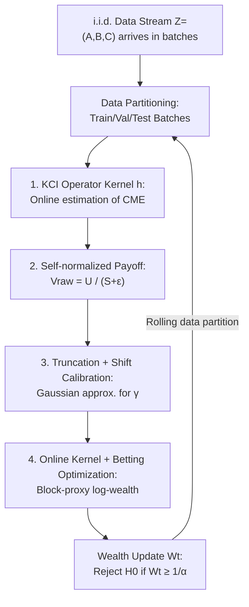

# Sequential Kernel-based Conditional Independence Testing via Adaptive Betting

**Conference**: ICML 2026  
**arXiv**: [2606.18993](https://arxiv.org/abs/2606.18993)  
**Code**: [github.com/he-zh/SKCI](https://github.com/he-zh/SKCI)  
**Area**: Learning Theory / Sequential Hypothesis Testing  
**Keywords**: Conditional Independence Testing, testing-by-betting, anytime-valid, kernel methods, Model-X

## TL;DR
SKCI proposes a sequential (anytime-valid) conditional independence test: it applies "testing-by-betting" to a **self-normalized kernel conditional independence (KCI) statistic**, coupled with a "truncation + shifting" Gaussian approximation calibration. This ensures that even when the conditional distribution $P_{A\mid C}$ in the Model-X assumption must be estimated online (rather than being exactly known), the Type I error inflation remains minor while maintaining high power—outperforming existing sequential Model-X methods on high-dimensional synthetic benchmarks and real-world fairness auditing tasks.

## Background & Motivation

**Background**: Conditional independence (CI) testing ($A\perp\!\!\!\perp B\mid C$) is a fundamental tool for causal discovery, fairness auditing, and robustness diagnostics. Classical p-value tests are fragile under "optional stopping, multiple testing, and side-by-side data analysis" (the reproducibility crisis). Anytime-valid testing (based on e-values and testing-by-betting) provides a principled alternative: it reframes testing as a "betting game" where a player starts with initial wealth $W_0=1$ and chooses a payoff function $f_t$ per round. Wealth evolves as $W_t=W_{t-1}(1+\lambda_t f_t(Z_t))$. As long as the conditional expectation of $f_t$ under the null hypothesis is $\le 0$, the wealth process is a non-negative supermartingale under $H_0$. By Ville's inequality, $\Pr_{H_0}(\exists t: W_t\ge 1/\alpha)\le\alpha$, yielding a level-$\alpha$ anytime-valid test that rejects at $\tau=\inf\{t:W_t\ge 1/\alpha\}$.

**Limitations of Prior Work**: CI testing is inherently difficult—Shah & Peters (2020) proved that **without additional assumptions, no test can control Type I error while maintaining non-trivial power**; Waudby-Smith & Ramdas (2023) extended this impossibility to the sequential setting. To circumvent this, the mainstream approach relies on the **Model-X assumption**: assuming the conditional distribution $P_{A\mid C}$ is exactly known, allowing for the generation of null-calibrated samples $\tilde Z=(\tilde A,B,C)$ where $\tilde A\sim P_{A\mid C}$. However, existing sequential CI tests (e-CRT, DAVT, etc.) almost exclusively **require $P_{A\mid C}$ to be exactly known**.

**Key Challenge**: In reality, an exact $P_{A\mid C}$ is rarely available and must be estimated online from auxiliary data. Once $\tilde Z$ only approximately follows the null distribution, a sufficiently powerful test (due to large sample sizes or sensitive statistics $g$) will **detect the mismatch between $Z$ and the inaccurately generated $\tilde Z$**, leading to false rejections even when $A\perp\!\!\!\perp B\mid C$ holds. The sequential setting is even more demanding: validity must hold across unbounded stopping times, meaning approximation errors cannot be amplified into detectable signals as observations increase.

**Goal**: Develop a sequential CI test that performs well when $P_{A\mid C}$ is known and, more importantly, maintains reasonable Type I control and power when $P_{A\mid C}$ must be **estimated online**.

**Key Insight**: Rather than explicitly constructing null-calibrated samples $\tilde Z$, the authors use payoff functions of the form $f_t(Z_t)=g_t(Z_t;\gamma_t)$—where $\gamma_t$ is a data-dependent "shift" chosen to ensure the wealth process is an approximate supermartingale under the null. This is paired with statistics that rapidly accumulate evidence under weak signals.

**Core Idea**: Apply "testing-by-betting" to a **self-normalized kernel conditional independence (KCI) statistic**, using "truncation + shifting" Gaussian approximation calibration to absorb conditional distribution estimation errors. This significantly reduces Type I error inflation in the estimated-distribution regime without sacrificing power.

## Method

### Overall Architecture

SKCI processes an i.i.d. data stream $Z_t=(A_t,B_t,C_t)$ arriving in batches (batch size $b$). The test can stop at any data-dependent time. To ensure that payoff functions and betting ratios are $\mathcal{F}_{t-1}$-measurable, the observed data at each round is partitioned into three disjoint subsets: the **training set** $\mathcal{X}^{tr}_{t-1}$ (for estimating data-dependent components in the statistic, growing over time), the **validation set** $\mathcal{X}^{val}_{t-1}$ (for estimating calibration values), and the **test batch** $\mathcal{Y}_t$ (for updating wealth $W_t$). These sets roll forward: "test batch → next round's validation set → eventually merged into training set."

The statistic is composed of several modules: first, a KCI operator kernel $h$ measures the "residual association between $A$ and $B$ after accounting for $C$," with conditional mean embeddings estimated online. Then, a **self-normalization** of the kernel interaction between the new batch and history yields the raw payoff $V^{raw}_t$, addressing the slow wealth growth under weak signals. Next, a "truncation + shifting" operation $V_t=\max\{V^{raw}_t-\gamma_t,-1\}$ ensures the payoff is $\ge -1$ and its conditional mean under the null is $\le 0$, with the shift $\gamma_t$ estimated via Gaussian approximation. Finally, an online optimization of the conditional kernel $k_C$ and betting ratio $\lambda_t$ is performed using a block-proxy log-wealth objective. Wealth is updated each round, and $H_0$ is rejected if $W_t\ge 1/\alpha$.

### Key Designs

**1. KCI Operator Kernel: Mapping "residual association after C" to a bettable kernel**

CI testing is difficult because when $C$ is continuous, one usually observes only one $(A,B)$ pair for a given $C$, making it impossible to create null samples via permutation as in unconditional tests. Instead of generating samples, SKCI uses the KCI framework (Zhang et al., 2011) to construct a symmetric kernel $h$ measuring conditional dependence. Mapping $A,B,C$ into their respective RKHS (feature maps $\phi_A,\phi_B,\phi_C$), the conditional mean embeddings $\mu_{A\mid C}(c)=\mathbb{E}[\phi_A(A)\mid C=c]$ and $\mu_{B\mid C}(c)$ represent the parts of $A$ and $B$ explainable by $C$. The KCI operator uses the **tensor product of residuals**:

$$\psi(z)=\bigl(\phi_A(a)-\mu_{A\mid C}(c)\bigr)\otimes\bigl(\phi_B(b)-\mu_{B\mid C}(c)\bigr)\otimes\phi_C(c)$$

This encodes the dependence between residuals of $A$ and $B$ after removing the influence of $C$. Under $H_0$, residuals are conditionally uncorrelated, so $\mathbb{E}_{H_0}[\psi(Z)]=0$. Under certain kernel generality conditions, any violation of conditional independence leads to $\mathbb{E}[\psi(Z)]\neq0$. Defining $h(Z,Z')=\langle\psi(Z),\psi(Z')\rangle$ satisfies $\mathbb{E}_{H_0}[h(Z,Z')\mid Z]=0$, which is exactly the "zero conditional mean under the null" required for betting. Crucially, $\mu_{A\mid C}$ and $\mu_{B\mid C}$ are **unknown** outside of Model-X and must be estimated online from $\mathcal{X}^{tr}_{t-1}$ via Kernel Ridge Regression (KRR). Thus, the kernel $h^{(t)}$ depends on all past information but remains $\mathcal{F}_{t-1}$-measurable.

**2. Self-normalized Payoff: Stable wealth accumulation under weak signals**

When the difference between $H_0$ and $H_1$ is weak (or the kernel $h$ is poorly chosen), the magnitude of kernel interactions is small, resulting in slow wealth growth. This cannot be solved by simply scaling the function, as Ville's inequality requires payoffs $\ge -1$. The solution is a **self-normalized** horizontal U-statistic. Given training history $\mathcal{X}^{tr}_{t-1}=\{x_i\}_{i=1}^n$ and a new batch $\mathcal{Y}_t=\{y_j\}_{j=1}^b$, define the horizontal U-statistic $U_{n,b}=\frac{1}{nb}\sum_i\sum_j h(x_i,y_j)$ and a history-based V-statistic $S_n=\frac{1}{n^2}\sum_i\sum_j h(x_i,x_j)$. The raw payoff is the ratio:

$$V^{raw}_t\coloneq\frac{U_{n,b}(\mathcal{X}^{tr}_{t-1},\mathcal{Y}_t)}{S_n(\mathcal{X}^{tr}_{t-1})+\varepsilon},\quad\varepsilon>0$$

As $n, b$ increase, both $U_{n,b}$ and $S_n$ converge to $\mathbb{E}h(X,Y)$, making $V^{raw}_t\approx 1$ under the alternative—**independent of the scale of kernel $h$**. Under the null, since the denominator $S_n$ is $\mathcal{F}_{t-1}$-measurable and the numerator has conditional mean zero, $V^{raw}_t$ remains a zero-mean martingale. The term $\varepsilon$ prevents numerical instability.

**3. Truncation + Shift Calibration: Absorbing estimation errors via Gaussian approximation**

To apply Ville's inequality, the payoff must satisfy $V_t\ge -1$ and $\mathbb{E}_{H_0}[V_t\mid\mathcal{F}_{t-1}]\le 0$. Fluctuation in the normalization can cause $V^{raw}_t$ to drop below $-1$. The authors apply a **one-sided truncation** paired with a **predictable shift** $\gamma_t$: $V_t\coloneq\max\{V^{raw}_t-\gamma_t,-1\}$. Truncation ensures wealth non-negativity but raises the conditional mean; to compensate, the **minimal non-negative shift** $\gamma_t\coloneq\min_{\gamma\ge0}\{\gamma:\mathbb{E}_{H_0}[\max\{V^{raw}_t-\gamma,-1\}\mid\mathcal{F}_{t-1}]\le 0\}$ is sought.

Since the null distribution of $V^{raw}_t$ is unknown, a **Gaussian approximation** is used: since $V^{raw}_t$ is a normalized average of independent test samples, by CLT, $\mathrm{Law}(V^{raw}_t\mid\mathcal{F}_{t-1})\approx\mathcal{N}(\mu_t,\sigma_t^2)$ for large $b$. Under Gaussianity, the null expectation has a closed form $f(\gamma;\mu,\sigma)=\sigma[\phi(\xi)-\xi\Phi(-\xi)]-1$ (where $\xi=\frac{\gamma-\mu-1}{\sigma}$). In practice, $\hat\mu_t=0$ is assumed, and variance $\hat\sigma_t^2$ is estimated using the **validation set** to reduce bias. The shift $\hat\gamma_t$ is solved via binary search. This calibration converts "conditional distribution estimation error" into controllable Type I drift rather than immediate false rejection.

**4. Online Kernel + Betting Optimization: Adapting to undetectable correlation subspaces**

Kernel selection in KCI plays two roles: the regression kernel affects the estimation of CMEs, while the kernel $k_C$ over $C$ determines sensitivity to conditional dependence. $\lambda_t$ and $k_C$ are jointly optimized to maximize the expected log-wealth increment $\arg\max_{\lambda,k_C}\mathbb{E}_{H_1}[\log(1+\lambda V_t)]$. Since the alternative is unknown, an **empirical proxy** is used on historical data: the training samples are split into blocks to construct proxy payoffs $\tilde V_i^{(t)}$ via a "leave-block-out" approach. This allows SKCI to **online tune the kernel to the subspace containing the relevant signal**.

### Loss & Training
The overall procedure (Algorithm 1) involves three phases per round: Phase 1 fits $\mu_{A\mid C}^{(t)}, \mu_{B\mid C}^{(t)}$ using KRR on $\mathcal{X}^{tr}_{t-1}$; Phase 2 updates $\eta_t$ and $k_C$ via gradient steps and solves for $\hat\gamma_t$; Phase 3 computes $V^{raw}_t$ from the test batch, calibrates it to $V_t$, and updates wealth $W_t$. Theorem 4.2 provides a one-step drift bound $\delta_t \le U_t$, accounting for Gaussian approximation gaps, CME estimation errors, and variance mismatch, which leads to a finite-sample Type I bound (Prop 4.3).

## Key Experimental Results

### Main Results
Evaluations were conducted on synthetic and real benchmarks with $b=20$ and 100 repetitions. Comparisons were made against e-CRT, DAVT, and EC2ST across three regimes: **Oracle** ($P_{A\mid C}$ known), **Pretrained** (3000 offline samples), and **Online** (CME updated sequentially).

| Benchmark | Challenge | SKCI Performance | Baseline Failures |
|-----------|-----------|------------------|-------------------|
| Linear Gaussian (19D $C$) | Strong non-linearity in $C$ | Stable Type I, rapid power growth | Baseline Type I worsened in Pretrained/Online |
| CI Hard Cases (1D/3D Shared) | Case-varying dependence | Competitive power, tight Type I | Most baselines failed in Power or Type I |
| CI Hard Cases (3D Separated) | Signal decoupled from structure | Effective power via kernel optimization | Others failed to detect or exploded in Type I |
| RatInABox Neural Data | High-dim biological signal | High power + Tight Type I | EC2ST Type I near 1; DAVT/e-CRT struggled |
| Car Insurance (Real) | Online only, limited samples | Conservative Type I, competitive power | DAVT/EC2ST Type I near 1; e-CRT lacked power |

### Method/Baseline Comparison

| Method | Statistic / Class | Main Weakness |
|--------|-------------------|---------------|
| e-CRT (Shaer 2023) | Model prediction error | Good Type I but slow detection/low power |
| DAVT (Pandeva 2024b) | Neural Networks | Type I uncontrolled in Online regime |
| EC2ST (Pandeva 2024a) | Classification (True vs Knockoff) | Severe Type I inflation (often near 1) |
| **SKCI (Ours)** | Self-normalized KCI + Shift | Minor Type I inflation with high power |

### Key Findings
- **Calibration is the main battleground**: In dSprites, all methods show high power, but SKCI is the only one maintaining Type I control when the null is true.
- **Online kernel optimization is decisive**: In "Separated coordinates" settings, only SKCI succeeds by finding the relevant subspace through tuning $k_C$.
- **Theory-consistent ablations**: Increasing $b$ and $\varepsilon$ reduces Type I errors, aligning with the $1/b\varepsilon$ terms in the theoretical drift bound.

## Highlights & Insights
- **Shifting vs. Generating**: Instead of generating potentially "wrong" null samples, SKCI uses a data-dependent shift to calibrate payoffs into approximate supermartingales, bypassing the fragility of sample generation.
- **Scale-invariant Payoffs**: Self-normalization ensures $V^{raw}\approx 1$ under the alternative regardless of signal strength, solving the wealth accumulation problem without breaking the null martingale property.
- **Quantifiable Error**: Theorem 4.2 explicitly incorporates CME estimation errors into the drift bound, providing a theoretical guarantee that "better estimation leads to less inflation."

## Limitations & Future Work
- **No Assumption-free Exact Control**: As per impossibility results, SKCI provides "minor inflation + finite sample bounds" rather than exact level-$\alpha$ control without assumptions.
- **Gaussian Dependence**: The shift estimation relies on CLT, requiring sufficiently large $b$. Small batches may lead to inaccurate calibration.
- **Computational Cost**: Online KRR fitting and kernel optimization per round incur significant overhead, potentially limiting scalability for very long sequences or high dimensions.

## Related Work & Insights
- **Comparison with e-CRT**: While e-CRT is robust, its detection is slow. SKCI's self-normalized kernel provides much faster evidence accumulation.
- **Correction of Calibration Failures**: Building on batch studies (Pogodin 2024, He 2025), SKCI extends KCI-based testing to the more demanding anytime-valid setting.
- **Robustness over EC2ST**: EC2ST's failure when null distributions shift highlights the value of SKCI's explicit handling of estimation errors.

## Rating
- Novelty: ⭐⭐⭐⭐⭐ "Calibrating with shifts instead of generating null samples" is a major step for sequential CI testing.
- Experimental Thoroughness: ⭐⭐⭐⭐⭐ Extensive comparison across synthetic, high-dim neural, image, and real-world datasets.
- Writing Quality: ⭐⭐⭐⭐ Rigorous method, though formula-dense and demanding for new readers.
- Value: ⭐⭐⭐⭐⭐ Provides a robust, theoretically grounded solution for anytime-valid CI testing in the estimated-distribution regime.

<!-- RELATED:START -->

## Related Papers

- [\[ICML 2026\] Conditional KRR: Injecting Unpenalized Features into Kernel Methods with Applications to Kernel Thresholding](conditional_krr_injecting_unpenalized_features_into_kernel_methods_with_applicat.md)
- [\[NeurIPS 2025\] Kernel Conditional Tests from Learning-Theoretic Bounds](../../NeurIPS2025/learning_theory/kernel_conditional_tests_from_learning-theoretic_bounds.md)
- [\[ICML 2026\] Matroid Algorithms Under Size-Sensitive Independence Oracles](matroid_algorithms_under_size-sensitive_independence_oracles.md)
- [\[NeurIPS 2025\] Adaptive Data Analysis for Growing Data](../../NeurIPS2025/learning_theory/adaptive_data_analysis_for_growing_data.md)
- [\[ICLR 2026\] Scalable Random Wavelet Features: Efficient Non-Stationary Kernel Approximation with Convergence Guarantees](../../ICLR2026/learning_theory/scalable_random_wavelet_features_efficient_non-stationary_kernel_approximation_w.md)

<!-- RELATED:END -->
