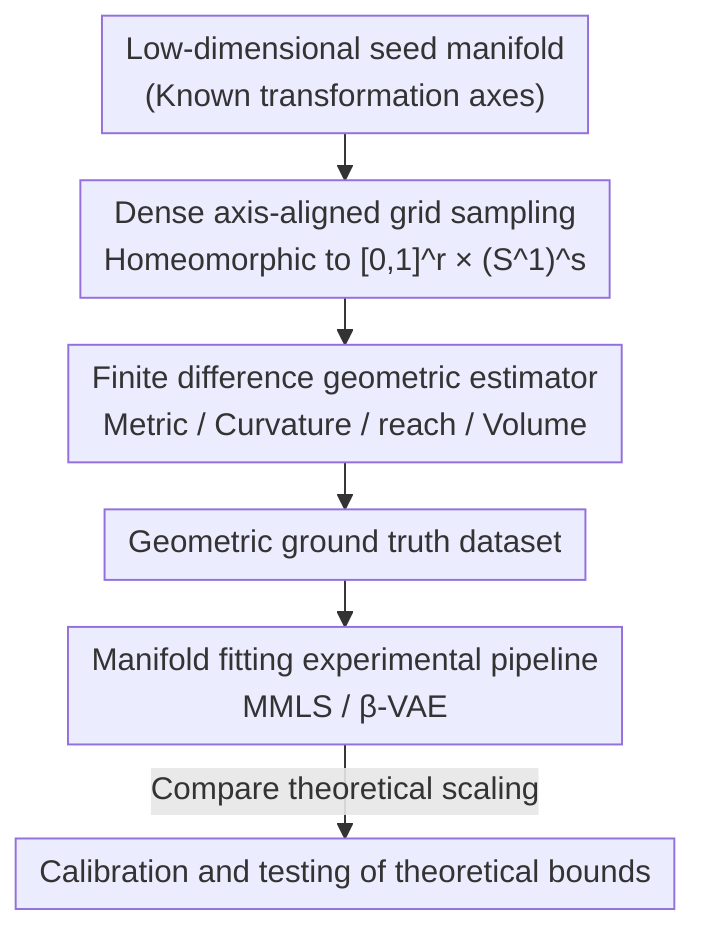

# The Data Manifold under the Microscope

**Conference**: ICML 2026  
**arXiv**: [2606.15760](https://arxiv.org/abs/2606.15760)  
**Code**: https://github.com/koulakis/manifold-microscope (Available)  
**Area**: Learning Theory / Manifold Geometry / Representation Analysis  
**Keywords**: Manifold Hypothesis, Intrinsic Dimension, Curvature, Reach, Finite Difference Estimation

## TL;DR
Addressing the gap where "manifold fitting theory's generalization/approximation bounds are nearly unverifiable on real data," this paper proposes a **controllable geometric benchmark framework**. By recreating datasets like dSprites and COIL-20 as low-dimensional manifolds sampled on **dense regular grids** along transformation axes, and using **finite difference geometric estimators**, quantities like curvature, reach, and volume can be calculated with near-ground-truth precision under low intrinsic dimensions. This allows for the empirical calibration of manifold fitting bounds from Genovese, Fefferman, and others in a "known ground truth" sandbox.

## Background & Motivation

**Background**: The success of deep learning, especially generative models (VAE, Diffusion, MAE), is often explained by the **Manifold Hypothesis**—the idea that high-dimensional data concentrates near low-dimensional manifolds, and learning is about finding good parameterizations for these manifolds. Theoretical researchers have provided minimax rates for manifold fitting (Genovese et al. 2012), non-asymptotic rates dependent on smoothness (Aamari & Levrard 2019), and structured complexity based on reach (Fefferman et al. 2018). Key quantities involved are **curvature, reach, sampling density, and intrinsic dimension**.

**Limitations of Prior Work**: These theoretical bounds are almost "unusable" on real data. The data generation processes are unknown, intrinsic dimensions can only be crudely estimated, and sampling is irregular. Consequently, constants in those bounds (such as terms scaling with $\tau^{-2}$) cannot be directly measured or verified. Theoretical guarantees remain abstract, and it is unknown whether they are tight or informative for specific data.

**Key Challenge**: Existing geometric benchmarks are **polarized**. At one end are analytical manifolds (spheres, tori), which have known geometry but are too simple and unlike real data; at the other end are real datasets, which are realistic but have geometry that can only be crudely estimated without ground truth. There is a lack of a "middle ground" that possesses both geometric ground truth and a degree of realism, preventing the connection between theory and empirical results.

**Goal**: Create a controllable testing platform that allows researchers to (1) calibrate/unit-test various geometric estimators and (2) observe whether the scaling behavior of existing theoretical bounds matches measured errors in an environment where "geometric ground truth is known."

**Key Insight**: The authors found that as long as data is restricted to **low intrinsic dimensions ($d=1\text{–}4$) and explicit transformation factors are known**, geometric quantities can be calculated with near-ground-truth accuracy using **dense regular grid sampling + finite differences**. Conversely, general-purpose estimators are often unreliable or difficult to deploy in this regime.

**Core Idea**: Use "low-dimensional manifolds sampled on dense grids along known transformation axes + finite difference geometric estimators" to create a sandbox with known geometric ground truth, bringing manifold fitting theory from paper to an empirical microscope.

## Method

### Overall Architecture
The framework starts with a low-dimensional "seed" manifold, performs **dense, axis-aligned** regular grid sampling along known transformation axes (rotation, translation, scaling, etc.) to obtain a discrete dataset. On this grid, **central finite differences** are used to estimate the induced metric, volume elements, curvature tensors, and reach point-by-point. These geometric ground truths are then fed into a **manifold fitting experimental pipeline** to examine whether theoretical bounds match empirical errors. The entire pipeline consists of three stages: "Dataset Construction → Geometric Measurement → Theoretical Verification."

Each dataset is modeled as a union of smooth $d$-dimensional manifolds embedded in $\mathbb{R}^D$ and restricted to simple topologies—each manifold is homeomorphic to $[0,1]^r \times (S^1)^s$ ($r+s=d$), where some coordinates vary on an interval and others wrap around a circle. One class of dSprites is homeomorphic to $[0,1]^3 \times S^1$ and embedded in $\mathbb{R}^{4096}$. The grid is defined as:

$$G=\left\{\left(\tfrac{j_1}{n_1-1},\dots,\tfrac{j_r}{n_r-1},\,2\pi\tfrac{j_{r+1}}{n_{r+1}},\dots,2\pi\tfrac{j_d}{n_d}\right)\right\}$$

The first $r$ dimensions are equidistantly sampled on $[0,1]$, and the last $s$ dimensions on $S^1$. Each class uses a mapping $u_i: G \to M_i$ to map grid points to data elements. the discrete dataset is $X_G = \bigcup_{i \le k} u_i[G]$.

### Key Designs

**1. Dense Axis-Aligned Grid Sampling: Transforming "Unknown Ground Truth" to "Known"**
To verify theoretical bounds, one must first possess geometric ground truth, which real data lacks. The authors restrict data to low intrinsic dimensions with explicitly controllable transformation factors and then **densely sample all combinations** equidistantly along each transformation axis. For analytical manifolds, grids are generated directly using known parameterizations. For image datasets (dSprites, COIL-20), translations/rotations/scaling are systematically applied to sample all combinations, with **oversampling at the edges** for non-cyclic dimensions to provide boundary margins for finite differences. Since the grid is sufficiently dense, partial derivatives can be stably approximated via differences—a task where general-purpose estimators often fail in low-dimensional regimes (as they must infer derivatives from unstructured point clouds via complex interpolation). To obtain subset samples that are more intrinsic-geometrically uniform, the framework also provides **Farthest Point Iterative Sampling** and **Weighting by Volume Form**.

**2. Finite Difference Geometric Estimator: Trading Grid Structure for Near-Optimal Precision**
With a dense grid, the framework uses **second-order central differences** to estimate partial derivatives: $f'(x)=\frac{f(x+h)-f(x-h)}{2h}+O(h^2)$. Generalizing this coordinate-wise yields the metric $g_{ij}=\langle u_{,i},u_{,j}\rangle+O(h^2)$, which is used to calculate volume elements, Christoffel symbols, Riemann/Ricci tensors, scalar curvature, and reach. In terms of accuracy, volume and curvature satisfy $|\hat v-v|=O(h^2)$ and $|\hat R-R|=O(h^2)$. On a quasi-uniform $d$-dimensional grid with spacing $h \asymp n^{-1/d}$, the scalar curvature error is $O(h^2)=O((1/n)^{2/d})$. Reach is estimated using the plug-in estimator from Aamari et al. (2019), but because it is a global minimum over point pairs rather than just local derivatives, the authors distinguish between the **global bottleneck regime** ($O(n^{-1/d})$) and the slower **local curvature regime** (upper bound of inverse reach $O(n^{-2/(3d-1)})$). Critically, assuming $C^3$ (reach/volume) or $C^5$ (scalar curvature) smoothness combined with the grid structure allows geometric quantities to be computed with **near-optimal precision**, serving as a "unit test."

**3. Scaling Verification of Theoretical Bounds in the Sandbox**
With geometric ground truth, the framework can empirically compare two types of classical bounds. Genovese et al. (2012) showed a minimax rate of $C_1(1/n)^{2/(2+d)} \le R_n(Q) \le C_2(\log n/n)^{2/(2+d)}$, implying sample complexity **grows exponentially with intrinsic dimension $d$ but is independent of ambient dimension $D$**. Fefferman et al. (2018) provided a Hausdorff error bound $H(M_o,M) < C_1(\log n/n)^{1/d}$ under low noise. Aamari & Levrard (2019) further linked the exponent to the **local fitting order** (linear/PCA fitting corresponds to $1/d$, quadratic local fitting to $2/d$). The authors perform manifold fitting using MMLS (geometric) and β-VAE (deep learning) on datasets with known geometry and plot Hausdorff distance against sample size to see if the empirical scaling matches these theoretical bounds.

### Loss & Training
This paper is an analysis framework rather than a training method, so it does not define new loss functions. The fitting side employs two off-the-shelf methods: the geometric **Manifold Moving Least Squares (MMLS)** and the deep learning **β-VAE autoencoder**. Evaluation uses a fixed uniform test subset to approximate Hausdorff/mean distance, while geometric measurements are calculated across the entire dataset.

## Key Experimental Results

### Main Results: Estimator Precision vs. Theoretical Scaling

| Task | Estimated Quantity | Ours (Finite Difference) | Baseline | Conclusion |
|------|--------------------|--------------------------|----------|------------|
| Scalar Curvature ($S^2,S^3,S^4,H^2_2,T^2$) | RMSE vs. Ground Truth | $O(h^2)=O((1/n)^{2/d})$ | Sritharan et al. 2021 (with pointwise oracle radius) | Finite difference is **significantly more accurate**, even when the baseline uses optimal radii. |
| Scalar Curvature Theoretical Rate | Sample complexity | $O((1/n)^{2/d})$ | Aamari & Levrard $O((\log n/n)^{3/d})$ | Theory is slightly tighter; the gap stems from needing 3rd-order derivatives for intrinsic curvature. |
| Manifold Fitting | Hausdorff vs. Sample size | MMLS / β-VAE empirical curves | Genovese / Fefferman scaling | Empirical scaling behavior is verified on known geometry. |

### Datasets and Geometric Parameters

| Dataset | $d$ | $D$ | Transformation Factors | Connected Components |
|---------|-----|-----|-----------------------|----------------------|
| $S^1$ / Two moons | 1 | 2 | $\phi_1$ | 1 / 2 |
| $S^2$ / $T^2$ | 2 | 3 | $\phi_1,\phi_2$ | 1 |
| dSprites | 4 | 4096 | scale, orientation, pos.x, pos.y | 3 |
| COIL-20 | 3 | 4096 | Horizontal orientation, zoom, image orientation | 20 |

### Key Findings
- **Grid structure is the source of precision**: The finite difference estimator "knows the grid," making it much more accurate than general point cloud estimators in low-dimensional regimes—even when the latter use oracle radii. This proves geometric quantities can be calculated near ground truth in this controlled setting.
- **Exponential explosion with intrinsic dimension, independent of ambient dimension**: Genovese's rate shows sample complexity depends on $d$ and not $D$. dSprites ($d=4, D=4096$) serves as a perfect example of a high-dimensional embedding of a low-dimensional manifold to verify this.
- **Measurable gap between theory and practice**: The gap between $O((1/n)^{2/d})$ and $O((\log n/n)^{3/d})$ from Aamari & Levrard is attributed to different smoothness requirements for intrinsic vs. extrinsic (second fundamental form) curvature calculations—this diagnostic "gap analysis" is the value of the sandbox.
- **β-VAE reshapes geometry layer-by-layer**: As a case study, the framework can track how β-VAE changes geometric quantities like manifold curvature layer-by-layer, demonstrating its use as a representation analysis tool.

## Highlights & Insights
- **Turning "unverifiable theory" into "unit-testable objects"**: The cleverest part is the realization—instead of estimating geometry on real data (which is bound to be inaccurate), construct data where geometry is known so both estimators and theoretical bounds can be "cross-checked." This is an inverse perspective.
- **Low Dimensions + Grid Structure = Advantage over General Estimators**: General estimators carry complex interpolations and large constants to adapt to unstructured point clouds. This work actively sacrifices generality for near-optimal precision, clearly positioning itself as a "benchmark and unit test" rather than a "competitor for general-purpose estimators."
- **Transferability**: This calibration environment (dense grid + finite differences) can be directly used as a benchmark for any newly proposed curvature/reach estimator or to provide a "scaling health check" for new theoretical bounds dependent on geometric constants.

## Limitations & Future Work
- The authors acknowledge that the work only covers **low intrinsic dimensions and simple topologies** ($[0,1]^r \times (S^1)^s$). While more complex topologies could be handled with chart coverage, the cost of dense grid sampling rises exponentially with $d$, and uniform sampling by volume form is especially expensive in higher dimensions.
- Calculating scalar curvature intrinsically requires 3rd-order derivatives ($C^5$ smoothness), which is more demanding than using the second fundamental form extrinsically ($C^4$), leading to a visible gap in theoretical rates. Switching to extrinsic formulas may improve this.
- Reach is a global minimum over pairs; its convergence is not solely controlled by local difference precision. The actual classification of "global bottleneck" vs. "local curvature" regimes might not be clear on more complex data.
- The framework primarily serves as a "calibration/sandbox" and is not a geometric analysis tool for large-scale real-world datasets. Caution is needed when extrapolating conclusions to natural image manifolds.

## Related Work & Insights
- **vs. Analytical Manifold Benchmarks (Sphere/Torus)**: These have known geometry but are too simple and lack realism; this work transforms dSprites/COIL-20 into gridded versions that retain geometric ground truth while being closer to real data.
- **vs. Geometric Estimation on Real Datasets**: Real data geometry can only be crudely estimated with no ground truth; this work trades generality for ground truth via dense sampling in a controlled low-dim setting.
- **vs. General Geometric Estimators (Aamari et al. 2023 for reach, Sritharan et al. 2021 for curvature)**: These provide generality on unstructured clouds but often have large constants and limited accuracy. This work provides a "correct answer" environment for them.
- **vs. Neural Geometric Estimators (Yao et al. 2023/2024b)**: These are scalable but lack strong guarantees; this sandbox can be used to test their actual errors.

## Rating
- Novelty: ⭐⭐⭐⭐ High; the inverse perspective of creating data to verify theory is a fresh approach.
- Experimental Thoroughness: ⭐⭐⭐⭐ Covers multiple analytical manifolds and two image datasets with two fitting methods, albeit in controlled low-dimensional settings.
- Writing Quality: ⭐⭐⭐⭐ Rigorous definitions and clear positioning (not competing with general estimators).
- Value: ⭐⭐⭐⭐ Provides a much-needed calibration benchmark and unit-testing platform for geometric estimators and manifold fitting theory.

<!-- RELATED:START -->

## Related Papers

- [\[NeurIPS 2025\] Adaptive Data Analysis for Growing Data](../../NeurIPS2025/learning_theory/adaptive_data_analysis_for_growing_data.md)
- [\[ICML 2026\] Matroid Algorithms Under Size-Sensitive Independence Oracles](matroid_algorithms_under_size-sensitive_independence_oracles.md)
- [\[ICML 2026\] Active Learning with Low-Rank Structure for Data Selection](active_learning_with_low-rank_structure_for_data_selection.md)
- [\[ICML 2026\] Expectation Consistency Loss: Rethink Confidence Calibration under Covariate Shift](expectation_consistency_loss_rethink_confidence_calibration_under_covariate_shif.md)
- [\[ICML 2026\] Provably Data-driven Multiple Hyper-parameter Tuning with Structured Loss Function](provably_data-driven_multiple_hyper-parameter_tuning_with_structured_loss_functi.md)

<!-- RELATED:END -->
