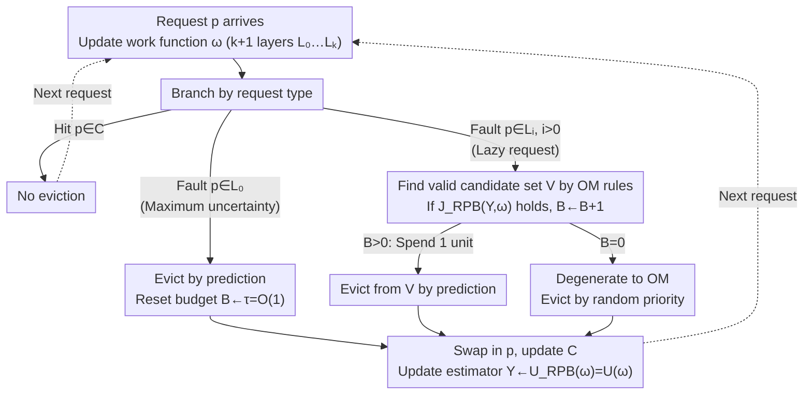

# Towards Optimal Robustness in Learning-Augmented Paging

**Conference**: ICML 2026  
**arXiv**: [2606.01342](https://arxiv.org/abs/2606.01342)  
**Code**: None  
**Area**: Online Algorithms / Learning-Augmented Algorithms / Caching  
**Keywords**: learning-augmented paging, competitive ratio, OnlineMin, relative prediction budget, robustness

## TL;DR
This paper proposes a unified "Relative Prediction Budget" (RPB) perspective for randomized online paging with predictions. Based on OnlineMin, the RPB-OnOPT framework is designed, pushing the provable robust competitive ratio from the existing $2H_k+O(1)$ to $H_k+O(1)$, which is close to the information-theoretic lower bound, while maintaining 1-consistency.

## Background & Motivation

**Background**: Online paging is a classic prototype for online decision-making. Given a cache of capacity $k$ and a sequence of arriving page requests, a hit incurs no cost, while a fault requires evicting a page to bring in the new one. The lower bound for the competitive ratio of any deterministic algorithm is $k$, which is achieved by LRU. The lower bound for randomized algorithms is $H_k = \sum_{i=1}^{k}1/i \approx \ln k$, approximated by work-function-based algorithms like Equitable, K_Equitable, and OnlineMin. The learning-augmented (ALPS) approach adds a potentially inaccurate ML prediction (typically next-arrival time) to the request sequence, aiming for both 1-consistency (approaching OPT when predictions are perfect) and bounded robustness (remaining close to the classic competitive ratio even with arbitrary prediction errors).

**Limitations of Prior Work**: Algorithms built on the Marker framework, such as PredictiveMarker and LMarker, have robust upper bounds stuck around $2H_k+O(1)$. Although the Trust&Doubt and F&R series can achieve 1-consistency, their robustness constants still deviate significantly from the optimal $H_k$. In other words, existing solutions are twice as costly as OPT in the "worst-case" scenario. This performance gap stems from the inherent hard upper bound of the Marker mechanism itself and the decoupled design of prediction budget and prediction quality.

**Key Challenge**: To achieve 1-consistency, an algorithm must "dare to use predictions," while to achieve $H_k$-level robustness, it must "dare to ignore predictions." Current algorithms either "over-trust" predictions at a fixed threshold (e.g., PredictiveMarker uses an $H_k$ threshold, which magnifies errors to $4H_k$) or are "overly conservative" (e.g., LMarker uses a threshold of 1, missing many accurate predictions). Both lack a fine-grained scheduling mechanism that integrates prediction quality with the cost of the robust baseline.

**Goal**: (i) Explicitly formalize the design essence of existing "robust-consistent" algorithms into a unified primitive; (ii) Construct a framework on top of this primitive that provably achieves $H_k+O(1)$ robustness; (iii) Retain 1-consistency while maintaining practical effectiveness on real workloads.

**Key Insight**: The authors discovered that all robust learning-augmented paging algorithms essentially maintain a "non-negative budget $B_t$ relative to a robust baseline $\mathcal{A}$." Deviation from $\mathcal{A}$ to follow prediction advice is only allowed when $B_t > 0$; the difference lies in the granularity of "earning" and "spending" the budget. Simultaneously, online optimal algorithms like OnlineMin naturally maintain a work function layer structure of "valid configurations," providing a better robust base for integrating predictions than Marker.

**Core Idea**: By mounting this RPB budget bookkeeping system onto OnlineMin, the earning of budget is directly linked to "past prediction effectiveness vs. the worst-case expected cost of the online optimum." This allows for the simultaneous achievement of optimal consistency and near-optimal robustness for the first time.

## Method

### Overall Architecture
Input: An online request sequence $\sigma = \langle r_1,\dots,r_n\rangle$ and next-arrival time predictions available at each step. Output: Cache eviction decisions. The algorithm maintains four components at each step: (1) Current work function $\omega$ (represented compactly by $k+1$ layers $L_0, \dots, L_k$, where $L_0$ is the support-out and $L_i, i > 0$ are support layers); (2) Current cache configuration $C$ (always a valid configuration); (3) Non-negative budget $B$; (4) Estimator variable $Y = U(\omega) = k - |R(\omega)|$, representing the number of unrevealed layers.

When a request arrives, the algorithm first updates $\omega$ according to work function rules, then branches:

- **Hit**: No action taken.
- **Fault and $p \in L_0$ (Support-out, maximum uncertainty)**: Evict according to predictions and reset the budget to a constant $\tau = O(1)$.
- **Fault and $p \in L_i, i > 0$ (Lazy request)**: First identify a candidate set $V$ according to OM rules, then use the decision function $\mathcal{J}_{RPB}(Y, \omega)$ to determine whether to increment the budget ($B \leftarrow B+1$). If $B > 0$, spend 1 unit and evict from $V$ based on predictions; otherwise, degenerate to OM's priority eviction.

After the request is processed, update $Y \leftarrow \mathcal{U}_{RPB}(\omega)$ for the next step. The entire process is unified in the RPB-OnOPT algorithm, where different robust-consistent trade-offs are obtained by instantiating different $\mathcal{J}_{RPB}$ and $\mathcal{U}_{RPB}$.

### Key Designs

**1. Relative Prediction Budget (RPB): A unified view of prediction usage intensity.**
To explain why previous robustness bounds were stuck at $2H_k$, a unified metric is needed. The authors found that all robust learning-augmented paging algorithms essentially maintain a "non-negative budget $B_t$ relative to a robust baseline $\mathcal{A}$." Predictions are only followed when $B_t > 0$. BlindOracle&LRU, PredictiveMarker, LMarker, and F&R can all be reinterpreted as "RPB algorithms under different earning rules." PredictiveMarker earns $H_k$ units at once on each clean request, LMarker earns 1 unit, and F&R earns 1 unit when its cost matches Belady. These rules fail to incorporate "whether the prediction is actually useful" at a fine grain, locking the robust constant. RPB links budget earning to both "past algorithm performance" and the "baseline expected cost under worst-case lazy adversaries," identifying over-trust and over-conservatism while pushing robustness to $H_k+O(1)$.

**2. RPB-OnOPT Framework: Placing the budget on an online optimal base instead of Marker.**
This is the fundamental step for shifting the upper bound from $2H_k$ to $H_k$. The Marker mechanism inherently limits the lower bound to $2H_k+O(1)$, so the authors switched the base to OnOPT (such as OnlineMin), which ensures every step landing on a "valid configuration." In two scenarios: when a request falls in $L_0$ (max uncertainty), evicting by prediction and resetting $B$ to constant $\tau = O(1)$ achieves optimality for perfect predictions (Theorem 5.1). When $p \in L_i, i > 0$, the OM candidate set rule $V = C \cap \bigcup_{l=1}^{z} L_l$ ensures evictions stay within a valid configuration. OnOPT algorithmizes "staying in a valid configuration," providing a stable basis for $H_k$-level potential function analysis.

**3. RPB-OM Instantiation and Decision Function $\mathcal{J}_{RPB}$: Aligning budget earning with the exponential decay of potential functions.**
To bridge the framework to a specific provably 1-consistent and $(H_k+O(1))$-robust algorithm, RPB-OM replaces OnOPT’s custom priority with OM’s random priority. The estimator is the number of unrevealed layers $Y = U(\omega) = k - |R(\omega)|$ (smaller means more has been revealed/predictions were effective). The decision function is $\mathcal{J}_{RPB}(Y, \omega) = \big(U(\omega) \le (Y+2)/e - 2\big)$, and the update function is $\mathcal{U}_{RPB}(\omega) = U(\omega)$. The intuition: budget is only earned when the current number of unrevealed layers is significantly smaller than in the past, indicating that predictions have indeed reduced uncertainty. Robustness proof relies on two new properties matching the OM potential function decay: serving $L_0$ requests increases the OM potential function by at most $H_k-1$ (Corollary 5.5), and serving lazy $p \in N(\omega)$ requests decreases it by at least $1/(U(\omega)+1)$ (Lemma 5.6).

### Loss & Training
This paper does not involve ML training; predictions are treated as a black box. All "training" overhead is explicitly given via the RPB constant $\tau$, decision thresholds, and potential function proofs.

## Key Experimental Results

### Main Results
The authors compared major learning-augmented paging algorithms on LIRS and SPC1 traces using next-arrival time predictors (with injected errors). The metric is the cost ratio relative to OPT (cost/OPT).

| Algorithm | Perfect Prediction | Moderate Error | Adversarial Prediction | Theoretical Robust Bound |
| :--- | :--- | :--- | :--- | :--- |
| BlindOracle | 1.00 | Surges | Unbounded | $\infty$ |
| BlindOracle & LRU | 1.05 | 1.3-1.5 | $\le 2k$ | $2k$ |
| PredictiveMarker | $\sim$2 | 1.4-1.8 | $\le 4H_k$ | $4H_k$ |
| LMarker | $\sim$2 | 1.4-1.6 | $\le 2H_k+4$ | $2H_k+4$ |
| **RPB-OM (Ours)** | **1.00** | **1.1-1.3** | **$\le H_k+O(1)$** | **$H_k+O(1)$** |

### Ablation Study

| Configuration | Avg. cost/OPT | Description |
| :--- | :--- | :--- |
| RPB-OM (Full) | 1.10-1.30 | Complete method with budget linked to $U(\omega)$ |
| RPB-OM, $\mathcal{J}_{RPB} \equiv \text{true}$ | $\sim$1.5 | Earns budget every step; degenerates to aggressive strategy, poor robustness |
| RPB-OM, $\mathcal{J}_{RPB} \equiv \text{false}$ | $\sim$1.4 | Never earns budget; equivalent to pure OM, consistency lost |
| RPB on Marker base | $\sim$1.6 | Replaces OnOPT with Marker base; replicates existing $2H_k$ bound |

### Key Findings
- Changing the robust base from Marker to OnOPT is the fundamental reason for pushing the bound from $2H_k$ to $H_k$. Changing RPB without changing the base still results in a $2H_k$ bound.
- The decision function $\mathcal{J}_{RPB}$ using $U(\omega)$ rather than "global past cost" is crucial: the former aligns with the potential function decay rate $1/(U+1)$ to yield an additive constant, whereas the latter introduces a multiplicative factor of 2.
- On real traces, even with imperfect predictors, RPB-OM reduces page faults by 10%-20% compared to LMarker/PredictiveMarker, showing that "earning budget relative to a robust baseline" utilizes moderately accurate predictions better than "earning based on eviction chain length."

## Highlights & Insights
- **Leverage of a Unified Perspective**: RPB is not just an algorithm but a "mirror." it maps BlindOracle&LRU, PredictiveMarker, LMarker, and F&R onto a single "budget bookkeeping" logic, identifying who is over-trusting or over-conservative.
- **"Changing the Base" is more Powerful than "Tuning Thresholds"**: Previous works tuned thresholds on Marker, which has a hard robust limit of $2H_k+O(1)$. This paper proves that moving to OnOPT—which stays in a "valid configuration"—is necessary to approach $H_k$. This observation has transfer value for other ALPS problems (e.g., $k$-server, metrical task systems).
- **Standalone Potential Function Properties**: Corollary 5.5 and Lemma 5.6 provide precise bounds on OM potential function changes for $L_0$ and lazy requests, serving as general tools for analyzing any learning-augmented variants on OM.

## Limitations & Future Work
- The robust bound is $H_k+O(1)$, which still has an additive constant compared to $H_k$. The authors note that removing this constant is equivalent to not using any prediction.
- The decision function $\mathcal{J}_{RPB}$ in RPB-OM is relatively simple (only using $U(\omega)$). Aligning directly with OM's real expected cost per step would require a more complex budget function, increasing theoretical and implementation complexity.
- Experiments only covered next-arrival time predictions. More realistic prediction forms like probability distributions or streaming update predictions were not explored.
- The framework is inherently for "randomized paging" and does not address deterministic settings (lower bound $k$) or hierarchical caching.

## Related Work & Insights
- **vs. BlindOracle&LRU (Wei, 2020)**: They switch globally between two algorithms with coarse budget granularity, leading to $2k$ worst-case. This paper uses RPB within OnOPT for fine-grained switching, tightening robustness from $2k$ to $H_k+O(1)$.
- **vs. PredictiveMarker / LMarker (Lykouris-Vassilvtiskii 2018; Rohatgi 2020)**: They use fixed thresholds ($H_k$ and 1) on Marker to earn budget, falling into $4H_k$ and $2H_k+4$. This paper proves the Marker base is locked at $2H_k+O(1)$.
- **vs. F&R (Sadek & Elias, 2024)**: They first reached $\mathcal{O}(\log k)$ robustness, but with a non-optimal leading constant. This paper sets the leading constant to 1.
- **Insight**: For other ALPS problems like $k$-server or ski rental, one should ask: "Is our robust base already the online optimal algorithm for that problem?" If not, changing the base is often more productive than tuning thresholds.

## Rating
- Novelty: ⭐⭐⭐⭐⭐ First to achieve both 1-consistency and near-optimal $H_k+O(1)$-robustness while providing the unified RPB primitive.
- Experimental Thoroughness: ⭐⭐⭐ Solid results on traces, but the predictor and noise types are narrow.
- Writing Quality: ⭐⭐⭐⭐ High readability, successfully framing complex work-function/potential-function analysis as a clear narrative via Observations 1-4.
- Value: ⭐⭐⭐⭐⭐ Provides both the optimal robust result and a strategic "change the base" observation for the broader ALPS subfield.

<!-- RELATED:START -->

## Related Papers

- [\[ICML 2025\] Near-Optimal Consistency-Robustness Trade-Offs for Learning-Augmented Online Knapsack Problems](../../ICML2025/learning_theory/near-optimal_consistency-robustness_trade-offs_for_learning-augmented_online_kna.md)
- [\[ICML 2026\] Parsimonious Learning-Augmented Online Metric Matching](parsimonious_learning-augmented_online_metric_matching.md)
- [\[ICML 2026\] Robustness of Mixtures of Experts to Feature Noise](robustness_of_mixtures_of_experts_to_feature_noise.md)
- [\[ICML 2026\] Multi-task Linear Regression without Eigenvalue Lower Bounds: Adaptivity, Robustness and Safety](multi-task_linear_regression_without_eigenvalue_lower_bounds_adaptivity_robustne.md)
- [\[ICML 2026\] On the Robustness of Langevin Dynamics to Score Function Error](on_the_robustness_of_langevin_dynamics_to_score_function_error.md)

<!-- RELATED:END -->
