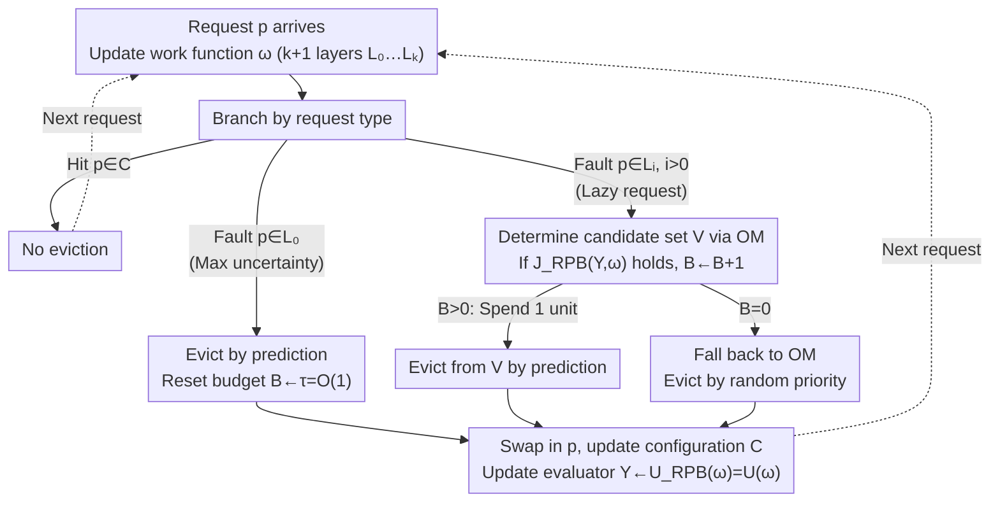

# Towards Optimal Robustness in Learning-Augmented Paging

**Conference**: ICML 2026  
**arXiv**: [2606.01342](https://arxiv.org/abs/2606.01342)  
**Code**: None  
**Area**: Online Algorithms / Learning-Augmented Algorithms / Paging  
**Keywords**: learning-augmented paging, competitive ratio, OnlineMin, relative prediction budget, robustness

## TL;DR
This paper proposes a unified "Relative Prediction Budget" (RPB) perspective for randomized online paging with predictions. Based on OnlineMin, it designs the RPB-OnOPT framework, pushing the provable robust competitive ratio from the existing $2H_k+O(1)$ to $H_k+O(1)$, which is close to the information-theoretic lower bound, while maintaining 1-consistency.

## Background & Motivation

**Background**: Online paging is a classic prototype problem for online decision-making. Given a cache of capacity $k$ and a sequence of arriving page requests, hits incur no cost, while page faults require an eviction and a swap-in. The lower bound of the competitive ratio for any deterministic algorithm is $k$, achieved by LRU; the randomized lower bound is $H_k=\sum_{i=1}^{k}1/i\approx \ln k$, approximated by work-function-based algorithms like Equitable, K_Equitable, and OnlineMin. The algorithms with predictions (ALPS) approach overlays the request sequence with a potentially inaccurate ML prediction (typically next-arrival time), aiming to achieve both 1-consistency (near-OPT performance with perfect predictions) and bounded robustness (remaining close to the classical competitive ratio under worst-case predictions).

**Limitations of Prior Work**: Marker-based algorithms like PredictiveMarker and LMarker have robust upper bounds stuck at $2H_k+O(1)$. While the Trust&Doubt and F&R series can achieve 1-consistency, their robust constants still deviate from the optimal $H_k$. In other words, existing solutions perform twice as poorly as OPT in "worst-case scenarios"—a result of the inherent hard upper bound of the Marker mechanism itself and the decoupled design of prediction budgets and quality.

**Key Challenge**: To achieve 1-consistency, an algorithm must "dare to use predictions"; to achieve $H_k$ robustness, it must "dare to ignore predictions." Current algorithms are either "overly trusting" of predictions via fixed thresholds (e.g., PredictiveMarker uses an $H_k$ threshold, magnifying errors to $4H_k$) or "overly conservative" (e.g., LMarker uses a threshold of 1, missing many accurate predictions). Both lack a fine-grained scheduling mechanism that incorporates both prediction quality and a robust baseline cost.

**Goal**: (i) Formalize the design essence of all "robust-consistent" algorithms into a unified primitive; (ii) construct a framework provably achieving $H_k+O(1)$ robustness; (iii) maintain 1-consistency and demonstrate effectiveness on real workloads.

**Key Insight**: The authors observe that all robust learning-augmented paging algorithms essentially maintain a "non-negative budget $B_t$ relative to a robust baseline $\mathcal{A}$"—deviation from $\mathcal{A}$ to follow a prediction is only allowed when $B_t>0$. The difference lies only in the granularity of "earning" and "spending" the budget. Furthermore, online optimal algorithms like OnlineMin naturally maintain a "valid configuration" work function structure, providing a superior robust base for grafting predictions compared to Marker.

**Core Idea**: Mount this RPB budget-keeping onto OnlineMin, linking budget earning directly to "prediction effectiveness over past steps vs. the worst-case expected cost of online optimal." This allows the simultaneous achievement of optimal consistency and near-optimal robustness for the first time.

## Method

### Overall Architecture
Input: Online request sequence $\sigma=\langle r_1,\dots,r_n\rangle$ and next-arrival time predictions available at each step; Output: Cache eviction decisions. The algorithm maintains four components at each step: (1) current work function $\omega$ (compactly represented by $k+1$ layers $L_0,\dots,L_k$, where $L_0$ contains pages outside the support and $L_i, i>0$ comprise the support layers); (2) current cache configuration $C$ (always a valid configuration); (3) non-negative budget $B$; (4) evaluator variable $Y=U(\omega)=k-|R(\omega)|$, representing the number of unrevealed layers.

When a request arrives, the work function $\omega$ is updated according to standard rules, followed by a branching logic:

- Hit: Do nothing.
- Fault & $p\in L_0$ (Outside support, maximum uncertainty): Evict based on prediction and reset the budget to a constant $\tau=O(1)$.
- Fault & $p\in L_i,\,i>0$ (Lazy request): Determine a candidate set $V$ via OM rules, then use a judgment function $\mathcal{J}_{RPB}(Y,\omega)$ to decide whether to increment the budget $B\leftarrow B+1$. If $B>0$, spend 1 unit to evict from $V$ according to the prediction; otherwise, fall back to OM's priority-based eviction.

After processing, update $Y\leftarrow \mathcal{U}_{RPB}(\omega)$ for the next evaluation. This process is unified in the RPB-OnOPT algorithm, where different robust-consistent trade-offs are instantiated by defining $\mathcal{J}_{RPB}$ and $\mathcal{U}_{RPB}$.

### Key Designs

**1. Relative Prediction Budget (RPB): A mirror to clarify the prediction intensity of existing algorithms**

To explain why previous robust upper bounds were stuck at $2H_k$, a unified metric is needed. The authors found that all robust learning-augmented paging algorithms essentially maintain a "non-negative budget $B_t$ relative to a robust baseline $\mathcal{A}$." One only dares to deviate from $\mathcal{A}$ to listen to predictions when $B_t>0$, with the difference being the granularity of earning. BlindOracle&LRU, PredictiveMarker, LMarker, and F&R can all be reinterpreted as RPB algorithms with different earning rules: PredictiveMarker earns $H_k$ units at once on each clean request, LMarker earns 1, and F&R earns 1 whenever its cost matches Belady. The problem becomes clear—these rules do not incorporate fine-grained "utility of predictions" into earning conditions, locking the robust constant. RPB addresses this by linking budget earning to both "past performance" and "baseline expected cost under worst-case lazy adversary," identifying over-trust and over-conservatism while providing a path to $H_k+O(1)$.

**2. RPB-OnOPT Framework: Mounting the budget on an online optimal base instead of Marker**

This is the fundamental step to push the bound from $2H_k$ to $H_k$. The Marker mechanism itself restricts the lower bound to $2H_k+O(1)$. The authors switch the base, mounting RPB onto OnOPT (with OnlineMin as an instance), an online optimal algorithm that stays within valid configurations at every step. This involves two scenarios: when a request falls in the outer support $L_0$, evicting by prediction and resetting the budget to $\tau=O(1)$ achieves optimal performance for perfect predictions (Theorem 5.1), requiring minimum prediction usage for 1-consistency. When a request falls in $L_i, i>0$, the OM candidate set rule $V=C\cap\bigcup_{l=1}^{z}L_l$ ensures evictions remain within a valid configuration. OnOPT algorithmicizes the "maintenance of valid configurations," providing a solid base for $H_k$-level potential function analysis.

**3. RPB-OM Instantiation and Judgment Function $\mathcal{J}_{RPB}$: Aligning budget triggers with exponential decay of potential functions**

The framework is instantiated into a specific algorithm that is provably 1-consistent and $(H_k+O(1))$-robust. RPB-OM replaces custom priorities in OnOPT with OM’s random priorities, sets the evaluator to unrevealed layers $Y=U(\omega)=k-|R(\omega)|$, and uses the judgment function $\mathcal{J}_{RPB}(Y,\omega)=\big(U(\omega)\le (Y+2)/e-2\big)$. The intuition: budget is only earned when the current number of unrevealed layers is significantly lower than in the past, indicating that predictions have successfully reduced uncertainty. Robustness proof relies on two new properties aligned with OM’s potential function structure: the OM potential function increases by at most $H_k-1$ on $L_0$ requests (Corollary 5.5) and decreases by at least $1/(U(\omega)+1)$ on lazy adversary requests (Lemma 5.6). Together, these ensure that the cumulative deviation from OM is only an $O(1)$ additive term, regardless of prediction quality.

### Loss & Training
This paper does not involve ML training; predictions are treated as a black box. All "training" overhead is explicitly defined within the RPB constant $\tau$, judgment thresholds, and potential function proofs.

## Key Experimental Results

### Main Results
The authors compared mainstream learning-augmented paging algorithms on LIRS and SPC1 traces using a next-arrival time predictor (with injected synthetic errors). The metric is the cost ratio relative to OPT (cost/OPT).

| Algorithm | Perfect Prediction | Medium Error | Adversarial Prediction | Robust Theoretical Bound |
| :--- | :--- | :--- | :--- | :--- |
| BlindOracle | 1.00 | Spikes | Unbounded | $\infty$ |
| BlindOracle & LRU | 1.05 | 1.3-1.5 | $\le 2k$ | $2k$ |
| PredictiveMarker | $\sim$2 | 1.4-1.8 | $\le 4H_k$ | $4H_k$ |
| LMarker | $\sim$2 | 1.4-1.6 | $\le 2H_k+4$ | $2H_k+4$ |
| **RPB-OM (Ours)** | **1.00** | **1.1-1.3** | **$\le H_k+O(1)$** | **$H_k+O(1)$** |

### Ablation Study
| Configuration | Avg. cost/OPT | Description |
| :--- | :--- | :--- |
| RPB-OM Full | 1.10-1.30 | Complete method, budget linked to $U(\omega)$ |
| RPB-OM, $\mathcal{J}_{RPB}\equiv\text{true}$ | $\sim$1.5 | Budget added every step; degenerates to aggressive strategy, poor robustness |
| RPB-OM, $\mathcal{J}_{RPB}\equiv\text{false}$ | $\sim$1.4 | No budget added; equivalent to pure OM, loss of consistency |
| RPB on Marker base | $\sim$1.6 | Replacing OnOPT with Marker replicates existing $2H_k$ bound |

### Key Findings
- Switching the robust base from Marker to OnOPT is the fundamental reason for pushing the bound from $2H_k$ to $H_k$. Using RPB on a Marker base still results in a $2H_k$ limit.
- Using $U(\omega)$ instead of "global past cost" for the judgment function $\mathcal{J}_{RPB}$ is critical: it aligns with the potential function decay rate $1/(U+1)$, yielding an additive constant rather than a multiplicative factor of 2.
- On real traces, even with imperfect predictors, RPB-OM reduces page faults by 10-20% compared to LMarker/PredictiveMarker, demonstrating that "earning budget relative to a robust baseline" utilizes medium-accuracy predictions more effectively.

## Highlights & Insights
- **Leverage of a Unified View**: RPB is less a new algorithm and more a "mirror"—it maps BlindOracle&LRU, PredictiveMarker, LMarker, and F&R onto a single "budget bookkeeping" logic, revealing over-trust or over-conservatism.
- **"Base Switching" over "Threshold Tuning"**: While previous works tuned thresholds on Marker, the $2H_k+O(1)$ bound remained a hard cap. This paper proves that moving to an online optimal base (like OnOPT) is necessary to approach $H_k$, an insight transferable to other ALPS problems like $k$-server.
- **Standalone Potential Function Lemmas**: Corollary 5.5 and Lemma 5.6 provide precise bounds for OM potential function changes on $L_0$ and lazy requests, serving as general tools for analyzing any learning-augmented variants based on OM.

## Limitations & Future Work
- The robust upper bound is $H_k+O(1)$, which still contains an additive constant relative to $H_k$. Removing this constant would imply not using predictions at all.
- The form of $\mathcal{J}_{RPB}$ in RPB-OM is simplified (using only $U(\omega)$). Directly aligning with OM's per-step expected cost would require more complex budget functions.
- Experiments focused on next-arrival time predictions; more realistic prediction forms (e.g., probability distributions, streaming updates) were not explored.
- The framework is limited to randomized paging and does not address deterministic settings (bound $k$) or hierarchical caching.

## Related Work & Insights
- **vs. BlindOracle & LRU (Wei, 2020)**: They switch globally between two algorithms with coarse budget granularity and a $2k$ worst-case; this work uses RPB for fine-grained switching within OnOPT, tightening robustness to $H_k+O(1)$.
- **vs. PredictiveMarker / LMarker (Lykouris-Vassilvtiskii 2018; Rohatgi 2020)**: They use fixed thresholds ($H_k$ and 1) on Marker, resulting in $4H_k$ and $2H_k+4$. This work proves the Marker base itself is the bottleneck.
- **vs. Sadek & Elias (2024)**: They achieved $\mathcal{O}(\log k)$ robustness, but the leading constant was non-optimal; this work reduces the leading constant to 1.
- **Insight**: In other ALPS problems like $k$-server or ski rental, one should ask: "Is our robust base already the online optimal for this problem?" If not, switching the base often yields higher returns than tuning thresholds.

## Rating
- Novelty: ⭐⭐⭐⭐⭐ First to achieve 1-consistency and near-optimal $H_k+O(1)$-robustness while providing the RPB primitive.
- Experimental Thoroughness: ⭐⭐⭐ Solid on traces, but narrow in prediction and noise models.
- Writing Quality: ⭐⭐⭐⭐ High readability, successfully framing complex work function and potential function analysis as a clear narrative.
- Value: ⭐⭐⭐⭐⭐ Provides both optimal robust results and a guiding philosphy for base-switching in the ALPS subfield.

<!-- RELATED:START -->

## Related Papers

- [\[ICML 2025\] Near-Optimal Consistency-Robustness Trade-Offs for Learning-Augmented Online Knapsack Problems](../../ICML2025/learning_theory/near-optimal_consistency-robustness_trade-offs_for_learning-augmented_online_kna.md)
- [\[ICML 2026\] Parsimonious Learning-Augmented Online Metric Matching](parsimonious_learning-augmented_online_metric_matching.md)
- [\[ICML 2026\] Multi-task Linear Regression without Eigenvalue Lower Bounds: Adaptivity, Robustness and Safety](multi-task_linear_regression_without_eigenvalue_lower_bounds_adaptivity_robustne.md)
- [\[ICML 2025\] Learning-Augmented Hierarchical Clustering](../../ICML2025/learning_theory/learning-augmented_hierarchical_clustering.md)
- [\[ICML 2026\] Optimal Design for Multinomial Logit Model with Applications to Best Assortment Identification](optimal_design_for_multinomial_logit_model_with_applications_to_best_assortment_.md)

<!-- RELATED:END -->
