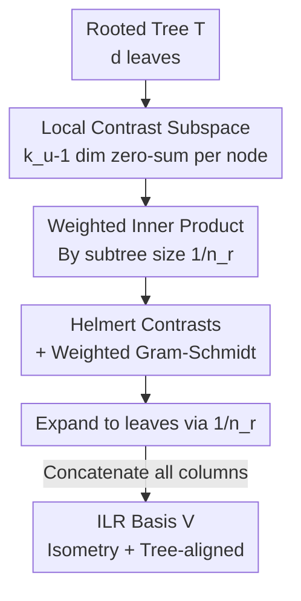

# Tree-Structured Orthonormal Decomposition of the Aitchison Simplex

**Conference**: ICML2026  
**arXiv**: [2606.11646](https://arxiv.org/abs/2606.11646)  
**Code**: https://github.com/vsingh-group/polyilr  
**Area**: Learning Theory / Compositional Data Analysis  
**Keywords**: Aitchison Geometry, ILR Coordinates, Orthonormal Decomposition, Polytomous Trees, Isometric Isomorphism  

## TL;DR
PolyILR constructs a **canonical, complete, and orthonormal** Aitchison simplex coordinate system for any tree structure (including polytomies). Each internal node contributes $k_u-1$ contrast coordinates through weighted inner products, Helmert contrasts, and expansion by subtree size, ensuring a valid isometric ILR basis where every coordinate corresponds to a specific location on the tree.

## Background & Motivation
**Background**: Compositional data—non-negative vectors where only relative proportions are meaningful—are prevalent in microbiomes, single-cell cell-type proportions, geochemistry, and softmax outputs. The standard tool for analysis is **Aitchison geometry**, which formalizes that "only ratios $x_i/x_j$ carry information" and embeds the simplex $\Delta^{d-1}$ isometrically into Euclidean space via **Isometric Log-Ratio (ILR)** transforms.

**Limitations of Prior Work**: The ILR basis is not unique; any orthonormal basis of $\mathcal{H}=\{z:\mathbf{1}^\top z=0\}$ yields valid ILR coordinates. These induce the same geometry but **different decompositions**, and the choice of basis directly determines interpretability. Many domains possess natural **hierarchical structures** (phylogenies, taxonomies, Gene Ontology) that define which comparisons are meaningful and at what resolution. However, existing methods either ignore the tree structure, lose Aitchison geometry, support only **binary trees**, or provide isolated contrasts rather than a complete coordinate system.

**Key Challenge**: Binary trees are straightforward because each internal node has exactly two children, requiring only one contrast (the log-ratio of the geometric means of the two descendant clusters). In this case, internal nodes map one-to-one with basis vectors (as in PhILR). However, **polytomies are highly common** in reality; approximately 64% of branching points in the NCBI taxonomy have three or more children. A node with $k_u>2$ children requires $k_u-1$ orthonormal contrasts, forming a **subspace** rather than a single vector. This introduces three challenges: (i) defining canonical local contrasts at a node; (ii) expanding local contrasts into global vectors over leaves; and (iii) ensuring orthogonality across all nodes. The fundamental barrier is **structural incompatibility**: Aitchison geometry requires a global zero-sum $(d-1)$-dimensional tangent space, while trees impose nested, local constraints.

**Goal**: To construct a **principled, geometrically grounded, and canonical** orthonormal decomposition of the Aitchison tangent space for any tree, without sacrificing isometry or introducing arbitrary binarization.

**Core Idea**: Attach a **local geometric structure** to each internal node encoding all relative comparisons between children. This is measured by an **inner product weighted by subtree size**, and the local orthonormal basis is **expanded by $1/n_r$** to the leaves. The key theorem is that local orthogonality under the weighted inner product is equivalent to global orthogonality in $\mathbb{R}^d$ after expansion.

## Method

### Overall Architecture
The input to PolyILR is a rooted tree $\mathcal{T}$ with $d$ leaves (each leaf corresponding to one dimension of the composition). The output is an ILR basis matrix $V\in\mathbb{R}^{d\times(d-1)}$ such that $\varphi(x)=V^\top\log x$ is an isometric isomorphism from the Aitchison simplex to Euclidean space, where each column of $V$ corresponds to a specific contrast at an internal node.

The construction follows a DFS traversal of each internal node $u$, performing four steps: define the local contrast subspace $S_u$, assign a weighted inner product based on child subtree sizes $n_r$, compute Helmert contrasts followed by Gram-Schmidt under the weighted inner product, and expand the local basis via $1/n_r$ into global columns in $V$.

### Key Designs

**1. Local Contrast Subspace $S_u$: Deriving zero-sum constraints from ILR requirements**

For a node $u$ with $k_u$ children, the local contrast subspace is defined as:

$$S_u=\Big\{h\in\mathbb{R}^{k_u}:\textstyle\sum_{r=1}^{k_u}h_r=0\Big\}.$$

This is a $(k_u-1)$-dimensional subspace orthogonal to $\mathbf{1}$, capturing all relative comparisons between child clusters. A key insight is that this zero-sum constraint is **not arbitrary**; it is forced by the ILR requirement $V^\top\mathbf{1}=0$. Since each column of $V$ is expanded from a local vector $\mathbf{h}$, global orthogonality with $\mathbf{1}$ necessitates local zero-sum $\mathbf{h}^\top\mathbf{1}=0$. This formally handles the fact that polytomous nodes require a subspace rather than a single vector.

**2. Weighted Inner Product: Scaling local orthogonality to global orthogonality**

Simply taking a local orthonormal basis and expanding it uniformly to leaves destroys global orthogonality because children with different subtree sizes contribute differently to the global inner product. PolyILR equips $S_u$ with a weighted inner product:

$$\langle h,h'\rangle_w=\sum_{r=1}^{k_u}\frac{h_r h'_r}{n_r},$$

where $n_r$ is the number of leaves in the $r$-th child's subtree. Accordingly, local vectors are expanded to leaves such that leaf $i$ has value $v_i = \widetilde H^{(u)}_{r,m}/n_r$ if it belongs to child $r$, and 0 otherwise. Dividing by $n_r$ is the crux—it ensures that local orthogonality $\sum_r h_r h'_r/n_r = \delta$ translates exactly to global orthogonality $\langle\mathbf{v},\mathbf{v}'\rangle = \sum_i v_i v'_i = \delta$.

**3. Helmert Contrasts + Weighted Gram-Schmidt: A canonical solution for local bases**

To make the construction **canonical (reproducible)**, a deterministic choice for the local basis is required. PolyILR uses **Helmert contrasts**: the $m$-th column of a $k \times (k-1)$ Helmert matrix compares the $(m+1)$-th child against the average of the first $m$ children:

$$H_{r,m}=\begin{cases}\sqrt{1/(m(m+1))}&r\le m,\\ -\sqrt{m/(m+1)}&r=m+1,\\ 0&r>m+1.\end{cases}$$

Given a fixed child ordering, the Helmert basis is unique. Since Helmert columns are only orthogonal under the standard inner product, Gram-Schmidt is applied under $\langle\cdot,\cdot\rangle_w$ to obtain $\widetilde H^{(u)}$. Theorem 4.1 guarantees $V$ satisfies $V^\top\mathbf{1}=0$ and $V^\top V = I_{d-1}$.

**4. Tree-Aligned Coordinates: Multi-scale structural analysis**

Each coordinate $z_j = v_j^\top \log x$ is a **balance** comparing the geometric mean of one child against others. Because coordinate indices $j$ are bijective with node-contrast pairs $(u, m)$, $\mathbb{R}^{d-1}$ is partitioned by tree nodes. This allows for hierarchical analysis: by **node** (which split drives the signal), by **depth** (which resolution is important), or by **subtree** (clade-level information).

## Key Experimental Results

### Main Results
The experiments focus on representational interpretability while ensuring isometry (parity with CLR/PhILR performance). Evaluations on microbiome (HMP, cMD3, DISCO) and single-cell data compare CLR, PhILR, and PolyILR across RF, SVM, and LR classifiers.

| Dataset / Task | Metric | CLR (RF) | PhILR (RF) | PolyILR (RF) |
|---|---|---|---|---|
| HMP body sites (5) | Acc | .956 | .961 | .963 |
| HMP body subsites (18) | Acc | .597 | .608 | .622 |
| DISCO leukemia (2) | Acc | .925 | .940 | .935 |
| HMP body sites (5) | AUROC | .987 | .992 | .992 |
| DISCO leukemia (2) | AUROC | .968 | .984 | .984 |

Performance remains consistent across ILR variants, as expected for isometric transforms. Differences in RF are minimal, confirming that PolyILR preserves geometry.

### Key Findings
- **Interpretability without Sacrifice**: Classification performance is on par with CLR/PhILR, but feature stability is significantly higher. PolyILR ensures coordinates are canonically bound to tree nodes.
- **Superior Stability**: Using Jaccard overlap of top-$K$ features in cross-validation, PolyILR achieves high stability (0.6–0.9), whereas PhILR is highly unstable (0.01–0.1) due to arbitrary binarization dependencies.
- **Semantic Coordinates**: Each balance reads naturally (e.g., "Streptococcaceae vs. Lactobacillus + Leuconostocaceae"), enabling direct attribution of signals to specific branching points.
- **Backward Compatibility**: For binary trees, PolyILR reduces exactly to PhILR.

## Highlights & Insights
- The argument that **"zero-sum constraints are forced by ILR"** is elegant, anchoring the design choices to the mathematical requirements of isometry.
- The **$1/n_r$ weighted expansion** is the technical core, seamlessly linking local weighted orthogonality to global standard orthogonality.
- The analogy to **Fourier and Wavelet transforms** is apt: where Fourier bases derive from translational symmetry, PolyILR derives tree-aligned components from hierarchical structures.
- The link to **softmax outputs** suggests potential for probability modeling with class hierarchies.

## Limitations & Future Work
- Canonicity depends on child ordering and Helmert sign conventions; while fixed by tree topology, different orderings produce rotations within node subspaces.
- As an isometric transform, it provides interpretability rather than a "performance boost" over other ILR bases.
- The connection to softmax/probabilistic modeling is theoretical and lacks empirical validation in this work.
- Requires a **known and reliable tree**; the interpretability is bounded by the quality of the input hierarchy.

## Related Work & Insights
- **vs PhILR / Sequential Binary Partition (SBP)**: These only handle binary trees. Polytomies require arbitrary binarization, making coordinates dependent on artificial splits. PolyILR handles polytomies directly via $k_u-1$ dimensional subspaces.
- **vs PhyloFactor**: PhyloFactor greedily selects isolated informative contrasts; PolyILR provides a **complete** orthonormal basis canonically tied to the entire tree.
- **vs CLR**: CLR is isometric but flat and non-hierarchical; PolyILR provides the same geometric invariants while aligning every coordinate with tree topology.

## Rating
- Novelty: ⭐⭐⭐⭐⭐ (First canonical, complete ILR decomposition for general polytomous trees).
- Experimental Thoroughness: ⭐⭐⭐⭐ (Validated on multiple real-world datasets for stability; lacks tree-noise robustness analysis).
- Writing Quality: ⭐⭐⭐⭐⭐ (Rigorous logic and intuitive analogies).
- Value: ⭐⭐⭐⭐ (A solid foundational tool for hierarchical compositional data analysis).

<!-- RELATED:START -->

## Related Papers

- [\[ICML 2026\] Provably Data-driven Multiple Hyper-parameter Tuning with Structured Loss Function](provably_data-driven_multiple_hyper-parameter_tuning_with_structured_loss_functi.md)
- [\[ICLR 2026\] Better Learning-Augmented Spanning Tree Algorithms via Metric Forest Completion](../../ICLR2026/learning_theory/better_learning-augmented_spanning_tree_algorithms_via_metric_forest_completion.md)
- [\[ICML 2026\] Finite-Width Neural Tangent Kernels from Feynman Diagrams](finite-width_neural_tangent_kernels_from_feynman_diagrams.md)
- [\[ICML 2026\] When Sample Selection Bias Precipitates Model Collapse](when_sample_selection_bias_precipitates_model_collapse.md)
- [\[ICML 2026\] Geometric and Stochastic Analysis of Discontinuities in Sparse Mixture-of-Experts](geometric_and_stochastic_analysis_of_discontinuities_in_sparse_mixture-of-expert.md)

<!-- RELATED:END -->
