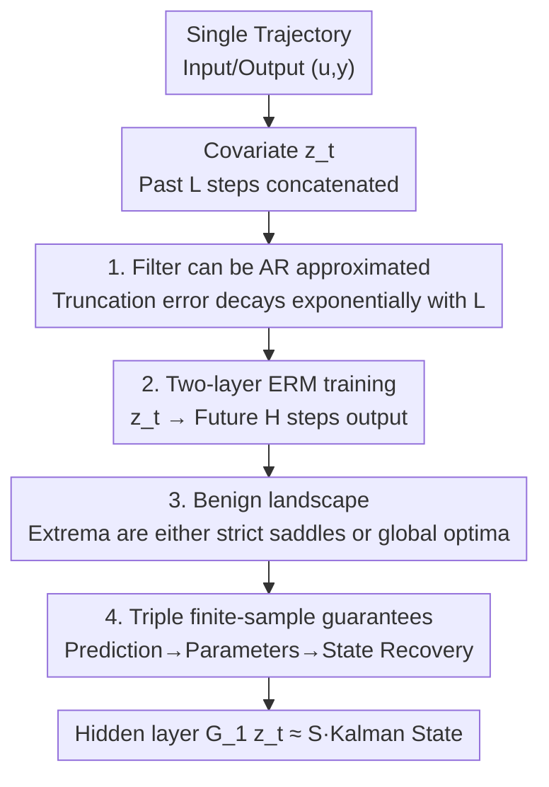

# Two-Layer Linear Auto-Regressive Models Estimate Latent States

**Conference**: ICML2026  
**arXiv**: [2606.12691](https://arxiv.org/abs/2606.12691)  
**Code**: To be confirmed  
**Area**: Learning Theory / System Identification / Autoregressive Models  
**Keywords**: Autoregressive models, Kalman filtering, latent state recovery, finite-sample guarantees, non-convex optimization landscape

## TL;DR
This paper theoretically proves that training a **two-layer linear autoregressive model** using empirical risk minimization on data from a partially observable linear dynamical system results in the hidden layer activations spontaneously approximating (up to a similarity transform) the optimal latent state estimates provided by a Kalman filter. The model learns filtering "end-to-end" without being informed of system parameters or states, providing triple finite-sample guarantees for prediction, parameters, and state recovery.

## Background & Motivation

**Background**: Autoregressive models (from LLMs to robot world models) have become universal tools for processing sequential data, based on the core paradigm of "predicting the next element given the history." A long-standing open question is whether these models, while performing prediction well, actually learn the underlying mechanisms behind the data. Empirical evidence is mixed: some studies show LLMs can represent board states in chess transcripts, while others suggest they confuse different states that share the same set of legal moves.

**Limitations of Prior Work**: On the side of rigorous theory, the field of system identification has studied which properties of a system can be identified from input-output data for decades. In the last decade, it has been rewritten from a statistical learning perspective, providing finite-sample theories for partially observable linear systems. However, almost all these works follow a two-step route: "first learn a (linear) autoregressive model, then extract latent states using classical decompositions (such as Ho-Kalman decomposition or nuclear norm regularization)." This approach of "explicitly searching for latent states / introducing specialized regularization" is incompatible with the mainstream end-to-end training paradigm in deep learning.

**Key Challenge**: Classical control theory is adept at linking "observables" and "latent states," but relies on a specialized estimate-then-decompose workflow; deep learning relies on end-to-end gradient training but lacks theoretical guarantees on whether it has truly learned the latent states. These two lines of research have long been fragmented.

**Goal**: To unify the perspective of dynamical systems theory with standard end-to-end deep learning training. Specifically, given only a **single** input-output trajectory $\{(u_t,y_t)\}$ of the system (3.1), the objective is to **directly** learn the optimal filter without explicitly learning the system matrices $A,B,C$ and noise covariances, and to prove that latent states emerge within the model's internal activations.

**Key Insight**: The authors observe that the prediction equation of the Kalman filter $\hat{x}_{t+1}=\bar{A}\hat{x}_t+Bu_t+Fy_t$ can be expanded as a linear function of the **past $L$ steps of inputs and outputs**, which exactly matches the form of a shallow autoregressive model. Consequently, "learning a filter" can be reformulated as "training a linear two-layer network," where the latent states naturally reside in the intermediate layer.

**Core Idea**: By using a two-layer linear autoregressive network $G_2G_1\bar{z}_t$ with a hidden dimension $h$ to fit "future $H$ steps of output," the first layer $G_1\bar{z}_t$ becomes equivalent to the state estimate of the Kalman filter under a similarity transform. This transforms "latent state recovery" from an additional decomposition step into a natural byproduct of training.

## Method

### Overall Architecture
The paper investigates a partially observable linear dynamical system: $x_{t+1}=Ax_t+Bu_t+w_t$, $y_t=Cx_t+v_t$, where $x_t$ is the unobservable latent state and only the input $u_t$ and output $y_t$ are observed. The goal is to directly learn the Kalman filter using only a single trajectory and read out the latent states. The theory progresses through four steps: "rewriting the filter as an autoregressive model → proving the optimization landscape is benign → providing finite-sample statistical guarantees → deriving state recovery."

Specifically, for a selected history length $L$, the past $L$ steps of outputs and inputs are concatenated into a covariate $\bar{z}_t=[y_{t-1}^\top\cdots y_{t-L}^\top\ u_{t-1}^\top\cdots u_{t-L}^\top\ ]^\top\in\mathbb{R}^{\bar{d}_z}$ ($\bar{d}_z=(m+p)L$); for a future horizon $H$, the prediction target is $y_{t:t+H-1}\in\mathbb{R}^{\bar{d}_y}$ ($\bar{d}_y=mH$). The model consists of two layers of linear mappings $f(\bar{z})=G_2G_1\bar{z}$ with a hidden dimension $h$, and weights carry a Frobenius norm upper bound $c_0$ (equivalent to weight decay regularization). Training is performed using empirical risk minimization with squared loss:

$$\mathcal{L}_R(G_1,G_2)=\frac{1}{2T}\sum_{t=1}^T\|y_{t:t+H-1}-G_2G_1\bar{z}_t\|_{\ell_2}^2.$$

An architecture search is conducted for the hidden dimension $h$, followed by using gradient descent to optimize $(G_1,G_2)$ for each $h$. The following four key designs correspond to the four steps of progression.

### Key Designs

**1. Formulating the Kalman filter as an autoregressive approximation with bounded truncation error: Enabling "latent states" to be linearly represented by finite history**

The first pain point addressed is: a filter is an infinite recursion (depending on the entire history); why can it be approximated by an autoregressive model with a fixed window $L$? The authors repeatedly expand the predictive filter (3.2) to obtain $\hat{x}_t=\mathcal{C}\bar{z}_t+\bar{A}^L\hat{x}_{t-L}$, where $\mathcal{C}$ is an "extended controllability matrix" stacked from the filter's closed-loop matrix $\bar{A}=A-FC$, the Kalman gain $F$, and the input matrix $B$. The key is that if the system is observable and stabilizable (Assumption 2), the filter's closed-loop is stable $\rho(\bar{A})<1$, so the residual term $\bar{A}^L\hat{x}_{t-L}$ decays geometrically with $L$. Proposition 1 provides $\|\hat{x}_t-\mathcal{C}\bar{z}_t\|_{\ell_2}^2\le C_\rho^2\rho^{2L}\|\Sigma[\hat{x}_t]\|(n+\log(1/\delta))$, so taking $L\gtrsim\beta\log(T)/(1-\rho)$ compresses the truncation error to be arbitrarily small. This step safely lands the "optimal filter with infinite memory" onto a "linear model with a finite window," serving as the foundation for everything that follows. Similarly, the future output can be written as $y_{t:t+H-1}=\mathcal{O}\mathcal{C}\bar{z}_t+\mathcal{O}\bar{A}^L\hat{x}_{t-L}+\xi_t$, where $\mathcal{O}$ is the extended observability matrix and $\xi_t$ treats future inputs and innovations as noise—this perfectly aligns with the target $\mathcal{O}\mathcal{C}$ that the two-layer network $G_2G_1$ should learn.

**2. Proving the non-convex optimization landscape is benign: Allowing naive gradient descent to reach the global optimum**

The second pain point is that ERM (3.6) is non-convex with respect to $(G_1,G_2)$ (product of two matrices); why would gradient descent not get stuck in bad local minima? The authors prove (Proposition 2) that when data is generated by the true system (3.1) and $L$ and trajectory length $T$ are sufficiently large, the loss landscape satisfies two "good properties"—**any local minimum is a global minimum, and any saddle point is a strict saddle point** (i.e., the Hessian's minimum eigenvalue is strictly negative). This means no "flat bad saddles" trap the optimization. This conclusion leverages statistical tools characterizing global optima in non-convex identification from Ziemann et al. and relies on the persistence of excitation of the input-output training data. The authors also honestly point out a caveat: while strict saddles + local optimality usually guarantee convergence of (perturbed) gradient descent, those results were proven for **unconstrained** problems, whereas this paper involves norm constraints. Extending this to constrained cases (e.g., projected gradient) remains an open problem, though first-order methods were observed to perform well experimentally.

**3. Triple finite-sample statistical guarantees: Deriving parameter error from prediction error**

Benign landscapes alone are insufficient; what is needed is the error magnitude when training data is finite. The authors provide two progressive bounds. Theorem 2 (In-sample prediction error): At the global optimum $(\hat{G}_1,\hat{G}_2)$, $\frac{1}{T}\sum_t\|(\hat{G}_2\hat{G}_1-\mathcal{O}\mathcal{C})\bar{z}_t\|_{\ell_2}^2\lesssim\frac{\|\Sigma[\xi_1]\|H}{T}(r(\bar{d}_y+\bar{d}_z)\log(T\Lambda)+\log\frac{T}{\delta})$, indicating the learned mapping approximates the $\mathcal{O}\mathcal{C}$ available only with known dynamics at a rate of $\tilde{O}(1/T)$, with near-optimal dependence on trajectory length $T$ and function class dimension $r(\bar{d}_y+\bar{d}_z)$. The technical core here is bounding the prediction error (which lacks a closed-form solution) using a self-normalized version of the function class's Gaussian complexity to handle correlated data. Theorem 3 (Parameter estimation error) further extends the in-sample conclusion to unseen data: as long as the covariate $\bar{z}_t$ persistently excites all modes of the Hankel matrix $\mathcal{H}=\mathcal{O}\mathcal{C}$ (proven in the paper as $\lambda_{\min}(\sum_t\bar{z}_t\bar{z}_t^\top)\gtrsim\lambda_{\min}(\Sigma[\bar{z}_L])T$ under assumptions), a near-optimal generalization bound for $\|\hat{G}_2\hat{G}_1-\mathcal{O}\mathcal{C}\|_F^2$ is obtained.

**4. Latent state recovery (up to similarity transform): Translating "learning the filter" into "reading out latent states"**

The previous steps only guaranteed that the model **output** approximates the truth, but what is truly desired is "hidden layer = latent state." Theorem 4 proves that when $\mathcal{O}$ is full column rank, $\mathcal{C}$ is full row rank, and a robustness condition $2\|\hat{G}_2\hat{G}_1-\mathcal{O}\mathcal{C}\|_F\le\sigma_n$ is met, there exists a similarity transform $S$ such that $\|\hat{x}_t-S\hat{G}_1\bar{z}_t\|_{\ell_2}^2$ tends to 0 at a rate of $\tilde{O}(1/T)$—meaning the hidden layer activation $\hat{G}_1\bar{z}_t$ under $S$ is the Kalman state estimate. Here, the "similarity transform" is not a flaw but an essential property: starting from pure input-output data, latent states can only be recovered up to an equivalence class of similarity transforms (Remark 1), because $(A,B,C)$ and $(SAS^{-1},SB,CS^{-1})$ produce identical input-output statistics. Crucially, while the classical Ho-Kalman route requires SVD on a Hankel matrix to obtain such robustness guarantees, the autoregressive model in this paper **requires no additional decomposition steps**. This also reveals a trade-off: $H$ must be $\ge n$ to make $\mathcal{O}$ full column rank for state recovery, but an excessively large $H$ loosens the error bound as $\|\Sigma[\xi_1]\|$ grows polynomially with $H$.

### Loss & Training
The training objective is the squared loss ERM (3.6), with an outer loop performing grid search for hidden dimension $h\le r$ and an inner loop using gradient descent for $(G_1,G_2)$. The norm constraint $\max\{\|G_1\|_F^2,\|G_2\|_F^2\}\le c_0$ is implemented as weight decay in practice: experiments use Adam with a weight decay of $10^{-3}$ instead of explicit projection, combined with exponential learning rate decay. This directly corresponds to the common "linear activation + weight decay" training paradigm in deep learning.

## Key Experimental Results

The goal of the experiments is to **verify the theory**: whether the hidden layer of a two-layer linear network truly aligns with the Kalman state. Evaluations were conducted using synthetic random systems ($n=4,p=2,m=3$, marginally stable with $\rho(A)=1$) and two real environments from ControlGym (underwater vehicle umv, $n=8$; aircraft ac6, $n=10$).

### Main Results: Architecture search reveals hidden dimension automatically equals true state dimension
Fixing $L=10,H=5,T_{\text{train}}=10^4$, grid searches for $h\in\{1,\dots,10\}$ were performed over $N=10$ trajectories, reporting mean ± std of the minimum training loss.

| Hidden Dimension $h$ | Training Loss (mean ± std) | Notes |
|-----------|----------------------|------|
| 1 | 309.60 ± 167.99 | Severely under-parameterized; loss explodes |
| 2 | 0.666 ± 0.047 | Threshold crossed; loss drops sharply |
| 3 | 0.720 ± 0.057 | — |
| **4** | **0.618 ± 0.041** | **Lowest; exactly equals true state dimension $n=4$** |
| 5–10 | 0.62–0.69 | Over-parameterized; no further gains |

Key phenomenon: At $h=1$, the under-parameterized loss is as high as 309, while the minimum training loss occurs at $h=4=n$, indicating that the model automatically "discovers" the true latent state dimension.

### State Recovery: Hidden layer activations align highly with Kalman states
Setting $h$ to the state dimension $n$ and fitting a linear mapping $\hat{S}$, $R^2$ is used to measure the coordinate-wise consistency between $\hat{S}\hat{G}_1\bar{z}_t$ and the Kalman prediction $\hat{x}_t$.

| System | $H$ | Average $R^2$ | Notes |
|------|-----|-----------|------|
| Random ($n=4$) | 1 | 0.999 | $R^2$ for all four coordinates ≥0.998 |
| Random ($n=4$) | 5 | 0.998 | Near-perfect alignment even for multi-step |
| umv ($n=8$) | 1 | (Reported in Table 2) | Real control systems also show high alignment |
| ac6 ($n=10$) | 1 | (As above) | — |

### Key Findings
- The optimal value from architecture search for the hidden dimension spontaneously converges to the true state dimension $n$ without any prior knowledge of $n$, echoing the idea that the "model automatically represents the latent state."
- The $R^2$ of latent state recovery on synthetic systems is close to 1.000 for both $H=1$ and $H=5$, showing that alignment does not depend on a specific horizon.
- Experiments show that Adam (a first-order method) stably converges to a good solution, indirectly supporting the theory regarding the benign landscape in Proposition 2 (despite the convergence proof for the constrained case remaining open).

## Highlights & Insights
- **The perspective that "latent states are a byproduct of training" is elegant**: It proves that latent states—which require specialized SVD/decomposition in control theory—are a natural product of the hidden layer in standard end-to-end training, bridging the gap between system identification and deep learning paradigms.
- **The similarity transform is treated as a "feature" rather than a "flaw"**: The authors clearly use Remark 1 to explain that starting from I/O data, recovery is fundamentally limited to a similarity transform equivalence class; thus, the appearance of $S$ in the theory is an unavoidable and correct conclusion, not a relaxation.
- **Triple guarantees progress logically**: Prediction error (in-sample) → parameter error (generalization) → state recovery (semantics). The logical chain is clean, and each step specifies the required order of $L$ and $T$, making it transferable to other problems that "first autoregressively approximate a recursive filter, then analyze a two-layer network."
- **Automatic detection of state dimension**: The experimental observation that the hidden dimension automatically equals the state dimension provides a lightweight method to infer the system order using training loss.

## Limitations & Future Work
- **Linear + Gaussian**: Both theory and experiments are limited to linear dynamical systems and Gaussian noise. Whether these conclusions extend to non-linear systems/non-Gaussian noise, or even real Transformer autoregression, remains the most significant open question.
- **Convergence of constrained optimization remains unproven**: The benign landscape guarantee of Proposition 2 follows standard results written for unconstrained problems. Since this paper involves norm constraints, proving convergence for algorithms like projected gradient is still an open problem, currently supported only by empirical evidence.
- **Higher computational cost**: The authors acknowledge that the autoregressive approximation requires more parameters and memory than the true Kalman filter—it replicates the input-output behavior of the filter rather than its compact computational structure.
- **Trade-off of $H$**: $H < n$ fails to recover states, while excessively large $H$ loosens the error bounds; the adaptive selection of $H$ was not deeply explored.
- The validation on real data was limited to two systems in ControlGym, which are relatively small-scale.

## Related Work & Insights
- **vs Ho-Kalman / nuclear norm regularization (estimate-then-decompose) [OO19, OO21, SOF22]**: These methods first learn a linear autoregressive model and then extract state-space parameters via classical decomposition. Ours does not separate these steps; state estimation directly appears in the activations of the two-layer linear model, with robustness guarantees without requiring additional SVD.
- **vs Tsiamis & Pappas [TP19]**: Also focuses on Kalman filtering rather than parameter estimation, uses least-squares autoregression, and provides non-asymptotic analysis. The difference is that they follow the mainstream estimate-then-decompose path, while Ours proposes and analyzes a **non-convex** learning process.
- **vs Goel & Bartlett [GB24], Du et al. [DBOO23]**: These works prove that autoregressive Transformers can approximate Kalman filters or generalize across multiple linear systems. Ours uses a simpler two-layer linear model and focuses on **state estimation** rather than control, providing full finite-sample recovery guarantees.
- **vs Policy Gradient for Learning Filter Gain [USP+22, FTA25]**: That line of work analyzes the benign landscape of autoregressive policies in a control context. Ours adopts the benign landscape idea but applies it to state estimation rather than control.

## Rating
- Novelty: ⭐⭐⭐⭐⭐ First to rigorously prove that the "hidden layer of an end-to-end trained two-layer linear network = Kalman state," unifying system identification and deep learning paradigms.
- Experimental Thoroughness: ⭐⭐⭐⭐ Synthetic and ControlGym experiments verify core theoretical predictions (hidden dimension = state dimension, $R^2 \approx 1$), but are small-scale and purely justificatory.
- Writing Quality: ⭐⭐⭐⭐⭐ The four-step progression is logically clear, and assumptions and caveats (similarity transforms, open constrained convergence) are honestly discussed.
- Value: ⭐⭐⭐⭐ Provides a provable idealized example of whether autoregressive models learn latent mechanisms, offering conceptual value for understanding representation learning, though linear assumptions limit direct application.

<!-- RELATED:START -->

## Related Papers

- [\[ICLR 2026\] On the Convergence of Two-Layer Kolmogorov-Arnold Networks with First-Layer Training](../../ICLR2026/learning_theory/on_the_convergence_of_two-layer_kolmogorov-arnold_networks_with_first-layer_trai.md)
- [\[ICLR 2026\] Navigating the Latent Space Dynamics of Neural Models](../../ICLR2026/learning_theory/navigating_the_latent_space_dynamics_of_neural_models.md)
- [\[ICLR 2026\] Two-Layer Convolutional Autoencoders Trained on Normal Data Provably Detect Unseen Anomalies](../../ICLR2026/learning_theory/two-layer_convolutional_autoencoders_trained_on_normal_data_provably_detect_unse.md)
- [\[ICLR 2026\] Transformers Learn Latent Mixture Models In-Context via Mirror Descent](../../ICLR2026/learning_theory/transformers_learn_latent_mixture_models_in-context_via_mirror_descent.md)
- [\[ICML 2026\] A Perturbation Approach to Unconstrained Linear Bandits](a_perturbation_approach_to_unconstrained_linear_bandits.md)

<!-- RELATED:END -->
