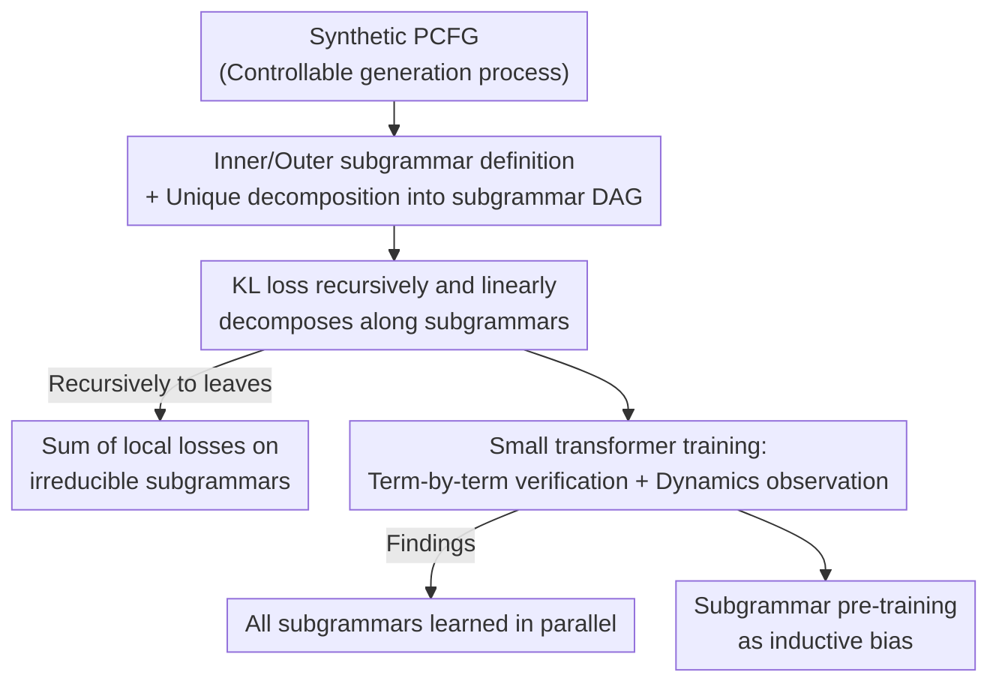

# Unraveling Syntax: Language Modeling and the Substructure of Grammars

**Conference**: ICML 2026  
**arXiv**: [2510.02524](https://arxiv.org/abs/2510.02524)  
**Code**: https://github.com/laschulz/pcfg-transformer-learning  
**Area**: Learning Theory / Language Model Learning Dynamics / Formal Languages  
**Keywords**: Context-Free Grammar, PCFG, Subgrammar, Loss Decomposition, Parallel Learning

## TL;DR
This paper establishes a foundational set of theorems linking "language modeling loss" to the "substructures of Context-Free Grammars (CFG)," proving that the KL divergence of language modeling can be linearly decomposed recursively along the subgrammar hierarchy. Through training small transformers on synthetic PCFGs, it is discovered that models learn all subgrammars **in parallel** (unlike children who master simple structures first). While PCFG subgrammar pre-training primarily benefits models that are small relative to the grammar complexity, it consistently aligns internal representations more closely with the grammar's sub-structures.

## Background & Motivation
**Background**: One path to understanding "why LLMs are so powerful" involves retreating to fully controllable synthetic settings—using Context-Free Grammars (CFG/PCFG) as proxies for language. Training small models on small grammars allows for precise probing of which rules are learned and how grammar size affects learning. Since CFGs can characterize most domains of interest—such as natural language syntax, programming languages, and arithmetic—they serve as a linguistically motivated yet mathematically clean experimental testbed.

**Limitations of Prior Work**: The authors point out two areas that have not been rigorously investigated. First, most existing works analyze the static representations and reasoning logic of **already trained** models, while rarely studying the **dynamics of language acquisition**—for instance, whether models master simple sub-structures before moving to complex syntax, similar to children. Second, existing research treats CFG as a monolithic entity, **ignoring that CFG as a mathematical object itself possesses sub-structures** that can be decomposed into "subgrammars." In the study of learning abstract function classes like polynomials, XOR, or parity, "interacting with the sub-structures of the function class" (e.g., monomials in a polynomial) has been a core topic, yet CFG research lacks corresponding tools.

**Key Challenge**: To study "learning dynamics $\times$ sub-structures," one must first have a **correct definition of subgrammars** and strictly connect them to language modeling loss—otherwise, claims like "the model learned this part first" remain intuitive rather than quantifiable.

**Goal**: (1) Define subgrammars of CFGs; (2) Prove fundamental relationships between language modeling loss and subgrammar structure; (3) Empirically investigate how subgrammar structure affects training dynamics and whether it can be used to improve optimization.

**Key Insight**: Starting from the identity "Loss = KL divergence" ($\mathcal{L}(\theta)=D_{\mathrm{KL}}(P\|Q_\theta)+H(P)$, where entropy $H(P)$ is independent of $\theta$), the authors focus on KL divergence. By utilizing the recursiveness of the PCFG generation process and the chain rule decomposition of autoregressive models, they find that KL divergence naturally "splits the bill" along the subgrammar structure.

**Core Idea**: Two new definitions, "inner subgrammar" and "outer subgrammar," are used to characterize the sub-structures of CFGs. The authors prove that language modeling KL loss **linearly decomposes recursively** along this sub-structure—reducing a seemingly monolithic loss into a sum of local losses over a set of "irreducible subgrammars."

## Method
This paper combines theory with controlled experiments: providing definitions, proving theorems, and finally "visualizing" these theorems by training small transformers on synthetic PCFGs. The core of the method is not a single pipeline but three components: subgrammar definitions, the loss decomposition theorem, and experimental probes designed around these theorems.

### Overall Architecture
The authors answer three progressive questions—**how to define sub-structures $\to$ what is the relationship between loss and sub-structure $\to$ can this relationship improve training**—unified by a synthetic testbed. A small set of PCFGs covering "factorized subgrammars, shared sub-structures, hierarchical recursion, and deep nested dependencies" is manually designed and trained on a scaled-down nanoGPT. Precise access to the generative process allows for term-by-term theoretical verification.

### Key Designs

**1. Inner and Outer Subgrammars: Two Correct Definitions for CFG "Sub-structures"**

To discuss "loss decomposition along sub-structures," one must clarify what sub-structures are. The authors propose two complementary subgrammars. **Inner subgrammars** correspond to subtrees of the CFG derivation tree: taking a subset of non-terminals $\mathcal{N}'\subseteq\mathcal{N}$, collecting all rules that expand symbols in $\mathcal{N}'$, and re-normalizing weights such that for each $A\in\mathcal{N}'$, $\sum_{(A\to\alpha)\in\mathcal{P}'}\mathcal{W}'(A\to\alpha)=1$. If it does not contain the start symbol $S$, it is a "proper subgrammar." **Outer subgrammars** correspond to a "simplified version of the language": retaining a subset of rules $\mathcal{P}'\subseteq\mathcal{P}$ including $S$; every string generated by the outer subgrammar is a valid string in the original grammar. Intuitively, inner subgrammars are the inherent compositional blocks within a CFG, while outer subgrammars are "simpler languages." The authors further prove that **every PCFG can be uniquely decomposed into a hierarchical DAG of inner subgrammars (with self-loops)** (Theorem 4.1), where each node is labeled by a set of non-terminals—this DAG precisely corresponds to the "grammar hierarchy" in classical Gruska CFG theory.

**2. Recursive Linear Decomposition of KL Loss: The Core Theorem**

This is the pillar of the paper. Let PCFG $G$ have top-level subgrammars $A_1,\dots,A_k$, and let $Q_\theta$ be an autoregressive language model. The authors first expand the KL divergence in the simplest case $S\to\alpha A\beta$ (where $\alpha,\beta$ are fixed terminal strings and $A$ is a proper subgrammar). By utilizing the subgrammar structure of $P_G$ and the autoregressive chain decomposition of $Q_\theta$, they split $D_{\mathrm{KL}}(P_G\|Q)$ into the sum of three "restricted KL divergences": prefix $\alpha$, subgrammar $A$, and suffix $\beta$. Generally (Theorem 4.3):

$$D_{\mathrm{KL}}(P_G\|Q_\theta)=\sum_{i=1}^{k}D_{\mathrm{KL}}(P_G\|Q_\theta)_{A_i}+\sum_{\alpha\in C}D_{\mathrm{KL}}(P_G\|Q_\theta)_{\alpha}$$

Where $D_{\mathrm{KL}}(\cdot)_{A}$ "restricts" the KL to subgrammar $A$ (averaging over all contexts that can initiate $A$), and $C$ is the set of fixed terminal substrings in the expansion of $S$. Crucially, this recursion **holds for any subgrammar**; repeated application expands all the way to the leaves of the DAG, yielding the "sum of local losses on irreducible subgrammars." This implies "global loss" is never a black box but a linear superposition of local losses on sub-structures—the theoretical foundation for all subsequent dynamic observations.

**3. Context-Insensitivity Hypothesis + Recursive Explosion: Cleaning the Decomposition and Characterizing Recursive Cost**

The "restricted KL" in Theorem 4.3 depends on context. The authors introduce a **context-insensitive** hypothesis: if the model provides the same conditional distribution for subgrammar $A_i$ regardless of the feasible context, the recursive terms collapse into clean KL divergences (Corollary 4.5): $D_{\mathrm{KL}}(P_G\|Q_\theta)=\sum_i p_i\,D_{\mathrm{KL}}(P_{A_i}\|Q_\theta(A_i))$, where $p_i$ is the probability of $A_i$ appearing in the expansion of $S$. The authors emphasize that while this hypothesis is strong, it often holds "statistically" in experiments. Furthermore, for **recursion** ($S$ appears in the rules expanding $S$ itself), Theorem 4.6 provides a closed form under "expected recursion":

$$D_{\mathrm{KL}}(P_G\|Q_\theta)=\frac{\sum_{i=1}^{k}D_{\mathrm{KL}}(P_{A_i}\|Q_\theta(A_i))}{1-\mathbb{E}[R]}$$

Where $R$ is the number of times $S$ appears in a single expansion of $S$. This formula quantifies the cost of recursion: as $\mathbb{E}[R]$ approaches 1, the denominator shrinks, and the divergence "explodes." If $\mathbb{E}[R]\ge1$, the PCFG sampling process never terminates in expectation, and the divergence is unbounded.

**4. Sufficient Condition for Parallel Learning: Encoding "Why Parallel" into an Independence Hypothesis**

The most counter-intuitive phenomenon in the experiments is that models reduce losses for all subgrammars **in parallel**, rather than simple-to-complex. The authors note that linear decomposition of loss does not prevent parallel learning, but does not enforce it. They provide a sufficient condition (Corollary 4.7): if a gradient update step $\delta=\nabla_\theta(-D_{\mathrm{KL}}(P_G\|Q_\theta)_{A_i})$ for subgrammar $A_i$ does not harm the performance of other subgrammars $A_j$ ($j\ne i$), then gradient descent will learn all subgrammars **in parallel**. This "non-interference between subgrammars" condition reduces the empirical phenomenon to a clear mathematical hypothesis.

### Loss & Training
The objective is standard maximum likelihood / equivalent KL minimization. Experiments use nanoGPT (e.g., 2-layer, 4-layer, 2-head decoder-only transformers) trained on several manual PCFGs (ABC grammar, nested parentheses, Python-like, arithmetic expressions). In subgrammar pre-training experiments, models are trained on subgrammar strings for $y$ epochs, then on the full grammar for $x-y$ epochs, compared against "training from scratch for $x$ epochs" with **identical total epochs and total sentences**, measuring representation alignment via CKA/cosine similarity across 30 random seeds.

## Key Experimental Results

### Overview of Core Theoretical Results

| Result | Statement (Simplified) | Implication |
|------|------|------|
| Theorem 4.1 | Unique decomposition of PCFG into inner subgrammar DAG | Provides a well-defined coordinate system for "sub-structures" |
| Theorem 4.3 | $D_{\mathrm{KL}}=\sum_i D_{\mathrm{KL},A_i}+\sum_\alpha D_{\mathrm{KL},\alpha}$ | KL loss decomposes recursively and linearly along subgrammars |
| Corollary 4.5 | Under context-insensitivity: $D_{\mathrm{KL}}=\sum_i p_i D_{\mathrm{KL}}(P_{A_i}\|Q_\theta)$ | Recursive terms collapse to clean KL, weighted by probability |
| Theorem 4.6 | $D_{\mathrm{KL}}=\frac{\sum_i D_{\mathrm{KL}}(P_{A_i}\|Q_\theta)}{1-\mathbb{E}[R]}$ | Recursive cost: as $\mathbb{E}[R]\to1$ divergence explodes; $\ge1$ non-termination |
| Corollary 4.7 | Gradient updates not harming other subgrammars $\implies$ Parallel learning | Reduces "parallel learning" to an independence hypothesis |

### Main Results: Loss Decomposition and Parallel Learning
Training small transformers on PCFGs with various subgrammar structures, the authors plot the KL divergence over time, verifying that "total KL = sum of local subgrammar KLs" holds throughout **all training stages** (Fig. 1–2). For Theorem 4.6, using a two-rule grammar $S\to x\,(p),\ S\to(S\text{ and }S)\,(1-p)$ verifies that $\mathbb{E}[R]=2(1-p)$ and KL $\propto C/(2p-1)$, showing non-linear explosion as $p\to0.5$. In all plots, the same phenomenon appears—**subgrammars are learned in parallel**.

### Ablation Study: Impact of Subgrammar Pre-training on Internal Representations (CKA, Python-like PCFG)
The table shows average linear CKA similarity (0–1, higher is more aligned) across seeds (30 seeds, 435 pairs), after pre-training followed by 45 epochs of full training:

| Configuration | 2-layer Attn (10 ep pre) | 2-layer Attn (20 ep pre) | 4-layer Attn (10 ep pre) |
|------|------|------|------|
| Full grammar - From scratch | 0.258 | 0.249 | 0.249 |
| Full grammar - With pre-training | 0.281 (+8.9%) | 0.303 (+21.7%) | 0.323 (+8.3%) |
| Subgrammar - From scratch | 0.298 | 0.288 | 0.295 |
| Subgrammar - With pre-training | 0.339 (+13.8%) | 0.348 (+20.8%) | 0.347 (+10.7%) |

Surprisingly: **Spending a few epochs specifically on subgrammars leads the model into a weight subspace that is more "aligned" across seeds**—subgrammar representations are more consistent, and full grammar representations are also more aligned, even though these models had less total training on the full grammar.

### Key Findings
- **Parallel learning is a property of the training method and architecture**, not the language task itself; linear decomposition of loss ensures "nothing prevents parallel learning," but actual parallelism depends on whether optimization satisfies the independence in Corollary 4.7.
- **Subgrammar pre-training only improves final loss for models that are "small relative to the grammar"**: effective on 2-layer transformers, disappears on 4-layer models. An "optimal pre-training window" exists—too little lacks inductive bias, too much leads to over-specialization.
- **Subgrammar position is irrelevant**: small transformers consistently retain modeling performance regardless of whether a subgrammar was pre-trained in the prefix, infix, or suffix position.
- **Models are bottlenecked by "depth," not "length"**: on nested parentheses, prediction error remains low when extending context $(a)^i$ at the same depth, but grows anti-logarithmically when increasing depth $)^i$. Probing frontier models: GPT-5.1 Instant solved 5/5 non-deep arithmetic expressions but only 2/5 at depth 7. ⚠️ *Note: Frontier model probes are anecdotal evidence; refer to original text.*

## Highlights & Insights
- **Translating "Black-box Loss" into "Sum of Local Losses"**: The recursive linear decomposition of KL provides a quantifiable coordinate system to measure what the model has learned or where it is stuck.
- **One-line Characterization of Recursive Cost**: $1/(1-\mathbb{E}[R])$ compresses the difficulty of deep recursion into a simple denominator.
- **Contrast of Parallel Learning vs. Sequential Acquisition**: The fact that models reduce all subgrammar losses in parallel stands in stark contrast to the "simple-to-complex" language acquisition of children.
- **Transferable Methodology**: Moving the "function class sub-structure $\times$ learning dynamics" paradigm to formal languages.

## Limitations & Future Work
- **Lack of Complete Theory for Parallel Learning**: Only a sufficient condition (Corollary 4.7) is provided; it remains unclear **when/why** gradient training produces parallel improvements across subgrammars.
- **Restricted Testbed**: Limited to small synthetic PCFGs and decoder-only transformers; **all grammars are unambiguous**.
- **Root Cause of Depth Failure**: Section 6 does not distinguish whether "deep recursion failure" is a representational limit or an optimization barrier.
- **Lack of Cross-Language Class Comparisons**: Dynamics were not compared between regular, (mildly) context-sensitive languages, etc.

## Related Work & Insights
- **vs. Cagnetta & Wyart (2024)**: They observed "discontinuous, staged" learning on PCFGs with finite support; this paper observes **parallel** learning under autoregressive full-sequence modeling—reconciling these is future work.
- **vs. Allen-Zhu & Li (2023)**: They characterize how transformers implement CFG computations internally (static view); this paper focuses specifically on **learning dynamics**.
- **vs. Structured Hypothesis Class Learning (juntas/parities)**: This paper imports the "learning $\times$ sub-structure" thread to formal languages where recursion is explicit.

## Rating
- Novelty: ⭐⭐⭐⭐⭐ First recursive linear decomposition theorem for LM loss and CFG subgrammars.
- Experimental Thoroughness: ⭐⭐⭐⭐ Solid verification on synthetic PCFGs, but narrow architecture/grammar coverage.
- Writing Quality: ⭐⭐⭐⭐ Clear structure; theoretical and intuitive explanations are well-balanced.
- Value: ⭐⭐⭐⭐⭐ Provides a quantifiable coordinate system for LM learning dynamics research.

<!-- RELATED:START -->

## Related Papers

- [\[ICLR 2026\] Theoretical Modeling of Large Language Model Self-Improvement Training Dynamics Through Solver-Verifier Gap](../../ICLR2026/learning_theory/theoretical_modeling_of_large_language_model_self-improvement_training_dynamics_.md)
- [\[ICML 2026\] Formalizing Learning from Language Feedback with Provable Guarantees](formalizing_learning_from_language_feedback_with_provable_guarantees.md)
- [\[ICLR 2026\] Language Identification in the Limit with Computational Trace](../../ICLR2026/learning_theory/language_identification_in_the_limit_with_computational_trace.md)
- [\[ICLR 2026\] Automata Learning and Identification of the Support of Language Models](../../ICLR2026/learning_theory/automata_learning_and_identification_of_the_support_of_language_models.md)
- [\[ICLR 2026\] Diffusion Language Models are Provably Optimal Parallel Samplers](../../ICLR2026/learning_theory/diffusion_language_models_are_provably_optimal_parallel_samplers.md)

<!-- RELATED:END -->
