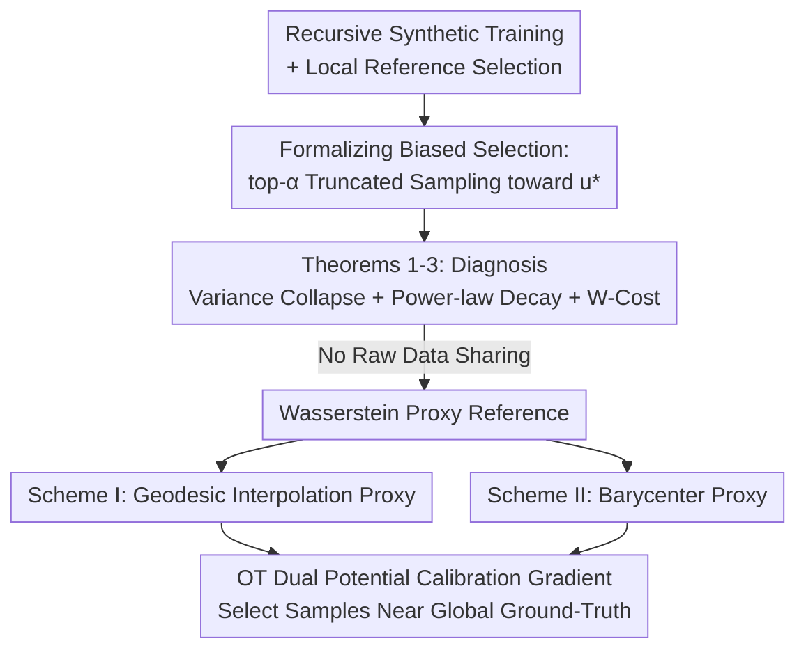

# When Sample Selection Bias Precipitates Model Collapse

**Conference**: ICML 2026  
**arXiv**: [2606.13732](https://arxiv.org/abs/2606.13732)  
**Code**: To be confirmed  
**Area**: Learning Theory / Model Collapse  
**Keywords**: Model Collapse, Data Selection Bias, Data Islands, Wasserstein Geometry, Synthetic Data

## TL;DR
This paper demonstrates that in low-resource and data-island scenarios, data selection—widely regarded as a "remedy" for model collapse—actually accelerates it. Since each verifier only observes a biased local slice of the target manifold, they prioritize samples matching local references and prune globally relevant tail modes, theoretically collapsing variance to point masses at a power-law rate. The authors propose constructing Wasserstein proxy references (geodesic interpolation/barycenters) across multiple islands to enable collaborative selection without sharing raw data.

## Background & Motivation

**Background**: Recursive training of generative models on their own synthetic data is becoming common but leads to **model collapse**—the erosion of distributional tails and homogenization of outputs over generations. This manifests as shrinking variance and diverging Wasserstein distances between synthetic and real distributions. The community consensus is to use **data selection** (filtering low-quality synthetic samples) to stabilize recursive training; with ideal verifiers, recursive training can even outperform models trained solely on real data.

**Limitations of Prior Work**: The reliability of data selection depends heavily on the **reference distribution used by the verifier**. In low-resource data islands (e.g., hospital alliances, financial institutions where raw data cannot be aggregated due to privacy), each verifier works only on a local, fragmented, and biased slice of the global distribution. Selected synthetic data reflects limited local priors rather than global diversity.

**Key Challenge**: Selection itself becomes a "bias filter"—it prioritizes samples close to the local manifold and prunes globally relevant but locally under-represented tail modes. Consequently, selection shifts from a "guardrail against collapse" to a "mechanism for collapse." This is analogous to how human preference-based filtering causes diversity shrinkage, but here it is **passively driven** by environmental constraints rather than active preference curation.

**Goal**: (Q1) Theoretically characterize how island-style biased selection accelerates collapse, determine the collapse rate, and quantify the cost to downstream generalization; (Q2) Provide a mitigation scheme under the hard constraint that raw data cannot be shared.

**Core Idea**: Biased selection is formalized as "top-$\alpha$ truncated sampling toward an ideal target $\mathbf{u}^*$," proving that it forces variance to collapse toward a point mass at a power-law rate under the Accumulate paradigm. Wasserstein geometry (geodesic interpolation, barycenters) is then utilized to allow multiple islands to synthesize a "quasi-global" proxy reference without exchanging raw data, replacing a single biased reference with a collective one.

## Method

### Overall Architecture
The paper follows a two-part "theoretical diagnosis + geometric solution" structure. The first half (Section 3) provides three theorems within a multivariate Gaussian framework to prove that biased selection accelerates collapse and quantifies the generalization cost. The second half (Section 4) proposes local remedial schemes: constructing proxy references via Wasserstein geodesic interpolation (Scheme I) or Barycenters (Scheme II), followed by sample selection using calibration gradients based on OT dual potentials.

### Key Designs

**1. Formalizing biased selection as "top-α truncated sampling toward an ideal target"**

To analyze biased local references, the authors utilize a scoring function $U(\mathbf{x})$ that is **locally concave** near the target state $\mathbf{x}=\mathbf{u}^*$ (Assumption 1). This covers both environmental constraints (e.g., pruning based on distance to local feature centroids) and active preference curation (e.g., Best-of-N selection). At generation $t$, a high-utility neighborhood $\mathcal{R}_t$ surrounding $\mathbf{u}^*$ is defined and dynamically calibrated to capture the top-$\alpha$ probability mass of the current sampling distribution ($\alpha=n/N$ is the filtering budget). Thus, selected data follows a **truncated multivariate normal** distribution $\mathcal{TN}(\bar{\bm\mu}_{t-1},\bar{\bm\Sigma}_{t-1},\mathcal{R}_t)$.

**2. Three Theorems: Proving accelerated collapse and power-law rates**

This formulates the theoretical backbone. **Theorem 1 (Bias-induced Collapse)**: Under the Accumulate paradigm (which normally ensures stability), imposing top-$\alpha$ biased selection causes means to align with the target $\|\bar{\bm\mu}_t-\mathbf{u}^*\|^2\xrightarrow{a.s.}0$ while variance irreversibly collapses $\bar{\bm\Sigma}_t\xrightarrow{a.s.}\mathbf{0}$. **Theorem 2 (Collapse Rate)**: After standardizing selection to isotropic coordinates, variance is proved to decay via a **power law** $\text{Tr}(\bar{\bm\Sigma}_t)=\mathcal{O}_{a.s.}(t^{-\psi})$, where $\psi$ originates from the spectral gap of the dissipation matrix. **Theorem 3 (Wasserstein Generalization Cost)**: Under standard Lipschitz conditions, the expected risk on the ground-truth manifold is bounded by $\mathcal{R}_{\mathcal{D}^*}(h_t;g^*)\le 2\ell\epsilon\,\mathbb{W}_p(\mathcal{D}_t,\mathcal{D}^*)+\mathcal{R}_{\mathcal{D}_t}(h_t;g_t)+\mathcal{O}(\ell\delta)$. Generalization is dominated by the Wasserstein distance between the filtered and ground-truth distributions.

**3. Scheme I — Collaborative Geodesic Interpolation Proxy: Gradient-based selection without raw data**

The authors use OT dual potentials to construct **calibration gradients** for scoring. For a synthetic set $\mathcal{P}$ and reference set $\mathcal{Q}_k$, the optimal dual potential $f^*$ is the subgradient of the transport cost. The sample score is $\mathcal{S}_k(x_i)=f^*(x_i)-\frac{1}{N-1}\sum_{j\ne i}f^*(x_j)$; positive scores suggest pruning to reduce divergence. To avoid sharing $\mathcal{Q}_k$, the authors use Wasserstein geodesic properties to construct an interpolation proxy $\xi_k^*$ located between $\mathcal{P}$ and $\mathcal{Q}_k$, proving $\nabla_\mathcal{P}\mathbb{W}_p(\mathcal{P},\mathcal{Q}_k)\approx\nabla_\mathcal{P}\mathbb{W}_p(\mathcal{P},\xi_k^*)$.

**4. Scheme II — Collaborative Wasserstein Barycenter Proxy: Decoupled and reusable proxies**

Scheme I is not scalable as proxies must be recomputed if $\mathcal{P}$ changes. Scheme II directly estimates a proxy for the ground truth: the **Wasserstein Barycenter** of all local real distributions $\mathcal{Q}^*=\arg\min_{\mathcal{Q}}\sum_k\lambda_k\mathbb{W}_p^p(\mathcal{Q},\mathcal{Q}_k)$. A central server iteratively broadcasts a barycenter estimate $\xi^{(r)}$, and each island returns its geodesic interpolation $\xi_k^{(r)}$ with its local distribution. The server updates via $\xi^{(r+1)}=\sum_k \frac{1}{K}\xi_k^{(r)}$. Its advantage is that the barycenter depends only on local real data and is independent of the synthetic candidate size $N$.

### Loss & Training
This work does not train new generative models; the core "training strategy" is modifying the **selection phase** in recursive training: replacing single-island biased scoring with multi-island collaborative scoring using Sinkhorn-based OT. Complexity (Theorem 6): Scheme I is $\mathcal{O}(RL(N+M+S)S+nNK)$, and Scheme II is $\mathcal{O}(TLMS+LNS)$, both scaling near-linearly with $N$ and $M$.

## Key Experimental Results

### Main Results
Experiments using DDPM on CIFAR-10 / STL-10 / CelebA under the Accumulate-Subsample paradigm ($N=4n$). Real data is distributed across 10 islands using an ExDir$(1,0.1)$ non-IID split. Evaluation after 10 generations uses FID, Precision, and Recall.

| Method | CIFAR-10 FID↓ | CIFAR-10 Recall↑ | STL-10 FID↓ | CelebA FID↓ |
|------|--------------|------------------|-------------|-------------|
| Random | 106 | 0.48 | 95 | 96 |
| K-means | 102 | 0.40 | 89 | 87 |
| CenterMatch | 116 | 0.35 | 111 | 87 |
| CovMatch | 115 | 0.47 | 131 | 92 |
| **Scheme II (Barycenter)** | 85 | 0.57 | 69 | 75 |
| **Scheme I (Interpolation)** | **71** | **0.58** | **65** | **69** |

### Key Findings
- **Standard selection baselines perform worse than random selection in non-IID island scenarios.** This is a powerful empirical result: selection, intended to prevent collapse, actually accelerates it under biased references.
- On CelebA (faces), baselines perform relatively better because face data is highly structured; even with biased references, filtered images retain essential features. This suggests biased selection is most lethal for "tail-heavy, loosely structured" data.
- Scheme I is generally the best but less scalable; Scheme II is slightly behind but reusable and scales efficiently with the number of clients, making it the superior engineering choice.

## Highlights & Insights
- **Reversing the consensus of "data selection as a remedy"**: In low-resource/island/non-IID settings, selection becomes a collapse mechanism due to biased references. The empirical evidence that selection can be worse than random is particularly impactful.
- **Privacy-preserving collaborative selection via Wasserstein geometry**: The core mechanism shifts from "collaborative learning" to "collaborative evaluation"—sharing intermediate interpolations rather than raw data or models.
- **Quantitative characterization of power-law collapse $\mathcal{O}(t^{-\psi})$**: The two-stage dynamics (rapid homogenization followed by slow asymptotic convergence to a Dirac mass) provide clear insight into the tension between local alignment and global dissipation.

## Limitations & Future Work
- The core theorems (Theorem 1/2) are based on multivariate Gaussian/local concavity assumptions; whether high-dimensional multi-modal data strictly follows power-law collapse remains an open question.
- If collaborative proxies are poisoned by a majority of malicious nodes, the mechanism might reinforce "collective bias" rather than the ground truth; defense mechanisms are outside the current scope.
- The evaluation is limited to image generation with DDPM; the effectiveness in other modalities like Large Language Models (LLMs) or at larger scales has not yet been verified.

## Related Work & Insights
- **vs. Human Preference Curation**: While others characterize how preference optimization leads to variance loss, this work identifies a **passive** phenomenon driven by environmental constraints (island access) that cannot be solved by typical de-biasing.
- **vs. CenterMatch/CovMatch**: These methods filter toward local real centroids/covariances; this paper proves such local reference selection induces collapse in non-IID settings and replaces them with barycenter-based proxies.

## Rating
- Novelty: ⭐⭐⭐⭐⭐ (Flips the "selection = remedy" consensus; introduces privacy-preserving collaborative evaluation).
- Experimental Thoroughness: ⭐⭐⭐⭐ (Three datasets + non-IID controls + simulations + complexity analysis).
- Writing Quality: ⭐⭐⭐⭐ (Clear three-stage structure, although mathematically dense).
- Value: ⭐⭐⭐⭐ (Provides a clear warning and actionable solution for recursive synthetic data pipelines in privacy-sensitive sectors).

<!-- RELATED:START -->

## Related Papers

- [\[ICLR 2026\] Escaping Model Collapse via Synthetic Data Verification: Near-term Improvements and Long-term Convergence](../../ICLR2026/learning_theory/escaping_model_collapse_via_synthetic_data_verification_near-term_improvements_a.md)
- [\[ICLR 2026\] When Bias Meets Trainability: Connecting Theories of Initialization](../../ICLR2026/learning_theory/when_bias_meets_trainability_connecting_theories_of_initialization.md)
- [\[ICLR 2026\] Preventing Model Collapse Under Overparametrization: Optimal Mixing Ratios for Interpolation Learning and Ridge Regression](../../ICLR2026/learning_theory/preventing_model_collapse_under_overparametrization_optimal_mixing_ratios_for_in.md)
- [\[ICLR 2026\] Optimizing Data Augmentation through Bayesian Model Selection](../../ICLR2026/learning_theory/optimizing_data_augmentation_through_bayesian_model_selection.md)
- [\[ICML 2026\] Active Learning with Low-Rank Structure for Data Selection](active_learning_with_low-rank_structure_for_data_selection.md)

<!-- RELATED:END -->
