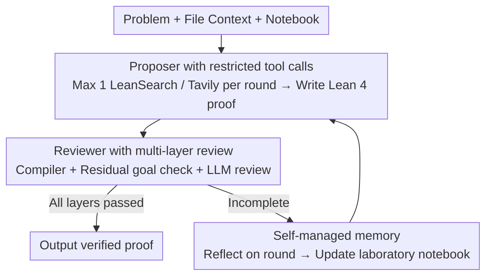

# A Minimal Agent for Automated Theorem Proving

**Conference**: ICML 2026  
**arXiv**: [2602.24273](https://arxiv.org/abs/2602.24273)  
**Code**: https://github.com/Axiomatic-AI/ax-prover-base  
**Area**: LLM Agent / Formal Mathematics  
**Keywords**: Theorem Proving, Lean 4, Agent Architecture, Iterative Refinement, Self-Managed Memory

## TL;DR
This paper proposes AxProverBase—a minimalist Lean 4 theorem-proving agent. By relying on only three components—"compiler feedback + self-managed notebook + lightweight tool search"—it achieves or exceeds the performance of specialized systems like Hilbert/Seed-Prover using non-fine-tuned frontier LLMs (Claude Opus), while reducing costs by 100x.

## Background & Motivation

**Background**: Recent breakthroughs in AI theorem proving (AlphaProof, Hilbert, Seed-Prover) have been significant, but most depend on large-scale synthetic data fine-tuning or reinforcement learning (RL), leading to extremely high complexity and costs. Meanwhile, the formal mathematical capabilities of frontier general-purpose LLMs are improving rapidly, yet it remains difficult to isolate the contributions of system design versus model improvements to final performance.

**Limitations of Prior Work**: (1) Complex architectures are difficult to reproduce; (2) systems are tightly coupled with specific Lean/Mathlib versions, requiring retraining for updates; (3) GPU clusters or API costs are prohibitive; (4) the marginal contributions of iterative feedback, memory, and tool search have not been quantified.

**Key Challenge**: There is a common assumption that a strong prover requires complex design. Is this true? Would simplification lead to a total collapse in performance?

**Goal**: Identify the "minimal necessary combination of modules" to achieve competitive performance with a minimalist architecture, while providing a clear ablation baseline.

**Key Insight**: Starting from the ReAct framework, the system is decomposed into three replaceable modules: Proposer, Reviewer, and Memory. These are stacked bottom-up to quantify marginal benefits.

**Core Idea**: Iterative feedback >> Memory >> Tool Search. The combination of "compiler feedback + self-reflective notebook" is already capable of rivaling the most complex systems; tool search is merely a secondary enhancement.

## Method

### Overall Architecture

The question AxProverBase aims to answer is: Setting aside large-scale fine-tuning and complex search, what are the minimum parts required for a proving agent? The entire system is compressed into a ReAct-style iterative loop containing only three replaceable modules. The Proposer reads the problem, file context, and memory to write a segment of Lean 4 proof. The Reviewer submits this proof to a dual-layer verification process involving the Lean 4 compiler and an LLM reviewer. If the proof is incomplete, the attempt and feedback are written into Memory for the next round, continuing until the proof passes or the iteration budget is exhausted. Each module has several implementations (e.g., the Proposer can be a vanilla LLM or tool-augmented; Memory can be absent, history-based, or self-managed). The paper uses this "bottom-up stacking" design to quantify the marginal value of each component.

### Key Designs

**1. Proposer with Restricted Tool Calls: Enabling Mathlib lookup without overwhelming reasoning**

The primary challenge for vanilla LLMs in writing Lean code is not mathematical logic, but rather generating code that actually compiles—this requires knowledge of specific lemma names and signatures in Mathlib. Thus, the Proposer triggers at most one parallel round of tool calls before each proposal: LeanSearch uses vector retrieval to fetch relevant theorems, while Tavily performs web searches for background information. Web searching is permitted (though typically restricted in competitions) because the goal here is to find "syntax/library APIs" rather than "answers." However, tool calls are strictly limited to once per round to prevent retrieval noise from overwhelming the model's own reasoning and context.

**2. Multi-layered Reviewer: Blocking "fake proofs" like sorry/admit**

LLMs often resort to shortcuts—using `sorry` or `admit` as placeholders, or utilizing metaprogramming tricks to make code "appear" to compile without proving anything. The Reviewer addresses this with three checkpoints: First, the Lean 4 compiler ensures the code compiles without `sorry`, `admit`, or `suggestion`. Second, residual goals are extracted post-compilation to confirm no unclosed subgoals were bypassed. Third, an LLM reviewer checks if the theorem statement was tampered with or if logical flaws like "circular reasoning via over-generalization" exist. These layers serve as the final line of defense for system reliability.

**3. Self-Managed Context (Memory): Tracking technical insights rather than raw logs**

The memory module determines how failed attempts and feedback are carried into subsequent rounds. While simply appending the last $N$ attempts (History Memory) is straightforward, it leads to context bloat and rising costs. Self-managed memory instead requires the Proposer to reflect after each iteration and maintain a "Laboratory Notebook." This notebook records valuable technical insights and mistakes to avoid, while deleting obsolete entries. Subsequent iterations prioritize this refined notebook over raw history. The decision of what to keep or delete is left entirely to the LLMs' judgment, which proves superior to hard-coded heuristics. Empirically, this reduces context by approximately $50\%$, lowers per-problem costs by $20\%$, and halves the variance of the pass rate.

### A Complete Example

Consider a PutnamBench problem: In Round 1, the Proposer receives the problem, performs a parallel search (retrieving Mathlib lemmas), and writes a proof version. The Reviewer identifies a compiler error regarding a signature mismatch and one unclosed goal. The system records "this lemma's parameter order was incorrect" in the notebook. In Round 2, the Proposer reads the refined notebook (not the full previous context), corrects the lemma usage, fills the missing goal, and resubmits. All three review layers pass, the proof is verified, and the loop terminates early. This linear "write-compile-reflect-rewrite" iteration drives the process without external tree search or fine-tuning.

### Training Strategy
No training; frontier LLMs are used directly for inference.

## Key Experimental Results

### Ablation Study (PutnamBench 100-problem subset)

| Configuration | Pass@1 (%) | Pass@20 (%) | Average Cost | Description |
|------|-----------|-----------|--------|------|
| Base LLM (Claude Opus) | 2.0 | 5.0 | – | Baseline |
| + Iterative Feedback (1 retry) | 8.5 | 18.0 | $0.30/prob | **Single largest gain** |
| + Historical Memory (5 iterations) | 15.2 | 31.0 | $0.80/prob | Effective but bloats context |
| + Self-Managed Memory (5 iterations) | 16.3 | 33.2 | $0.64/prob | **Optimal tradeoff** |
| + Tool Search | 17.8 | 35.5 | $0.72/prob | Marginal gain ~8% |

### Main Results (Full system, 50 iterations)

| Model | Pass@1 | Pass@50 | Relative Cost |
|------|--------|---------|--------|
| Claude Sonnet 4.5 (10k thinking) | 28.5% | 51.3% | 0.8x |
| Claude Opus 4.5 (10k thinking) | 38.2% | 60.7% | 1.0x |
| Claude Opus 4.5 (32k thinking) | 45.1% | **68.3%** | 1.8x |
| Gemini 3 Flash (high) | 9.2% | 25.1% | 0.3x |
| Gemini 3 Pro (high) | 12.5% | 28.7% | 0.6x |

### Main Results (Opus 32k, 50 iterations)

| Benchmark | AxProverBase | Prev. SOTA | Note |
|------|-------------|-----------|------|
| PutnamBench (pass@1) | **54.7%** | Hilbert 55.9% | 100x lower cost |
| FATE-M (pass@1) | **98.0%** | REAL-Prover 56.7% | Significant lead |
| FATE-H (pass@1) | **66.0%** | REAL-Prover 0% | First to >60% |
| FATE-X (pass@1) | 24.0% | Seed-Prover 33% | Extremely high difficulty |
| LeanCat (pass@1) | **59.0%** | Opus Zero-shot 8.25% | Significant iteration gain |

### Key Findings
- **Iterative feedback is decisive**: Simply adding a feedback loop increased Pass@1 from 2% to 8.5% (a 4.25x increase), exceeding the cumulative effect of other changes.
- **Self-managed memory outperforms historical memory**: It offers better performance and stability at a lower cost, demonstrating the value of "curated memory over total memory."
- **Framework amplifies model capability**: Opus 32k thinking achieved a Pass@50 that was 7.6 percentage points higher than 10k thinking; stronger models gain more from this framework.
- **Limited value of tool search**: In competition environments, web search provides minimal help, while LeanSearch is useful but not critical.
- **Cross-domain generalization**: The simple architecture generalizes across competition math, abstract algebra (FATE-M), and category theory (LeanCat).

## Highlights & Insights
- **The power of minimalism**: Theorem proving does not strictly necessitate large-scale training or complex search; "compiler feedback + self-reflection + strong models" can rival SOTA.
- **Efficacy of self-reflection**: Allowing the LLM to maintain its own notebook is superior to fixed heuristic information retrieval, highlighting the value of "metacognition" in AI systems.
- **Rigorous ablation design**: Bottom-up stacking with clear quantification of each layer's contribution provides a roadmap for future improvements.
- **New cost-performance perspective**: A cost of $\$12.6$/problem compared to hundreds or thousands for Hilbert significantly lowers the barrier to entry.

## Limitations & Future Work
- Performance of 24% on FATE-X suggests the system still faces bottlenecks regarding deep mathematical intuition.
- Evaluation was limited to a single model family (Claude); performance on other architectures was not extensively tested.
- The system is Lean 4 specific; transferability to Coq/Isabelle requires verification.
- Self-managed memory relies on the model's capacity for introspection, which may fail for weaker models.
- Future directions: enhancing hybrid semantic+symbolic retrieval; integrating specialized solvers; and adopting a two-stage "sketch-to-formalization" paradigm.

## Related Work & Insights
- **vs. Seed-Prover / Goedel-Prover**: These rely on large-scale synthetic data and RL; this paper demonstrates that general-purpose LLMs can also be competitive.
- **vs. AlphaProof**: AlphaProof utilizes tree search and complex heuristics; this paper uses a linear iterative program that is simpler yet remains competitive.
- **Insight**: The paradigm of iterative feedback + self-reflection + light tools can be transferred to other complex reasoning tasks such as program synthesis and scientific verification.

## Rating
- Novelty: ⭐⭐⭐⭐☆ Individual modules are not highly novel, but the "minimalism is strength" conclusion is insightful.
- Experimental Thoroughness: ⭐⭐⭐⭐⭐ Comprehensive across 5 benchmarks, multiple models, and detailed ablations.
- Writing Quality: ⭐⭐⭐⭐⭐ Clear architecture, complete pseudocode, and precise presentation of results.
- Value: ⭐⭐⭐⭐⭐ Lowers the barrier for AI in formal mathematics, significantly impacting the open-source community.

<!-- RELATED:START -->

## Related Papers

- [\[AAAI 2026\] Structured Personalization: Modeling Constraints as Matroids for Data-Minimal LLM Agents](../../AAAI2026/llm_agent/structured_personalization_modeling_constraints_as_matroids_for_data-minimal_llm.md)
- [\[ACL 2025\] Theorem-of-Thought: A Multi-Agent Framework for Abductive, Deductive, and Inductive Reasoning in Language Models](../../ACL2025/llm_agent/theorem-of-thought_a_multi-agent_framework_for_abductive_deductive_and_inductive.md)
- [\[ICLR 2026\] TaskCraft: Automated Generation of Agentic Tasks](../../ICLR2026/llm_agent/taskcraft_automated_generation_of_agentic_tasks.md)
- [\[ICLR 2026\] MATHMO: Automated Mathematical Modeling Through Adaptive Search](../../ICLR2026/llm_agent/mathmo_automated_mathematical_modeling_through_adaptive_search.md)
- [\[ICLR 2026\] WebFactory: Automated Compression of Foundational Language Intelligence into Grounded Web Agents](../../ICLR2026/llm_agent/webfactory_automated_compression_of_foundational_language_intelligence_into_grou.md)

<!-- RELATED:END -->
