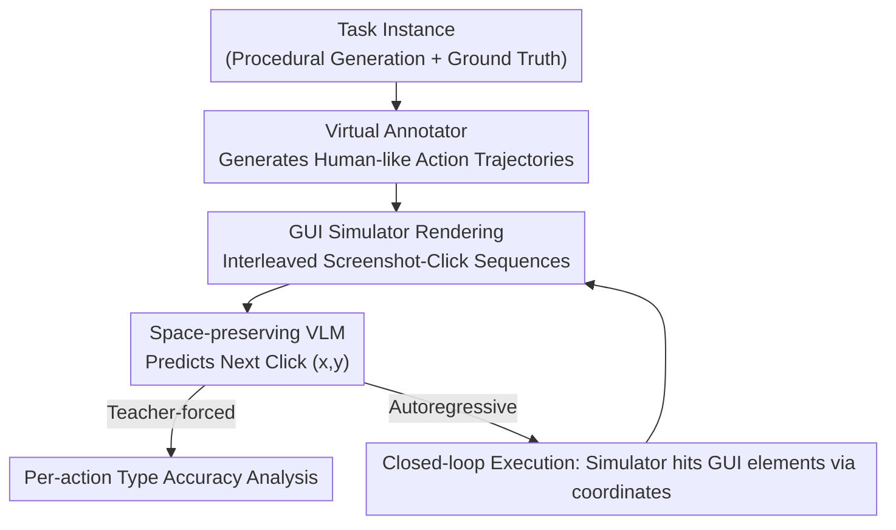

# A Systematic Study of Behavioral Cloning for Scientific Data Annotation

**Conference**: ICML2026  
**arXiv**: [2606.07568](https://arxiv.org/abs/2606.07568)  
**Code**: To be confirmed  
**Area**: LLM Agent / Behavioral Cloning / GUI Agent  
**Keywords**: Behavioral cloning, scientific data annotation, GUI agent, synthetic benchmark, linear probes

## TL;DR
This paper establishes a controlled framework consisting of 9 procedurally synthetic annotation tasks and virtual annotators to systematically study whether "behavioral cloning" (allowing a VLM to directly mimic full human operation trajectories—clicking, navigating, and undoing within an annotation interface) can replace "direct label prediction." Through four dimensions—training dynamics, scaling laws, transfer capabilities, and linear probes—it reveals findings such as the hierarchical emergence of skills, the phenomenon where models make fewer mistakes than training data but still perform error correction, the necessity of multi-task pre-training for transferability, and task-shared internal representations of "errors."

## Background & Motivation
**Background**: Scientific data annotation (e.g., tracking animals in behavior videos, proofreading 3-D neuron reconstructions) is long hindered by the "last mile" problem—even if automated algorithms achieve high accuracy, humans must manually find and correct remaining errors. An extreme example: proofreading a fruit fly brain in connectomics took 33 person-years even with state-of-the-art automated segmentation.

**Limitations of Prior Work**: Most ML methods treat annotation as a direct "data → label" mapping, optimizing only final output precision. However, human annotation is an interactive workflow: experts browse data, click/edit via interfaces, re-verify uncertain areas, and undo/restart upon finding errors. These action sequences contain procedural supervision signals on "how high-quality annotations are produced," which direct prediction discards entirely.

**Key Challenge**: Behavioral cloning (BC, allowing models to mimic human actions) could leverage this trajectory supervision and has succeeded in autonomous driving or gaming agents. However, it has been rarely studied systematically in scientific annotation due to practical hurdles: collecting behavioral data requires instrumented interfaces, there are no standard benchmarks for long-horizon annotation sessions, and scientists cannot easily spare time. Consequently, both ML researchers and domain scientists lack answers to basic questions: How difficult is it for a model to learn an annotation workflow? What challenges remain even with sufficient data? What makes certain tasks harder than others?

**Goal**: To transform these questions into quantifiable and controllable experiments to answer "what, how, and where the bottlenecks are" for BC in scientific annotation.

**Key Insight**: Since real behavioral data is difficult to collect, the authors use **synthesis**. They procedurally generate data for 9 annotation tasks along with virtual annotators that simulate real human strategies. This allows arbitrary scaling of training data, systematic adjustment of task difficulty, and isolation of variables to study failure modes—capabilities inaccessible with real data.

**Core Idea**: Treat "human annotation sessions" (sequences of interleaved screenshots and clicks) as the training target for behavioral cloning. Using a space-preserving VLM to predict "where to click next," the synthetic framework is used to dissect BC’s training dynamics, scaling, transfer, and internal representations.

## Method

### Overall Architecture
The input to the framework is an interleaved sequence of "screenshots and clicks" $(\text{img}_0, \text{click}_0, \text{img}_1, \text{click}_1, \ldots)$. The output is the model's prediction for the "next click coordinates $(x,y)$" at each step. During closed-loop evaluation, this click is sent back to a GUI simulator for execution, producing a new screenshot, and the cycle continues until task completion. The pipeline decouples three components: **World Content** (task instances with ground truth), **Annotation Strategy** (action sequences), and **Interface Rendering** (GUI screenshots). This decoupling allows for independent characterization of task difficulty, labeling behavior, and error rates.

### Key Designs

**1. Virtual Annotator: Proceduralizing human strategies to create procedural supervision**

Direct prediction loses supervision because it only looks at the final label; this paper synthesize "how humans label." Given a task instance with ground truth, the virtual annotator generates realistic action sequences containing four types of behavior: **Navigation** (flipping z-slices, rotating 3-D views, switching spectral channels), **Placement** (clicking to place markers, drawing polygons, selecting objects), **Verification** (switching views or revisiting previous locations to check), and **Error & Correction** (simulating 10–30% placement errors followed by immediate undo actions). Crucially, the "error-undo" pattern is preserved in the training data, allowing the model to learn error recovery strategies. A comparison with 4 human annotators on a "Colored Dot Tracking" task showed that virtual annotators' navigation/placement/error rates fell within the human range, validating the realism of the procedural behavior.

**2. Unified Action Space via Canvas Clicks: One output head for all action types**

An action is defined simply as a click at canvas coordinates $(x,y)$. When the simulator receives coordinates, it performs hit testing: if it lands on a GUI element, it triggers the corresponding behavior (+z, undo, done, category selector); otherwise, it is recorded as a canvas placement. The model uses a **single output head**—predicting independent distributions for $x$ and $y$—covering all action types. The model cannot specify an action type; it only learns "where to click." This design is intentional: any tool with clickable elements can be integrated without modifying the model architecture or objective, and it forces the model to learn spatial localization rather than shortcutting by selecting action types.

**3. Space-preserving Lightweight VLM: Enabling pixel-level prediction for long sessions**

Annotation requires pixel-level precision, but off-the-shelf VLMs face memory bottlenecks during long sessions (e.g., Qwen3-VL-4B exceeds 80 GB at 20 frames). Ours uses a frozen DINOv2 visual encoder to extract patch tokens from each frame, spatially pooled to $12\times 9=108$ tokens, connected to a transformer head using **block-causal attention**. Attention is bidirectional within a frame and causal across frames. This preserves the spatial structure necessary for pixel prediction while compressing sequences to a trainable scale. Four model sizes (25M to 320M) were trained to study scaling.

**4. Dual-mode Evaluation: Teacher-forced skill decomposition vs. Autoregressive closed-loop**

To provide both fine-grained diagnostics and real-world capability metrics, two evaluation modes are used. **Teacher-forced** evaluation provides ground-truth history and measures next-action accuracy, avoiding error accumulation and allowing for analysis of specific action types (placement, undo, done, navigation). **Autoregressive** evaluation runs the model in a closed-loop with the GUI simulator: the model predicts clicks from screenshots, and the simulator executes them via JavaScript until completion or timeout. Combining both identifies whether a model "knows how" to act versus whether it "chooses to" act.

### Loss & Training
The training objective is the maximum likelihood of human actions (standard supervision for behavioral cloning). The model performs classification/regression for $x$ and $y$ coordinates at each step. In multi-task settings, trajectories from 9 tasks are mixed for joint training. Downstream adaptation involves fine-tuning the pre-trained model on a small number of new task sequences. The main multi-task experiment took ~2 days on 4×A100; all scaling and ablation studies totaled ~1 week on 4×A100.

## Key Experimental Results

### Main Results
The authors trained four model sizes on 9 tasks joint behavioral cloning and tested downstream transfer against VLM baselines.

| Evaluation Setting | Ours 95M BC Model | Baseline | Conclusion |
|--------|------|----------|------|
| Colored Dot Placement Acc @5px (teacher-forced) | 97.4% | Gemini 1.5 Flash 80.0% / Qwen2-VL-7B 25.0% | Small specialized models significantly outperform general large VLMs |
| 9-task Closed-loop Success Rate (autoregressive) | Successful on most tasks | Gemini successful on 3/9, Qwen on 0/9 | General VLMs struggle with closed-loop long-horizon annotation |
| New Task Shape Matching Fine-tuning (500 seq) | 76.6% | Training from scratch (7800 seq) → 0% | Multi-task pre-training provides transferable representations |
| Real EM Neuron Tracking (H01 Human Cortex) | 95.1% Skeleton Acc | — | Human-level performance after fine-tuning with 100% completion rate |

### Ablation Study

| Adaptation Method | Accuracy | Description |
|------|---------|------|
| Multi-task Pre-training + Fine-tuning (500 seq) | 76.6% | Saturates at 500 sequences |
| Training from scratch (7800 seq) | 0% | Fails completely even with 15x more data |
| Zero-shot / Few-shot In-context | ~0% | In-context examples fail to induce adaptation |
| $\beta$-DAgger (on two failed tasks) | Still fails | Suggests task difficulty, not error accumulation, is the bottleneck |

### Key Findings
- **Hierarchical Emergence of Skills**: GUI mechanisms (clicking buttons, placing markers) are learned first, while task-critical decisions (when to undo, when to click "done") are learned later. Undo accuracy emerges latest but eventually approaches 100%, indicating the model indeed learns to identify and correct errors.
- **Models Make Fewer Errors than Training Data, Yet Still Correct Them**: While 9.2% of placement actions in the training data contain "error-undo" patterns, the model only makes errors in 1.0% of cases and uses undo in 0.7% during generation. This is a known bias where models "deactivate minority classes," effectively learning to skip the "error-correction" pattern. However, under teacher-forced evaluation, if forced into an error state, the model triggers undo nearly 100% of the time. The model **knows how to correct but chooses not to err**.
- **Scaling & Transfer**: A 10× increase in parameters leads to ~3× improvement in sample efficiency (larger models save data). At equal loss levels, smaller models are slightly better at decision-making actions; the authors hypothesize small models are forced to compress information into more abstract, transferable decision factors. Multi-task pre-training enables transfer via fine-tuning, but in-context learning fails completely (potentially due to low task diversity of only 9 tasks).
- **Shared Error Representations**: Training linear probes on the [cls] position of the residual flow yielded an ROC AUC of 0.92 for single-task error detection and 0.87 for a 9-task pool. Leave-one-task-out cross-validation showed an average transfer of 0.71, with 8/9 tasks above random. Only 3D Exploration transfer failed (0.29), as its errors were categorical rather than spatial placement errors, encoded in the opposite direction. This suggests a partially universal internal representation of "something went wrong."

## Highlights & Insights
- **"Opening the Black Box" of BC with Synthetic Data**: By using procedural tasks and virtual annotators, the authors can scale data at will and isolate difficulty variables to study training dynamics that are impossible to capture with real data. This paradigm of "synthetic metadata + controlled variables" is transferable to any long-horizon interactive task.
- **"Correction without Error" is the most counter-intuitive finding**: It reveals a systemic blind spot in maximum likelihood training—rare but critical actions (corrections) are suppressed by frequency. This suggests that loss weighting by action importance rather than frequency, or oversampling critical decision points, could address this gap.
- **Unified Action Space via Canvas Clicks is a strong engineering abstraction**: Compressing all actions into "where to point" allows for zero-modification integration of any clickable tool and prevents evaluation cheating through action-type heuristics.
- **Closing the loop from Synthetic to Real EM Tracking**: Achieving 95.1% skeleton accuracy on the H01 human cortex and 89.4% on C. elegans after fine-tuning proves that "synthetic pre-training + small-scale real fine-tuning" is a pragmatic path for deployment.

## Limitations & Future Work
- Scaling conclusions only hold within the 25M–320M range and have not been tested at frontier scales; the finding that "small models decide better" may be scope-limited.
- The action space is limited to canvas clicks (intentional for generality), excluding modalities like keyboard shortcuts, scrolling, or freehand drawing that some tools rely on.
- RL-based methods were not explored beyond DAgger; reward shaping might specifically solve the underestimation of rare actions. In-context learning failed completely; inducing ICL for procedural tasks remains an open problem.
- High architectural memory overhead limits context length, necessitating more efficient alternatives.

## Related Work & Insights
- **vs. Direct Prediction (Flood-filling, Tracking, Pose Estimation)**: These only learn "data → label" mappings and discard the process supervision of navigation/verification/correction. Ours learns full annotation session trajectories.
- **vs. SAM / PseudoClick (Interactive Segmentation)**: These model single-click refinement in a Markovian single-image setting. Ours models entire long-horizon annotation sessions with sequential dependencies.
- **vs. VPT (Minecraft Behavioral Cloning)**: Most similar methodologically (BC on video). Ours adapts BC to scientific annotation and uses synthetic data to compensate for the lack of large-scale behavioral datasets.
- **vs. RLCorrector**: Uses RL to learn correction strategies from rewards. Ours performs behavioral cloning from trajectories, avoiding the need for reward design.

## Rating
- Novelty: ⭐⭐⭐⭐⭐ Bringing BC systematically to scientific annotation via a synthetic controlled framework is a rare and valuable perspective.
- Experimental Thoroughness: ⭐⭐⭐⭐⭐ Comprehensive coverage across training dynamics, scaling, transfer, probes, and real-world deployment.
- Writing Quality: ⭐⭐⭐⭐ High information density and clear logic, though figures are dense and benefit from appendix reference.
- Value: ⭐⭐⭐⭐⭐ Sets a benchmark and realistic expectations for BC in scientific annotation, addressing the collective action problem in the field.

<!-- RELATED:START -->

## Related Papers

- [\[ICLR 2026\] Towards Multimodal Data-Driven Scientific Discovery Powered by LLM Agents](../../ICLR2026/llm_agent/towards_multimodal_data-driven_scientific_discovery_powered_by_llm_agents.md)
- [\[ICML 2026\] Think Twice Before You Act: Enhancing Agent Behavioral Safety with Thought Correction](think_twice_before_you_act_enhancing_agent_behavioral_safety_with_thought_correc.md)
- [\[AAAI 2026\] Towards Trustworthy Multi-Turn LLM Agents via Behavioral Guidance](../../AAAI2026/llm_agent/towards_trustworthy_multi-turn_llm_agents_via_behavioral_guidance.md)
- [\[ACL 2025\] An Empirical Study on LLM-based Agents for Automated Bug Fixing](../../ACL2025/llm_agent/an_empirical_study_on_llm-based_agents_for_automated_bug_fixing.md)
- [\[ICML 2026\] CoDA-Bench: Can Code Agents Handle Data-Intensive Tasks?](coda-bench_can_code_agents_handle_data-intensive_tasks.md)

<!-- RELATED:END -->
