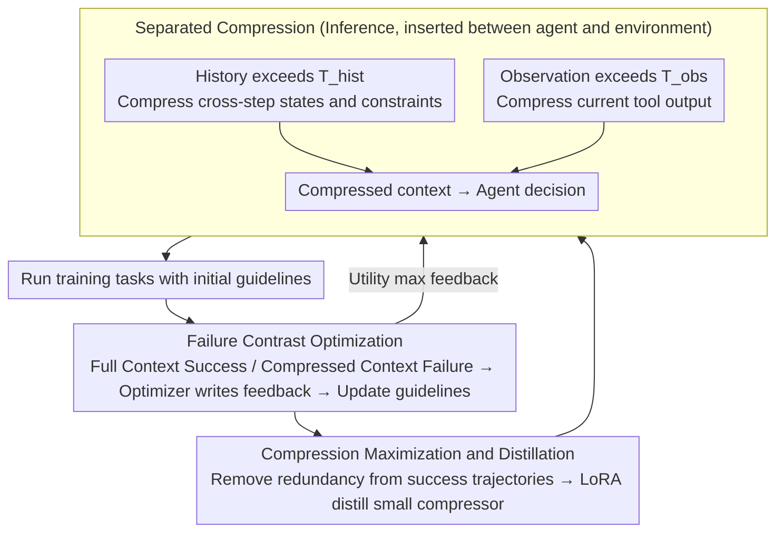

# ACON: Optimizing Context Compression for Long-horizon LLM Agents

**Conference**: ICML2026  
**arXiv**: [2510.00615](https://arxiv.org/abs/2510.00615)  
**Code**: https://github.com/microsoft/acon  
**Area**: LLM Agent / Context Compression / Long-horizon Tasks  
**Keywords**: LLM Agent, Context Compression, Prompt Optimization, Trajectory Contrast, Compression Distillation  

## TL;DR
Acon optimizes natural language compression guidelines using trajectory failure contrast to compress both agent history and observation contexts. It reduces peak tokens by 26% to 54% on AppWorld, OfficeBench, and multi-objective QA while maintaining or improving success rates for long-horizon tasks.

## Background & Motivation
**Background**: LLM agents are deployed for multi-step tasks such as office automation, application operation, and search-based QA. Unlike single-turn QA, agents must continuously store observations, actions, tool outputs, and intermediate states, as each subsequent decision depends on this interaction history.

**Limitations of Prior Work**: The context of long-horizon agents grows continuously, leading to two problems. First, Transformer inference and KV cache costs scale with context length, making memory and latency uncontrollable. Second, as outdated or irrelevant information accumulates in long contexts, models—especially smaller ones—become easily distracted by noise, significantly reducing task success rates.

**Key Challenge**: Context compression must be both aggressive and precise. Simple truncation or generic summarization can easily lose critical states such as file paths, API parameters, account statuses, or constraints in tool returns. Conversely, retaining too much information fails to reduce costs. Furthermore, many proprietary LLMs cannot undergo gradient updates, and RL-based compression strategies require expensive rollouts.

**Goal**: The authors aim to construct a model-agnostic compression framework that automatically learns compression rules for different environments without modifying agent weights. The goal is to produce compressed contexts that are short yet preserve necessary states while distilling the compressor into small models to minimize overhead.

**Key Insight**: The paper observes that compression failures leave strong diagnostic signals at the trajectory level. If a task succeeds with full context but fails with compressed context, it indicates the compressor missed critical states. Presenting this contrast to an LLM for analysis generates natural language feedback used to update compression prompts.

**Core Idea**: Instead of fine-tuning the agent, the compression guidelines for "what to keep and what to delete" are iteratively optimized in natural language space, followed by distilling a small-scale compressor from successful trajectories.

## Method
Acon serves as a context management layer between the agent and the environment. The agent still makes decisions using standard ReAct or benchmark-specified tool formats. Acon invokes the compressor only when the history or observation exceeds a threshold, rewriting long text into shorter, high-density state summaries. The key is not a manually written summary prompt, but the automatic improvement of that prompt using success/failure trajectories from training tasks.

### Overall Architecture
The input consists of a long-horizon agent benchmark, a fixed agent LLM, a fixed system prompt, and a set of training tasks. At each timestep, the agent receives the history $h_{t-1}$ and the latest observation $o_t$. If the history length exceeds threshold $T_{hist}$, Acon uses compressor $f(h_t;\phi,P_{hist})$ to generate a compressed history; if the observation exceeds threshold $T_{obs}$, it uses $f(o_t,h_{t-1};\phi,P_{obs})$ to generate a compressed observation. The compressed context replaces the original for the next decision step.

During training, tasks are initially run with default guidelines to collect a "contrastive subset" where the full context succeeded but the compressed context failed. An optimizer LLM analyzes the original context, the compressed version, and the failure signal to identify what was missing. An update prompt then aggregates feedback to refine the guidelines. The first stage, "utility maximization," focuses on success rates. The second stage, "compression maximization," analyzes successful trajectories to identify information that can be further removed. Finally, the optimized large-model compressor generates input-output pairs to fine-tune small models like Qwen3/Phi via LoRA.

### Key Designs
1.  **Separated Compression of History and Observation: Managing Two Sources of Context Bloat**
    Context explosion in long-horizon agents stems from two sources: historical growth over steps and large single-step tool returns (e.g., large tables, long emails). Acon uses two separate paths rather than a single summary prompt. History compression $f(h_t;\phi,P_{hist})$ is triggered at $T_{hist}$, focusing on cross-step states and future constraints. Observation compression $f(o_t,h_{t-1};\phi,P_{obs})$ is triggered at $T_{obs}$, focusing on relevant fields within tool returns while referencing history for context. Using independent guidelines specifically tailored to each source outperforms generic prompting and allows for behavior tuning per environment.

2.  **Failure Contrast-based Guideline Optimization: Translating Sparse Signals into Feedback**
    Manual refinement of compression rules is difficult, and RL optimization is often infeasible for API-based models. Acon leverages the contrast between a success (full context) and a failure (compressed context) to pinpoint errors. The optimizer LLM compares the original context $H$ with the compressed version $H'$, explicitly identifying missing information. Multiple natural language feedbacks are then synthesized into a new guideline $P^{(1)}$. This optimization occurs in the natural language space, making it compatible with any agent model and more actionable than sparse reward signals.

3.  **Compression Maximization and Distillation: Accuracy First, Efficiency Second**
    Solely pursuing success creates conservative summaries with high token counts, while pursuing brevity risks losing states. Acon decouples these into utility maximization (ensuring critical states are kept) and compression maximization (removing redundant descriptions from successful trajectories). Finally, a distillation step uses the optimized large model to generate $(x,y)$ pairs for training (History: $x=h_t, y=h'_t$; Observation: $x=(h_{t-1}, o_t), y=o'_t$). These pairs are used to fine-tune small models like Qwen3/Phi via LoRA to minimize inference overhead.

### Loss & Training
The objective is formulated as $\max_\psi E[R(s_T(\psi))]-\lambda E[C(H'(\psi))]$, where $R$ is the task reward and $C$ is the context cost. Optimization uses textual feedback rather than gradient updates for the guidelines. In the distillation stage, a standard next-token cross-entropy loss is used for the student model based on teacher outputs.

## Key Experimental Results

### Main Results
Experiments were conducted on AppWorld, OfficeBench, and 8-objective QA. Representative data highlights the tradeoff between performance and peak tokens.

| Benchmark / Setting | Method | Task Metric | Steps | Peak tokens | Dependency | Description |
|------------------|------|----------|-------|-------------|------------|------|
| AppWorld / history / gpt-4.1 | No compression | 56.0 Acc | 16.14 | 9.93K | 5.96M | Full context upper bound, high cost |
| AppWorld / history / gpt-4.1 | Prompting | 43.5 Acc | 24.01 | 6.93K | 5.29M | Generic compression drops success rate |
| AppWorld / history / gpt-4.1 | Acon UT | 51.2 Acc | 20.92 | 7.17K | 4.49M | Better stability on medium tasks |
| AppWorld / history / gpt-4.1 | Acon UT+CO | 56.5 Acc | 22.82 | 7.33K | 4.69M | Matches/exceeds full context, peak tokens -26% |
| AppWorld / observation / gpt-4.1 | Prompting | 42.3 Acc | 17.38 | 6.58K | 4.09M | Baseline observation loses key info |
| AppWorld / observation / gpt-4.1 | Acon UT+CO | 53.6 Acc | 18.12 | 7.43K | 4.93M | Higher success rate than baseline compression |

On OfficeBench and 8-objective QA, Acon improves the accuracy/efficiency tradeoff.

| Benchmark | Method Category | Main Result | Conclusion |
|-----------|----------|----------|----------|
| OfficeBench | History compression | Peak context reduced by ~30%, Acc > 74% | Utility maximization (UT) is stable for precise office tasks |
| 8-objective QA | History compression | Surpasses no compression in EM/F1; peak tokens -54.5% | Removing redundancy improves focus in retrieval QA |
| Small Agent Qwen3-14B | Distilled compressor | AppWorld 25.6% → 33.9%, 8-obj QA EM 0.158 → 0.23 | Compression mitigates long-context interference for small models |
| Compressor Cost | Distillation | Costs drop from $0.045 to $0.014 or $0.0004 | Distillation significantly reduces overhead |

### Ablation Study
The study analyzes compression thresholds, prompt optimizers, and API/latency costs.

| Ablation Dimension | Configuration | AppWorld Avg Acc | Conclusion |
|----------|------|-------------------|------|
| Prompt optimizer | o3 + contrastive feedback | 51.2 | Optimal setting |
| Prompt optimizer | o3, no contrastive | 50.6 (-0.6) | Failure-only is less effective than contrastive |
| Prompt optimizer | gpt-4.1 + contrastive | 47.6 (-3.6) | Weaker optimizer reduces guideline quality |

| Efficiency Setting | API cost / task | Latency / task | Description |
|--------------|-----------------|----------------|------|
| No Compression | $0.331 | 73.24s | High token cost, no compressor latency |
| Acon history | $0.285 | 87.68s | Lower API cost, but compression adds latency |
| Acon observation | $0.272 | 101.92s | Lowest cost, highest latency |

### Key Findings
- Acon's primary benefit is making the context "task-specific." For long trajectories in AppWorld, where standard compression fails, Acon preserves critical states.
- Utility maximization (UT) and Compression maximization (CO) offer an adjustable tradeoff. UT+CO works well for redundant environments like AppWorld, while UT is safer for sensitive tasks like OfficeBench.
- Small models benefit significantly. Compressed trajectories remove distractors, allowing models like Qwen3-14B to achieve better decision-making in long-horizon tasks.

## Highlights & Insights
- The transition from manual rules to optimized compression guidelines based on true agent failure signals is a significant improvement over generic summarization.
- The failure contrast design is highly practical; the difference between a successful long context and a failed compressed context provides clear error localization for the optimizer LLM.
- Acon is model-agnostic. It does not require access to model weights, making it viable for proprietary API-based agents.
- Compression acts as a "denoiser." The fact that Acon occasionally outperforms full-context baselines suggests that preserving only relevant states is sometimes better than preserving all information.

## Limitations & Future Work
- Acon relies on task rollouts to collect data, which depends on reproducible benchmarks.
- Compression introduces additional latency. Even if API costs drop, real-time systems may require asynchronous compression or smaller compressors to minimize wall-clock time.
- Optimization depends on strong LLMs as optimizers. The drop in performance when using weaker models like gpt-4.1 instead of o3 indicates a bottleneck in optimizer quality.
- Current experiments are text-heavy; future work should cover multi-modal agents, browser GUIs, and large codebases.

## Related Work & Insights
- **vs FIFO / Retrieval**: FIFO lacks environmental state knowledge, and Retrieval relies purely on similarity; Acon learns what must be kept via failure signals.
- **vs LLMLingua / generic prompting**: These focus on text compression rather than agent action consequences; Acon is optimized for trajectory outcomes.
- **vs KV cache compression**: Acon operates at the semantic level (text), while KV compression operates at the mechanism level (cache). They are complementary.

## Rating
- Novelty: ⭐⭐⭐⭐☆ Contrastive guideline optimization addresses long-horizon agent pain points effectively.
- Experimental Thoroughness: ⭐⭐⭐⭐☆ Covers three benchmarks, two types of compression, and distillation.
- Writing Quality: ⭐⭐⭐⭐☆ Clear structure; rich appendix.
- Value: ⭐⭐⭐⭐⭐ Direct utility for deployment costs and small-model performance in long-horizon tasks.

<!-- RELATED:START -->

## Related Papers

- [\[ACL 2026\] OCR-Memory: Optical Context Retrieval for Long-Horizon Agent Memory](../../ACL2026/llm_agent/ocr-memory_optical_context_retrieval_for_long-horizon_agent_memory.md)
- [\[ICLR 2026\] Solving the Granularity Mismatch: Hierarchical Preference Learning for Long-Horizon LLM Agents](../../ICLR2026/llm_agent/solving_the_granularity_mismatch_hierarchical_preference_learning_for_long-horiz.md)
- [\[ICLR 2026\] Harnessing Uncertainty: Entropy-Modulated Policy Gradients for Long-Horizon LLM Agents](../../ICLR2026/llm_agent/harnessing_uncertainty_entropy-modulated_policy_gradients_for_long-horizon_llm_a.md)
- [\[AAAI 2026\] When Refusals Fail: Unstable Safety Mechanisms in Long-Context LLM Agents](../../AAAI2026/llm_agent/when_refusals_fail_unstable_safety_mechanisms_in_long-context_llm_agents.md)
- [\[ACL 2026\] TiMem: Temporal-Hierarchical Memory Consolidation for Long-Horizon Conversational Agents](../../ACL2026/llm_agent/timem_temporal-hierarchical_memory_consolidation_for_long-horizon_conversational.md)

<!-- RELATED:END -->
