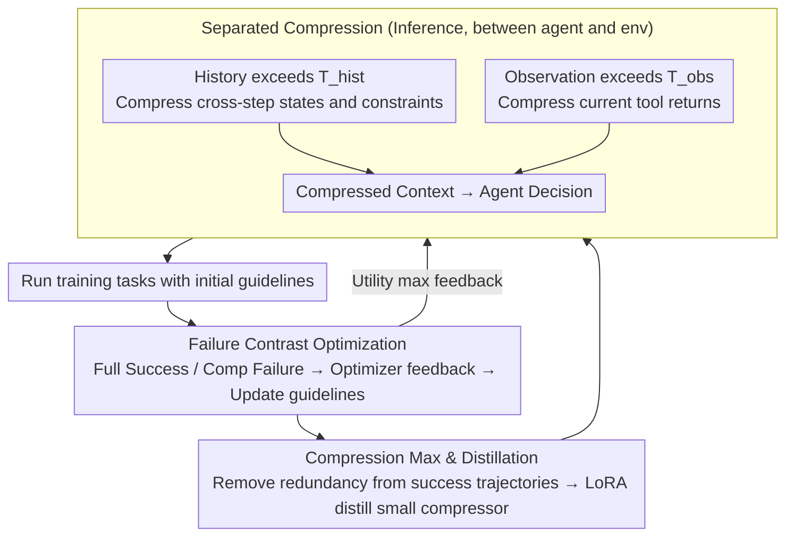

# ACON: Optimizing Context Compression for Long-horizon LLM Agents

**Conference**: ICML2026  
**arXiv**: [2510.00615](https://arxiv.org/abs/2510.00615)  
**Code**: https://github.com/microsoft/acon  
**Area**: LLM Agent / Context Compression / Long-horizon Tasks  
**Keywords**: LLM Agent, Context Compression, Prompt Optimization, Trajectory Contrast, Compression Distillation  

## TL;DR
Acon utilizes failure trajectory contrast to optimize natural language compression guidelines, simultaneously compressing agent history and observation contexts. It reduces peak tokens by 26% to 54% on AppWorld, OfficeBench, and multi-objective QA while maintaining or improving success rates in long-horizon tasks.

## Background & Motivation
**Background**: LLM agents have been deployed for multi-step tasks such as office automation, application operations, and search-based QA. Unlike single-turn QA, agents must continuously preserve observations, actions, tool outputs, and intermediate states, as every subsequent decision depends on this interaction history.

**Limitations of Prior Work**: The context of long-horizon agents grows continuously, leading to two primary issues. First, Transformer inference and KV cache costs increase with context length, leading to uncontrollable memory usage and latency. Second, as a large amount of obsolete or irrelevant information accumulates in long contexts, models are more easily distracted by noise, which significantly degrades task success rates, particularly for smaller models.

**Key Challenge**: Context compression must be both "aggressive" and "accurate." If it only involves truncation or generic summarization, critical states like file paths, API parameters, account statuses, and constraints in tool returns are easily lost. Conversely, if too much is retained, costs remain high. Furthermore, many proprietary LLMs cannot undergo gradient updates, and RL-based compression strategies require expensive rollouts.

**Goal**: The authors aim to construct a model-agnostic compression framework that automatically learns compression rules for different environments without modifying agent weights. The goal is to produce compressed contexts that are short yet retain the states necessary for task completion, with the ability to distill the compressor into smaller models to reduce overhead.

**Key Insight**: The paper observes that compression failures leave strong diagnostic signals at the trajectory level: if a task succeeds with full context but fails with compressed context, it indicates the compressor missed critical states. Entrusting this contrast between contexts to an LLM for analysis generates natural language feedback, which can be used to update the compression prompt.

**Core Idea**: Instead of fine-tuning the agent, the method iteratively optimizes natural language "compression guidelines" (specifying what to keep and what to delete) and then distills successful trajectories into a small-scale compressor.

## Method
Acon can be viewed as a context management layer inserted between the agent and the environment. The agent still makes decisions using original ReAct or benchmark-specified tool formats. Acon calls the compressor only when the history or observation exceeds a threshold, rewriting long text into shorter, higher-density state summaries. The key is not a hand-written generic summary prompt, but rather the automatic improvement of this prompt using success/failure trajectories from training tasks.

### Overall Architecture
The input consists of a long-horizon agent benchmark, a fixed agent LLM, a fixed system prompt, and a batch of training tasks. At each time step, the agent sees history $h_{t-1}$ and the latest observation $o_t$. If the history length exceeds threshold $T_{hist}$, Acon uses the compressor $f(h_t;\phi,P_{hist})$ to generate a compressed history. If the observation exceeds threshold $T_{obs}$, it uses $f(o_t,h_{t-1};\phi,P_{obs})$ to generate a compressed observation. The compressed context replaces the original for the next decision step.

The training phase begins by running tasks with initial compression guidelines to collect a "contrastive subset" (success with full context, failure with compressed context). The optimizer LLM reads the original context, compressed context, and failure information to identify what was missed and which states should have been preserved. Subsequently, another update prompt aggregates multiple feedbacks to update the compression guidelines. The first round focuses on maximizing task success (Utility Maximization); the second round analyzes only successful compressed trajectories to identify redundant information, further shortening the context (Compression Maximization). Finally, the authors use the optimized large-model compressor to generate input-output pairs to fine-tune small models like Qwen3/Phi via LoRA.

### Key Designs
1. **Separated history and observation compression: Treating two types of expansion differently**
   Token explosion in long-horizon agents stems from two sources: historical growth over steps and large single-step tool returns (e.g., large tables, long emails). Acon separates these into two triggers rather than using a generic summary prompt. History compression $f(h_t;\phi,P_{hist})$ focuses on cross-step states and future constraints when history exceeds $T_{hist}$. Observation compression $f(o_t,h_{t-1};\phi,P_{obs})$ focuses on valid fields in the current tool return, referencing history to judge relevance, when $T_{obs}$ is exceeded. Two independently optimized sets of guidelines fit the task structure better than a single prompt.

2. **Failure-contrast guided prompt optimization: Translating sparse success/failure signals into readable feedback**
   Determining what to "keep or delete" is difficult to hand-write, and RL optimization requires massive rollouts and cannot be used for proprietary APIs. Acon's key observation is that the contrast between full-context success and compressed-context failure provides precise error localization. It collects this contrastive subset, allowing an optimizer LLM to compare full context $H$ and compressed version $H'$, explicitly stating missing information. Multiple natural language feedbacks are then aggregated into a new guideline $P^{(1)}$. This iteration in natural language space is applicable to any agent model.

3. **Compression maximization and compressor distillation: Prioritize accuracy, then length, then cost**
   Pursuing only success leads to conservative summaries (high token count); pursuing only brevity loses states. Acon splits the goal: Utility Maximization ensures critical states are kept to maintain success rates, while Compression Maximization analyzes successful trajectories to delete redundant descriptions. This decouples reward and cost. Finally, distillation uses the large model compressor to produce $(x,y)$ training pairs (History: $x=h_t, y=h'_t$; Observation: $x=(h_{t-1},o_t), y=o'_t$) to fine-tune small models like Qwen3/Phi via LoRA, avoiding expensive API calls.

### Loss & Training
The objective is expressed as $\max_\psi E[R(s_T(\psi))]-\lambda E[C(H'(\psi))]$, where $R$ is the task completion reward and $C$ is the dynamic context cost. Optimization does not involve gradient updates to the LLM weights but uses text feedback to update compression guidelines. During distillation, a teacher compressor generates $(x,y)$ pairs for standard next-token cross-entropy training of the student model.

## Key Experimental Results

### Main Results
Results cover AppWorld, OfficeBench, and 8-objective QA. The following table highlights the trade-off between task performance and peak tokens.

| Benchmark / Setting | Method | Task Metric | Steps | Peak tokens | Dependency | Note |
|------------------|------|----------|-------|-------------|------------|------|
| AppWorld / history / gpt-4.1 | No compression | 56.0 Acc | 16.14 | 9.93K | 5.96M | Full context upper bound, highest cost |
| AppWorld / history / gpt-4.1 | Prompting | 43.5 Acc | 24.01 | 6.93K | 5.29M | Basic compression drops success rate |
| AppWorld / history / gpt-4.1 | Acon UT | 51.2 Acc | 20.92 | 7.17K | 4.49M | Token reduction with stability in medium tasks |
| AppWorld / history / gpt-4.1 | Acon UT+CO | 56.5 Acc | 22.82 | 7.33K | 4.69M | Meets/exceeds full context, ~26% peak token reduction |
| AppWorld / observation / gpt-4.1 | Prompting | 42.3 Acc | 17.38 | 6.58K | 4.09M | Basic observation compression loses info |
| AppWorld / observation / gpt-4.1 | Acon UT+CO | 53.6 Acc | 18.12 | 7.43K | 4.93M | Higher success than baseline compression |

On OfficeBench and 8-objective QA, Acon similarly improves the accuracy/efficiency trade-off.

| Benchmark | Method Category | Main Result | Conclusion |
|-----------|----------|----------|----------|
| OfficeBench | history compression | Acon reduces peak context by ~30%, maintains Acc > 74% | Office tasks need precision; UT is more stable than over-compression |
| 8-objective QA | history compression | Acon exceeds no compression in EM/F1; Peak tokens/Dependency drop by 54.5%/61.5% | Removing redundancy improves factual focus in QA |
| Small agent Qwen3-14B | distilled compressor + compressed trajectories | AppWorld: 25.6% → 33.9%; 8-objective QA EM: 0.158 → 0.23 | Compression mitigates long-context interference for small models |
| Compressor Cost | gpt-4.1-mini / Qwen3-14B distill | Cost dropped from $0.045 (gpt-4.1) to $0.014 or $0.0004 | Distillation significantly reduces compression overhead |

### Ablation Study
The paper analyzes compression thresholds, prompt optimizers, and actual API/latency costs.

| Ablation Dimension | Config | AppWorld Avg Acc | Conclusion |
|----------|------|-------------------|------|
| Prompt optimizer | o3 + contrastive feedback | 51.2 | Default setting is best |
| Prompt optimizer | o3, no contrastive | 50.6 (-0.6) | Using only failure trajectories is inferior to contrastive feedback |
| Prompt optimizer | gpt-4.1 + contrastive | 47.6 (-3.6) | Weaker optimizer models work but reduce guideline quality |
| Prompt optimizer | gpt-5 + contrastive | 50.6 (-0.6) | Model strength matters less than the presence of contrastive feedback |

| Real Efficiency Setting | API cost / task | Latency / task | Note |
|--------------|-----------------|----------------|------|
| No Compression | $0.331 | 73.24s | High token cost, no compressor overhead |
| Acon history | $0.285 | 87.68s | Lower API cost, but compression adds latency |
| Acon observation | $0.272 | 101.92s | Lowest cost, highest latency |

| Threshold Analysis | Observation | Insight |
|----------|------|------|
| Threshold too low | Fewer tokens, but frequent calls and lower accuracy | Premature compression rewrites useful information |
| Threshold too high | Accuracy near no-compression, but high cost | Insufficient compression gain |
| Medium threshold | history 4096, observation 1024 works best | Optimal default deployment trade-off |

### Key Findings
- Acon's primary benefit is making the context more "task-relevant" rather than just saving tokens. In long trajectories (AppWorld hard/medium), normal compression fails whereas Acon preserves critical states.
- UT and CO are selectable trade-offs. Environments with redundant tool outputs (AppWorld) benefit from UT+CO; detail-sensitive tasks (OfficeBench/QA) favor UT.
- Compressors can be "miniaturized." Distilled small models retain over 95% of teacher performance, making compression costs negligible, though some latency remains.
- Small agents benefit significantly. Compressed trajectories reduce distractors, enabling models like Qwen3-14B to make correct decisions in long-horizon contexts.

## Highlights & Insights
- This paper transforms "compression prompt writing" from manual rules into an optimizable process using signals from real agent failures.
- The failure-contrast design is practical. The difference between success (full) and failure (compressed) acts as precise error localization for the compressor.
- Acon is model-agnostic. It does not require access to agent weights, making it realistic for proprietary API LLMs and deployed systems.
- Compression serves as "denoising." Some compressed settings outperform the full context, suggesting that more information is not always better for reasoning.

## Limitations & Future Work
- Acon requires training rollouts to collect contrastive data, which depends on benchmarks or reproducible environments.
- Compression introduces additional latency. Real-time systems may prioritize wall-clock latency over API costs, necessitating asynchronous compression or smaller models.
- Guideline optimization relies on strong LLMs as optimizers. The performance drop with gpt-4.1 vs o3 suggests optimizer quality is a bottleneck.
- Currently covers text-based tools; yet to be tested on multi-modal agents, browser GUIs, or massive codebases.
- Compression errors are difficult to eliminate entirely. In high-fidelity tasks, CO might delete subtle facts, requiring task-specific tuning of compression strategies.

## Related Work & Insights
- **vs FIFO / Retrieval**: FIFO captures only recent history, and Retrieval grabs fragments by similarity; both lack knowledge of "environmental states." Acon learns this via failure contrast.
- **vs LLMLingua / generic prompting**: These methods compress text but do not understand action consequences or future dependencies. Acon optimizes for trajectory failures.
- **vs ReSum / RL-based agent compression**: These often optimize the agent or policy model. Acon does not update agent weights, fitting closed-source API agents.
- **vs KV cache compression**: KV compression operates on the attention cache level. Acon operates on semantic text; the two are complementary.

## Rating
- Novelty: ⭐⭐⭐⭐☆ Optimizing natural language compression guidelines via trajectory contrast addresses real long-horizon agent pain points.
- Experimental Thoroughness: ⭐⭐⭐⭐☆ Covers three benchmarks, two types of compression, distillation, and cost; could expand more into open environments.
- Writing Quality: ⭐⭐⭐⭐☆ Clear problem statement and methods, though some optimization flow descriptions are dense.
- Value: ⭐⭐⭐⭐⭐ Directly useful for reducing deployment costs, context interference, and improving small model utility for long-horizon agents.

<!-- RELATED:START -->

## Related Papers

- [\[ACL 2026\] OCR-Memory: Optical Context Retrieval for Long-Horizon Agent Memory](../../ACL2026/llm_agent/ocr-memory_optical_context_retrieval_for_long-horizon_agent_memory.md)
- [\[ICLR 2026\] AgentFold: Long-Horizon Web Agents with Proactive Context Folding](../../ICLR2026/llm_agent/agentfold_long-horizon_web_agents_with_proactive_context_folding.md)
- [\[ICLR 2026\] Solving the Granularity Mismatch: Hierarchical Preference Learning for Long-Horizon LLM Agents](../../ICLR2026/llm_agent/solving_the_granularity_mismatch_hierarchical_preference_learning_for_long-horiz.md)
- [\[ICLR 2026\] Harnessing Uncertainty: Entropy-Modulated Policy Gradients for Long-Horizon LLM Agents](../../ICLR2026/llm_agent/harnessing_uncertainty_entropy-modulated_policy_gradients_for_long-horizon_llm_a.md)
- [\[AAAI 2026\] When Refusals Fail: Unstable Safety Mechanisms in Long-Context LLM Agents](../../AAAI2026/llm_agent/when_refusals_fail_unstable_safety_mechanisms_in_long-context_llm_agents.md)

<!-- RELATED:END -->
