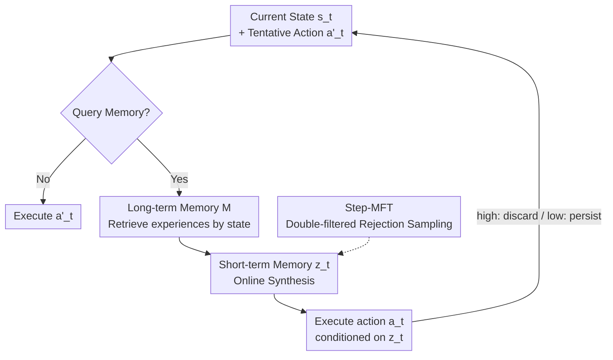

# AdaMEM: Test-Time Adaptive Memory for Language Agents

**Conference**: ICML 2026  
**arXiv**: [2606.05684](https://arxiv.org/abs/2606.05684)  
**Code**: https://github.com/yunx-z/AdaMEM  
**Area**: Agent  
**Keywords**: Language Agents, Test-Time Adaptation, Agent Memory, Strategy Synthesis, Rejection Sampling Fine-Tuning  

## TL;DR
AdaMEM decouples agent memory into two layers: "offline long-term trajectory memory" and "online synthesized short-term strategy memory." This allows agents to dynamically refresh guidance strategies based on current states during long-horizon tasks. Coupled with Step-MFT—a fine-tuning technique that preserves only strategies that "actually change actions"—it achieves relative gains of 13–17% over static memory baselines on ALFWorld, WebShop, and HotpotQA.

## Background & Motivation
**Background**: Enabling language agents to learn from past experiences and adapt to new situations is a long-term goal. Current mainstream approaches favor *training-free* prompt adaptation—retrieving past successful trajectories to insert into system prompts as in-context examples, such as Synapse (retrieving raw trajectories) and ReasoningBank (distilling trajectories into high-level strategies offline).

**Limitations of Prior Work**: These systems almost exclusively retrieve memory only at the **onset of an episode** ($t=0$). Once retrieved, the agent is locked into this "initial guidance" throughout the long-horizon task. However, initial states often contain minimal information (e.g., an empty search page in WebShop), leading to noisy retrievals. As the task progresses and sub-goals shift, this static guidance becomes increasingly irrelevant with no mechanism for correction. Empirical results show "negative transfer": Synapse and ReasoningBank actually perform 6.0 and 2.8 points lower than the memory-less ReAct on WebShop.

**Key Challenge**: The "storage" and "abstraction" of memory are coupled—either storing raw trajectories (comprehensive but verbose, causing context explosion) or distilling them offline into fixed strategies (concise but rigid, failing to adapt to test-time states). Neither provide fresh, specific guidance within an episode based on the current step.

**Goal**: Split the problem into two parts: (1) How to break the rigidity of "one-time static retrieval" to allow continuous adaptation during inference? (2) How to efficiently train models to synthesize strategies that truly drive decision-making?

**Core Idea**: Decouple storage from abstraction. Long-term memory serves as an offline repository for raw successful trajectories. Short-term memory **synthesizes brief natural language strategies on-the-fly** based on the current state to guide the next action. Additionally, the "change in action" is used as a zero-cost step-level signal to fine-tune strategy generation.

## Method

### Overall Architecture
The core of AdaMEM is a **non-parametric adaptive mechanism**: the agent maintains a static pool of raw experiences $\mathcal{M}$ but generates a state-dependent strategy $z_t$ at critical decision steps without updating model parameters. The decision flow is: Current state $s_t$ → (Agent generates a tentative action $a'_t$ and decides whether to query memory) → If yes, retrieve similar experiences $\mathcal{E}_{\text{ret}}$ from long-term memory using $s_t$ → Synthesize these into a short-term strategy $z_t$ online → Generate the refined actual action $a_t$ conditioned on $z_t$.

This mechanism consists of two memory layers, two inference modes, and an optional fine-tuning technique.

### Key Designs

**1. Long-term Trajectory Memory $\mathcal{M}$: Offline Raw Successes, Dense Retrieval**

To address the rigidity of offline distilled strategies, AdaMEM stores **raw trajectories instead of distilled policies**, postponing "abstraction" until test-time. A trajectory is defined as $\tau=\{(s_1,a_1,r_1),\dots,(s_T,a_T,r_T)\}$. Since language agent tasks often have sparse rewards, $\mathcal{M}$ only collects **successful** ($r_T=1$) trajectories. To support dense retrieval, every step $t$ in a successful trajectory is stored as a key-value pair:

$$k_i=\phi(s_t),\quad v_i=(s_t,a_t,\tau_{t+1:T})$$

The key is the state embedding $\phi(s_t)$, and the value includes the current state, action, and the **entire subsequent trajectory leading to success** $\tau_{t+1:T}$. This provides empirical demonstrations of how successful decisions unfolded from similar historical states. This decoupling also allows the long-term memory to be constructed by different models, supporting cross-model generalization (e.g., a Gemma agent using a Qwen-generated memory bank).

**2. Short-term Strategic Memory $z_t$: Online, State-Aware One-time Guidance**

Retrieving raw trajectories is insufficient, as feeding verbose logs directly into the policy consumes context and lacks alignment with the current step. AdaMEM synthesizes retrieved experiences into a concise natural language strategy $z_t$ specifically for the next action. Unlike ReasoningBank's offline strategies, $z_t$ is **generated online and explicitly conditioned on the current state $s_t$**, ensuring guidance fits the dynamic environment. Ablations prove this abstraction is vital: removing $z_t$ and feeding raw logs directly drops success rates on ALFWorld from 65.5% to 59.3%, despite reducing tokens per step.

**3. Adaptive Intensity: AdaMEM-high vs. AdaMEM-low**

The strategy "lifespan" serves as a knob for "freshness vs. token cost." **AdaMEM-high** (High adaptation) re-evaluates at every step: it produces a tentative action $a'_t$ and a retrieval decision $d_{\text{mem}}$; if "yes," it retrieves and synthesizes a new $z_t \sim \pi_\theta(z \mid s_t, \mathcal{E}_{\text{ret}})$, then generates $a_t$. $z_t$ is **discarded from context immediately** after use. **AdaMEM-low** (Low adaptation) treats $z_t$ as a **persistent state variable** $z_{\text{curr}}$ cached in context across steps. It only refreshes when a significant distribution shift is detected ($d_{\text{refresh}}$). This establishes a scaling dimension for agent memory where higher test-time computation (refresh frequency) yields monotonic performance gains.

**4. Step-MFT: Learning only "Action-Changing" Strategies**

Standard outcome-oriented filtering (treating all strategies in a successful trajectory as positive) is too coarse. The paper defines **Strategy Advantage** as the difference in success probability with and without a strategy:

$$A(s,z)=V^{\pi_{\text{mem}}}(s)-V^{\pi_{\text{base}}}(s)$$

Under greedy decoding, $A(s,z)=Q(s,a_t)-Q(s,a'_t)$. Proposition 3.1 demonstrates that **if a strategy does not change the action ($a_t=a'_t$), the advantage is zero**. Thus, "action change" is a **necessary condition** for positive strategy advantage. Step-MFT uses this as a zero-cost proxy for rejection sampling: (1) The trajectory must succeed ($r=1$); (2) The strategy must have changed the agent's action ($a_t \neq a'_t$). The filtered "silver" strategies $z^*$ are trained via standard SFT:

$$\mathcal{L}_{\text{SFT}}=-\mathbb{E}_{(s,\mathcal{E},z^*)\sim\mathcal{D}^*}\big[\log\pi_\theta(z^*\mid s,\mathcal{E})\big]$$

This filter prioritizes precision, ensuring that the model learns strategies that actually drive successful decisions.

### Core Idea in Action
In WebShop, static methods retrieve once at the start ($S_0$, the homepage), which lacks information and leads to noisy guidance throughout the episode. AdaMEM-low waits until the agent reaches an informative **Search Results** page to trigger a refresh. It then retrieves relevant experiences and synthesizes a strategy $z_{\text{curr}}$ (e.g., focusing on specific attributes or price ranges), flipping the previous -6.0 negative transfer into a +2.8 gain.

## Key Experimental Results

### Main Results
Evaluation on ALFWorld (Embodied), WebShop (E-commerce), and HotpotQA (Multi-hop QA). Baselines: Qwen-based models. Results for the training-free setting (AdaMEM-low):

| Memory Mechanism | ALFWorld seen | ALFWorld unseen | WebShop |
|--------|------|------|------|
| No Memory (ReAct) | 45.2 | 46.8 | 71.4 |
| ReasoningBank (Offline) | 49.3 | 51.2 | 68.6 |
| Synapse (Raw) | 52.1 | 52.2 | 65.4 |
| **AdaMEM-low** | **54.0** | **58.2** | **74.2** |

The gains are most significant in unseen generalization scenarios: AdaMEM outperforms No Memory by +11.4 points and the strongest static method (Synapse) by +6.0 points **without any training**.

### Ablation Study
On ALFWorld (seen), using AdaMEM-max (per-step refresh):

| Configuration | Success Rate | Tokens/Step | Description |
|------|---------|------|------|
| Full AdaMEM-max | 65.5 | 6.0K | Long-term + Short-term Abstraction |
| w/o Short-term Strategy | 59.3 | 3.8K | Raw logs only; 6.2 point drop |

Step-MFT Filtering Comparison: On WebShop, filtering by Outcome only dropped AdaMEM-high from 76.1 to 73.9. Adding the "Action Change" filter (Step-MFT) yielded a stable +1.3 improvement.

### Key Findings
- **Short-term strategy abstraction is critical**: Removing it saves tokens but costs 6.2 points. As retrieval budget $k$ increases, AdaMEM improves monotonically, whereas Synapse degrades due to context overflow.
- **Dynamic timing corrects negative transfer**: Static methods fail on WebShop due to initial noisy retrieval; AdaMEM flips this loss to a gain by triggering retrieval mid-episode.
- **Outcome-only filtering is harmful**: Naive outcome filtering includes ineffective strategies; the "action change" signal is necessary for credit assignment.
- **Efficiency**: Synthesizing short strategies instead of processing long logs makes AdaMEM inference 16% faster than Synapse, creating a better Pareto frontier for performance vs. tokens.

## Highlights & Insights
- **Decoupling Storage and Abstraction**: Retaining raw trajectories ensures no information loss, while test-time abstraction ensures adaptability. It also enables off-policy memory sharing across different model families.
- **Action Change as Proxy for Advantage**: Using "did the action change?" as a proxy for process-level credit is a clean, zero-cost alternative to expensive MCTS rollouts or PRMs.
- **Memory Refresh as a Scaling Dimension**: AdaMEM introduces a "test-time compute scaling" perspective to agent memory, where increasing the refresh frequency yields predictable performance gains.

## Limitations & Future Work
- **Success Bias**: Long-term memory only collects successful trajectories ($r_T=1$), ignoring "what to avoid" in failed trajectories. Tasks with extremely low base success rates may lack enough data to populate the memory.
- **Conservative Proxy**: Step-MFT might ignore useful strategies that simply "confirm" the correct action without changing it.
- **Decision Training**: The decision of *when* to refresh currently relies on prompting rather than explicit training.
- **Modality**: Currently text-only; does not yet handle noise in multi-modal or real-world embodied environments.

## Related Work & Insights
- **vs Synapse**: Both use raw trajectories, but Synapse stores them in the context once at the start. Increasing $k$ in Synapse leads to context overflow and noise. AdaMEM compresses experiences into strategies and refreshes them dynamically.
- **vs ReasoningBank**: ReasoningBank is a "static special case" of AdaMEM; its strategies are pre-generated offline and retrieval is limited to the start of the episode. AdaMEM allows online synthesis and mid-episode correction.
- **Inter- vs Intra-episode**: Unlike methods optimized for inter-episode transfer using RL, AdaMEM focuses on intra-episode correction—how to recover when initial priors fail during exploration.

## Rating
- Novelty: ⭐⭐⭐⭐⭐ (Decoupling + Action change proxy).
- Experimental Thoroughness: ⭐⭐⭐⭐ (Broad benchmarks and scaling analysis).
- Writing Quality: ⭐⭐⭐⭐⭐ (Logical flow from motivation to formal proposition).
- Value: ⭐⭐⭐⭐ (Practical for long-horizon agents and cross-model memory).

<!-- RELATED:START -->

## Related Papers

- [\[ICML 2026\] From Player to Master: Enhancing Test-Time Learning of LLM Agents via Reinforcement Learning over Memory](from_player_to_master_enhancing_test-time_learning_of_llm_agents_via_reinforceme.md)
- [\[NeurIPS 2025\] Agentic Plan Caching: Test-Time Memory for Fast and Cost-Efficient LLM Agents](../../NeurIPS2025/llm_agent/agentic_plan_caching_test-time_memory_for_fast_and_cost-efficient_llm_agents.md)
- [\[ACL 2026\] CLAG: Adaptive Memory Organization via Agent-Driven Clustering for Small Language Model Agents](../../ACL2026/llm_agent/clag_adaptive_memory_organization_via_agent-driven_clustering_for_small_language.md)
- [\[AAAI 2026\] Time, Identity and Consciousness in Language Model Agents](../../AAAI2026/llm_agent/time_identity_and_consciousness_in_language_model_agents.md)
- [\[NeurIPS 2025\] AgentTTS: Large Language Model Agent for Test-time Compute-optimal Scaling Strategy in Complex Tasks](../../NeurIPS2025/llm_agent/agenttts_large_language_model_agent_for_testtime_computeopti.md)

<!-- RELATED:END -->
