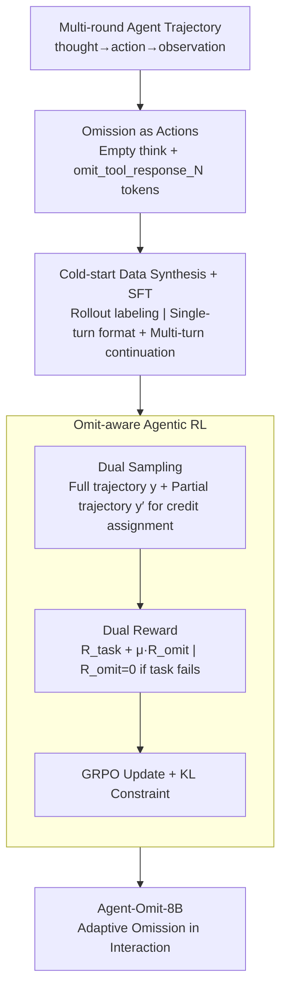

# Agent-Omit: Adaptive Context Omission for Efficient LLM Agents

**Conference**: ICML 2026  
**arXiv**: [2602.04284](https://arxiv.org/abs/2602.04284)  
**Code**: https://github.com/usail-hkust/Agent-Omit (Available)  
**Area**: LLM Agent / Efficient Inference / Agentic Reinforcement Learning  
**Keywords**: Context Management, Thought Omission, Observation Omission, GRPO, Dual Sampling

## TL;DR
By quantifying which turn-level thoughts and observations are omittable via Monte-Carlo rollouts, an 8B agent is trained using cold-start SFT and dual-sampling omit-aware GRPO. This agent adaptively skips redundant thoughts and observations, significantly reducing token usage across five benchmarks while maintaining accuracy comparable to seven state-of-the-art frontier models.

## Background & Motivation

**Background**: LLM agents solve tasks through multi-round thought $\rightarrow$ action $\rightarrow$ observation cycles (ReAct / agentic RL). Models like Kimi-K2 and DeepSeek-V3.2 have demonstrated strong capabilities in deep search, web shopping, embodied decision-making, and scientific discovery. However, multi-round interactions lead to increasingly long contexts and soaring token costs.

**Limitations of Prior Work**: Existing efficiency methods fall into three categories: compressing thoughts only (ToolLight, DEPO), pruning observations only (Observation-Mask, DeepMiner), or summarizing both (MEM-Agent, ReSum). These methods compress entire trajectories uniformly, ignoring the massive differences in contribution across different turns.

**Key Challenge**: The necessity of thoughts and observations is turn-dependent. Early high-level planning often determines multiple subsequent rounds, while most early observations become obsolete during final summarization. One-size-fits-all compression either erroneously deletes essential information (impacting accuracy) or retains useless tokens (impacting efficiency).

**Goal**: Two steps: (1) Quantitatively prove the feasibility of "turn-selective omission" through controlled intervention; (2) Train a policy capable of adaptively deciding which thoughts to skip and which historical observations to discard during interaction.

**Key Insight**: Model the omission behavior itself as part of the action space—thought outputs an empty string, and observations are explicitly deleted via special tokens like `<omit_tool_response_N>`. This allows omission to be learned naturally within SFT and RL frameworks.

**Core Idea**: Enable the agent to actively output "thought omission" and "observation omission" actions. Train using an omit-aware GRPO that couples "task reward" with "token savings" (while zeroing omission rewards if the task fails), supplemented by dual sampling to solve the credit assignment problem where omitted information is no longer visible.

## Method

### Overall Architecture
The objective is to address the token accumulation in thought $\rightarrow$ action $\rightarrow$ observation cycles where turn-level necessity varies. Agent-Omit elevates "what to save" from external post-processing to a first-order action. The training consists of two phases: cold-start SFT to initiate the omission format using Monte-Carlo rollout labels, followed by omit-aware GRPO with dual sampling and dual rewards to enable adaptive decision-making during interaction.

### Key Designs

**1. Upgrading Omission from Heuristics to Explicit Actions**

The motivation is that existing methods treat the entire trajectory uniformly, whereas necessity is turn-dependent. Controlled interventions on WebShop with Qwen3-8B—systematically removing thought $\tau_t$ or observation $o_t$ and observing completion—revealed that thoughts account for 45.1% and observations 52.2% of tokens, while actions only take 2.7%. Significant "grey areas" exist in intermediate rounds where accuracy remains stable despite token reduction. Omission is given a tokenizer-native interface: thought omission outputs empty `<think> </think>`, and observation omission utilizes `<omit_tool_response_N_...>` to mask historical observation sets $\Gamma \subseteq \{1,\dots,t-1\}$.

**2. Cold-start Data Synthesis: Rollout Labeling and Multi-stage SFT**

RL requires an initial ability to output omission symbols to sample positive instances. The authors perform forward rollouts on training trajectories to identify omittable turns—those where removal reduces tokens without decreasing accuracy. Two data layers are created: Single-Turn omission uses system prompts to teach the empty thought and omission commands (opening the format); Multi-Turn omission replaces all omittable segments in a trajectory with omission tokens, forcing the agent to maintain reasoning continuity despite missing context. Full-parameter SFT is conducted with loss: $\mathcal{L} = -\mathbb{E}_{(x,y)\sim \mathcal{D}_{single}\cup\mathcal{D}_{multi}}[\log \mathcal{P}_{\pi_\theta}(y\mid x)]$, with loss masking applied to environment observations.

**3. Omit-aware Agentic RL: Dual Sampling and Coupled Rewards**

Learning omission as a first-order decision presents a deadlock: once information is omitted, the agent cannot see it again, complicating credit assignment. Dual sampling addresses this: for each input, a full trajectory $y$ (executing omission) and several partial trajectories $y'$ (context before omission + current thought/action) are sampled. This allows the agent to observe counterfactual context to learn attribution. Rewards are split: task reward $R_{task}$ is given to both $y$ and $y'$; omit reward $R_{omit}=\mathrm{Tok}(\tau_{omitted})/\mathrm{Tok}(y) + \mathrm{Tok}(o_{omitted})/\mathrm{Tok}(y)$ is given only to the full trajectory and is forced to zero if $R_{task}=0$. This prevents "omission for the sake of omission" (collapse). The combined reward is $r(\cdot)=(1-\mu)R_{task}+\mu R_{omit}$ ($\mu=0.2$), $r'(\cdot)=R_{task}$, optimized via GRPO with KL constraint $-\beta \mathbb{D}_{KL}[\pi_\theta \| \pi_{ref}]$.

### Loss & Training
The SFT phase uses standard LM loss with observation masking. The RL optimization objective is:
$$\max_{\pi_\theta} \mathbb{E}_{x,\{y_i,\{y'_{i,j}\}\}}\big[\tfrac{1}{n}\sum_i \big(r(x,y_i) + \tfrac{1}{p(y_i)}\sum_j r'(x,y'_{i,j})\big)\big] - \beta \mathbb{D}_{KL}[\pi_\theta \| \pi_{ref}]$$
The base model is Qwen3-8B. Theoretically, under the semantic Lipschitz assumption, the bias in performance/efficiency is bounded by $\delta + K' \cdot \mathrm{KL}(\pi^\ast, \pi_\theta)$, meaning the policy can monotonically approach the optimal omission frontier as KL decreases.

## Key Experimental Results

### Main Results
Evaluated across five agent environments (DeepSearch, WebShop, TextCraft, BabyAI, SciWorld) against seven frontier LLMs (DeepSeek-R1-0528, DeepSeek-V3.2, o3/o4-mini, etc.) and seven efficient agent methods.

| Comparison | Pass@1 Accuracy | Token Cost | Notes |
|------------|-----------------|------------|-------|
| Agent-Omit-8B (Ours) | Comparable to 7 frontier LLMs | Significantly Lower | 8B model achieves parity using half or fewer tokens |
| Efficient Agent Methods (TM/OM/TOM) | Varies | Varies | Agent-Omit achieves best trade-off |
| Qwen3-8B (Base) | Baseline | Baseline | Baseline tokens: 45.1% thought + 52.2% observation |

### Ablation Study

| Configuration | Key Phenomenon | Interpretation |
|---------------|----------------|----------------|
| SFT Only (No RL) | Learns format but limited gain | RL is required for adaptive "when to omit" |
| No Dual Sampling | Omission policy struggles to converge | Partial trajectories are essential for credit assignment |
| No $R_{omit}$ | Behavior identical to vanilla agent | Lacks explicit efficiency incentive |
| Uncoupled $R_{omit}$ and $R_{task}$ | Reward hacking, accuracy drops | Coupled constraint "No $R_{omit}$ if task fails" is vital |
| Multi-turn Analysis | Adaptive omission of 3–4 rounds | Highest omission in intermediate turns, matching quantitative analysis |

### Key Findings
- Uniform compression methods (TM/OM/TOM) sacrifice either accuracy or tokens by ignoring turn differences; Agent-Omit reaches the optimal Pareto frontier.
- The "essential ends, omittable middle" pattern is consistent across all five environments, indicating cross-domain transferability of the omission policy.
- The theoretical KL bound aligns with training curves: the agent approaches the Monte-Carlo-labeled optimal frontier as GRPO progresses.
- Learning omission as a first-order action is more effective than post-hoc summarization because it leverages task-aware RL feedback.

## Highlights & Insights
- Shifting "context compression" from a static post-processing problem to "first-order decision-making" is a paradigm shift—the model itself decides what to save.
- Dual sampling solves the credit assignment deadlock for information deletion; this trick is reusable for any strategy learning involving "delete/merge" actions.
- Explicit token interfaces make omission fully compatible with existing LLM tokenizers/APIs, offering a low-cost integration path for production systems.
- Coupling task success to omission rewards is a simple yet critical reward shaping design that prevents efficiency-driven collapse.

## Limitations & Future Work
- Experiments focused on Qwen3-8B and text-based environments; scaling to 70B+ models, multimodal inputs, or ultra-long horizons (>20 turns) remains to be verified.
- Omission currently covers full thought removal or historical observation deletion; fine-grained "partial compression" (e.g., partial thought omission) is unexplored.
- Dual sampling significantly increases RL sampling costs, presenting a potential bottleneck for training 100B+ models.
- Theoretical analysis depends on semantic Lipschitz continuity; discrete reward responses to minor prompt changes may loosen the upper bound.

## Related Work & Insights
- **vs ToolLight / DEPO**: These perform token-level compression; Ours performs turn-level decision-making, which is more precise and RL-trainable.
- **vs Observation-Mask / DeepMiner**: These use fixed heuristic rules; Ours uses a learned strategy consistent across environments.
- **vs MEM-Agent / ReSum**: Summarization introduces LLM invocation costs and potential information distortion; omission uses direct masking, avoiding distortion and saving more tokens.
- **vs Mainstream Agentic RL (GRPO/Verl)**: This work extends agentic RL by introducing dual sampling and omit-aware rewards, orthogonally applicable to ReAct or search agent frameworks.

## Rating
- Novelty: ⭐⭐⭐⭐ Redefining context compression as a first-order action and solving credit assignment via dual sampling is a clear innovation.
- Experimental Thoroughness: ⭐⭐⭐⭐ Comprehensive comparison across heterogeneous environments and many LLMs, though missing a scaling curve for larger model sizes.
- Writing Quality: ⭐⭐⭐⭐ Logical flow from quantitative analysis to framework, theory, and experiments; Figure 3 visualization is highly persuasive.
- Value: ⭐⭐⭐⭐⭐ Directly applicable to real-world agent deployments—context cost is a major barrier, and this method provides a plug-and-play solution for RL pipelines.

<!-- RELATED:START -->

## Related Papers

- [\[ICML 2026\] ACON: Optimizing Context Compression for Long-horizon LLM Agents](acon_optimizing_context_compression_for_long-horizon_llm_agents.md)
- [\[ICML 2026\] Learning Efficient Guardrails for Compliance](learning_efficient_guardrails_for_compliance.md)
- [\[ICML 2026\] AdaMEM: Test-Time Adaptive Memory for Language Agents](adamem_test-time_adaptive_memory_for_language_agents.md)
- [\[AAAI 2026\] AgentSwift: Efficient LLM Agent Design via Value-guided Hierarchical Search](../../AAAI2026/llm_agent/agentswift_efficient_llm_agent_design_via_value-guided_hierarchical_search.md)
- [\[ICLR 2026\] Efficient Agent Training for Computer Use](../../ICLR2026/llm_agent/efficient_agent_training_for_computer_use.md)

<!-- RELATED:END -->
