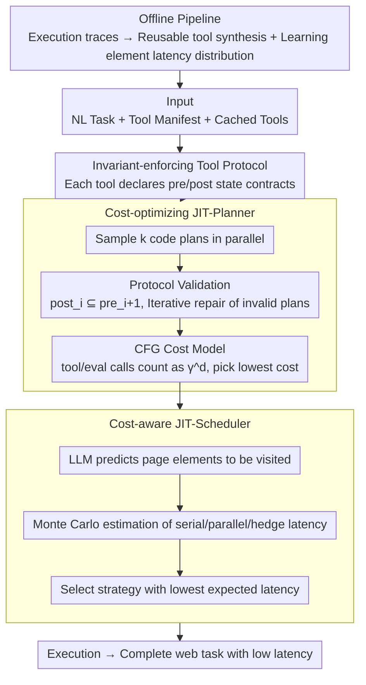

# Agent JIT Compilation for Latency-Optimizing Web Agent Planning and Scheduling

**Conference**: ICML 2026  
**arXiv**: [2605.21470](https://arxiv.org/abs/2605.21470)  
**Code**: No public code  
**Area**: LLM Agent / Web Automation  
**Keywords**: computer-use agent, JIT compilation, web automation, tool protocol, cost-aware scheduling  

## TL;DR
This paper transforms the web Computer-Use Agent from a step-by-step "screenshot-LLM call-execution" loop into a system resembling a JIT compiler. It compiles natural language tasks into verifiable, cacheable, and parallel-schedulable code plans. Consequently, JIT-Planner is 10.4× faster than Browser-Use with 28 percentage points (pp) higher accuracy, while JIT-Scheduler is 2.4× faster than OpenAI CUA with 9pp higher accuracy.

## Background & Motivation
**Background**: Computer-use agents attempt to control browsers using natural language to perform web tasks such as ordering food, shopping, emailing, managing code repositories, and forum interactions. Mainstream implementations generally follow a cyclical agent pattern: observe screenshot or DOM, call LLM to generate the next action (click/type/scroll), execute, and observe the next state.

**Limitations of Prior Work**: This loop has three prominent issues. First, the toolset is too atomic; while click/type/scroll are universal, each task requires many steps, leading to high error rates. Second, execution is strictly serial, requiring an LLM wait at every step, which results in high latency for long tasks. Third, non-deterministic LLM calls are continuously introduced even after plan generation, splitting data processing or loops—which could be handled by code—into multiple inferences.

**Key Challenge**: Web tasks require the semantic understanding of LLMs while also containing numerous deterministic operations that can be compiled, cached, and statically checked. Traditional agents treat all steps as online decisions, causing both latency and errors to be magnified by repeated LLM calls.

**Goal**: The authors aim to elevate agent runtime optimization from "selecting the next action" to "generating and optimizing an entire executable plan." The system must verify if tool call sequences satisfy page state constraints, estimate costs of candidate plans, and select appropriate scheduling strategies for parallelizable tasks.

**Key Insight**: The paper borrows the concept of a JIT compiler: a natural language task is treated like a high-level program, which the system compiles into a low-level code plan at runtime. Since multiple candidate plans may be correct but differ greatly in latency, the system performs static verification and cost selection similar to compiler optimization.

**Core Idea**: Use an invariant-enforcing tool protocol to ensure valid tool combinations, apply a CFG cost model to select the lowest-cost option among candidate code plans, and use Monte Carlo latency estimation to choose between serial/parallel/hedge execution strategies.

## Method

### Overall Architecture
Agent JIT reframes the online decision problem of "web agent executing the next action" as a compilation problem of "compiling and optimizing a natural language task into an executable code plan at runtime," thereby shifting deterministic operations into code. The system consists of three online components and an offline caching pipeline. The offline pipeline synthesizes reusable tools from successful execution traces and learns the latency distribution of web element interactions. Online, given a natural language task, tool manifests, cached tools, and historical latency distributions, the JIT-Planner samples multiple code plans in parallel (which can mix tool calls, LLM eval calls, and control flow). It uses the tool protocol to check if the pre/post states of each tool are compatible, selects the cheapest one via the cost model, and finally, the JIT-Scheduler chooses the execution strategy (serial/parallel/hedge) with the lowest expected latency for schedulable tasks.

### Key Designs

**1. Invariant-enforcing tool protocol: Adding state contracts to tools to exclude illegal tool sequences during compilation.**

The authors found that 45–50% of errors in web automation stem from incorrect tool call sequences—typically calling a detail-page-specific tool before entering the detail page. Historically, these errors only surfaced when the browser actually failed. The protocol upgrades each tool from a "callable function" to a composable building block with state contracts: the tool manifest includes input/output schemas and declares `pre`, `post`, and optional `pre_check/post_check` and `execute`. In a plan, two adjacent tools are only valid if the post-condition of the former satisfies the pre-condition of the latter ($post_i \subseteq pre_{i+1}$). Embedding these state invariants into the protocol filters out invalid plans at the compilation stage rather than delaying checks to runtime.

**2. Cost-optimizing JIT-Planner: Choosing the lower-latency code from equivalent implementations of the same task.**

A web task often has multiple equivalent implementations, such as using code to summarize a list versus calling an LLM for each item. Both might work, but the average latency between the best-cost and worst-cost plans can differ by 5.3×. The planner has workers sample plans from the LLM in parallel. Failed plans are iteratively repaired using validation errors from the protocol until $k$ valid candidates are collected. A CFG is then built for each candidate to estimate cost: a tool call is $C_{tool}\gamma^d$ and an AI eval call is $C_{eval}\gamma^d$, where $d$ is the loop/nesting depth and $\gamma=10$ is a depth penalty factor used to heavily penalize expensive LLM calls inside loops. The valid plan with the lowest estimated cost is returned.

**3. Cost-aware JIT-Scheduler: Using Monte Carlo estimation from latency distributions to adaptively select execution strategies.**

No single execution strategy is always optimal: parallel is suited for independent subtasks, hedge for tasks prone to getting stuck on UI elements, and serial for short linear tasks. The scheduler first lets the LLM predict which page elements will be visited under different strategies. It then performs Monte Carlo sampling from learned offline element latency distributions to estimate expected time: serial is the sum of interaction times; parallel is the serial part plus the slowest worker's time; hedge involves redundant workers, taking the fastest completion time plus scheduling overhead. The strategy with the lowest average latency is chosen.

### A Complete Example
Consider a 19-step GitLab long task. The planner samples plans. One plan calls a detail-page tool before entering the repository page—the protocol discovers $post_i \not\subseteq pre_{i+1}$, marks it invalid, and provides feedback for repair. This increases the valid-plan candidates significantly (Gemini-1.5-Pro Pass@3 increases from 9% to 100%). Among valid candidates, the CFG cost model identifies that the "item-by-item LLM judgment" version places `ai_eval` in a loop, causing the $\gamma^d$ penalty to spike, so it selects the "batch list processing via code" version. Finally, the scheduler predicts frequent visits to sluggish DOM elements; Monte Carlo estimation shows hedge is faster than serial or parallel, achieving 100% Pass@t within 8 seconds, whereas the control group without the protocol stays at 22%.

### Loss & Training
As this is a systems paper, there is no model training loss. The optimization target is the latency-accuracy trade-off across the planning and scheduling layers. The JIT-Planner's cost model explicitly penalizes tool calls, AI eval calls, and nested loops, while the JIT-Scheduler uses cached latency distributions for Monte Carlo estimation. The offline pipeline extracts page schemas from execution traces, maps actions to schema elements, fits latency distributions, and synthesizes reusable code tools.

## Key Experimental Results

### Main Results

| Comparison | Latency | Accuracy | Conclusion |
|------|---------|----------|------|
| Browser-Use | 122.1s | Baseline | Calls LLM every step; 73% of latency from inference |
| Browser-Use +cache | 80.1s | Higher than Browser-Use | Uses cached tools but remains in agent loop; only 1.5× speedup |
| JIT-Planner | 11.7s | +28pp vs Browser-Use | 10.4× faster than Browser-Use, 6.8× faster than +cache |
| Worst-cost plan | 61.7s | Also valid candidate | 5.3× difference from best-cost, showing cost ranking matters |
| OpenAI CUA | 258.7s | 77.8% | Specialized CUA still executes serially |
| Anthropic CUA | 141.7s | 79.0% | Accuracy close but latency higher than JIT-Scheduler |
| JIT-Scheduler (Gemini-1.5-Pro) | 109.9s | 86.4% | 2.4× faster than OpenAI CUA with 9pp higher accuracy |

### Ablation Study

| Config / Phenomenon | Metric | Result | Explanation |
|-------------|------|------|------|
| Protocol on valid-plan rate | GPT-4o | 78% → 91% | Tool invariants significantly improve valid plan ratios |
| Protocol on valid-plan rate | Gemini-1.5-Pro | 79% → 96% | Pass@k for long tasks improves significantly |
| Protocol on valid-plan rate | Gemini-1.5-Flash | 74% → 85% | Small/fast models also benefit |
| Long GitLab task Pass@3 | Gemini-1.5-Pro | 9% → 100% | Protocol allows finding valid plans with fewer candidates |
| Tool-ordering failures | No protocol vs Protocol | 59% → 25% | Failures due to state sequence violations are reduced |
| CUA +cache vs JIT-Planner | REAL 3 Apps | JIT 1.5–2.4× faster | Faster even with same tools, isolating planner contribution |

### Key Findings
- Protocols are not just documentation; they substantially improve planner search efficiency. For long GitLab tasks, Gemini-1.5-Pro's Pass@3 rose from 9% to 100%, and parallel hedging reached 100% Pass@t in 8 seconds.
- The cost model accelerates tasks primarily by eliminating unnecessary LLM inference and `ai_eval` in loops. While 73% of Browser-Use's latency comes from LLM calls, JIT-Planner moves inference to the planning stage or removes it entirely.
- Task complexity has a minor impact on speedup. JIT-Planner achieved 10.8×, 8.7×, and 11.8× speedups on C-Low/Medium/High tasks respectively, showing gains come from the execution paradigm rather than specific task types.
- Scheduling strategies must be adaptive. Under GPT-4o, Serial/Parallel/Hedge latencies were 157.3/166.2/130.3s; JIT-Scheduler finds a more stable Pareto point between latency and accuracy.

## Highlights & Insights
- The strongest engineering insight is treating the web agent as a compilation problem rather than a pure policy problem. Once reusable tools are abstracted, web tasks resemble program synthesis and optimization rather than constant "re-thinking."
- Invariant protocols extend MCP-style type checking to state-flow checking, which is vital for tool ecosystems. Checking parameter types alone is insufficient to ensure a tool can be called on the current page.
- JIT-Planner's cost model is simple but effective: penalizing LLM eval and nested loops is enough to rank significantly faster plans. This suggests agent latency optimization needs better runtime representation rather than just larger models.
- Using latency distributions for the scheduler is more realistic than fixed rules, as web interaction often has a long tail. Hedging is more rational than simple parallelization in such environments.

## Limitations & Future Work
- The system relies on offline traces and cached tools. For entirely new websites, frequent frontend changes, or missing success traces, tool synthesis and latency distributions must be rebuilt.
- Coverage includes 5 apps and 37 tasks; while stronger than a toy demo, it still trails open-web reality. Factors like login, payments, CAPTCHAs, and personalization are not fully explored.
- Invariant manifests require tool authors or synthesis processes to accurately write pre/post conditions; overly loose invariants leak errors, while overly tight ones kill feasible plans.
- The cost model focuses on latency, with less consideration for monetary cost, risk, permissions, security auditing, and user explainability. Future agent compilers may need multi-objective optimization.

## Related Work & Insights
- **vs Browser-Use**: Browser-Use is a typical observe-act loop dependent on LLM at every step; Agent JIT compiles tasks into plans to reduce execution-time inference.
- **vs CUA**: OpenAI/Anthropic CUA use fixed action spaces and serial execution; the JIT system introduces cached tools, plan verification, and scheduling choices for better latency and accuracy.
- **vs code-action agents**: Existing code-action work outputs code but lacks systematic study of latency differences between plans; this work treats code plans as optimizable objects.
- **vs MCP/tool protocols**: MCP emphasizes tool interfaces; this work further requires state pre/post invariants to enable static verification of tool combinations.

## Rating
- Novelty: ⭐⭐⭐⭐ Abstracting agent execution as JIT compilation and scheduling is highly instructive, using grounded system/compiler concepts.
- Experimental Thoroughness: ⭐⭐⭐⭐ Covers multiple apps, models, and comprehensive ablations; open-web generalization needs larger-scale validation.
- Writing Quality: ⭐⭐⭐⭐ Clear architecture, pseudocode, and analysis; some model naming follows specific CUA settings familiar to researchers.
- Value: ⭐⭐⭐⭐⭐ Highly valuable for reducing latency and increasing reliability in real-world web agents.

<!-- RELATED:START -->

## Related Papers

- [\[ICML 2026\] Weasel: 通过重要性-多样性数据选择实现 Web Agent 的域外泛化](weasel_out-of-domain_generalization_for_web_agents_via_importance-diversity_data.md)
- [\[ICML 2026\] ACON: Optimizing Context Compression for Long-horizon LLM Agents](acon_optimizing_context_compression_for_long-horizon_llm_agents.md)
- [\[ACL 2026\] TheraAgent: Self-Improving Therapeutic Agent for Precise and Comprehensive Treatment Planning](../../ACL2026/llm_agent/theraagent_self-improving_therapeutic_agent_for_precise_and_comprehensive_treatm.md)
- [\[ICML 2026\] NaviAgent: Graph-Driven Bilevel Planning for Scalable Tool Orchestration](naviagent_graph-driven_bilevel_planning_for_scalable_tool_orchestration.md)
- [\[CVPR 2026\] Ego2Web: A Web Agent Benchmark Grounded in Egocentric Videos](../../CVPR2026/llm_agent/ego2web_a_web_agent_benchmark_grounded_in_egocentric_videos.md)

<!-- RELATED:END -->
