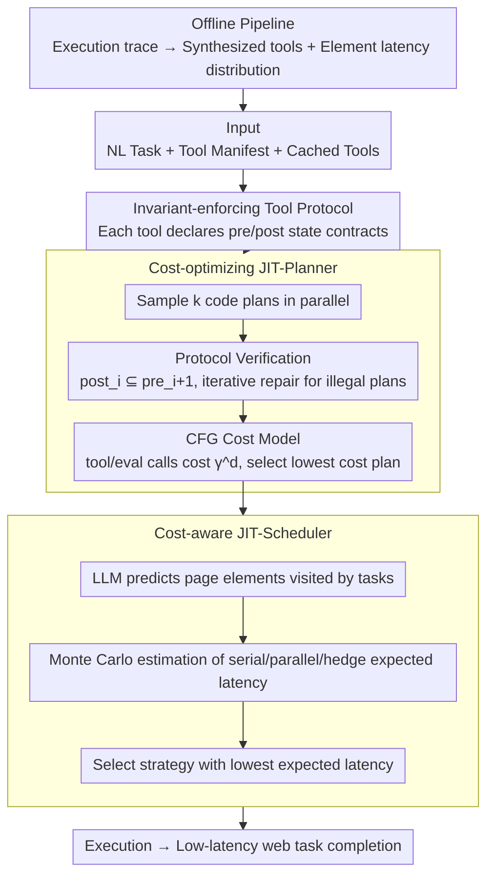

# Agent JIT Compilation for Latency-Optimizing Web Agent Planning and Scheduling

**Conference**: ICML 2026  
**arXiv**: [2605.21470](https://arxiv.org/abs/2605.21470)  
**Code**: No public code  
**Area**: LLM Agent / Web Automation  
**Keywords**: computer-use agent, JIT compilation, web automation, tool protocol, cost-aware scheduling  

## TL;DR
This paper transforms the web Computer-Use Agent from a step-by-step screenshot-LLM call-execution loop into a system similar to a JIT compiler: compiling natural language tasks into verifiable, cacheable, and parallel-schedulable code plans. This allows JIT-Planner to be 10.4× faster than Browser-Use with 28pp higher accuracy, and JIT-Scheduler to be 2.4× faster than OpenAI CUA with 9pp higher accuracy.

## Background & Motivation
**Background**: Computer-use agents attempt to control browsers using natural language to perform web tasks such as food ordering, shopping, email, code repository management, and forum interactions. Mainstream implementations generally follow a cyclic agent pattern: observing screenshots or DOM, calling an LLM to generate the next click/type/scroll, and observing the next state after execution.

**Limitations of Prior Work**: This cycle presents three prominent issues. First, the toolset is too atomic; while click/type/scroll are universal, each task requires many steps, leading to high error rates. Second, execution is highly serial, as every step must wait for the LLM, resulting in high latency for long tasks. Third, even after a plan is generated, non-deterministic LLM calls are continuously introduced, breaking many data processing or loops that could have been handled by code into multiple inferences.

**Key Challenge**: Web tasks require the semantic understanding of LLMs but also contain a large number of deterministic operations that can be compiled, cached, and statically checked. Traditional agents treat all steps as online decisions, causing both latency and errors to be magnified by LLM calls.

**Goal**: The authors aim to elevate agent runtime optimization from "selecting the next action" to "generating and optimizing an entire executable plan." The system needs to check if tool call sequences satisfy page state constraints, estimate the cost of different candidate plans, and select appropriate scheduling strategies for parallelizable tasks.

**Key Insight**: The paper borrows the concept of a JIT compiler: natural language tasks are treated like high-level programs, which the system compiles into low-level code plans at runtime. Multiple candidate plans may be correct, but their latency varies significantly; thus, static verification and cost selection are performed as in compiler optimization.

**Core Idea**: An invariant-enforcing tool protocol ensures legal tool combinations, a CFG cost model selects the lowest-cost option among candidate code plans, and Monte Carlo latency estimation selects the serial/parallel/hedge execution strategy.

## Method

### Overall Architecture
Agent JIT reformulates the online decision problem of "web agent executing the next action" into a compilation problem of "compiling and optimizing a natural language task into an executable code plan at runtime," thereby embedding many deterministic operations that would otherwise require step-by-step LLM calls into code. The system consists of three online components and one offline cache pipeline: the offline pipeline synthesizes reusable tools from successful execution traces and learns the latency distribution of web element interactions; during online execution, given the natural language task, tool manifest, cached tools, and historical latency distributions, the JIT-Planner samples multiple code plans in parallel (plans can mix tool calls, LLM eval calls, and control flows). The tool protocol checks if the pre/post states of each tool are composable, a cost model selects the cheapest among legal candidates, and finally, the JIT-Scheduler selects the strategy with the lowest expected latency among serial/parallel/hedge for schedulable tasks.

### Key Designs

**1. Invariant-enforcing tool protocol: Adding state contracts to tools to exclude illegal sequences at compile time**

The authors found that 45–50% of errors in web automation stem from incorrect tool call sequences—typically calling a detail-page-specific tool before entering the detail page. Historically, such errors are only exposed when the browser actually fails. Consequently, the protocol upgrades each tool from a "callable function" to a composable building block with state contracts: the tool manifest declares pre, post, and optional pre_check/post_check/execute in addition to the input/output schema. Two adjacent tools in a plan are legal only if the postcondition of the predecessor satisfies the precondition of the successor, i.e., the state flow must satisfy $post_i \subseteq pre_{i+1}$. Putting these state invariants into the protocol filters out a large number of unfeasible plans during the compilation phase rather than delaying checks to runtime.

**2. Cost-optimizing JIT-Planner: Multiple equivalent implementations exist; select the code with the lowest latency among legal candidates**

A single web task often has multiple equivalent implementations, such as directly summarizing a list using code versus calling the LLM item-by-item—both can work, but the average latency between the best-cost and worst-cost plans can differ by 5.3×. Thus, "executable" is not enough; cost optimization is required. The planner allows multiple workers to sample plans from the LLM in parallel. Plans that fail sampling are iteratively repaired with the verification errors provided by the protocol until $k$ legal candidates are accumulated. Subsequently, a CFG is built for each candidate to estimate cost: a tool call is counted as $C_{tool}\gamma^d$ and an AI eval call as $C_{eval}\gamma^d$, where $d$ is the loop/nesting depth and $\gamma=10$ is a depth penalty factor specifically used to heavily penalize patterns like "putting expensive LLM calls inside loops." The system returns the legal plan with the lowest estimated cost.

**3. Cost-aware JIT-Scheduler: No single execution strategy is always optimal; use latency distributions and Monte Carlo estimation for adaptive selection**

Parallelism is suitable for independent subtasks, hedging is suitable for tasks prone to getting stuck on a UI element, and serial execution is suitable for short linear tasks. No single strategy is universally superior, and hard-coded scheduling rules are often inaccurate. The scheduler first has the LLM predict which web elements the tasks will likely access under different strategies, then samples from the offline-learned element latency distributions using Monte Carlo to estimate the expected time: serial is the direct sum of interaction times; parallel is the serial portion plus the time of the slowest worker; hedging involves multiple redundant workers, taking the time of the fastest finisher plus scheduling overhead. The system selects the execution with the lowest average latency.

### A Full Example
Taking a 19-step long GitLab task as an example: the planner samples several code plans in parallel. One plan calls a detail page tool before entering the repository page—the protocol check finds that the precondition is not satisfied by the previous step's postcondition ($post_i \not\subseteq pre_{i+1}$), marks it as illegal, and feeds back the error for repair. This significantly increases the valid-plan candidates for long tasks (Pass@3 on Gemini-2.5-Pro rises from 9% to 100%). Among the accumulated legal candidates, the CFG cost model finds that the "item-by-item LLM judgment" version placed ai_eval inside a loop, making its cost skyrocket due to the $\gamma^d$ penalty, thus selecting the low-cost "batch list processing using code" version. Finally, the scheduler predicts the task will repeatedly access several laggy DOM elements. Monte Carlo estimation shows that hedge is faster than serial/parallel, so hedge execution is adopted—overall achieving 100% Pass@t within 8 seconds, while the control with the protocol disabled stops at 22%.

### Loss & Training
This is a systems paper without model training losses. The optimization objective lies in the latency-accuracy trade-off between the planning and scheduling layers: the JIT-Planner's cost model explicitly penalizes tool calls, AI eval calls, and nested loops, while the JIT-Scheduler uses cached latency distributions for Monte Carlo estimation. The offline cache pipeline extracts page schemas from execution traces, maps actions to schema elements, fits latency distributions, and synthesizes reusable code tools.

## Key Experimental Results

### Main Results

| Comparison | Latency | Accuracy | Conclusion |
|------|---------|----------|------|
| Browser-Use | 122.1s | Baseline | Calls LLM at every step; 73% of latency is from inference |
| Browser-Use +cache | 80.1s | > Browser-Use | Has cached tools but still a step-by-step agent loop; only 1.5× speedup |
| JIT-Planner | 11.7s | +28pp vs Browser-Use | 10.4× faster than Browser-Use on average; 6.8× faster than +cache |
| Worst-cost plan | 61.7s | Same legal candidate | 5.3× difference from best-cost plan mean; shows cost ranking is critical |
| OpenAI CUA | 258.7s | 77.8% | Specialized CUA still executes serially |
| Anthropic CUA | 141.7s | 79.0% | Accuracy similar but latency higher than JIT-Scheduler |
| JIT-Scheduler (Gemini-2.5-Pro) | 109.9s | 86.4% | 2.4× faster than OpenAI CUA with 9pp higher accuracy |

### Ablation Study

| Config / Phenomenon | Metric | Results | Description |
|-------------|------|------|------|
| Protocol on valid-plan rate | GPT-4.1 | 78% → 91% | Tool invariants significantly increase legal plan ratio |
| Protocol on valid-plan rate | Gemini-2.5-Pro | 79% → 96% | Pass@k for long tasks improves significantly |
| Protocol on valid-plan rate | Gemini-2.5-Flash | 74% → 85% | Small/fast models also benefit |
| Pass@3 on long GitLab task | Gemini-2.5-Pro | 9% → 100% | Protocol allows finding legal plans with few candidates in 19-step tasks |
| Tool-ordering failures | No protocol vs Protocol | 59% → 25% | Error types from state-order violations significantly reduced |
| CUA +cache vs JIT-Planner | REAL (3 apps) | JIT 1.5–2.4× faster | Faster even with same cached tools; isolates JIT contribution |

### Key Findings
- The protocol is not a document decoration but a substantial improvement to planner search efficiency. On long GitLab tasks, Pass@3 for Gemini-2.5-Pro went from 9% to 100%, and parallel hedging reached 100% Pass@t within 8 seconds, whereas it stalled at 22% without the protocol.
- The cost model speeds up execution primarily by eliminating unnecessary LLM inference and ai_eval in loops. With Browser-Use, 73% of latency comes from LLM calls; JIT-Planner moves many inferences to the planning phase or deletes them entirely after compiling tests into code.
- Task complexity has a small impact on speedup. JIT-Planner achieves 10.8×, 8.7×, and 11.8× speedup on C-Low/C-Medium/C-High respectively, maintaining ~10× on short/medium/long tasks, indicating gains come from paradigm shifts rather than specific task types.
- Scheduling strategy indeed needs to be adaptive. Under GPT-4.1, Serial/Parallel/Hedge latencies were 157.3/166.2/130.3s; for Gemini-2.5-Pro, they were 129.6/148.5/98.4s. However, the lowest latency strategy is not always the most accurate; JIT-Scheduler achieves a more stable Pareto point between the two.

## Highlights & Insights
- The strongest engineering insight is viewing the web agent as a compilation problem rather than a pure policy problem. Once reusable tools are abstracted, many web tasks resemble program synthesis and optimization rather than requiring the agent to "re-think" every step.
- The invariant protocol pushes MCP-style type checking to state-flow checking, which is crucial for the agent tool ecosystem. Checking parameter types alone is insufficient to guarantee that "the current page is capable of calling this tool."
- The JIT-Planner's cost model is simple but effective: penalizing LLM eval and nested loops is sufficient to rank significantly faster plans. This suggests that many agent latency optimizations do not require larger models but rather better runtime representations.
- The scheduler uses latency distributions instead of fixed rules, staying closer to real-world web environments. Web interaction often has long-tail latency; hedging is more reasonable than simple parallelism in these scenarios.

## Limitations & Future Work
- The system relies on offline traces and cached tools. For entirely unfamiliar websites, frequently changing frontends, or scenarios lacking success trajectories, tool synthesis and latency distributions need to be re-established.
- Tasks cover 5 applications and 37 tasks, which is stronger than a toy demo but still short of the open web. Specifically, login, payment, CAPTCHAs, and personalized recommendations are not fully addressed.
- Invariant manifests require tool authors or auto-synthesis processes to accurately write pre/post conditions; if invariants are too loose, errors leak; if too tight, feasible plans are killed.
- The cost model primarily optimizes latency, with less consideration for monetary cost, risk, permissions, security audits, and user interpretability. Future agent compilers may need multi-objective optimization.

## Related Work & Insights
- **vs Browser-Use**: Browser-Use is a typical observe-act loop where every step depends on the LLM; Agent JIT compiles tasks into code plans to reduce execution-time inference.
- **vs CUA**: OpenAI/Anthropic CUA uses fixed action spaces and serial execution; the JIT system introduces cached tools, plan verification, and scheduling choices, leading to better latency and accuracy.
- **vs Code-action Agents**: Existing code-action work enables agents to output code, but lacks systematic research on latency differences between multiple code plans; this work treats code plans as optimizable objects.
- **vs MCP/Tool Protocols**: MCP mainly emphasizes tool interfaces and types; Ours further requires state pre/post invariants, enabling static verification of tool combinations.

## Rating
- Novelty: ⭐⭐⭐⭐ Abstracting agent runtime as JIT compilation and scheduling optimization is very inspiring; components borrow from systems/compiler ideas and are solidly combined.
- Experimental Thoroughness: ⭐⭐⭐⭐ Covers five apps, multiple models, and ablations for planner/scheduler/protocol/cache with significance tests; generalization on the open web requires larger-scale validation.
- Writing Quality: ⭐⭐⭐⭐ System architecture, algorithm pseudo-code, and result analysis are clear; the appendix provides sufficient detail.
- Value: ⭐⭐⭐⭐⭐ Highly valuable for reducing latency and improving reliability in practical web agents; also points out that agent tool protocols should include state invariants.

<!-- RELATED:START -->

## Related Papers

- [\[ICML 2026\] It's a TRAP! Task-Redirecting Agent Persuasion Benchmark for Web Agents](its_a_trap_task-redirecting_agent_persuasion_benchmark_for_web_agents.md)
- [\[ACL 2026\] Why LLM Web Agents Fail: A Hierarchical Planning Perspective](../../ACL2026/llm_agent/why_do_llm-based_web_agents_fail_a_hierarchical_planning_perspective.md)
- [\[ICML 2026\] ACON: Optimizing Context Compression for Long-horizon LLM Agents](acon_optimizing_context_compression_for_long-horizon_llm_agents.md)
- [\[ACL 2026\] TheraAgent: Self-Improving Therapeutic Agent for Precise and Comprehensive Treatment Planning](../../ACL2026/llm_agent/theraagent_self-improving_therapeutic_agent_for_precise_and_comprehensive_treatm.md)
- [\[CVPR 2026\] Ego2Web: A Web Agent Benchmark Grounded in Egocentric Videos](../../CVPR2026/llm_agent/ego2web_a_web_agent_benchmark_grounded_in_egocentric_videos.md)

<!-- RELATED:END -->
