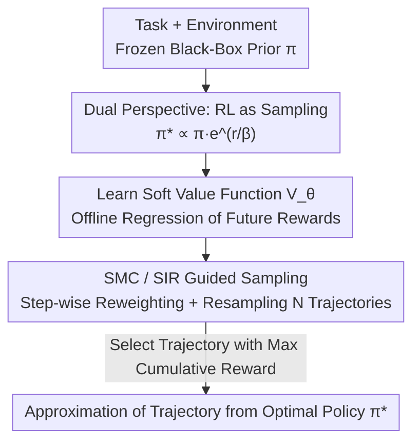

# Agentic Monte Carlo: Simulating Reinforcement Learning for Black-Box Agents

**Conference**: ICML2026  
**arXiv**: [2606.05296](https://arxiv.org/abs/2606.05296)  
**Code**: https://github.com/layer6ai-labs/Agentic-Monte-Carlo  
**Area**: Agent / Reinforcement Learning / LLM  
**Keywords**: Black-box Agent, Sequential Monte Carlo, Control-as-Inference, Value Function, Test-time Compute

## TL;DR
The paper reframes "RL for black-box LLM Agents" as "sampling from the posterior of an optimal policy." By employing Sequential Monte Carlo (SMC) with a lightweight value function to guide frozen black-box models during test time, the authors achieve RL-style optimization without accessing any parameters. This approach outperforms prompting baselines on three AgentGym environments and surpasses GRPO (which requires full parameter access) by scaling test-time computation.

## Background & Motivation
**Background**: LLM Agents are primarily trained using Reinforcement Learning (RL). Policy gradient methods such as PPO and GRPO are highly effective for open-source (white-box) models, enhancing capabilities across domains from mathematical reasoning to software engineering.

**Limitations of Prior Work**: Policy gradients require access to model parameters to calculate gradients. However, state-of-the-art models (e.g., GPT-5, Gemini 3, Claude 4.6) are typically proprietary "black boxes" accessible only via APIs. Optimizing agents based on these models currently relies on prompt engineering or fine-tuning weaker open-source surrogates—neither of which directly optimizes the target black-box model.

**Key Challenge**: RL optimization targets "policy parameters," which are inaccessible in black-box scenarios. As long as the problem is framed as "parameter optimization," black-box models remain a dead end for direct RL.

**Goal**: Achieve optimization equivalent to KL-regularized RL for black-box agents without parameter access or complete log-probabilities.

**Key Insight**: The authors leverage the known duality between RL and Bayesian inference (control-as-inference). The optimal policy in KL-regularized RL is essentially a posterior distribution, with the pre-trained model acting as the prior and the "high reward" acting as the likelihood. Thus, instead of updating prior parameters (which is impossible), one can **sample** directly from the posterior.

**Core Idea**: Replace "training policy parameters" with "sampling from the optimal policy posterior." Use Sequential Monte Carlo to make this sampling computationally feasible. The black-box model acts as a proposal generator, while an external, small value function guides the sampling toward high-reward regions.

## Method

### Overall Architecture
The input to AMC (Agentic Monte Carlo) consists of a task, an environment, and a frozen black-box LLM prior policy $\pi$. The output is a set of trajectories approximating the optimal policy $\pi_*$ (the highest cumulative reward trajectory is selected for deployment). The approach conceptually rewrites RL as a sampling problem and implements it in two phases: **Offline**, a soft value function $V_\theta$ is trained using trajectories generated by the prior; **Online**, SMC with Sequential Importance Resampling (SIR) is used to run $N$ trajectories in parallel. At each step, $V_\theta$ calculates importance weights to "prune poor trajectories and duplicate good ones." The resulting weighted trajectories weakly converge to $\pi_*$ as $N\to\infty$.

### Key Designs

**1. Dual Perspective: Reframing RL as Posterior Sampling**

The primary pain point is the lack of optimizable parameters. The authors utilize findings from Korbak et al., stating that the KL-regularized RL objective $\pi_*=\arg\max_{\pi_\theta}\mathbb{E}_{\pi_\theta}[r(s_{0:T})]-\beta\,\mathbb{KL}[\pi_\theta\,\|\,\pi]$ is essentially a variational inference problem approximating the posterior:

$$\pi_*(s_{0:T})\propto \pi(s_{0:T})\,e^{r(s_{0:T})/\beta}.$$

The trajectory probability $\pi(s_{0:T})$ from the pre-trained model serves as the prior, and the exponential term $e^{r(s_{0:T})/\beta}$ acts as the likelihood representing trajectory optimality. This shift allows the use of **pure sampling** methods like Monte Carlo, bypassing policy optimization entirely. Consequently, whether the prior is a black box is irrelevant—only the ability to sample from it (e.g., via API calls) is required.

**2. Learning the Soft Value Function $V_\theta$: Turning Expected Future Rewards into Offline Regression**

Importance sampling requires estimating the "expected future reward" for each trajectory, represented by the soft value function $V(s_t)=\log\mathbb{E}_{\pi(s_{t+1:T}\mid s_t)}[e^{\frac{1}{\beta}\sum_{\tau=t}^{T}r(s_\tau)}]$. Calculating this expectation accurately by simulating the agent to termination is computationally expensive. The authors **learn** this function: since the prior $\pi$ is frozen, $M$ Monte Carlo trajectories can be sampled to perform regression on state values. The value is parameterized as $V_\theta(s_t)=f_\theta(s_t)+r(s_t)$, where $r(s_t)$ is the current reward (known at test time) and $f_\theta$ predicts future rewards. During training, the inner expectation is approximated with a single trajectory, and the loss is defined as:

$$\mathcal{L}(f_\theta)=\frac{1}{P}\sum_{k=1}^{P}\Big\lVert f_\theta(s_{t_k}^{(k)})-\textstyle\sum_{\tau=t_k+1}^{T}r(s_\tau^{(k)})\Big\rVert_2^2.$$

$f_\theta$ is a small Transformer with a regression head, initialized from small open-source LLMs (e.g., Llama-3.2-11B). This **offline regression** is significantly cheaper than the online rollouts required for GRPO and never touches the black-box prior.

**3. SMC / SIR Guided Sampling: Pruning and Propagating Trajectories with Importance Weights**

With $V_\theta$, Sequential Importance Resampling (bootstrap filter) can be used to sample from the posterior. Sampling $N$ trajectories from the prior $\pi$ in parallel, importance weights $w_t=\pi_*(s_{0:t})/\pi(s_{0:t})$ are used to correct the distribution. The authors derive a recursive form for the weights that depends only on the value function difference and the immediate reward, eliminating the need for black-box log-probabilities:

$$w_t=w_{t-1}\cdot e^{\,V(s_t)-V(s_{t-1})+r(s_{t-1})/\beta}.$$

Resampling is triggered at specific time steps: trajectories are sampled with replacement based on normalized weights. **Low-weight (poor) trajectories are likely pruned, while high-weight (good) ones are duplicated.** This ensures the trajectory set approaches $\pi_*$ as $N$ increases. Unlike heuristic SMC (e.g., FoA) that uses prompts for LLM self-evaluation, AMC uses a **data-driven** value estimation for more accurate guidance.

### Loss & Training
The value function is trained using MSE regression as shown above, with $\beta=1$ during training. Sampling temperature is adjusted post-hoc. $f_\theta$ is fine-tuned using a regression head and LoRA, while the prior policy remains frozen. The most critical hyperparameter in the online phase is the number of trajectories $N$ (fixed at $N=15$) and the resampling steps.

## Key Experimental Results

### Main Results
Evaluated on three AgentGym environments (WebShop, SciWorld, TextCraft), each method generates $N=15$ trajectories, selecting the one with the highest reward. Results are averaged over three seeds.

| Environment | Prior Policy | ReAct (Single) | Best-of-15 | AMC | Note |
|-------------|--------------|----------------|------------|-----|------|
| WebShop | Llama-3.2-11B | 0.159 | 0.562 | **0.625** | Outperforms SMC(FoA) (0.580) |
| WebShop | GPT-5.1 (Black-box) | 0.171 | 0.519 | **0.543** | 11B critic guides large black-box |
| SciWorld | GPT-4.1-mini (Black-box) | 0.250 | 0.616 | **0.673** | |
| SciWorld | GPT-5.1 (Black-box) | 0.090 | 0.533 | **0.597** | |
| TextCraft | GPT-4.1-mini (Black-box) | 0.432 | 0.728 | **0.852** | |
| TextCraft | GPT-5.1 (Black-box) | 0.691 | **0.889** | 0.790 | Exception: Saturated strong prior |

AMC consistently outperforms Best-of-15 and SMC(FoA). Notably, a small 11B value function successfully guides frontier black-box models like GPT-5.1. The only outlier is TextCraft with GPT-5.1, where the prior is already highly confident, and value function training data lacks diversity, causing AMC to prune good trajectories incorrectly.

### Comparison with GRPO and Value Function Ablation
Comparison with GRPO (requiring full parameter access) as an oracle, and a value function ablation:

| Comparison | Setting | Key Findings |
|------------|---------|--------------|
| vs GRPO (GPT-5.1 Prior) | SciWorld | AMC exceeds GRPO with $N=5$, a score Best-of-N cannot reach. |
| vs GRPO (Qwen-2.5-3B Backbone) | SciWorld | AMC surpasses full-parameter GRPO when $N=25$. |
| Hardware Cost | — | AMC uses 2×RTX 6000 Ada; GRPO requires 8×A100. |
| Training vs Prompt (SMC Zero-shot) | WebShop/SciWorld | SMC(Zero-shot) shows unstable gains over Best-of-N; AMC is consistently higher. |

### Key Findings
- **Necessity of Value Function Training**: Using pure prompts for LLM self-evaluation (SMC Zero-shot) provides minimal gains, indicating that raw pre-trained knowledge is insufficient for accurate state-value estimation.
- **Compute-Parameter Trade-off**: Increasing test-time computation ($N$) allows AMC to outperform full-parameter GRPO with significantly lower hardware costs.
- **Saturation Point**: AMC gains saturate or become negative when the prior is nearly perfect (e.g., TextCraft + GPT-5.1) due to reduced data diversity for value function training.

## Highlights & Insights
- Reframing "RL for black-box models" through the lens of control-as-inference is a powerful conceptual shift. By treating the black box as a proposal generator for posterior sampling, parameter access becomes unnecessary.
- The recursive weight formula $w_t=w_{t-1}e^{V(s_t)-V(s_{t-1})+r(s_{t-1})/\beta}$ is a technical breakthrough for black-box scenarios as it circumvents the need for model log-probabilities.
- The "small value function guiding a large black box" paradigm is highly practical, allowing researchers to optimize frontier models via APIs with minimal local compute.

## Limitations & Future Work
- AMC may struggle with highly confident priors where trajectory diversity is low, leading to value function collapse.
- Using single trajectories to approximate expectations introduces bias. Resampling steps currently require manual cross-validation.
- The method relies heavily on available external rewards during test time; its robustness in scenarios without such signals remains to be fully explored.
- Future work: Adaptive resampling criteria, enhancing training data diversity for high-confidence priors, and moving from offline to online/iterative value function learning.

## Related Work & Insights
- **vs GRPO / PPO (Policy Gradient RL)**: These require gradients and white-box access. AMC approximates the same optimal policy $\pi_*$ via sampling and offline regression, enabling black-box optimization at a lower cost, needing only higher $N$ to match performance.
- **vs SMC for LLMs (Zhao 2024 / Loula 2025)**: These typically modify the proposal distribution using logits, which are unavailable in black boxes. AMC is designed for interactive agents and requires no logit access.
- **vs Fleet of Agents (Klein 2025, SMC FoA)**: FoA utilizes static heuristics or prompts as value functions. AMC's data-driven learned value function provides superior guidance (e.g., WebShop 0.625 vs 0.580).
- **vs Rollout Roulette (Puri 2025)**: While the latter uses Process Reward Models (PRMs) for reasoning, AMC focuses on multi-step interactive agents, training a critic on interaction histories and treating it as a soft value function surrogate.

## Rating
- **Novelty**: ⭐⭐⭐⭐⭐ Reframing black-box RL as a sampling problem via control-as-inference is an elegant and impactful contribution.
- **Experimental Thoroughness**: ⭐⭐⭐⭐ Covers multiple environments and models with GRPO head-to-head comparisons, though evaluation in reward-free scenarios is limited.
- **Writing Quality**: ⭐⭐⭐⭐⭐ Logical flow from duality to SMC to value function learning is clear and well-motivated.
- **Value**: ⭐⭐⭐⭐⭐ Provides a practical, low-compute path for optimizing API-only LLM agents.

<!-- RELATED:START -->

## Related Papers

- [\[ICML 2026\] Constitutional Black-Box Monitoring for Scheming in LLM Agents](constitutional_black-box_monitoring_for_scheming_in_llm_agents.md)
- [\[ICML 2026\] From Player to Master: Enhancing Test-Time Learning of LLM Agents via Reinforcement Learning over Memory](from_player_to_master_enhancing_test-time_learning_of_llm_agents_via_reinforceme.md)
- [\[ICML 2025\] KBQA-o1: Agentic Knowledge Base Question Answering with Monte Carlo Tree Search](../../ICML2025/llm_agent/kbqa-o1_agentic_knowledge_base_question_answering_with_monte_carlo_tree_search.md)
- [\[ICLR 2026\] MobileRL: Online Agentic Reinforcement Learning for Mobile GUI Agents](../../ICLR2026/llm_agent/mobilerl_online_agentic_reinforcement_learning_for_mobile_gui_agents.md)
- [\[ICML 2026\] On Information Self-Locking in Reinforcement Learning for Active Reasoning of LLM Agents](on_information_self-locking_in_reinforcement_learning_for_active_reasoning_of_ll.md)

<!-- RELATED:END -->
