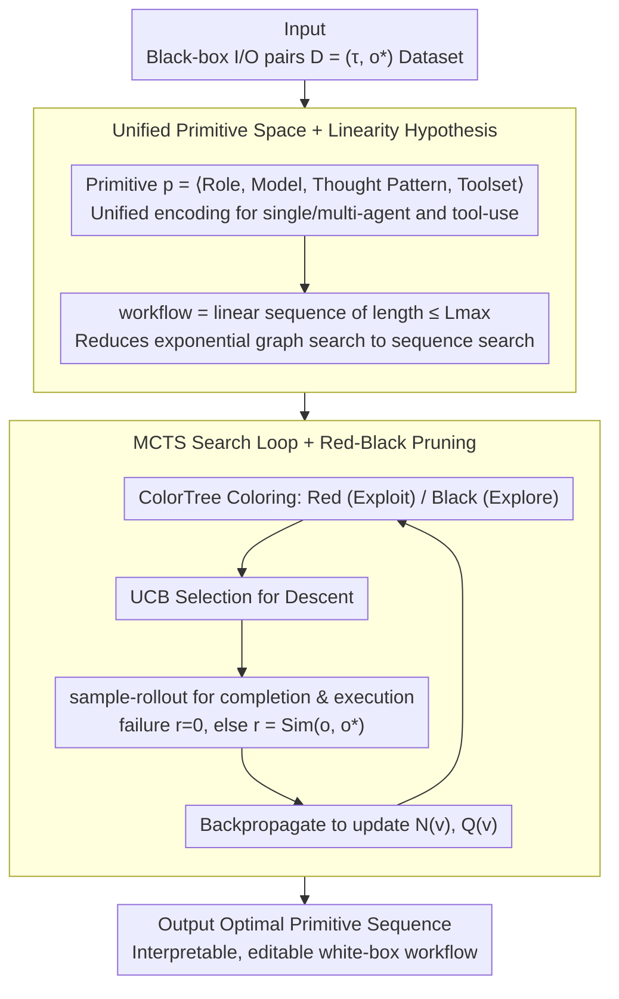

# AgentXRay: White-Boxing Agentic Systems via Workflow Reconstruction

**Conference**: ICML 2026  
**arXiv**: [2602.05353](https://arxiv.org/abs/2602.05353)  
**Code**: Not explicitly labeled (no clear link)  
**Area**: LLM Agent / Interpretability / Combinatorial Optimization  
**Keywords**: Agentic Workflow Reconstruction, MCTS, Red-Black Pruning, Black-box Explanation, Multi-Agent

## TL;DR
The authors define "Agentic Workflow Reconstruction" (AWR) as a new task to reverse-engineer equivalent white-box workflows from black-box agent systems. They utilize MCTS to search within the sequence space of agent primitives, complemented by score-based dynamic Red-Black pruning to balance depth and width, achieving interpretable white-box reconstructions across five real-world domains.

## Background & Motivation

**Background**: LLM agents and multi-agent systems (MAS) solve complex tasks through role specialization and tool calling (e.g., ChatDev, MetaGPT). However, high-performance agents deployed in practice are typically black boxes, where internal prompts, agent topologies, and toolchains remain invisible.

**Limitations of Prior Work**: Users can only observe inputs and outputs, lacking insight into the decision-making process, which hinders debugging, modification, and security auditing. Existing agent interpretability research either targets single-step LLM reasoning or requires white-box access (e.g., model distillation), making it inapplicable to pure black-box APIs.

**Key Challenge**: The internal state space of black-box systems is immense (agent roles $\times$ models $\times$ thought patterns $\times$ toolsets $\times$ sequences). Even if input-output pairs can be sampled, exhaustive search is infeasible; meanwhile, classic distillation requires model parameters and is therefore inapplicable.

**Goal**: Define a new task, Agentic Workflow Reconstruction (AWR): synthesizing an explicit, interpretable, and editable white-box workflow using only $(\tau, o^\ast)$ input-output pairs, such that its execution output remains consistent with the black box.

**Key Insight**: (1) Linearity Hypothesis—Most practical agent systems serialize into an action-observation sequence during execution (even if designed as graphs). Thus, the search space can be restricted to a chain of primitives with length $\le L_{\max}$. (2) Use output similarity as a proxy metric to bypass the undecidability of true functional equivalence.

**Core Idea**: Formulate AWR as a combinatorial optimization over the discrete space of primitive sequences, and use MCTS with Red-Black pruning to efficiently approximate the optimal workflow under token budgets.

## Method

### Overall Architecture
AgentXRay aims to solve the following: given a black-box agent system $\mathcal{M}_{\text{black}}$ where only inputs and outputs are visible, reconstruct a white-box workflow that reproduces its behavior. Given a dataset $\mathcal{D}=\{(\tau_i, o_i^\ast)\}$ (task + black-box output pairs), the method first encodes all possible agent components into a unified primitive $p=\langle \rho, \mu, \pi, T_{\text{local}}\rangle$ (role, underlying model, thought pattern, toolset). A candidate workflow is represented as a linear primitive sequence $\mathbf{s}=[s_1,\dots,s_L]$ of length $L \le L_{\max}$. MCTS is then employed to search this discrete space to maximize proxy similarity: $\mathbf{s}^\ast = \arg\max_{\mathbf{s}} \mathbb{E}_{(\tau,o^\ast)}[\mathrm{Sim}(\Phi(\mathbf{s},\tau), o^\ast)]$. During the search, Red-Black coloring dynamically decides whether to "exploit deeper" or "explore wider." The final output is the optimal sequence found as the white-box reconstruction.

### Key Designs

**1. Unified Primitive Space + Linearity Hypothesis: Compressing Graph Search into Sequence Search**

Pure graph topology search explodes even with moderate primitive sets—enumerating all topologies is $O(2^{|\Omega|^2})$. The authors break this via two levels of abstraction. First, heterogeneous components are unified into one search unit: each primitive is $\langle$role, model, thought pattern, local tools$\rangle$. Pure reasoning agents have $T_{\text{local}}=\emptyset$, while tool-augmented agents have $T_{\text{local}}\ne\emptyset$, placing single-agent, multi-agent, and tool-use systems in the same space $\Omega$. Second, the Linearity Hypothesis, citing MacNet (Qian 2025), observes that multi-agent DAGs are topologically sorted during execution, and interactions (e.g., ReAct, WebArena) are naturally ordered traces. By restricting the search space to linear sequences of length $\le L_{\max}$, complexity drops from $O(2^{|\Omega|^2})$ to $O(|\Omega|^{L_{\max}})$. The key is that reconstruction pursues "behavioral fidelity" rather than exact internal topology—reproducing the observable execution sequence is sufficient.

**2. MCTS Search Loop: Amortizing Search Costs via Statistical Sampling**

Even with linear sequences, $|\Omega|^{L_{\max}}$ remains non-exhaustive, and $\mathrm{Sim}$ provides delayed rewards—observable only after a workflow run. AgentXRay uses MCTS to handle these sparse signals: each iteration samples a $(\tau, o^\ast)$ pair, descends from the root (a workflow prefix) using UCB, and performs a sample-rollout at a leaf node. The sequence is completed to length $L_{\max}$ and executed to get output $o$. If execution fails, $r=0$; otherwise, $r=\mathrm{Sim}(o, o^\ast)$. Rewards are backpropagated to update $N(v)$ and $Q(v)$. Compared to exhaustive search, MCTS amortizes costs via sampling; UCB robustly balances exploration and exploitation across heterogeneous action spaces.

**3. Red-Black Pruning: Dynamic Coloring to Prioritize Promising Subtrees**

Standard MCTS can struggle with large $\Omega$, either becoming too wide to go deep or getting stuck in poor branches. Red-Black pruning makes "whether to refine the current path" a node-level dynamic decision. Before each iteration, the ColorTree re-colors the tree: nodes with high scores and sufficient visits are marked Red (stable choice), triggering further UCB descent. Insufficiently explored nodes are marked Black, prioritizing the expansion of child nodes to increase width. The search loop (Algorithm 1) consists of color-guided descent (Line 9), early-stop rollout (Lines 11–13), and reward backprop (Line 22). Unlike static pruning, this quantifies the decision based on "confidence to dig deeper," directing resources to subtrees worth intensive search, thus achieving higher fidelity and depth within the same budget.

### Loss & Training
This is a non-gradient method without a training phase. The "loss" is the negative proxy similarity $-\mathrm{Sim}(\Phi(\mathbf{s},\tau), o^\ast)$, and the "optimizer" is MCTS + Red-Black Pruning. Since every workflow execution involves real LLM API calls (GPT, Gemini, etc.), the budget is measured by the number of iterations $N$ and total tokens rather than gradient steps.

## Key Experimental Results

### Main Results
Evaluated across five domains and five target systems: Software Development (ChatDev), Data Analysis (MetaGPT), Education (TeachMaster), 3D Modeling (ChatGPT GPT-5.2 API), and Scientific Computing (Gemini 3 Pro). Proxy similarity is measured via Static Functional Equivalence (SFE).

| Domain / Target System | Metric | AgentXRay Average SFE | Notes |
|-----------------|------|--------------------|------|
| Software / ChatDev | AST-based | High SFE (Combined mean 0.426) | Reconstructed executable dev workflows |
| Data Analysis / MetaGPT | AST + Text | 0.426 | Multi-agent collaboration reproduced via linearization |
| Education / TeachMaster | Text Similarity | 0.426 | Teaching processes recovered |
| 3D Modeling / ChatGPT | Output Comparison | 0.426 | Reconstructed single agent + tool chains |
| Science / Gemini 3 Pro | Output Comparison | 0.426 | Long-chain scientific reasoning approximated |
| Overall | — | 0.426 SFE | Significantly higher than base MCTS without pruning |

### Ablation Study

| Config | Observation | Interpretation |
|------|------|------|
| Full AgentXRay (MCTS + Red-Black) | Best SFE, 8–22% token reduction | Pruning enables deeper search under same budget |
| No Red-Black Pruning (Pure MCTS) | Lower SFE + higher token usage | Lack of score guidance spreads resources too thinly |
| No Linearity Hypothesis (Graph Search) | Infeasible | $O(2^{|\Omega|^2})$ leads to search explosion |
| Different $L_{\max}$ | Mid-range length is optimal | Too short lacks expressivity; too long increases rollout failure |
| Score Function (Sim vs Sim + Depth) | Multi-dimensional score is best | Combined "fidelity + depth" score makes Red-Black more sensitive |

### Key Findings
- Red-Black pruning is the key toggle for token efficiency: under fixed iteration budgets, pruning allows the search to reach deeper workflow levels, obtaining better fidelity.
- The Linearity Hypothesis yields usable fidelity across five distinct domains (including true multi-agent systems like ChatDev/MetaGPT), validating that the "topological execution order" is the primary signal for black-box observation.
- Even if the target system is a closed-source API like GPT-5.2 or Gemini 3 Pro, AgentXRay approximates behavior through I/O access, demonstrating effectiveness for commercial black boxes.
- Reconstructed workflows are editable, allowing users to replace specific roles or tools for downstream adaptation—a fundamental advantage over model distillation.

## Highlights & Insights
- Transforms the interpretability problem into "behavioral equivalence + structural white-box" at the observable level, avoiding the impossible task of accessing model parameters.
- Unified primitive definitions covering both agents and tools allow the search space to naturally accommodate single-agent tool-use systems, expanding applicability.
- Red-Black pruning refines the "to prune or not" decision into a node-level dynamic choice based on scores, making it more robust than static thresholds and transferable to other sparse-reward LLM agent searches.
- Utilizing SFE as a proxy metric bypasses the undecidability of "true functional equivalence," offering a practical compromise for open-ended multi-file outputs in code synthesis and agent evaluation.

## Limitations & Future Work
- The Linearity Hypothesis acts as an upper bound: systems heavily reliant on concurrent or asynchronous multi-agent interactions (e.g., simultaneous loops) might lose essential behaviors when linearized.
- SFE is a proxy; in some tasks, AST matching or text similarity may fail to distinguish true functional differences, potentially misleading the MCTS scoring.
- Rollouts require real workflow executions; the search cost over $N$ iterations remains high in terms of total tokens, even with 8–22% relative savings.
- The primitive space $\Omega$ must be pre-defined. If the black box utilizes specialized tricks not included in $\Omega$, reconstruction will never reach full fidelity.

## Related Work & Insights
- **vs Model Distillation**: Distillation requires parameter access and produces black-box small models; AWR requires only I/O and produces white-box editable workflows.
- **vs MacNet (Qian 2025)**: MacNet trains new agents using DAGs; this work does the opposite—reversing an equivalent linear workflow from a black-box agent.
- **vs Interaction Agents (ReAct/WebArena)**: Those works design agents; this work observes and reverses agents into an interpretable representation.
- **vs MCTS-for-LLM (ToT, AgentTrek)**: They search for a single reasoning path; this work searches for the "agent construction graph itself," representing a higher level of abstraction.

## Rating
- Novelty: ⭐⭐⭐⭐⭐ The AWR task definition is novel, and Red-Black score-based pruning is a substantive improvement to MCTS.
- Experimental Thoroughness: ⭐⭐⭐⭐ Broad coverage across five domains and real closed-source APIs, though statistical significance could be further strengthened.
- Writing Quality: ⭐⭐⭐⭐ Motivations, unified primitives, and linearity arguments are clearly presented; Algorithm 1 is directly reproducible.
- Value: ⭐⭐⭐⭐ Directly assists in the interpretability, controllability, and auditability of agent deployments; serves as a practical tool for reverse-engineering closed-source agent APIs.

<!-- RELATED:START -->

<!-- RELATED:END -->

## Related Papers

- [\[AAAI 2026\] A2Flow: Automating Agentic Workflow Generation via Self-Adaptive Abstraction Operators](../../AAAI2026/llm_agent/a2flow_automating_agentic_workflow_generation_via_self-adaptive_abstraction_oper.md)
- [\[ICML 2026\] Answer Only as Precisely as Justified: Calibrated Claim-Level Specificity Control for Agentic Systems](answer_only_as_precisely_as_justified_calibrated_claim-level_specificity_control.md)
- [\[ACL 2026\] Rethinking Reasoning-Intensive Retrieval: Evaluating and Advancing Retrievers in Agentic Search Systems](../../ACL2026/llm_agent/rethinking_reasoning-intensive_retrieval_evaluating_and_advancing_retrievers_in_.md)
- [\[AAAI 2026\] With Great Capabilities Come Great Responsibilities: Introducing the Agentic Risk & Capability Framework for Governing Agentic AI Systems](../../AAAI2026/llm_agent/with_great_capabilities_come_great_responsibilities_introducing_the_agentic_risk.md)
- [\[CVPR 2026\] Simple Agents Outperform Experts in Biomedical Imaging Workflow Optimization](../../CVPR2026/llm_agent/simple_agents_outperform_experts_in_biomedical_imaging_workflow_optimization.md)

<!-- RELATED:END -->
