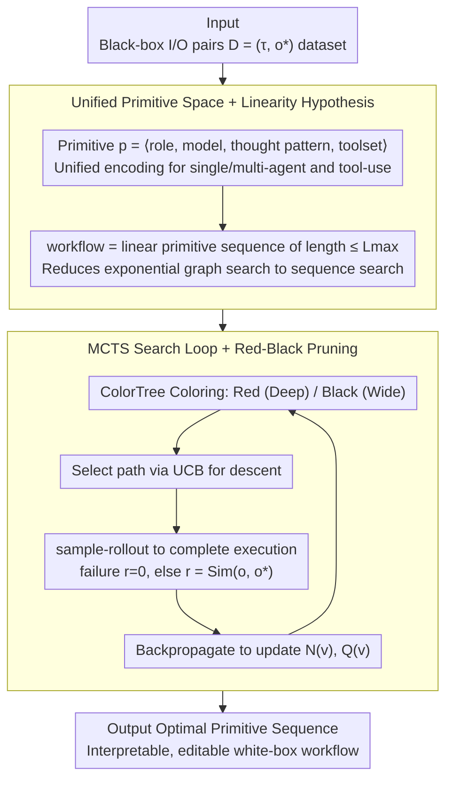

# AgentXRay: White-Boxing Agentic Systems via Workflow Reconstruction

**Conference**: ICML 2026  
**arXiv**: [2602.05353](https://arxiv.org/abs/2602.05353)  
**Code**: Not explicitly labeled in the paper (no clear link)  
**Area**: LLM Agent / Interpretability / Combinatorial Optimization  
**Keywords**: Agentic Workflow Reconstruction, MCTS, Red-Black Pruning, Black-box Explanation, Multi-agent

## TL;DR
The authors define the task of "inferring an equivalent white-box workflow from a black-box agent system" as AWR. They utilize MCTS to search within the sequence space of agent primitives, combined with dynamic Red-Black pruning based on scoring to balance search depth and width, achieving interpretable white-box reconstruction across five real-world domains.

## Background & Motivation

**Background**: LLM agents and multi-agent systems (MAS) solve complex tasks through role specialization and tool calling (e.g., ChatDev, MetaGPT). However, high-performance agents in actual deployment are typically black boxes—their internal prompts, agent topologies, and toolchains are invisible.

**Limitations of Prior Work**: Users only observe inputs and outputs, making it impossible to understand the decision-making process. This hinders debugging, modification, and safety auditing. Existing research on agent interpretability either focuses on single-step LLM reasoning or requires white-box access (e.g., model distillation), making them inapplicable to pure black-box APIs.

**Key Challenge**: The internal state space of black-box systems is immense (agent roles $\times$ models $\times$ thought patterns $\times$ toolsets $\times$ sequences). Even if input-output pairs can be sampled, exhaustive search is infeasible. Furthermore, classical distillation requires model parameters and is thus inapplicable.

**Goal**: Define a new task, Agentic Workflow Reconstruction (AWR): using only $(\tau, o^\ast)$ input-output pairs to synthesize an explicit, interpretable, and editable white-box workflow that produces outputs as consistent as possible with the black box upon execution.

**Key Insight**: (1) Linearity Hypothesis—most practical agent systems serialize into an action-observation sequence during execution (even if designed as graphs); thus, the search space can be restricted to a chain of primitives of length $\le L_{\max}$. (2) Output similarity is used as a proxy metric to bypass the undecidability of true functional equivalence.

**Core Idea**: Formulate AWR as a combinatorial optimization problem over a discrete primitive sequence space, and use MCTS with Red-Black pruning to efficiently approximate the optimal workflow under a token budget.

## Method

### Overall Architecture
AgentXRay aims to solve the following: given a black-box agent system $\mathcal{M}_{\text{black}}$ where only inputs and outputs are visible, infer a white-box workflow that reproduces its behavior. The input is a dataset $\mathcal{D}=\{(\tau_i, o_i^\ast)\}$ (task + black-box output pairs). The method first encodes all possible agent components into unified primitives $p=\langle \rho, \mu, \pi, T_{\text{local}}\rangle$ (role, underlying model, thought pattern, toolset), representing a candidate workflow as a linear primitive sequence $\mathbf{s}=[s_1,\dots,s_L]$ of length $L \le L_{\max}$. MCTS is then performed over this discrete sequence space with the objective of maximizing the proxy similarity $\mathbf{s}^\ast = \arg\max_{\mathbf{s}} \mathbb{E}_{(\tau,o^\ast)}[\mathrm{Sim}(\Phi(\mathbf{s},\tau), o^\ast)]$ (where $\mathrm{Sim}$ is a task-specific metric, such as AST for code or cosine similarity for text). During the search, Red-Black coloring is used to decide whether each node should undergo "deep exploration" or "breadth expansion," ultimately outputting the best sequence found as the white-box reconstruction.

### Key Designs

**1. Unified Primitive Space + Linearity Hypothesis: Compressing Graph Topology Search into Linear Sequence Search**

Searching pure graph topologies explodes on even medium-sized primitive sets—enumerating all agent topologies is $O(2^{|\Omega|^2})$, which is intractable. The authors break this through two layers of abstraction. The first is unifying heterogeneous components into a single search unit: each primitive is $\langle$role, model, thought pattern, local tools$\rangle$. Pure reasoning agents have $T_{\text{local}}=\emptyset$ and tool-augmented agents have $T_{\text{local}}\ne\emptyset$, allowing single-agent, multi-agent, and tool-use systems to fall within the same space $\Omega$. The second layer is the Linearity Hypothesis: drawing from MacNet (Qian 2025), which notes that multi-agent DAG execution is topologically sorted and interactions in ReAct/WebArena are naturally ordered traces, the search space is restricted to linear sequences of length $\le L_{\max}$. This reduces complexity from $O(2^{|\Omega|^2})$ to $O(|\Omega|^{L_{\max}})$. Its effectiveness lies in the fact that reconstruction seeks "behavioral fidelity" (I/O matching) rather than internal topology restoration—reproducing the observable execution sequence is sufficient. Thus, linearization is a task-aligned pruning step rather than a lossy approximation.

**2. MCTS Search Loop: Amortizing Search Costs of Sparse Rewards via Statistical Sampling**

Even when compressed to linear sequences, $|\Omega|^{L_{\max}}$ remains non-enumerable, and $\mathrm{Sim}$ is a delayed reward—observable only when the workflow is near completion and executed. AgentXRay handles this sparse signal using MCTS: each iteration draws one $(\tau, o^\ast)$ and descends from the root (representing a workflow prefix) by selecting edges (appending primitives) based on UCB. Upon reaching a node to be expanded, a sample-rollout is performed—sampling primitives to complete the sequence to $L_{\max}$ and executing it to obtain output $o$. Execution failure results in $r=0$, otherwise $r=\mathrm{Sim}(o, o^\ast)$. This is followed by backpropagating through the path to update visit counts $N(v)$ and values $Q(v)$. Compared to brute force, MCTS amortizes the search cost through sampling; UCB robustly balances exploration and exploitation in a heterogeneous action space of roles, models, and tools; once a rollout hits an invalid primitive, it halts early to avoid wasting tokens on the entire chain.

**3. Red-Black Pruning: Dynamic Scoring for Coloring, Directing Budget to Promising and Deep Subtrees**

Standard MCTS can stall on large $\Omega$—either remaining too broad to go deep or getting stuck in poor branches. Red-Black pruning makes "whether to continue refining the current path" a node-level dynamic decision. Before each iteration, ColorTree recolors the entire tree: nodes with high scores and sufficient visit counts are labeled Red (current choice is stable), continuing descent via UCB. Nodes that are not yet sufficiently explored are labeled Black, prioritizing the creation of new child nodes to expand width. The entire search loop (Algorithm 1) consists of color-guided descent (Line 9), early-stop rollout (Lines 11–13), and reward backpropagation (Line 22). Unlike static threshold pruning, this quantifies the decision based on "confidence in deeper exploration," directing resources to subtrees worth intensive search. Consequently, it reaches deeper workflow levels and achieves higher fidelity within the same iteration budget.

### Loss & Training
This is a non-gradient method with no training phase. The "loss" is the negative proxy similarity $-\mathrm{Sim}(\Phi(\mathbf{s},\tau), o^\ast)$, and the "optimizer" is MCTS + Red-Black Pruning. Since each workflow execution requires actual LLM API calls (GPT/Gemini, etc.), the budget is measured by the number of iterations $N$ and total tokens rather than gradient steps.

## Key Experimental Results

### Main Results
Five domains and five target systems: Software Development (ChatDev), Data Analysis (MetaGPT), Education (TeachMaster), 3D Modeling (ChatGPT GPT-5.2 API), and Scientific Computing (Gemini 3 Pro). Proxy similarity is measured by Static Functional Equivalence (SFE).

| Domain / Target System | Metric | Avg. SFE (Ours) | Remarks |
|-------------------------|--------|----------------------|---------|
| Software Dev / ChatDev | AST-based | High SFE (Avg 0.426) | Reconstructed executable dev workflow |
| Data Analysis / MetaGPT | AST + Text | Same as above | Multi-agent collaboration linearized |
| Education / TeachMaster | Text Sim | Same as above | Restored instructional flow |
| 3D Modeling / ChatGPT | Output Comp | Same as above | Single agent + tool-use chain |
| Science / Gemini 3 Pro | Output Comp | Same as above | Approx. long-chain scientific reasoning |
| Comprehensive | — | 0.426 SFE | Significantly higher than no-pruning baseline |

### Ablation Study

| Configuration | Phenomenon | Interpretation |
|---------------|------------|----------------|
| Full AgentXRay (MCTS + Red-Black) | Best SFE, 8–22% token reduction | Pruning enables deeper search under same budget |
| No Red-Black Pruning (Pure MCTS) | Lower SFE + more tokens | Lack of scoring guidance scatters resources uniformly |
| No Linearization (Graph Search) | Infeasible | $O(2^{|\Omega|^2})$ search explosion |
| Different $L_{\max}$ | Optimal at medium length | Too short lacks expressivity; too long increases rollout failure |
| Different Score Func (Sim vs Sim + Depth) | Multi-dimensional score better | Combined "fidelity + depth" score makes Red-Black more sensitive |

### Key Findings
- Red-Black pruning is the key factor for token efficiency: under the same iteration budget, pruning allows the search to reach deeper workflow levels, thereby achieving better fidelity.
- The Linearity Hypothesis provides usable fidelity across five distinct domains (including true multi-agent systems like ChatDev and MetaGPT), validating that the "topological order at execution time" is the primary observable signal of black boxes.
- AgentXRay approximates behavior even when the target system is a closed-source API like GPT-5.2 or Gemini 3 Pro using only I/O access; this implies white-box reconstruction is effective for real-world commercial black boxes.
- The reconstructed workflow is editable—users can replace a specific role or tool for downstream adaptation, which is a fundamental difference from model distillation.

## Highlights & Insights
- Formulating interpretability as "behavioral equivalence + structural white-box" at the observable level avoids the impossible task of accessing model parameters; this is a pragmatic paradigm for "interpretability."
- The unified primitive definition covers both agents and tools, ensuring the search space conceptually holds for single-agent + tool-use systems—expanding applicability beyond just multi-agent systems.
- Red-Black pruning turns the "prune vs. not prune" choice into a node-level dynamic decision (based on scoring), which is more robust than static threshold pruning and transferable to any LLM agent search with sparse rewards.
- Using SFE as a proxy metric circumvents the undecidability of "true functional equivalence." This is a realistic compromise for open-ended multi-file outputs, applicable to code synthesis and agent evaluation domains.

## Limitations & Future Work
- The Linearity Hypothesis acts as an upper bound: systems heavily reliant on concurrent or asynchronous multi-agent behaviors (e.g., synchronous dialogues, cyclic feedback) might have their essential behaviors missed by linear sequences.
- The evaluation metric SFE is a proxy; in certain tasks, AST matching or text similarity might not distinguish true functional differences, potentially misleading the MCTS scoring.
- Each rollout requires actual workflow execution, costing several LLM calls per iteration; while the 8–22% saving is significant relatively, the absolute cost remains high after $N$ iterations.
- The primitive space $\Omega$ requires predefined candidates for roles, models, patterns, and tools; if the black box uses a unique trick not in $\Omega$, it can never be reconstructed.

## Related Work & Insights
- **vs. Model Distillation**: Distillation requires parameter access and produces black-box student models; AWR requires only I/O and produces white-box editable workflows.
- **vs. MacNet / Multi-agent Graph Structure (Qian 2025)**: MacNet uses DAGs to train new agents; Ours does the opposite—inferring an equivalent linear workflow from a black-box agent.
- **vs. Interactive Agents (e.g., ReAct, WebArena)**: Those works design agents; Ours uses observations to reverse-engineer agents, providing an interpretable representation.
- **vs. MCTS-for-LLM (e.g., ToT, AgentTrek)**: They use MCTS to search for a single reasoning path; Ours uses MCTS to search for the "agent construction graph itself," which is a higher layer of abstraction.

## Rating
- Novelty: ⭐⭐⭐⭐⭐ The AWR task definition is new, and Red-Black scoring-based pruning is a substantial improvement to MCTS.
- Experimental Thoroughness: ⭐⭐⭐⭐ Coverage of five domains and real closed-source APIs, though domain details and statistical significance could be further strengthened.
- Writing Quality: ⭐⭐⭐⭐ Motivation, unified primitives, and the Linearity argument are very clear; Algorithm 1 is straightforward and reproducible.
- Value: ⭐⭐⭐⭐ Directly aids the interpretability, controllability, and auditability of agent deployment; provides a practical tool for reverse-engineering closed-source agent APIs.

<!-- RELATED:START -->

## Related Papers

- [\[AAAI 2026\] A2Flow: Automating Agentic Workflow Generation via Self-Adaptive Abstraction Operators](../../AAAI2026/llm_agent/a2flow_automating_agentic_workflow_generation_via_self-adaptive_abstraction_oper.md)
- [\[ICML 2026\] Answer Only as Precisely as Justified: Calibrated Claim-Level Specificity Control for Agentic Systems](answer_only_as_precisely_as_justified_calibrated_claim-level_specificity_control.md)
- [\[ICLR 2026\] AgenTracer: Who Is Inducing Failure in the LLM Agentic Systems?](../../ICLR2026/llm_agent/agentracer_who_is_inducing_failure_in_the_llm_agentic_systems.md)
- [\[ACL 2026\] Rethinking Reasoning-Intensive Retrieval: Evaluating and Advancing Retrievers in Agentic Search Systems](../../ACL2026/llm_agent/rethinking_reasoning-intensive_retrieval_evaluating_and_advancing_retrievers_in_.md)
- [\[AAAI 2026\] With Great Capabilities Come Great Responsibilities: Introducing the Agentic Risk & Capability Framework for Governing Agentic AI Systems](../../AAAI2026/llm_agent/with_great_capabilities_come_great_responsibilities_introducing_the_agentic_risk.md)

<!-- RELATED:END -->
