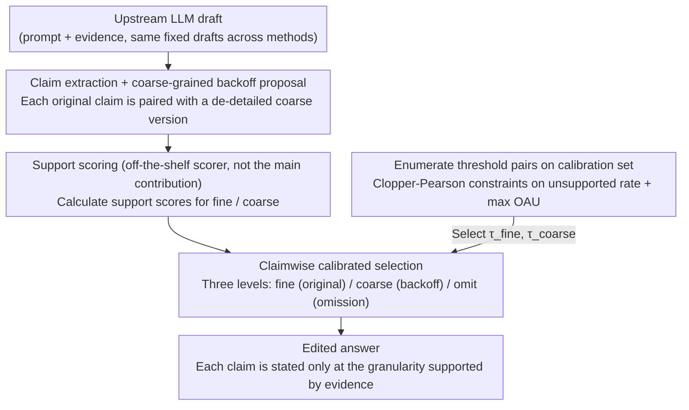

# Answer Only as Precisely as Justified: Calibrated Claim-Level Specificity Control for Agentic Systems

**Conference**: ICML 2026  
**arXiv**: [2604.17487](https://arxiv.org/abs/2604.17487)  
**Code**: Not provided in the cached text  
**Area**: LLM Agent / Uncertainty Calibration  
**Keywords**: claim-level fact-checking, specificity control, calibrated selection, over-commitment, long-form factuality  

## TL;DR
This paper models the issue of "stating details without sufficient evidence" in agentic systems as a claim-level over-commitment problem. It proposes calibrated CSS: a calibrated selection for each atomic claim among precise expression, coarse-grained backoff, and omission. In LongFact full-scale experiments, it improves OAU from 0.8460 (without post-processing) to 0.9130 while retaining a specificity of 0.9381.

## Background & Motivation
**Background**: Modern LLM agents often do not generate a single-turn answer but instead retrieve evidence, call tools, aggregate multiple facts, and deliver results to users or downstream modules. Such outputs are naturally composed of many claims: some are strongly supported by evidence, some only hold in a broad sense, and some specific details are not supported.

**Limitations of Prior Work**: Traditional answer-level uncertainty handling is too coarse. Rejecting the entire answer results in the loss of useful, supported content; providing the answer as-is risks over-committing to details such as dates, numbers, and entity relations. Long-form factuality research has shown that an answer often contains a mix of correct and incorrect content, so a single confidence score for the entire paragraph cannot guide the system on which information to retain.

**Key Challenge**: The conflict between reliability and informativeness manifests not just in "to answer or not," but in "at what semantic granularity to answer." A coarse-grained version of a claim may be supported by evidence, while the original fine-grained version is not; deleting the entire claim is too conservative, but keeping the original sentence leads to over-commitment.

**Goal**: The authors aim to construct a black-box post-processing layer that does not retrain the upstream model or modify the retrieval stack. Instead, it decides the most appropriate semantic precision claim-by-claim on a fixed draft. It performs three tasks: identifies the original claim, generates usable coarse-grained backoffs, and uses calibration rules to select between fine, coarse, or omit.

**Key Insight**: A key observation is that uncertainty can be expressed as local semantic backoff instead of vague phrasing or global rejection. For example, if evidence supports "the treaty was signed in Geneva" but not "signed in a specific year," the system should back off to the former rather than deleting the entire sentence or retaining the incorrect year.

**Core Idea**: Use a calibrated claim-level selector to choose the highest precision allowed by evidence among "original fine-grained claim / coarse-grained claim / omit," thereby allowing the agentic system to speak only at the granularity supported by evidence.

## Method
The proposed CSS (compositional selective specificity) can be viewed as a semantic precision controller placed after the generator. The inputs are the prompt, available evidence, and a draft answer generated by the upstream LLM; the output is not a regenerated answer but a local edit of each claim within the draft.

The focus of this design is not on training a new verifier but on transforming existing support scores into deployable selection strategies. The support estimator itself is composed of LLM-based support judgments and lightweight lexical/entity features, fixed during a single run; the core contribution is how to use these noisy scores to select the output granularity of claims.

### Overall Architecture
The overall process is divided into four steps.

Step 1 is draft generation: The upstream LLM generates an initial answer based on the prompt and evidence. All comparison strategies are based on the same set of fixed drafts; thus, the experiment compares post-processing selection strategies rather than differences between generators.

Step 2 is claim extraction and backoff proposal: The system breaks the draft into atomic claims $c_1, \ldots, c_m$. For each original claim $c_i$, the system generates a coarse-grained version $\tilde{c}_i$, aiming to retain the core meaning while removing details that might not be supported.

Step 3 is support scoring: Support scores $s_i^{\mathrm{fine}}$ and $s_i^{\mathrm{coarse}}$ are estimated for the fine and coarse claims respectively. During offline evaluation, binary support labels $y_i^{\mathrm{fine}}$ and $y_i^{\mathrm{coarse}}$ are available, but these are used only for scoring and oracle upper bounds, not provided to the deployable selector.

Step 4 is claimwise selection: The selector takes an action $\pi_i \in \{\mathrm{fine}, \mathrm{coarse}, \mathrm{omit}\}$ for each claim. If the fine score exceeds a threshold, the original claim is kept; if the fine score fails but the coarse score exceeds a threshold, the coarse version is output; if both fail, the claim is omitted.

### Key Designs
**1. Three-tier semantic specificity ladder: Adding semantic granularity beyond "Answer/Abstain"**

Traditional uncertainty handling only chooses between "retaining the whole" and "rejecting the whole"—rejection loses much useful content that was originally supported, while retention over-commits to unsupported details like dates or numbers. CSS refines the output space of each claim into three tiers: fine is the original fine-grained claim, coarse is a rewrite removing unstable details (local precision reduction rather than deletion), and omit is complete removal. The value of the three tiers is described by specificity weights: $w(\mathrm{omit})=0$, $w(\mathrm{coarse})=\gamma$, and $w(\mathrm{fine})=1$ (the experiment uses $\gamma=0.6$). This is more aligned with real-world error patterns than binary "keep/delete" actions—many claims are not completely invalid but are simply too specific; coarse backoff allows the system to step back when fine granularity is indefensible, retaining the core meaning supported by evidence.

**2. Over-commitment-aware utility (OAU): Measuring "useful retention" and "unsupported over-commitment" on the same scale**

If only support precision is measured, the system can achieve falsely high scores through "excessive deletion/rejection"; if only specificity retention is measured, it tolerates the retention of unsupported details. The paper uses OAU (over-commitment-aware utility) to combine both tendencies into one objective: positive rewards for supported specificity and negative penalties for claims that are "emitted but unsupported," formally approximated as the average of $w(\pi_i)y_i^{\mathrm{sel}} - e_i(1-y_i^{\mathrm{sel}})$ for each claim (the paper also reports support precision, specificity retention, and supported specificity as side metrics). Crucially, OAU is not just an evaluation metric; it is the objective maximized when calibrating thresholds, thus directly defining "what makes a good claimwise selection strategy."

**3. Calibration threshold selection under Clopper-Pearson constraints: Mapping noisy scores to deployable thresholds via upper confidence bounds**

Support scores are inherently noisy, and their distributions shift with datasets, models, and runs; manually fixing thresholds is either too conservative or fails to suppress risk. CSS instead enumerates threshold pairs $(\tau_{\mathrm{fine}}, \tau_{\mathrm{coarse}})$ on a held-out calibration set: for each pair, it counts the number of unsupported emitted claims $k$ and emitted claims $n$ in the calibration set, calculates a one-sided Clopper-Pearson upper confidence bound, and only retains threshold pairs satisfying $\mathrm{CPUpper}(k,n;\delta) \leq \alpha$ (experiments use $\alpha=0.10, \delta=0.05$). Among valid pairs, the one with the highest calibration OAU is selected. This allows the selector to keep the risk of unsupported emission within a budget while automatically moving to a higher utility operating point. The paper cautiously notes that since the same calibration set is used both to filter thresholds and maximize OAU, this is a conservative calibration rule rather than an end-to-end distribution-free conformal guarantee.

### Loss & Training
CSS is not an end-to-end training method and thus has no training loss in the traditional sense. Its "training/selection" occurs at two levels: first, the support scorer is fit once per run and fixed; second, calibrated CSS selects threshold pairs on a calibration split. The full LongFact experiment employs five-fold out-of-fold evaluation: each prompt is evaluated on a held-out fold, with scorer fitting and threshold calibration performed on the remaining folds.

The paper also emphasizes that this calibration step is not a full conformal guarantee. Because the same calibration split is used for both filtering threshold pairs and maximizing OAU, the authors refer to it as a conservative calibration rule rather than an end-to-end distribution-free guarantee.

## Key Experimental Results

### Main Results
The main experiment uses the full LongFact set of 2,280 prompts, extracting a total of 11,705 claims. All methods are compared on the same batch of fixed GPT-5.4 drafts. Metrics are calculated according to a claimwise protocol rather than the official SAFE/F1@K leaderboard metrics.

| Dataset / Run | Strategy | Samples | Emitted claims / Total claims | Support precision | Specificity retention | Supported specificity | OAU |
|---------------|------|--------|--------------------------|-------------------|------------------------|-----------------------|-----|
| LongFact full / GPT-5.4 | No CSS | 2280 | 11705 / 11705 | 0.9230 | 1.0000 | 0.9230 | 0.8460 |
| LongFact full / GPT-5.4 | Whole abstain | 2280 | 7365 / 11705 | 0.9825 | 0.6292 | 0.6182 | 0.6072 |
| LongFact full / GPT-5.4 | Claim-drop | 2280 | 10823 / 11705 | 0.9877 | 0.9246 | 0.9133 | 0.9019 |
| LongFact full / GPT-5.4 | Uncalibrated CSS | 2280 | 10948 / 11705 | 0.9934 | 0.8633 | 0.8583 | 0.8521 |
| LongFact full / GPT-5.4 | Calibrated CSS | 2280 | 11085 / 11705 | 0.9865 | 0.9381 | 0.9258 | 0.9130 |
| LongFact full / GPT-5.4 | Oracle CSS | 2280 | 11056 / 11705 | 1.0000 | 0.9359 | 0.9359 | 0.9359 |

The core conclusion of this table is that calibrated CSS does not merely pursue the highest precision. Compared to No CSS, it increases support precision from 0.9230 to 0.9865 and OAU from 0.8460 to 0.9130. Compared to uncalibrated CSS, it sacrifices a tiny amount of precision but increases specificity retention from 0.8633 to 0.9381, resulting in a 0.0609 higher final OAU.

### Ablation Study
The key ablation in the paper compares fixed-threshold CSS with calibrated CSS, replicated on LongFact pilot and HotpotQA pilot datasets. Each pilot uses 200 samples, divided into 30 for fitting, 30 for calibration, and 140 for testing.

| Dataset / Model | Strategy | Test Samples | claims | Support precision | Specificity retention | Supported specificity | OAU |
|---------------|------|------------|--------|-------------------|------------------------|-----------------------|-----|
| LongFact pilot / GPT-5.4 | Uncalibrated CSS | 140 | 721 / 757 | 0.9958 | 0.5900 | 0.5876 | 0.5836 |
| LongFact pilot / GPT-5.4 | Calibrated CSS | 140 | 724 / 757 | 0.9931 | 0.9411 | 0.9355 | 0.9289 |
| HotpotQA pilot / GPT-5.4 | Uncalibrated CSS | 140 | 409 / 470 | 0.9829 | 0.6209 | 0.6111 | 0.5962 |
| HotpotQA pilot / GPT-5.4 | Calibrated CSS | 140 | 429 / 470 | 0.9790 | 0.9000 | 0.8809 | 0.8617 |
| HotpotQA pilot / Claude Sonnet 4.6 | Uncalibrated CSS | 140 | 622 / 648 | 0.9936 | 0.7191 | 0.7142 | 0.7080 |
| HotpotQA pilot / Claude Sonnet 4.6 | Calibrated CSS | 140 | 628 / 648 | 0.9904 | 0.9475 | 0.9395 | 0.9302 |

### Key Findings
- Fixed-threshold CSS across multiple pilots appears "extremely safe but too conservative": precision is near 0.99, but specificity retention is significantly low (0.5900 on LongFact pilot).
- The gains from calibration come primarily from selecting an operating point rather than changing the verifier. In the three pilots, calibrated CSS loses only around 0.0027 to 0.0039 in precision but vastly improves retention and OAU.
- Claim-drop is a strong baseline, but it lacks coarse backoff and can only delete fine claims that fail the threshold. Calibrated CSS outperforms claim-drop on LongFact full, indicating that "local precision reduction" retains more useful information than "deleting details."
- The full-run OAU for Oracle CSS is 0.9359, while calibrated CSS achieves 0.9130. The gap exists but is small, suggesting the current selection layer captures most available gains and further improvements likely require stronger claim extraction, backoff generation, and support estimation.

## Highlights & Insights
- Reframing the "hallucination" problem as an "over-commitment" problem is a practical perspective. Many agent outputs are not entirely wrong but provide overly specific dates, numbers, or relations when evidence is insufficient; CSS targets this gray area perfectly.
- Coarse backoff is a more suitable uncertainty interface for agentic pipelines than abstention. Instead of simply saying "I don't know," it explicitly writes out what the system knows to a certain level, allowing downstream modules to decide whether to re-retrieve, upgrade the verifier, or hand off to a human.
- The design of OAU avoids a "false victory" of high precision with no content. While whole-answer abstention and uncalibrated CSS both reduce errors, only calibrated CSS maintains high support precision while retaining useful specificity.
- The most transferable value of this paper is "converting uncertainty into local editing strategies." Similar ideas can be applied to back off uncertain API details in code generation, control diagnostic levels in medical reports, or control the granularity of time, location, and entity relations in multi-hop QA.

## Limitations & Future Work
- The full LongFact experiment uses a custom claimwise protocol rather than the official SAFE/F1@K pipeline. Thus, these numbers illustrate claim-level post-processing effects and should not be directly compared with official LongFact leaderboard scores.
- HotpotQA and LongFact pilots consist of only 200 samples, with 140 for testing. While they show calibration trends, they are insufficient to cover complex retrieval failures, tool call failures, and multi-turn agent interactions.
- Oracle CSS is merely an upper bound, not a deployable method. Real systems still inherit errors from claim extraction, coarse backoff generation, and support estimation; if the backoff itself is a distorted rewrite, no calibration can guarantee semantic correctness.
- The calibration rule is currently not a full distribution-free guarantee. The paper uses the Clopper-Pearson bound to constrain unsupported emission, but the same set is used to select the max OAU threshold; thus, a stricter finite-sample validity layer is needed.
- The current method primarily handles post-processing of fixed drafts and has not yet studied continuous monitoring or sequential agent scenarios. Real agents might re-retrieve or adjust task plans based on downgraded claims, introducing new feedback loops.

## Related Work & Insights
- **vs Selective Prediction / Conformal Prediction**: Traditional selective prediction often accepts or rejects an entire sample; conformal prediction provides distribution-free uncertainty sets. This work draws on risk control ideas but applies them to the semantic granularity of each claim within an answer.
- **vs FActScore / LongFact**: FActScore and LongFact focus on the factuality evaluation of atomic facts in long-form outputs; CSS goes a step further by asking "how to edit the output if a fact is not fully supported," moving from evaluation to an executable control layer.
- **vs SelfCheckGPT / Chain-of-Verification**: These methods emphasize posterior verification and hallucination reduction, usually outputting verifier judgments or rewrite prompts; this paper explicitly links verifier scores to fine/coarse/omit decisions, forming a more structured output strategy.
- **vs Conformal Linguistic Calibration / Selective Abstraction**: These works similarly focus on trading off factuality and specificity; this paper emphasizes agentic deployment, viewing the output as a claim-level uncertainty interface for downstream auditing, upgrading, and re-retrieval.

## Rating
- Novelty: ⭐⭐⭐⭐☆ Clear problem definition modeling over-commitment as claim-level specificity control, combining coarse backoff with calibrated selection.
- Experimental Thoroughness: ⭐⭐⭐⭐☆ Supports main conclusions with full LongFact (2,280 prompts) plus multiple pilots, though pilots are small and the protocol is not official SAFE/F1@K.
- Writing Quality: ⭐⭐⭐⭐☆ Clear structure and well-explained metrics and baselines, with a cautious distinction between the deployable selector and the oracle ceiling.
- Value: ⭐⭐⭐⭐⭐ Highly insightful for practical agent systems by providing a reliability interface that is finer than abstention and safer than as-is answers.

<!-- RELATED:START -->

## Related Papers

- [\[ICML 2026\] AgentXRay: White-Boxing Agentic Systems via Workflow Reconstruction](agentxray_white-boxing_agentic_systems_via_workflow_reconstruction.md)
- [\[ICLR 2026\] CoDA: Agentic Systems for Collaborative Data Visualization](../../ICLR2026/llm_agent/coda_agentic_systems_for_collaborative_data_visualization.md)
- [\[ICLR 2026\] AgenTracer: Who Is Inducing Failure in the LLM Agentic Systems?](../../ICLR2026/llm_agent/agentracer_who_is_inducing_failure_in_the_llm_agentic_systems.md)
- [\[ICML 2026\] OTora: A Unified Red Teaming Framework for Reasoning-Level Denial-of-Service in LLM Agents](otora_a_unified_red_teaming_framework_for_reasoning-level_denial-of-service_in_l.md)
- [\[ICLR 2026\] EvoTest: Evolutionary Test-Time Learning for Self-Improving Agentic Systems](../../ICLR2026/llm_agent/evotest_evolutionary_test-time_learning_for_self-improving_agentic_systems.md)

<!-- RELATED:END -->
