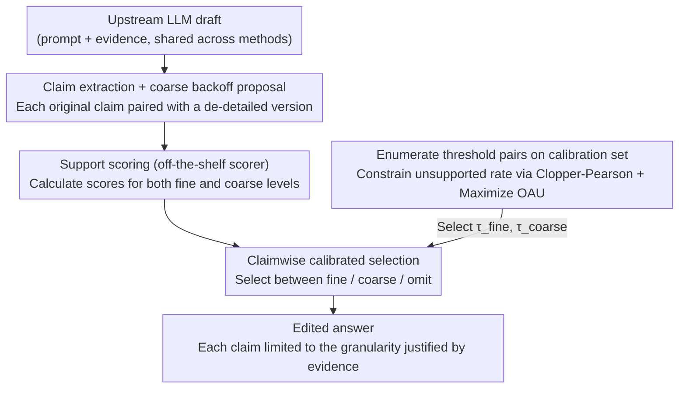

# Answer Only as Precisely as Justified: Calibrated Claim-Level Specificity Control for Agentic Systems

**Conference**: ICML 2026  
**arXiv**: [2604.17487](https://arxiv.org/abs/2604.17487)  
**Code**: Not provided in cached body  
**Area**: LLM Agent / Uncertainty Calibration  
**Keywords**: claim-level fact-checking, specificity control, calibrated selection, over-commitment, long-form factuality  

## TL;DR
This paper models the issue of "overly detailed expression with insufficient evidence" in agentic systems as a claim-level over-commitment problem and proposes calibrated CSS: a method that performs calibrated selection among precise expression, coarse-grained backoff, and omission for each atomic claim. In full LongFact experiments, it improves OAU from 0.8460 (without post-processing) to 0.9130 while retaining a specificity of 0.9381.

## Background & Motivation
**Background**: Modern LLM agents typically do not generate a single-turn answer but instead retrieve evidence, call tools, aggregate multiple facts, and deliver results to users or downstream modules. Such outputs are naturally composed of many claims: some are strongly supported by evidence, some are true only in a general sense, and others contain details not supported by the evidence.

**Limitations of Prior Work**: Traditional answer-level uncertainty handling is too coarse. Refusing the entire answer causes the system to discard much useful and supported content; providing the answer as-is risks over-committing to details like dates, numbers, or entity relations. Research on long-form factuality has shown that an answer often mixes correct and incorrect content, so a single confidence score for the entire block cannot guide the system on which information to retain.

**Key Challenge**: The tension between reliability and informativeness exists not just in "to answer or not," but in "at what level of semantic granularity to answer." A coarse-grained version of a claim might be supported by evidence while the original fine-grained version is not; deleting the entire claim is too conservative, while keeping the original sentence leads to over-commitment.

**Goal**: The authors aim to construct a black-box post-processing layer that does not retrain the upstream model or modify the retrieval stack. Instead, it determines the most appropriate semantic precision for each claim in a fixed draft. It performs three tasks: identifying the original claim, generating a usable coarse-grained backoff, and using calibration rules to select between fine, coarse, or omit.

**Key Insight**: The paper's key observation is that uncertainty can be expressed as local semantic backoff rather than vague phrasing or global refusal. For instance, if evidence supports "the treaty was signed in Geneva" but not "signed in a specific year," the system should back off to the former instead of deleting the sentence or retaining the wrong year.

**Core Idea**: Use a calibrated claim-level selector to choose the highest precision allowed by evidence among three tiers—"original precise claim / coarse-grained claim / omit"—ensuring the agentic system only speaks at a granularity justified by the evidence.

## Method
The proposed CSS (compositional selective specificity) acts as a semantic precision controller placed after the generator. The inputs are the prompt, available evidence, and a draft answer generated by the upstream LLM; the output is not a regenerated answer but a local edit of each claim within the draft.

The focus is not on training a new verifier but on turning existing support scores into a deployable selection strategy. The support estimator itself consists of LLM-based support judgments combined with lightweight lexical/entity features and remains fixed during a run; the core contribution is how to use these noisy scores to select the output granularity of a claim.

### Overall Architecture
The workflow consists of four steps.

First is draft generation: the upstream LLM generates an initial answer based on the prompt and evidence. All comparison strategies use the same fixed drafts, so experiments compare post-processing selection strategies rather than differences between generators.

Second is claim extraction and backoff proposal: the system decomposes the draft into atomic claims $c_1, \ldots, c_m$. For each original claim $c_i$, the system generates a coarse-grained version $\tilde{c}_i$, aiming to preserve the central meaning while removing details likely unsupported by evidence.

Third is support scoring: support scores $s_i^{\mathrm{fine}}$ and $s_i^{\mathrm{coarse}}$ are estimated for the fine and coarse claims, respectively. Offline evaluation uses binary support labels $y_i^{\mathrm{fine}}$ and $y_i^{\mathrm{coarse}}$, but these are only used for scoring and oracle bounds, not provided to the deployable selector.

Fourth is claimwise selection: the selector takes an action $\pi_i \in \{\mathrm{fine}, \mathrm{coarse}, \mathrm{omit}\}$ for each claim. If the fine score exceeds a threshold, the original claim is kept; if the fine score fails but the coarse score succeeds, the coarse version is output; if both fail, the claim is omitted.

### Key Designs
**1. Three-tier semantic specificity ladder: Adding granular options beyond "Answer/Refuse"**

Traditional uncertainty handling only chooses between "Keep all" and "Refuse all"—refusal discards much useful supported content, while keeping original text over-commits to details like dates or entities not supported by evidence. CSS refines the output space of each claim into three tiers: fine (original fine-grained claim), coarse (a rewrite removing unstable details, reducing local precision without deletion), and omit (no output). Values are characterized by specificity weights: $w(\mathrm{omit})=0$, $w(\mathrm{coarse})=\gamma$, and $w(\mathrm{fine})=1$ (set to $\gamma=0.6$ in experiments). This is more suited to real-world errors where claims aren't entirely invalid but are merely too specific; coarse backoff allows the system to step back when fine details are indefensible, preserving the core meaning supported by evidence.

**2. Over-commitment-aware utility (OAU): Measuring "useful retention" vs. "incorrect over-commitment" on one scale**

If evaluating only by support precision, systems can inflate scores via massive deletion/refusal; if evaluating only by specificity retention, they are permitted to keep unsupported details. The paper uses OAU to bridge these: providing positive rewards for supported specificity and negative penalties for unsupported emissions. It is formally approximated as the average of $w(\pi_i)y_i^{\mathrm{sel}} - e_i(1-y_i^{\mathrm{sel}})$ for each claim. Crucially, OAU is not just an evaluation metric but the objective maximized during threshold calibration, directly defining what constitutes an "optimal" claimwise selection strategy.

**3. Calibration under Clopper-Pearson constraints: Turning noisy scores into deployable thresholds**

Support scores are noisy and their distributions shift with datasets, models, or runs; manual thresholds are either too conservative or fail to control risk. CSS enumerates threshold pairs $(\tau_{\mathrm{fine}}, \tau_{\mathrm{coarse}})$ on a held-out calibration set. For each pair, it counts unsupported emitted claims $k$ and total emitted claims $n$, calculates the one-sided Clopper-Pearson upper confidence bound, and retains only pairs satisfying $\mathrm{CPUpper}(k,n;\delta) \leq \alpha$ (using $\alpha=0.10, \delta=0.05$). Among valid pairs, the one with the highest calibration OAU is selected. This allows the selector to keep the risk of unsupported emissions within a budget while automatically moving to higher-utility operating points. The paper notes this is a conservative calibration rule, not an end-to-end distribution-free conformal guarantee.

### Loss & Training
CSS is not an end-to-end training method and thus lacks a traditional training loss. Its "training/selection" occurs at two levels: the support scorer is fit once per run and fixed, and calibrated CSS selects threshold pairs on a calibration split. The full LongFact experiment employs five-fold out-of-fold evaluation: each prompt is evaluated on a held-out fold, while scorer fitting and threshold calibration are performed on the remaining folds.

## Key Experimental Results

### Main Results
The main experiment uses the full LongFact set of 2,280 prompts with 11,705 extracted claims. All methods are compared on the same fixed GPT-5.4 drafts. Metrics are calculated using a claimwise protocol rather than standard LongFact SAFE/F1@K leaderboard metrics.

| Dataset / Run | Strategy | Samples | Output claims / Total claims | Support precision | Specificity retention | Supported specificity | OAU |
|---------------|------|--------|--------------------------|-------------------|------------------------|-----------------------|-----|
| LongFact full / GPT-5.4 | No CSS | 2280 | 11705 / 11705 | 0.9230 | 1.0000 | 0.9230 | 0.8460 |
| LongFact full / GPT-5.4 | Whole abstain | 2280 | 7365 / 11705 | 0.9825 | 0.6292 | 0.6182 | 0.6072 |
| LongFact full / GPT-5.4 | Claim-drop | 2280 | 10823 / 11705 | 0.9877 | 0.9246 | 0.9133 | 0.9019 |
| LongFact full / GPT-5.4 | Uncalibrated CSS | 2280 | 10948 / 11705 | 0.9934 | 0.8633 | 0.8583 | 0.8521 |
| LongFact full / GPT-5.4 | Calibrated CSS | 2280 | 11085 / 11705 | 0.9865 | 0.9381 | 0.9258 | 0.9130 |
| LongFact full / GPT-5.4 | Oracle CSS | 2280 | 11056 / 11705 | 1.0000 | 0.9359 | 0.9359 | 0.9359 |

The core conclusion is that calibrated CSS does not simply chase the highest precision. Compared to "No CSS," it raises support precision from 0.9230 to 0.9865 and OAU from 0.8460 to 0.9130. Compared to uncalibrated CSS, it sacrifices a small amount of precision to increase specificity retention from 0.8633 to 0.9381, resulting in a 0.0609 higher OAU.

### Ablation Study
The key ablation compares fixed-threshold CSS against calibrated CSS across LongFact pilot and HotpotQA pilot datasets. Each pilot consists of 200 samples (30 fit, 30 calibration, 140 test).

| Dataset / Model | Strategy | Test Samples | claims | Support precision | Specificity retention | Supported specificity | OAU |
|---------------|------|------------|--------|-------------------|------------------------|-----------------------|-----|
| LongFact pilot / GPT-5.4 | Uncalibrated CSS | 140 | 721 / 757 | 0.9958 | 0.5900 | 0.5876 | 0.5836 |
| LongFact pilot / GPT-5.4 | Calibrated CSS | 140 | 724 / 757 | 0.9931 | 0.9411 | 0.9355 | 0.9289 |
| HotpotQA pilot / GPT-5.4 | Uncalibrated CSS | 140 | 409 / 470 | 0.9829 | 0.6209 | 0.6111 | 0.5962 |
| HotpotQA pilot / GPT-5.4 | Calibrated CSS | 140 | 429 / 470 | 0.9790 | 0.9000 | 0.8809 | 0.8617 |
| HotpotQA pilot / Claude Sonnet 4.6 | Uncalibrated CSS | 140 | 622 / 648 | 0.9936 | 0.7191 | 0.7142 | 0.7080 |
| HotpotQA pilot / Claude Sonnet 4.6 | Calibrated CSS | 140 | 628 / 648 | 0.9904 | 0.9475 | 0.9395 | 0.9302 |

### Key Findings
- Uncalibrated CSS is "extremely safe but too conservative" across pilots: precision is near 0.99, but specificity retention is significantly lower (0.5900 in LongFact pilot).
- The gain from calibration stems from selecting the operating point rather than changing the verifier. In all three pilots, calibrated CSS loses only ~0.0027 to 0.0039 in precision while drastically improving retention and OAU.
- Claim-drop is a strong baseline but lacks coarse backoff and can only delete fine claims that fail thresholds. Calibrated CSS outperforms claim-drop on LongFact full, proving "local precision reduction" preserves more useful information than "detail deletion."
- Oracle CSS achieved a full-run OAU of 0.9359 while calibrated CSS reached 0.9130. This suggests the current selection layer captures most available gains, and future improvements should come from better claim extraction, backoff generation, and support estimation.

## Highlights & Insights
- Reframing the "hallucination" problem as an "over-commitment" problem is a practical perspective. Many agent outputs are not entirely wrong but provide excessively specific dates or relations when evidence is insufficient; CSS targets this gray area.
- Coarse backoff is a better uncertainty interface for agentic pipelines than total abstention. Instead of simply saying "I don't know," it explicitly details the extent of its knowledge, allowing downstream modules to decide on re-retrieval or human escalation.
- The design of OAU avoids the "high precision with no content" trap. While whole-answer abstention reduces errors, only calibrated CSS maintains high support precision while preserving useful specificity.
- The most transferable insight is "transforming uncertainty into local editing strategies." Similar logic could apply to backoff for uncertain API details in code generation, diagnostic levels in medical reports, or granularity control for time/location/entities in multi-hop QA.

## Limitations & Future Work
- The full LongFact experiment uses a custom claimwise protocol rather than the official SAFE/F1@K pipeline. These figures illustrate claim-level post-processing but shouldn't be compared directly to LongFact leaderboard scores.
- HotpotQA and LongFact pilots are small (200 samples). While they demonstrate calibration trends, they may not cover complex retrieval failures or multi-turn agent interactions.
- Oracle CSS represents an upper bound, not a deployable method. Actual systems will inherit errors from claim extraction, backoff generation, and support estimation; if the backoff itself is semantically distorted, no calibration can guarantee correctness.
- The calibration rule currently lacks a full distribution-free guarantee. While using Clopper-Pearson bounds, the same calibration set is used to maximize OAU, requiring more rigorous finite-sample validity layers in future work.
- The method focuses on post-processing fixed drafts and does not yet address continuous monitoring or sequential agent scenarios where agents might re-retrieve or adjust plans based on downgraded claims.

## Related Work & Insights
- **vs. selective prediction / conformal prediction**: Traditional selective prediction often accepts/rejects entire samples; this work adapts risk control ideas to the semantic granularity of individual claims within an answer.
- **vs. FActScore / LongFact**: These focus on evaluating atomic facts in long-form text; CSS goes further by asking "how to edit the output if a fact is not fully supported," moving from evaluation to executable control.
- **vs. SelfCheckGPT / Chain-of-Verification**: These emphasize post-hoc verification and hallucination reduction; this paper explicitly links verifier scores to fine/coarse/omit decision-making.
- **vs. Conformal Linguistic Calibration / Selective Abstraction**: These also weigh factuality against specificity; CSS emphasizes agentic deployment, treating outputs as claim-level uncertainty interfaces for downstream auditing and re-retrieval.

## Rating
- Novelty: ⭐⭐⭐⭐☆ Clearly defines over-commitment as a claim-level specificity control problem combining backoff with calibrated selection.
- Experimental Thoroughness: ⭐⭐⭐⭐☆ Strong support from full LongFact runs, though pilot sizes are small and protocols are custom.
- Writing Quality: ⭐⭐⭐⭐☆ Well-structured, distinguishes clearly between deployable selectors and oracle ceilings.
- Value: ⭐⭐⭐⭐⭐ Highly inspiring for practical agent systems by providing a reliability interface more granular than simple refusal.

<!-- RELATED:START -->

## Related Papers

- [\[ICML 2026\] AgentXRay: White-Boxing Agentic Systems via Workflow Reconstruction](agentxray_white-boxing_agentic_systems_via_workflow_reconstruction.md)
- [\[ICML 2026\] OTora: A Unified Red Teaming Framework for Reasoning-Level Denial-of-Service in LLM Agents](otora_a_unified_red_teaming_framework_for_reasoning-level_denial-of-service_in_l.md)
- [\[ACL 2026\] Rethinking Reasoning-Intensive Retrieval: Evaluating and Advancing Retrievers in Agentic Search Systems](../../ACL2026/llm_agent/rethinking_reasoning-intensive_retrieval_evaluating_and_advancing_retrievers_in_.md)
- [\[AAAI 2026\] With Great Capabilities Come Great Responsibilities: Introducing the Agentic Risk & Capability Framework for Governing Agentic AI Systems](../../AAAI2026/llm_agent/with_great_capabilities_come_great_responsibilities_introducing_the_agentic_risk.md)
- [\[AAAI 2026\] Reflection-Driven Control for Trustworthy Code Agents](../../AAAI2026/llm_agent/reflection-driven_control_for_trustworthy_code_agents.md)

<!-- RELATED:END -->
