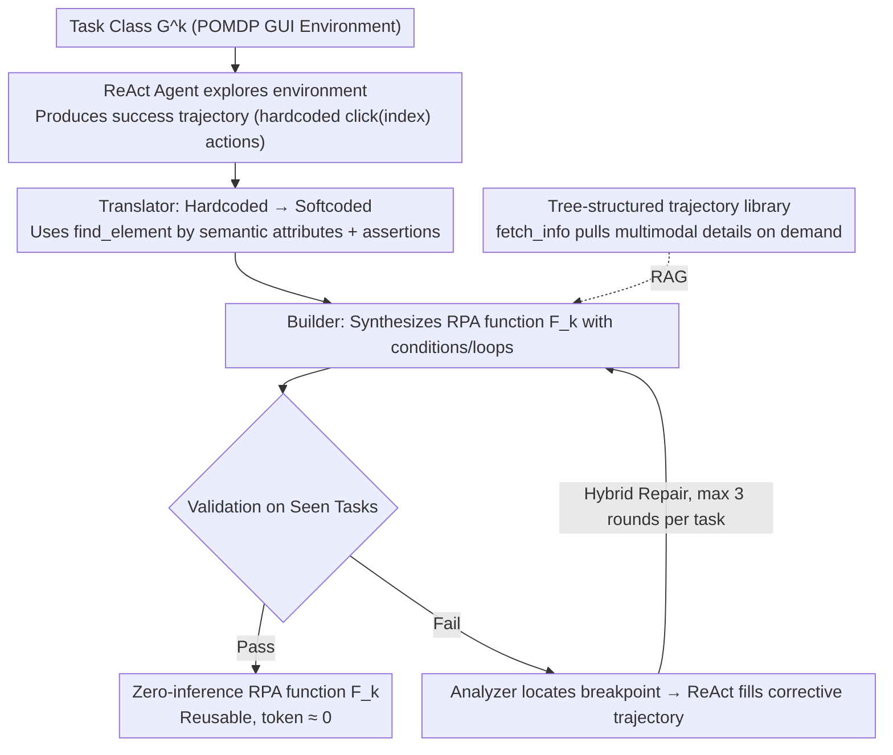

# AutoRPA: Efficient GUI Automation through LLM-Driven Code Synthesis from Interactions

**Conference**: ICML2026  
**arXiv**: [2605.21082](https://arxiv.org/abs/2605.21082)  
**Code**: None  
**Area**: LLM Agent  
**Keywords**: GUI Automation, Robotic Process Automation, Code Synthesis, LLM Agent, Trajectory Distillation  

## TL;DR
The authors propose the AutoRPA framework, which automatically distills interaction trajectories of ReAct-style GUI Agents into reusable RPA functions via a Translator-Builder pipeline. By combining iterative optimization with a hybrid repair strategy, the method maintains or exceeds original Agent success rates while reducing token consumption by 82%~96%.

## Background & Motivation

**Background**: LLM-based GUI Agents (e.g., SeeAct, M3A) can complete various GUI tasks through the ReAct paradigm across multi-step interactions. However, these methods require LLM inference for every task instance, leading to high token consumption and slow execution.

**Limitations of Prior Work**: In deployment scenarios, many GUI tasks are repetitive (e.g., the same user submitting daily reports, or different users booking flights). Repeatedly calling LLM inference for these tasks is expensive and inefficient. Traditional RPA is efficient but relies on manually written scripts, incurring high development costs and fragility to GUI layout changes.

**Key Challenge**: LLM Agents are flexible but expensive (inference per step), while traditional RPA is efficient but rigid (manually written, hard to generalize). Directly generating full code from LLMs often fails due to a lack of environment knowledge, and skill-learning methods that store success trajectories offer limited generalization.

**Goal**: Automatically distill the decision logic of LLM Agents into generalizable, low-token RPA functions that can execute robustly across different environment states and task instructions.

**Key Insight**: The authors observe that although ReAct Agents have high inference costs, their success trajectories contain the complete decision logic for a task. By converting hardcoded actions into softcoded equivalents and synthesizing them into RPA code with conditional logic, both flexibility and efficiency can be achieved.

**Core Idea**: A Translator agent converts hardcoded ReAct actions into softcoded actions based on semantic attributes. A Builder agent then synthesizes robust RPA functions from multiple translated trajectories, iteratively optimizing code quality through a hybrid repair strategy.

## Method

### Overall Architecture
AutoRPA models the GUI environment as a POMDP $(\mathcal{S}, \mathcal{A}, \mathcal{T}, \mathcal{G}, \mathcal{O})$ to distill a reusable RPA function $F_k$ for a task class $\mathcal{G}^k$ with minimal token overhead. The pipeline utilizes three agents: the ReAct Agent explores the environment to obtain success trajectories; the Translator rewrites hardcoded actions into softcoded versions using semantic attribute-based `find_element` calls; and the Builder synthesizes RPA code with conditions and loops. The code is validated on seen tasks; upon failure, an Analyzer locates the breakpoint, the ReAct Agent generates a corrective trajectory in the real environment, and the Builder iteratively updates the code for up to three rounds.

### Key Designs

**1. Translator-Builder Pipeline: Decoupling "Exploration" and "Coding"**

Directly generating whole GUI code from scratch usually fails because the LLM lacks knowledge of the target interface. While ReAct trajectories contain environment knowledge, they use hardcoded actions like `click(index=2)` tied to specific positions. AutoRPA employs a Translator Agent to analyze each step and its observations, converting hardcoded actions into softcoded ones using semantic attributes (e.g., converting "click element 2" to "click button with text 'Submit'"). The Builder Agent then receives these simplified translated trajectories $\psi(\tau'_{\text{ReAct}}(g))$—omitting raw observations while keeping action summaries—to synthesize RPA functions with logic. This division of labor preserves ReAct's exploration capabilities while ensuring code robustness across UI variations.

**2. Tree-structured Trajectory RAG: On-demand Detail Retrieval**

To write correct code, the Builder needs interface states, but including all screenshots and DOMs in the prompt exceeds length limits. AutoRPA organizes the trajectory library $\mathcal{D}_\tau$ into a three-layer tree: raw interaction blocks (screenshots/DOM), action summaries, and high-level conclusions. The Builder primarily views summaries and calls `fetch_info(traj, step)` to pull specific multimodal observations only when needed. This approach balances information completeness with prompt efficiency.

**3. Hybrid Repair Strategy: In-the-loop Correction via Environment Exploration**

When synthesized code fails, static debugging often involves guesswork. AutoRPA uses "in-the-loop" repair: execution stops at the first failure, where an Analyzer Agent diagnoses the cause. Subsequently, the ReAct Agent completes the task in the real environment from the breakpoint to produce a corrective demonstration trajectory $\tau'_{\text{hybrid}}(F_k, g_*) = F_k(g_*) \oplus (A, o_{t*}, a'_{t*}, \rho_{t*}, \ldots, C)$. The Builder then updates the code based on empirical success rather than speculation, limited to $M=3$ attempts per task.

### A Walkthrough Example

Consider a mobile "submit report" task. The ReAct Agent completes the process, producing a trajectory with a `click(index=2)` action. The Translator rewrites this as a click on a button with text "Submit" and adds an assertion to verify the page transition. The Builder notices that different users have different numbers of items and synthesizes a `for` loop. If execution fails because of an unexpected confirmation popup, the Analyzer identifies the blockage, the ReAct Agent clears the popup to finish the task, and the Builder adds a conditional branch to handle popups in the next code iteration.

## Key Experimental Results

### Main Results

Experiments were conducted on AndroidWorld (116 task types, 20 apps), WebArena (Reddit domain, 19 task types), and MiniWoB++ (53 task types).

| Method | Model | Time (min) ↓ | Tokens (k) ↓ | Success Rate (%) ↑ |
|------|------|-------------|--------------|-------------|
| SeeAct | GPT-4.1 | 5.14 | 58.8 | 25.4 |
| M3A | GPT-4.1 | 2.23 | 103.4 | 48.3 |
| ReAct† | GPT-4.1 | 3.91 | 68.7 | 50.0 |
| AutoRPA (code only) | GPT-4.1 | 1.42 | 2.7 | 47.2 |
| **AutoRPA** | **GPT-4.1** | **1.81** | **12.8** | **51.7** |
| ReAct† | GPT-5 | 8.57 | 142.5 | 74.1 |
| AutoRPA (code only) | GPT-5 | 2.72 | 6.2 | 70.7 |
| **AutoRPA** | **GPT-5** | **4.35** | **30.6** | **75.9** |

On MiniWoB++ (GPT-4.1):

| Method | 9 Hard Tasks Tokens (k) ↓ | Success Rate (%) ↑ | All 53 Tasks Tokens (k) ↓ | Success Rate (%) ↑ |
|------|-------------------------|-------------|------------------------|-------------|
| AdaPlanner | 15.1 | 74.1 | 6.1 | 90.3 |
| AutoManual | 23.2 | 91.1 | 4.6 | 95.2 |
| ReAct† | 16.2 | 84.4 | 9.2 | 92.8 |
| AutoRPA (code only) | 1.0 | 80.0 | 0.9 | 92.5 |
| **AutoRPA** | **1.4** | **91.1** | **1.4** | **95.4** |

### Ablation Study

| Configuration | Success Rate (%) |
|------|-----------|
| AutoRPA (Full) | 51.7 |
| w/o ReAct in construction | 32.5 |
| w/o Translator | 40.2 |
| w/o ReAct in repair | 45.5 |
| w/o RAG for Builder | 48.8 |

### Key Findings
- Removing ReAct exploration drops success rates from 51.7% to 32.5%, proving that environment knowledge from exploration is vital.
- The Translator's contribution is significant (-11.5% success rate when removed), as softcoded actions are essential for generalization.
- Running synthesized RPA code alone (code only) matches ReAct's performance while reducing tokens to 4%~7% of the original.
- As the number of construction tasks $N$ increases, AutoRPA consistently approaches ReAct's success rate, verifying that more samples yield more robust code.
- In highly diverse environments like WebArena, AutoRPA maintains competitive success rates with significantly lower token costs.

## Highlights & Insights
- **Trajectory Distillation Paradigm**: Converting LLM Agent online inference into offline code is essentially a shift from "inference-time computation" to "compile-time computation." This is applicable to any repetitive Agent task.
- **Softcoded Translation**: Locating GUI elements via semantic attributes instead of hardcoded coordinates addresses the classic RPA vulnerability to layout changes.
- **Hybrid Repair = Code Debugging + Environment Exploration**: Rather than relying on LLM "imagination" for debugging, the agent explores the real environment to find the fix. This "in-the-loop" strategy is more reliable than static code fixing.

## Limitations & Future Work
- The construction phase still consumes significant tokens (sampling $N$ tasks + iterative repair). The balance between construction cost and test-time savings warrants further discussion.
- For highly diverse task types (e.g., WebArena), a single RPA function may not cover all cases, requiring a fallback to ReAct.
- Dependencies on semantic attributes might fail on attribute-poor interfaces (e.g., pure image-based UIs).
- Future work could explore automatically determining when a task is worth distilling (cost-benefit analysis) and incremental updates for RPA functions.

## Related Work & Insights
- **ReAct Paradigm** (Yao et al., 2023): The foundational reasoning-action loop used in AutoRPA's exploration and repair.
- **AutoManual** (Chen et al., 2024): Induces environment rules to guide tasks; complementary to AutoRPA's skill distillation.
- **AdaPlanner** (Sun et al., 2023): A skill-learning method for Plan-and-Execute, though it relies on human demonstrations.
- **Insight**: For any repetitive LLM inference task, consider a strategy of "using high-cost methods to explore and collect trajectories, then distilling them into low-cost deterministic workflows."

<!-- RELATED:START -->

## Related Papers

- [\[ICML 2026\] EvolveR: Self-Evolving LLM Agents through an Experience-Driven Lifecycle](evolver_self-evolving_llm_agents_through_an_experience-driven_lifecycle.md)
- [\[ICLR 2026\] Code Driven Planning with Domain-Adaptive Selector](../../ICLR2026/llm_agent/code_driven_planning_with_domain-adaptive_selector.md)
- [\[AAAI 2026\] Reflection-Driven Control for Trustworthy Code Agents](../../AAAI2026/llm_agent/reflection-driven_control_for_trustworthy_code_agents.md)
- [\[ACL 2026\] Don't Act Blindly: Robust GUI Automation via Action-Effect Verification and Self-Correction](../../ACL2026/llm_agent/don39t_act_blindly_robust_gui_automation_via_action-effect_verification_and_self.md)
- [\[ICML 2026\] Recovering Policy-Induced Errors: Benchmarking and Trajectory Synthesis for Robust GUI Agents](recovering_policy-induced_errors_benchmarking_and_trajectory_synthesis_for_robus.md)

<!-- RELATED:END -->
