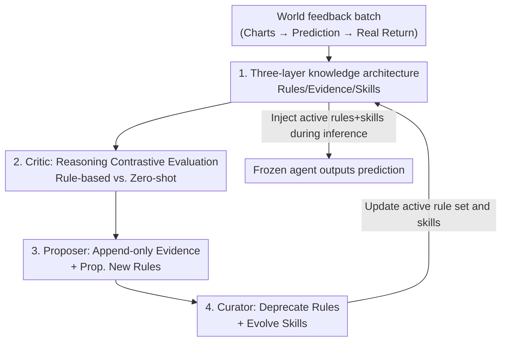

# Closing the Feedback Loop: From Experience Extraction to Insight Governance in Verbal Reinforcement Learning

**Conference**: ICML 2026  
**arXiv**: [2606.17591](https://arxiv.org/abs/2606.17591)  
**Code**: TBD  
**Area**: LLM Agent / Agent Memory  
**Keywords**: Verbal Reinforcement Learning, World Feedback, Knowledge Governance, Agent Memory, Non-stationary Environments

## TL;DR
This paper identifies an overlooked "retention-forgetting dilemma" in training-free Verbal Reinforcement Learning (which distills experience into rules in the context without updating parameters) within non-stationary environments. It proposes a transition from experience accumulation to governance via a "Rule/Evidence/Skill" three-layer architecture and a critic-proposer-curator loop. This approach flips the performance of accumulated experience from "dropping below the zero-shot baseline" to achieving "+5.3pp directional accuracy and doubling the Sharpe ratio."

## Background & Motivation

**Background**: Increasingly, LLM agent research treats "world feedback" (objective signals such as market returns, task outcomes, and demand forecasts) as a first-class learning signal. Rather than performing gradient updates, these methods extract natural language rules from experience and inject them into the context to modify agent behavior. Works like Reflexion and ExpeL represent this line of research, promoted for their interpretability, modularity, and lower cost compared to fine-tuning.

**Limitations of Prior Work**: However, in non-stationary environments, accumulated experience is as likely to be detrimental as it is helpful. Rules effective in one regime become invalid in another, and most real-world scenarios are non-stationary. Retaining everything leads to the context being flooded with obsolete and contradictory rules, causing incorrect rules to trigger at the wrong moments ("confident but wrong"). Deleting everything means the agent must relearn from scratch when conditions recur (which inevitably happens in non-stationary environments).

**Key Challenge**: The authors term this the **retention-forgetting dilemma** and diagnose a structural imbalance in existing methods: they invest heavily in "experience extraction" (how to produce good rules from experience) but severely underinvest in "insight governance" (how to manage rules once they exist). In other words, while rules are being produced aggressively, there is no mechanism to manage their trustworthiness.

**Goal**: To navigate this dilemma, a system must simultaneously satisfy four requirements: R1 Result-driven evaluation, R2 Persistent and structured evidence, R3 Non-monotonic knowledge lifecycle, and R4 Compositional governance. The authors reviewed existing training-free methods (see the comparison table below) and found that none satisfy all four.

**Key Insight**: Each layer exists to compensate for the failure modes of the layer above. Rules alone do not tell an agent which to trust; evidence for individual rules cannot handle compositional conflicts between rules; only by operating skills on top of evidence can principled governance be achieved.

**Core Idea**: By using a "Rule → Evidence → Skill" three-layer structure combined with a feedback-driven curation loop, world outcomes are reconnected to every layer of knowledge. This makes "governance" (rather than the "quantity of accumulated experience") the decisive factor in whether an agent progresses or regresses.

The following table provides the authors' diagnosis of existing training-free verbal RL methods:

| Method | R1 Evaluation | R2 Persistent Evidence | R3 Non-monotonic Lifecycle | R4 Compositional Governance |
|------|---------|------------|------------------|------------|
| Reflexion | Partial (Trajectory-level) | ✗ | ✗ | ✗ |
| ExpeL | Partial (Scalar) | ✗ (Invalidated upon rewrite) | Partial (In-place modification) | ✗ |
| Trajectory Attribution (Fang 2025) | ✓ (Causal attribution) | ✗ (No cross-episode) | Partial (Merging) | Partial (LLM Selection) |
| Meta-MDP (Cai 2025) | ✓ (Semantic critic) | ✗ (Source lost via merging) | Partial (Failure retention) | Partial (Three-level top-k) |
| **Ours** | ✓ (Reasoning contrast) | ✓ (Cross-batch) | ✓ (Deprecation without deletion) | ✓ (Evolved skills) |

## Method

### Overall Architecture

The system aims to prevent a **frozen-parameter** LLM agent from being overwhelmed by obsolete rules or losing lessons when conditions recur under non-stationary world feedback. It partitions agent "memory" into three layers: **Rules** record experiences distilled from world outcomes; **Evidence** records the reliability of each rule across episodes; and **Skills** operate on top of evidence to determine which rules to use, how to resolve conflicts, and when to abstain. These layers are linked into a closed loop by a **critic → proposer → curator** curation pipeline per batch (approx. 16 samples): the critic compares "rule-enhanced reasoning" with "zero-shot reasoning" on the same observed outcome to judge if a rule helped or hindered; the proposer only **appends** evaluations to the evidence log of each rule and proposes new rules for uncovered error patterns; the curator reads cross-rule evidence to **deprecate (not delete)** sustained negative rules and evolves skills. During inference, the agent receives only the "currently active rules + current skills" as additional context, with parameters remaining entirely unchanged.

A key structural constraint is that the evidence log $\Xi$ is **append-only**. Even if a rule is deprecated, the evidence regarding it is neither deleted nor modified, ensuring all governance decisions are rooted in complete historical observations.

### Key Designs

**1. Three-Layer Knowledge Architecture: Decoupling "What to remember" from "What to trust"**

A fundamental problem in existing methods is the conflation of rules, their reliability, and rule combinations. Consequently, a rule "verified 3 times and refuted 5 times" appears identical to one "verified 5 times and refuted 3 times" if only a binary "active/deprecated" state is recorded. This work explicitly decouples them: the **Rule Layer** contains natural language statements with "trigger conditions on observable features + a corrective action," where rules are deprecated but not deleted (R3); the **Evidence Layer** maintains a persistent log for each rule, structurally recording "which episode, help or hindrance, under what conditions," accumulating across episodes and surviving deprecation (R1+R2); the **Skill Layer** reads cross-rule evidence to control which rules enter the limited context and resolve conflicts (R4). Unlike Hindsight which uses a scalar confidence, this work preserves the **full evidence trajectory**, allowing deprecated rules to be reassessed if conditions change.

**2. Critic's Reasoning Contrastive Evaluation: Upgrading "Correctness" to "Attribution"**

Reflexion performs no post-hoc evaluation (rules are never re-examined once stored), and ExpeL uses only scalar importance approximations. The critic in this work compares **rule-augmented reasoning** with a **zero-shot baseline** on the same observed outcome. It asks "how did this rule affect the agent's chain-of-thought" rather than just "is the final prediction correct." This reasoning-level attribution is strictly more informative than "success/failure" scalars—it can attribute improvements or degradations to specific rules even if the final prediction is correct by chance. Formally, given a new batch of experience $B_k=\{(x_t,a_t,y_t)\}$, the evaluation is $E_k=\textsc{Critic}(B_k,\mathcal{L}_{k-1},\mathcal{S}_{k-1})$, where $\mathcal{L}$ and $\mathcal{S}$ are the rule library and skills.

**3. Proposer's Append-only Evidence: Rewriting leads to invalidation, so never rewrite**

A fatal flaw in prior work (e.g., ExpeL / TF-GRPO) is **in-place rule rewriting**. Once a rule is rewritten, all previously accumulated evaluation evidence is silently invalidated, requiring expensive re-evaluation to rebuild confidence. The proposer here **appends** critic evaluations to the evidence log of each rule and never modifies them in place: $\Xi_k,P_k=\textsc{Proposer}(E_k,\mathcal{L}_{k-1},\Xi_{k-1})$, where $\Xi_k$ merges batch $k$ evaluations into the evidence log and $P_k$ represents newly proposed rules. This append-only design allows evidence to survive rule deprecation, explaining "why it was deprecated" and allowing knowledge to be retrieved if conditions change—a structural prerequisite for R2 and "evidence-based R3."

**4. Curator's Evidence-Grounded Governance: Unified deprecation and skill evolution**

The curator reads cross-rule evidence to make two types of decisions **simultaneously**: deprecating sustained negative rules (R3) and evolving skills that encode priority, conflict resolution, and anti-patterns (R4): $\mathcal{L}_k,\mathcal{S}_k=\textsc{Curator}(\mathcal{L}_{k-1},\mathcal{S}_{k-1},\Xi_k,P_k)$. Because both types of decisions are grounded in the **same persistent evidence**, they are inherently consistent. An interesting mechanism emerged: rules that are "frequently cited but consistently yield wrong predictions" accumulate negative evidence faster. Thus, **"frequent citation" itself becomes a signal for deletion**. This echoes empirical observations from SkillsBench—unfounded skill sets degrade performance, whereas skills in this work are "focused by construction" because they are derived from accumulated evidence.

### A Detailed Example

Taking the learning phase of financial forecasting as an example: the base agent (Qwen3-VL-235B) processes a 20-day K-line chart and outputs directional predictions, scenario forecasts, risk parameters, and a chain-of-thought. The critic/proposer/curator utilize Claude Sonnet 4.6. The learning phase (2013–2016) is processed in batches (approx. 16 samples). After each batch, the critic compares predictions against real market returns to produce verbal evaluations. The proposer appends these to rule logs and extracts new rules for error patterns. The curator reviews cross-rule evidence to move negative rules out of the active context. For instance, skill S3 "Distribution after Accumulation" in Table 3 manages active rules rule_013/016 while incorporating lessons from deprecated rule_005/007, based on evidence from batches 6 and 7. In the inference phase (2017 test set), the agent receives only the active rules and current skills as context.

## Key Experimental Results

### Main Results

Setup: Replicating the protocol of Cui et al. (2026) using daily OHLCV data for the top 5 S&P 500 stocks (AAPL/AMZN/FB/GOOGL/MSFT). Learning 2013–2016, Testing 2017. 20-day input, 5-day prediction window. Mean of 5 evaluations reported. All training-free methods share the same base agent, differing only in **management of accumulated experience**.

| Method | Directional Accuracy | Scenario Accuracy | Avg Return | Sharpe | Max Drawdown |
|------|-----------|-----------|---------|--------|---------|
| Zero-shot | 51.2% | 23.8% | 0.16% | 0.53 | 34.5% |
| Reflexion | 46.3% | 23.3% | −0.08% | −0.12 | 35.2% |
| ExpeL | 51.1% | 24.7% | 0.14% | 0.36 | 24.4% |
| **Ours (Full Loop)** | **56.5%** | **29.0%** | **0.33%** | **1.00** | **13.0%** |

Three findings directly correspond to the capability diagnosis table:

| Requirement Satisfied | Result | Interpretation |
|-----------|------|------|
| None (Reflexion) | Drops below zero-shot (−4.9pp, negative Sharpe) | Experience actively harms—the "retention" side of the dilemma. |
| Partial (ExpeL) | Accuracy near zero-shot, but risk-adjusted return worsens (Sharpe 0.36 < 0.53) | Better extraction helps, but lacking R2/R4 means contradictory rules still accumulate. |
| Full Loop (Ours) | +5.3pp accuracy, Sharpe nearly doubled, Max Drawdown cut by 60% | Learning only occurs when all four requirements are met. |

### Key Findings
- **Governance > Experience Quantity**: The results of the same batch of accumulated experience can flip from "dropping below zero-shot" to "doubling the Sharpe ratio" based solely on the presence of the curation loop.
- **Persistent Evidence (R2) makes rule replacement smarter**: New rules are shaped by cumulative evidence of why "predecessor rules" failed, thereby avoiding the same pitfalls.
- **Frequent Citation as a Deletion Signal**: High-frequency rules that consistently provide wrong predictions are deprecated precisely because they accumulate negative evidence faster—a counter-intuitive benefit of append-only logs.
- The evolution graph shows an increasing gap between "accumulated rules (without governance)" and "active rules after deprecation (with governance)," highlighting the contribution of governance.

## Highlights & Insights
- **Clarifying the problem is a contribution**: Naming the "retention-forgetting dilemma" and defining "R1–R4" provides a diagnostic coordinate system for agent memory management.
- **Append-only evidence is a structural innovation**: Unlike prior works that fail because rule rewriting invalidates evidence, the "append-only + deprecate without deletion" approach secures R2/R3. This engineering trade-off is highly transferable to any agent with memory.
- **Evaluation upgrade from "correctness" to "reasoning attribution"**: Comparing CoT between rule-augmented and zero-shot runs is far more informative than scalar success rates and can be used to locate which context part influences output (e.g., RAG attribution).
- The decoupling of "popularity" from "reliability" suggests that in agent memory, high frequency does not necessarily mean high quality.

## Limitations & Future Work
- **Single-domain validation**: While financial forecasting was chosen for its noisy, delayed, and non-stationary world feedback, evidence in other domains like robot control or demand forecasting is currently absent.
- **Dependence on strong models as Critic/Curator**: Curation quality is likely tied to the capabilities of the "judge models" (Claude Sonnet 4.6), raising questions about performance when using smaller models as judges.
- **Computational/Latency Costs**: The overhead of running reasoning contrastive evaluations and cross-rule evidence reviews per batch is not discussed in depth.
- Future directions include linking the architecture to formal AGM belief revision postulates and conducting verifications across more non-stationary domains.

## Related Work & Insights
- **vs. Reflexion**: They extract verbal feedback but never re-examine stored feedback; ours adds the Critic/Curator loop to fill the R2/R3/R4 gap.
- **vs. ExpeL**: They use importance scores and in-place rule modification, which invalidates accumulated evidence; ours uses append-only to maintain structural evidence integrity.
- **vs. Hindsight (Latimer 2025)**: It uses scalar confidence, which loses the structured evidence trajectory; ours preserves the full trajectory to reconstruct the "why."
- **vs. Meta-MDP (Cai 2025)**: It uses golden/warning zones but merges similar items, losing source history; our deprecation is evidence-driven and reversible.
- **vs. SkillsBench (Li 2026)**: Their findings that "curated skills +16.2pp vs. self-generated skills −1.3pp" and "focus outperforms comprehensiveness" provide empirical motivation for R1 (quality) and R4 (composition) in this work.

## Rating
- Novelty: ⭐⭐⭐⭐⭐ The systematic reconstruction of agent memory via the dilemma framework and append-only loop is a major step beyond simple prompt tricks.
- Experimental Thoroughness: ⭐⭐⭐ The flip effect is convincing, but validation is limited to a single case (5 stocks).
- Writing Quality: ⭐⭐⭐⭐⭐ Extremely clear presentation of complex architecture and motives.
- Value: ⭐⭐⭐⭐ A practical template for long-term agent memory; the append-only evidence approach is particularly reusable.

<!-- RELATED:START -->

## Related Papers

- [\[CVPR 2026\] Learning to Select Visual Tools from Experience](../../CVPR2026/llm_agent/learning_to_select_visual_tools_from_experience.md)
- [\[ICML 2026\] From Player to Master: Enhancing Test-Time Learning of LLM Agents via Reinforcement Learning over Memory](from_player_to_master_enhancing_test-time_learning_of_llm_agents_via_reinforceme.md)
- [\[ICML 2026\] Agentic Monte Carlo: Simulating Reinforcement Learning for Black-Box Agents](agentic_monte_carlo_simulating_reinforcement_learning_for_black-box_agents.md)
- [\[ICML 2026\] On Information Self-Locking in Reinforcement Learning for Active Reasoning of LLM Agents](on_information_self-locking_in_reinforcement_learning_for_active_reasoning_of_ll.md)
- [\[ICML 2026\] Skill-Pro: Learning Reusable Skills from Experience via Non-Parametric PPO for LLM Agents](skill-pro_learning_reusable_skills_from_experience_via_non-parametric_ppo_for_ll.md)

<!-- RELATED:END -->
