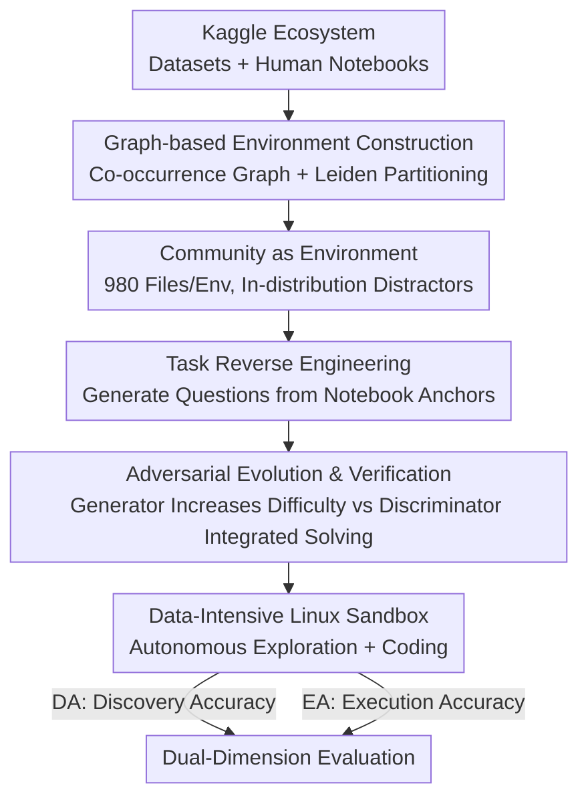

# CoDA-Bench: Can Code Agents Handle Data-Intensive Tasks?

**Conference**: ICML2026  
**arXiv**: [2606.15300](https://arxiv.org/abs/2606.15300)  
**Code**: https://github.com/ruc-datalab/CoDA-Bench (Data: https://huggingface.co/datasets/RUC-DataLab/CoDA-Bench, Homepage: https://coda-bench.github.io/)  
**Area**: LLM Agent / Code Agent / Evaluation Benchmark  
**Keywords**: Code Agents, Data-Intensive Environments, Evaluation Benchmark, Data Discovery, Kaggle

## TL;DR
CoDA-Bench is the first benchmark to jointly evaluate "code intelligence" and "data intelligence" within a data-intensive Linux sandbox. Agents are deployed into a Kaggle-based environment containing an average of 980 files, where they must autonomously discover correct data from semantically similar distractors before writing code to compute answers. Results show that even the most powerful Mini-SWE-Agent (GPT-5.5) achieves only 61.1% execution accuracy, exposing a severe lack of autonomous data discovery capabilities in current code agents.

## Background & Motivation
**Background**: LLMs have evolved from conversational assistants into autonomous agents capable of running complex workflows. Tools like Claude Code, Cursor, and Codex CLI are beginning to act as "autonomous engineers," requiring rigorous evaluation in realistic development scenarios.

**Limitations of Prior Work**: Existing benchmarks **decouple code and data capabilities**, leading to a misalignment with real-world development. Code-centric benchmarks (HumanEval, SWE-bench, etc.) focus on logical correctness or repository-level maintenance while **ignoring the challenges posed by massive heterogeneous data** in real scenarios. Data-centric benchmarks (DA-Code, DABstep, etc.) evaluate data processing but rely on isolated Python scripts and **directly feed all relevant files to the agent**, skipping the critical step of "large-scale data discovery and access within a shell environment." In reality, data is rarely presented on a silver platter.

**Key Challenge**: The value of an agent in real development lies in its interaction with large-scale data within a file system—navigating directory hierarchies and identifying relevant files from hundreds of candidates without explicit user targets. This requires **dual intelligence**: code intelligence (writing syntactically and logically correct programs) and data intelligence (locating correct information sources in complex data terrains). No existing benchmark evaluates these coupled capabilities.

**Core Problem**: Can current SOTA code agents **simultaneously** integrate code and data intelligence to handle data-intensive tasks?

**Design Motivation**: Randomly generated files are easily distinguished from target data (too simple), while manually curating hundreds of related files is not scalable. This work leverages the Kaggle ecosystem, which naturally contains interconnected datasets and human-written solution code, to cost-effectively build realistic noisy environments with "semantically similar but mostly irrelevant" files.

**Core Idea**: Build environments with in-distribution distractors using Kaggle dataset co-occurrence graphs, reverse-engineer verifiable tasks from numerical results in real notebooks, and push task difficulty to the limit while maintaining solvability through adversarial evolution.

## Method

### Overall Architecture
The construction of CoDA-Bench follows a three-stage pipeline: first, partition semantically coherent communities using a Kaggle dataset **co-occurrence graph**, treating each community as an evaluation environment with hundreds of in-distribution distractors; second, extract "solution anchors" (deterministically reproducible numerical results) from real Kaggle notebooks to **reverse-generate** natural language questions as verifiable tasks; finally, use GAN-style **adversarial evolution** to maximize task difficulty while ensuring solvability. During evaluation, agents are placed in the corresponding data-intensive Linux sandbox. Starting from the root directory with only a natural language instruction, the agent must autonomously explore files, identify relevant data, and write code. Performance is measured by Discovery Accuracy (DA) for data intelligence and Execution Accuracy (EA) for end-to-end code intelligence.

### Key Designs

**1. Graph-based Environments: Using Kaggle Co-occurrence Graphs + Community Partitioning to Create In-distribution Distractors**

To make "data discovery" a genuine challenge, distractors must be **topically and structurally similar but irrelevant** to the target data (in-distribution noise). The authors leverage over 640,000 public Kaggle datasets and human notebooks. Analysts often explore related data together, a co-occurrence that naturally characterizes which data should appear in the same real-world environment. Specifically, datasets are nodes in an undirected weighted graph $G=(\mathcal{D},E,w)$, where edge weights follow the co-occurrence frequency $w(d_i,d_k)=\sum_{j=1}^{m}\mathbbm{1}[d_i\in\mathcal{D}_j\land d_k\in\mathcal{D}_j]$ ($\mathcal{D}_j$ is the data subset cited by notebook $n_j$). The Leiden algorithm (resolution $\gamma=1.0$) partitions this large heterogeneous graph into semantically coherent communities. For any target data $\mathcal{D}^*\subset C_k$, the entire community $C_k$ is placed in the evaluation environment, where $C_k\setminus\mathcal{D}^*$ serves as topical distractors. This forces agents to perform fine-grained semantic reasoning rather than simple keyword matching. Each environment averages 980.8 files, covering CSV, JSON, Parquet, images, and PDFs, with sizes ranging from 20.3 MB to 45.4 GB.

**2. Task Reverse Engineering: Constructing Verifiable Questions from Notebook "Solution Anchors"**

Tasks must reflect real needs and allow objective scoring. Kaggle notebooks record solutions and numerical results, serving as ideal task sources. The authors define precise numerical results reported by experts (statistics, rankings, correlations, etc.) as **solution anchors**—these are deterministically reproducible under the same data and computation. Anchors are identified via static analysis + dynamic verification: LLMs pick "verifiable and non-trivial" candidates from cell outputs, and static data flow analysis traces the source of each anchor $a$, identifying the minimal input file set $\mathcal{D}_a$ and transformation sequence $\mathcal{T}_a=\langle\tau_1,\dots,\tau_k\rangle$. The path is rerun to ensure results replicate within a tolerance of $\varepsilon=10^{-6}$, ensuring uniqueness. Finally, an LLM reverse-generates a natural language question based on the anchor and recreated path, followed by human review to remove ambiguities. This "answer-to-question" approach ensures task correctness and practical relevance.

**3. Adversarial Evolution: GAN-style Generator-Discriminator Play for Maximum Difficulty and Solvability**

Reverse-engineered tasks may not be difficult enough, yet increasing difficulty risking ambiguity or insufficient information. Borrowing from GANs, the authors model task evolution as a minimax game between a Generator $G$ (maximizing difficulty) and a Discriminator $F$ (attempting to solve), expressed as $\min_G\max_F\mathcal{L}(G,F)=\mathbb{E}_{q\sim G}[\mathbbm{1}[F(q)=a_q]]$. Unlike standard GANs, $G$ and $F$ use SOTA LLMs and replace continuous updates with discrete rewriting. To avoid overfitting a single LLM, the discriminator is an ensemble of $K$ models sampled from a pool, calculating the solving rate $r^{(t)}=\frac{1}{K}\sum_{k=1}^{K}\mathbbm{1}[F_k(q^{(t)})=a_q]$. If the rate exceeds a threshold, the task is too easy, and the generator seeks opportunities to add difficulty based on success trajectories. If it falls below the threshold, a diagnostic analysis identifies if the failure stems from task defects (ambiguity, missing info); otherwise, it is verified by humans as a "hard but solvable" task and added to the library. The pipeline started with 323 communities and yielded 1,009 high-quality tasks, with a 72.3% total pass rate.

**4. Dual-Dimension Metrics (DA / EA): Decoupling Data Discovery and Code Execution**

**Discovery Accuracy (DA)** measures data intelligence: Let $\mathcal{F}_{\text{used}}^{(t)}$ be the files accessed by the agent and $\mathcal{F}_{\text{target}}^{(t)}$ be the ground truth target files. $\text{DA}=\frac{1}{|\mathcal{T}|}\sum_t \mathbbm{1}[\mathcal{F}_{\text{used}}^{(t)}=\mathcal{F}_{\text{target}}^{(t)}]$. **Execution Accuracy (EA)** measures code intelligence: $\text{EA}=\frac{1}{|\mathcal{T}|}\sum_t \mathbbm{1}[\text{normalize}(a_t)=\text{normalize}(a_t^*)]$, where results are normalized (rounding, whitespace removal, case unification). DA independently measures discovery, while EA captures end-to-end completion. The authors also subset **CoDA-Hard** (119 tasks), requiring at least 2 target files and solutions exceeding 30 lines of code.

## Key Experimental Results

### Main Results
Evaluation involved native CLI tools (Claude Code, Codex CLI) and framework-based agents (OpenHands, Mini-SWE-Agent) across 1,009 tasks (CoDA-Bench) and 119 tasks (CoDA-Hard).

| System | Model | CoDA-Bench DA% | CoDA-Bench EA% | CoDA-Hard EA% | Rounds | $/task |
|------|------|------|------|------|------|------|
| Mini-SWE-agent | GPT-5.5 | 83.0 | **61.1** | **49.6** | 32.5 | ~0.39 |
| OpenHands | GPT-5.5 | 82.1 | 59.7 | 44.5 | 18.1 | ~0.65 |
| Codex CLI | GPT-5.5 | 74.9 | 60.3 | 47.9 | 6.8 | ~1.39 |
| Claude Code | Sonnet-4.6 | 77.9 | 53.8 | 42.9 | 14.7 | 0.11 |
| Claude Code | Opus-4.7 | 77.3 | 51.9 | 45.4 | 16.1 | 0.22 |
| OpenHands | Kimi-K2.6 | 71.5 | 43.8 | 37.0 | 39.4 | ~0.41 |
| OpenHands | DeepSeek-V4-Pro | 75.9 | 49.0 | 36.1 | 35.8 | ~0.15 |

### Analysis & Ablation

| Analysis | Key Findings | Description |
|------|---------|------|
| Oracle vs Community (CoDA-Hard) | Sonnet-4.6 45.4%→73.1% (+27.7), GPT-5.5 44.5%→68.9% (+24.4) | Performance jumps significantly when target file paths are provided, proving data discovery is the primary bottleneck. |
| Even with Oracle | Average only 71.0%, still 29% failure | Integration from multiple sources, semantic ambiguity, and multi-step reasoning keep code generation challenging. |
| SNR (Signal-to-Noise Ratio) | Spearman $\rho=0.466$, $p<0.01$ | Communities with low SNR show significantly lower accuracy—the difficulty lies in distinguishing similar distractors, not just file count. |
| Data Volume | $\rho=-0.461$, $p<0.01$; >8GB near 0% | Large file reading creates I/O bottlenecks for agents. |
| Error Attribution (200 cases) | GPT-5.5: Code 44.0% / Discovery 33.0%; Kimi-K2.6: Discovery 40.7% / Code 34.7% | Weaker models fail more on discovery; failures in stronger models shift toward complex analysis and reasoning. |

### Key Findings
- **Data discovery is the true bottleneck**: Even the strongest agents fail to locate the correct files in nearly 20% of tasks. Providing Oracle paths increases EA by 24–28 points, confirming that identifying correct data among hundreds of candidates is a core deficiency.
- **Errors propagate irreversibly**: If an agent selects the wrong data file during the exploration phase, no amount of subsequent code refinement or debugging can recover the answer.
- **Frameworks determine efficiency, models determine the ceiling**: For GPT-5.5, Codex CLI hits 60.3% EA in 6.8 rounds, while Mini-SWE-agent needs 32.5 rounds for 61.1% EA. Kimi-K2.6 uses even more rounds (39.4) but yields lower results (43.8%), indicating interaction frequency cannot compensate for model capability limits.
- **Model-Framework alignment matters**: GPT models perform slightly better (+0.8 points) in Mini-SWE-agent than native CLI, while Claude models perform better in their native environment (51.9% vs 49.3%).

## Highlights & Insights
- **First joint evaluation of code and data intelligence**: By including the "missing link" of data discovery—a step bypassed by other benchmarks—CoDA-Bench provides a complete picture of agent utility in data-intensive tasks.
- **Novel in-distribution noise construction**: Instead of random or manually curated files, the use of Kaggle co-occurrence graphs and Leiden communities creates realistic semantic distractors that challenge an agent’s reasoning, not just its search speed.
- **Scalable and verifiable through reverse engineering**: Deriving tasks from numerical anchors ensures deterministically verifiable ground truths, while GAN-style evolution ensures the benchmark remains challenging.
- **"Irreversible error propagation" insight**: Highlights that future agent designs must prioritize the reliability of the data discovery phase, as downstream coding is futile if the data source is incorrect.

## Limitations & Future Work
- **Low performance ceiling**: The strongest system achieves only 61.1% EA (49.6% on Hard), showing the benchmark is difficult—a strength for longevity, but difficult for fine-grained ranking of top-tier models currently.
- **Kaggle ecosystem reliance**: Tasks are focused on data science/analysis and may not cover other data-intensive development (e.g., production databases, real-time streaming).
- **Metric dependence on numerical anchors**: Numerical answers are ideal for statistics/aggregation but less suited for open-ended analysis tasks without a unique answer.
- **Large-scale I/O bottlenecks**: Communities >8GB essentially lead to total failure, where some failures are due to engineering I/O limits rather than a lacks of reasoning.

## Related Work & Insights
- **vs SWE-bench / Terminal-Bench (Code-centric)**: These assume required data is already in place. CoDA-Bench requires autonomous discovery within complex environments.
- **vs DA-Code / DABstep / DSBench (Data-centric)**: While focused on data science, these provide all relevant files explicitly. CoDA-Bench hides data among hundreds of semantic distractors.
- **vs MLE-bench / GAIA (Files ≤ 10)**: These possess low discovery pressure. CoDA-Bench features an average of 980 files (max 8,158) with SNR as low as 0.0105, representing an order of magnitude difference in discovery complexity.

## Rating
- **Novelty**: ⭐⭐⭐⭐⭐ First benchmark to link code intelligence with data discovery; the combination of co-occurrence graphs and adversarial evolution is highly innovative.
- **Experimental Thoroughness**: ⭐⭐⭐⭐⭐ Covers native CLIs and frameworks across multiple model families, with extensive analysis on Oracle ablation, SNR, volume, and error attribution.
- **Writing Quality**: ⭐⭐⭐⭐ Motivations and construction flows are clear; some implementation details are deferred to appendices.
- **Value**: ⭐⭐⭐⭐⭐ Directly addresses the neglected bottleneck of "data discovery" in autonomous engineering, providing vital guidance for the development of real-world agents.

<!-- RELATED:START -->

## Related Papers

- [\[ICLR 2026\] CoDA: Agentic Systems for Collaborative Data Visualization](../../ICLR2026/llm_agent/coda_agentic_systems_for_collaborative_data_visualization.md)
- [\[ICLR 2026\] EXP-Bench: Can AI Conduct AI Research Experiments?](../../ICLR2026/llm_agent/exp-bench_can_ai_conduct_ai_research_experiments.md)
- [\[ICML 2026\] Process Reward Agents for Steering Knowledge-Intensive Reasoning](process_reward_agents_for_steering_knowledge-intensive_reasoning.md)
- [\[ICLR 2026\] Terminal-Bench: Benchmarking Agents on Difficult, Real-World Tasks in the Command Line Interface](../../ICLR2026/llm_agent/terminal-bench_benchmarking_agents_on_hard_realistic_tasks_in_command_line_inter.md)
- [\[ICML 2026\] AutoRPA: Efficient GUI Automation through LLM-Driven Code Synthesis from Interactions](autorpa_efficient_gui_automation_through_llm-driven_code_synthesis_from_interact.md)

<!-- RELATED:END -->
