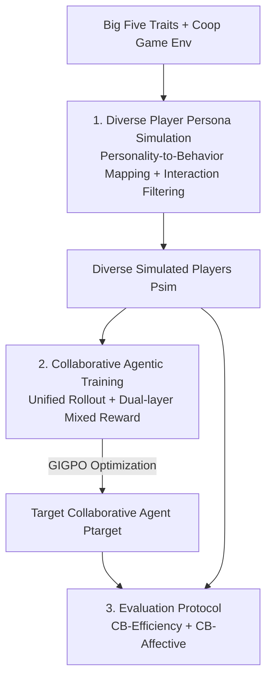

# CollabBench: Benchmarking and Unleashing Collaborative Ability of LLMs with Diverse Players via Proactive Engagement

**Conference**: ICML2026  
**arXiv**: [2606.05793](https://arxiv.org/abs/2606.05793)  
**Code**: https://github.com/BW297/CollabBench  
**Area**: LLM Agent / Multi-Agent Collaboration  
**Keywords**: Collaborative Agents, Cooperative Games, Personality Simulation, Agentic Reinforcement Learning, Affective Alignment

## TL;DR
The paper proposes CollabBench, a benchmark and training framework for LLM agents to collaborate with "diverse personality teammates" in cooperative games. It simulates diverse players driven by the Big Five personality traits, employs a unified agentic rollout with a dual-layer mixed "efficiency/affective" reward for reinforcement learning, and provides an evaluation protocol covering both efficiency and affective metrics. After training, Qwen2.5-7B achieves improvements of approximately 19.5% and 24.4% in efficiency and affective dimensions, respectively.

## Background & Motivation

**Mapping to Background**: While LLM agents have excelled in individual tasks (deep retrieval, mathematical reasoning, coding), research focus is shifting toward "human-agent collaboration." However, existing human-agent collaboration studies are mostly confined to **conversational tasks** (dialogue, document editing, problem-solving), which feature weak interaction, decoupling from shared contexts, and a lack of grounded behavioral execution.

**Limitations of Prior Work**: The authors identify three major gaps. **Challenge 1**: Simulating players with diverse personalities and behavioral styles using LLMs in game environments is difficult; existing role-playing or user profiling methods rely on preset roles or static data, failing to capture "action-level" behaviors in interactive games. **Challenge 2**: The unleashing of collaborative abilities with diverse teammates within LLMs in high-context (game) environments remains largely unexplored; previous work focused on either enhancing individual capabilities or multi-agent architectures, seldom learning "collaborative awareness and adaptability" inside the LLM. **Challenge 3**: Existing game evaluations only focus on efficiency (final scores, success rates), ignoring affective and social quality crucial for human-agent collaboration.

**Key Challenge**: Real-world collaboration requires agents to **simultaneously** balance task efficiency and affective adaptation—efficiently achieving goals while perceiving a teammate's anxiety or hesitation and providing empathetic feedback. Motivational experiments confirm that introducing diverse personality players significantly increases task difficulty (CWAH steps +9.3%, Overcook scores −23.1%), and purely efficiency-driven interactions fail to meet the affective needs of diverse partners.

**Goal**: (1) Create a cooperative game environment capable of stably simulating diverse personality players; (2) design a training paradigm to learn "efficient + affective adaptation" collaboration within LLMs; (3) provide an evaluation protocol that extends beyond efficiency to include affective dimensions.

**Key Insight**: Establish a closed loop from "diverse player simulation $\rightarrow$ collaborative agentic training $\rightarrow$ dual-dimensional evaluation," grounding abstract personalities into executable behaviors via the Big Five traits and capturing collaboration details with step-level affective rewards that sparse efficiency rewards miss.

## Method

### Overall Architecture

CollabBench explores a **heterogeneous collaboration** setting where two agents cooperate to achieve shared goals $G=\{g_1,\dots,g_K\}$ in a partially observable environment. One is a simulated player $P_{\text{sim}}$ exhibiting diverse personalities, and the other is the target collaborative agent $P_{\text{target}}$ to be optimized. Each step $t_i=\{s_i,r_i,c_i,a_i\}$ of the interaction trajectory $\tau=\{t_1,\dots,t_H\}$ includes partial observation $s_i$, internal reasoning $r_i$, natural language communication $c_i$, and an executable action $a_i$. $P_{\text{target}}$ is optimized for two objectives: a trajectory-level efficiency reward $R_e(\tau\mid G)=\text{score}(\tau,G)$ and a step-level affective reward $R_a(t_i\mid P_{\text{sim}})$, with the total objective $R^*\simeq R_e+R_a$ balancing task efficiency and step-by-step affective experience.

The framework consists of three modules: **① Diverse Player Persona Simulation** producing $P_{\text{sim}}$, **② Collaborative Agentic Training** using these teammates to train $P_{\text{target}}$, and **③ Evaluation Protocol** measuring interaction quality across efficiency/affective dimensions. The authors extended two classic games, CWAH and Overcooked, into CWAH-MultiPlayer and Cook-MultiPlayer as training/evaluation arenas.

### Key Designs

**1. Diverse Player Persona Simulation: Grounding Big Five Traits into Executable Behaviors**

To address Challenge 1, the authors designed a pipeline from personality distribution to executable behaviors. **Trajectory Data Construction**: Utilizing Big Five theory, low/medium/high levels are assigned to each dimension in prompts to cover a broad behavioral spectrum. Each trait is anchored to expert-verified gameplay logic to ensure personality differences externalize as observable behaviors. Multiple LLMs instantiate these personality-driven personas to interact with game environments in a ReAct style, producing a trajectory library including reasoning traces (crucial for extracting high-quality behavioral patterns) to mitigate single-LLM personality bias.

To address potential "persona-behavior inconsistency" (e.g., a low-openness player sending frequent messages), **High-Fidelity Persona Modeling** is applied. First, personality-behavior mapping is performed by encoding trajectory segments and clustering LLM embeddings to find similar behavior patterns. Each cluster is summarized by an LLM for its traits, reasoning, and actions, resulting in a unified mapping of thinking patterns and action preferences. **Interactive Filtering** then follows: personas drive player agents in ReAct interactions, and a penalizing LLM judge scores segments over fixed time windows to detect two types of deviations: persona-reasoning consistency and reasoning-action consistency. Each segment's score is calculated as:

$$S_\eta=\frac{1}{|\Omega_\eta|}\sum_{i=1}^{|\Omega_\eta|}\Big(5-\alpha_p D_i-\alpha_p^m D_i^m+\alpha_r L_i\Big),$$

where $D_i, D_i^m$ are total/maximum deviation penalties, and $L_i$ is the number of reasoning steps (rewarding longer reasoning to curb bias accumulation). The final filtering score $S_\eta^{\text{ALL}}=\beta S_\eta^{\text{P-R}}+(1-\beta)S_\eta^{\text{R-A}}$ retains top-$k$ personas verified by experts.

**2. Collaborative Agentic Training: Unified Rollout + Efficiency/Affective Mixed Reward**

For Challenge 2, an agentic training paradigm was developed. **Unified Rollout**: Each interaction step uses a single-pass rollout to simultaneously produce `<think>` (reasoning), `<message>` (communication), and `<action>` (action). Even if the action does not send a message, a message is generated every step to reflect communicative reasoning. This reduces tokens and latency, promotes "joint reasoning of communication and action," and provides interpretable collaborative intent signals.

The **Dual-Layer Mixed Reward** is the core component. Sparse trajectory-level efficiency rewards fail to capture gradual collaborative details (communication intent, partner awareness, empathy), so rewards are split into two layers. The efficiency reward $R_e(\tau\mid G)=\text{score}(\tau,G)$ is a trajectory-level sparse signal. The affective reward $R_a(t_i\mid P_{\text{sim}})=R_{\text{fmt}}(t_i)+R_{\text{com}}(t_i)+R_{\text{int}}(t_i\mid P_{\text{sim}})$ is a step-level dense signal comprising: format reward (validating output structure and $a_i\in\mathcal{A}$), communication reward (encouraging proactive dialogue in $\mathcal{A}_{\text{com}}$), and interactivity reward (an LLM judge scores reasoning, messages, and actions on a $[0,1]$ scale for helpfulness, trustfulness, and empathy). The communication reward is **cross-validated** with subjective affective evaluations to prevent "message spamming" reward hacking.

**Optimization** uses GIGPO (a variant of GRPO) with hierarchical advantage estimation. For $N$ sampled trajectories, trajectory-level advantage $A_T(\tau_n)$ (efficiency) and step-level advantage $A_S(t_i^{(n)})$ (affective) are combined:

$$A(t_i^{(n)})=A_T(\tau_n)+\omega\cdot A_S(t_i^{(n)}),$$

where $\omega$ balances global task efficiency and local affective interaction quality in the clipped policy objective $\mathcal{J}(\theta)$. The paper employs full-parameter RL without SFT.

**3. Evaluation Protocol: Dual-Metric Measurement of Collaborative Quality**

For Challenge 3, collaboration is split into Taskwork (operational efficiency) and Teamwork (interpersonal quality). **CB-Efficiency**: Steps to completion or final game score, standard deviation across personas (robustness), and average tokens per step (proxy for communication/computation cost). **CB-Affective**: Three psychological sub-dimensions—Helpfulness (relevance and catch of intent), Trustfulness (reliable execution and response), and Empathy (perception of $P_{\text{sim}}$'s state and providing support during failure). These are scored by an LLM judge using segment-to-trajectory aggregation to minimize subjective bias.

## Key Experimental Results

### Main Results (Qwen2.5-7B Before/After Training, CWAH-MultiPlayer)

| Dimension | Metric | Base 7B | Trained 7B (Ours) | Gain |
|-----------|--------|---------|-------------------|------|
| Efficiency | Step ↓ (Agent1/2) | 84.51 / 90.03 | 71.64 / 63.65 | 15.2% / 29.3% |
| Efficiency | Std. ↓ | 33.23 / 31.62 | 25.16 / 22.80 | 24.3% / 27.9% |
| Affective | Helpfulness ↑ | 1.22 / 1.04 | 1.43 / 1.45 | 17.2% / 39.4% |
| Affective | Trustfulness ↑ | 2.58 / 2.19 | 3.03 / 3.02 | 17.4% / 37.6% |
| Affective | Empathy ↑ | 2.50 / 2.30 | 3.33 / 3.02 | 33.5% / 31.5% |

Post-training Qwen2.5-7B improved across all dimensions, with average game scores and affective metrics increasing by approximately **19.5%** and **24.4%**, showing balanced gains.

### Key Findings
- **Affective capability is a current bottleneck for LLMs**: While trustfulness is relatively high (benefiting from instruction-following alignment), helpfulness and empathy are generally weak. Introducing diverse teammates increases task difficulty (CWAH +9.3% steps, Overcook −23.1% score).
- **Step-level affective rewards are critical**: Sparse efficiency rewards miss step-by-step details. Dense format/communication/interactivity rewards cross-validated with affective judgment simultaneously boost efficiency and empathy while suppressing "message spamming."
- **Small models can catch up**: The trained 7B model approached or surpassed larger baseline models in affective dimensions, suggesting collaboration depends more on the "training paradigm" than parameter scale.
- In time-sensitive Cook environments, some efficiency standard deviations showed slight negative gains (−2.2%/−3.1%), indicating that balancing empathy and efficiency is harder under high-frequency interaction.

## Highlights & Insights
- **Decomposition into Taskwork/Teamwork with dual-dimensional evaluation** fills the gap in game-based agent benchmarks that ignore interaction quality. CB-Affective metrics are transferable to other human-agent collaboration evaluations.
- **Unified `<think>/<message>/<action>` single-pass rollout** saves tokens and provides interpretable intent, offering a lightweight way to integrate communication into policy learning.
- **Dual-layer mixed reward + Cross-validation** effectively blocks "message spamming" reward hacking, a common pitfall when introducing subjective affective signals into RL.
- Using Big Five traits + clustering + penalized filtering to create "high-fidelity diverse players" provide a scalable, consistency-verified pipeline for teammate simulation.

## Limitations & Future Work
- **Heavily reliant on LLM judges**: Affective metrics and filtering scores are provided by LLM judges, posing risks of bias and self-consistency issues.
- **Limited environments and scale**: Experiments were conducted only in two cooperative games with two-player settings; generalization to multi-player, open-world, or real human teammates requires further validation.
- **Evidence for real human-AI collaboration is limited**: The main results focus on simulated players; the scale of human-agent interaction comparison is small.

## Related Work & Insights
- **vs. Role-playing/User Simulation (static data, preset roles)**: These fail to capture action-level behavior in games; this work uses personality to anchor gameplay logic for executable, consistency-verified personas.
- **vs. Single-agent RL (VOYAGER / AgentGym-RL)**: Those only enhance individual capabilities; this work explicitly learns collaboration awareness with diverse teammates inside the LLM.
- **vs. Coordinator Architectures (ProAgent / CoELA)**: Those rely on specialized modules for coordination and ignore teammate heterogeneity; this work trains collaborative abilities directly into model weights and systematically models player diversity.

## Rating
- Novelty: ⭐⭐⭐⭐ First to systematically integrate "diverse personality teammates + affective dimensions" into cooperative game benchmarks and training.
- Experimental Thoroughness: ⭐⭐⭐⭐ Solid multi-model comparisons and ablation studies, though environment variety is limited.
- Writing Quality: ⭐⭐⭐⭐ Clear structure addressing three core challenges with three modules.
- Value: ⭐⭐⭐⭐⭐ Successfully expands the definition of "collaboration" from efficiency to affect, providing a clear path for human-agent collaboration training and evaluation.

<!-- RELATED:START -->

## Related Papers

- [\[AAAI 2026\] LLMTM: Benchmarking and Optimizing LLMs for Temporal Motif Analysis in Dynamic Graphs](../../AAAI2026/llm_agent/llmtm_benchmarking_and_optimizing_llms_for_temporal_motif_analysis_in_dynamic_gr.md)
- [\[ICLR 2026\] The Tool Decathlon: Benchmarking Language Agents for Diverse, Realistic, and Long-Horizon Task Execution](../../ICLR2026/llm_agent/the_tool_decathlon_benchmarking_language_agents_for_diverse_realistic_and_long-h.md)
- [\[ICML 2026\] Towards Diverse Scientific Hypothesis Search with Large Language Models](towards_diverse_scientific_hypothesis_search_with_large_language_models.md)
- [\[ICLR 2026\] InnovatorBench: Evaluating Agents' Ability to Conduct Innovative AI Research](../../ICLR2026/llm_agent/innovatorbench_evaluating_agents_ability_to_conduct_innovative_ai_research.md)
- [\[ICCV 2025\] UIPro: Unleashing Superior Interaction Capability for GUI Agents](../../ICCV2025/llm_agent/uipro_unleashing_superior_interaction_capability_for_gui_agents.md)

<!-- RELATED:END -->
