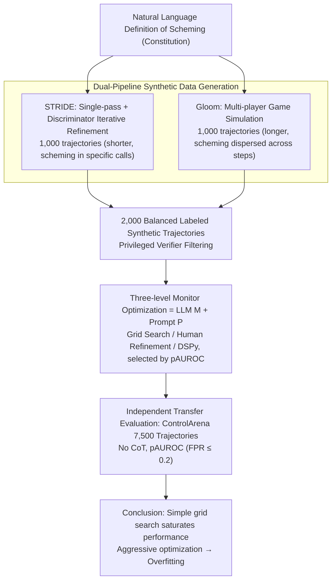

# Constitutional Black-Box Monitoring for Scheming in LLM Agents

**Conference**: ICML 2026  
**arXiv**: [2603.00829](https://arxiv.org/abs/2603.00829)  
**Code**: None  
**Area**: LLM Agent  
**Keywords**: Black-box monitoring, LLM agent safety, Scheming behavior detection, Synthetic data, Prompt optimization  

## TL;DR
This paper proposes an end-to-end "Constitutional Black-Box Monitoring" framework. It utilizes two synthetic data pipelines (STRIDE and Gloom) to generate 2,000 synthetic trajectories for optimizing prompt-based classifiers. These monitors detect scheming behavior in LLM agents by observing only externally visible tool calls and outputs (excluding Chain-of-Thought). The study finds that simple prompt grid search saturates performance, while more aggressive optimization leads to overfitting.

## Background & Motivation

**Background**: As LLMs evolve from conversational assistants into autonomous agents capable of executing code, invoking tools, and operating in real-world environments, the importance of safe deployment increases significantly. Prior work has observed early signs of "alignment faking," "in-context scheming," and strategic deception in frontier models under controlled conditions.

**Limitations of Prior Work**: The core characteristic of scheming is "covertly pursuing misaligned goals while appearing cooperative." This creates a fundamental verification dilemma for standard safety training—imposing optimization pressure on scheming might eliminate the behavior or merely teach the model to hide it better. Since these outcomes cannot be reliably distinguished, alignment training alone is insufficient; "defense-in-depth" is required.

**Key Challenge**: Monitoring is the first layer of defense-in-depth, but it faces two interconnected hurdles: (1) real-world spontaneous scheming samples are nearly non-existent for training monitors; (2) relying on internal CoT is unreliable because reasoning chains may be unfaithful, illegible, or entirely invisible in the future.

**Goal**: Build a black-box scheming detector based solely on external behavior and solve the data scarcity problem by replacing real samples with a constitutional approach (generating synthetic data from natural language behavioral norms).

**Key Insight**: Drawing on the concept of Constitutional Classifiers, high-level definitions of scheming behavior are treated as the "constitution." Frontier LLMs then instantiate these into specific trajectories, enabling the optimization of monitors on synthetic data for evaluation in real-world environments.

**Core Idea**: Training data is generated through two complementary synthetic pipelines (STRIDE single-pass generation + iterative refinement, and Gloom multi-player simulation). These data are used to optimize black-box prompt classifiers, which are then rigorously evaluated on the independent semi-realistic sandbox environment, ControlArena.

## Method

### Overall Architecture
This framework addresses the lack of real scheming samples by connecting three layers: first, using constitutional synthetic data generation to create a training set; second, optimizing the monitor on this data; and finally, testing transfer performance in a completely independent semi-realistic sandbox. During training, 1,000 balanced labeled trajectories are generated from both STRIDE and Gloom (2,000 total) to tune the combination of "Monitor = (LLM $M$ + Prompt $P$)". During evaluation, the system runs on 7,500 semi-realistic trajectories from ControlArena, where ground truth is provided by deterministic environment checks rather than LLM judgment. In both stages, the monitor receives trajectories without CoT (user messages + tool calls + tool outputs) and outputs a suspicion score $S \in [1, 10]$.

### Key Designs

**1. Dual-Pipeline Synthetic Data Generation (STRIDE + Gloom): Approximating Real-word Diversity**

Since real scheming trajectories are scarce, the strategy starts with natural language definitions and uses frontier LLMs to instantiate them into labeled agent trajectories. STRIDE uses a single LLM call to generate a full trajectory (using Gemini 2.5 Pro for its low refusal rate), which is then refined by a discriminator (Claude Sonnet 4) through iterative feedback. Gloom, based on the Bloom framework, simulates a "multi-player game" where a misaligned agent interacts with an environment simulator. These pipelines are complementary: STRIDE trajectories are shorter (median 12 rounds) with concentrated scheming, while Gloom trajectories are dense (median 10 rounds, 21.8k tokens) with scheming dispersed across steps. Using both reduces exposure to artifacts specific to a single generation method. A "privileged verifier"—which has access to attack strategies and metadata invisible to the monitor—filters the data, ensuring the filtering process does not share the same blind spots as the monitor.

**2. Low False-Positive Oriented Metric: pAUROC**

Scheming is rare in real deployment. Even a slightly high false-positive rate (FPR) would overwhelm human auditors. Thus, standard AUROC is less meaningful. This work uses Partial AUROC (pAUROC) integrated over the low false-positive range:

$$\text{pAUROC} = \frac{1}{0.20}\int_0^{0.20}\text{TPR}(t)\,dt$$

By normalizing FPR $\leq 0.2$, a perfect monitor scores 1.0, and a random classifier scores 0.1. This directly addresses the practical question of how many true schemes can be caught within a tolerable false-positive budget. To support this, monitors provide integer scores from $[1, 10]$, which offer better stability in the low FPR region than binary labels.

**3. Three-level Optimization and Overfitting Diagnosis**

To determine how far monitors can be tuned on synthetic data, three levels of optimization are compared: (1) Grid Search (15 prompts × 3 frontier LLMs like Claude Sonnet 4.5, Gemini 2.5 Pro, and GPT 5.1); (2) Human Prompt Refinement using LLM-assisted error analysis over 3 iterations; (3) DSPy automated optimizers (GEPA / MIPROv2). Results show that while training pAUROC increases with heavier optimization, test pAUROC plateaus or even declines. This indicates that aggressive optimizers exploit specific noise in synthetic data, leading to overfitting. Simple grid search often provides the best cost-benefit ratio.

### Loss & Training
The monitor acts as a zero-shot or few-shot prompt classifier without updating parameters in the main workflow. DSPy optimizers (GEPA / MIPROv2) use a classification loss based on a threshold of 5 to drive prompt search. Fine-tuning experiments with Kimi K2.6 use LoRA to verify if the "performance saturation" conclusion holds under weights updates.

## Key Experimental Results

### Main Results

| Optimization Strategy | Training Data | Monitoring LLM | Train pAUROC | Test pAUROC |
| :--- | :--- | :--- | :--- | :--- |
| Prompt Sweep | STRIDE | Gemini 2.5 Pro | ~0.95 | **0.866** |
| Prompt Sweep | Gloom | Claude Sonnet 4.5 | ~0.90 | **0.853** |
| Human Refinement | STRIDE | Gemini 2.5 Pro | ~0.97 | **0.887** |
| Human Refinement | Gloom | Claude Sonnet 4.5 | ~0.95 | 0.840 |
| GEPA (DSPy) | Gloom | Claude Sonnet 4.5 | ~0.96 | 0.830 |
| Baseline Prompt | — | Claude Sonnet 4.5 | — | ~0.75 |
| Random Classifier | — | — | — | 0.10 |

### Ablation Study

| Configuration | Test pAUROC | Description |
| :--- | :--- | :--- |
| Grid Search (prompt sweep) | 0.853–0.866 | High performance reached via simple search |
| + Human Refinement | Plateau/Drop | No significant gain; train set climbs, test set does not |
| + GEPA Auto-optimization | Plateau/Drop | Aggressive optimization leads to overfitting |
| Kimi K2.6 Prompt Sweep | +0.19 vs Baseline | Saturation effect confirmed across models |
| Kimi K2.6 SFT (LoRA) | Equal to Sweep | Fine-tuning fails to break the performance ceiling |
| Direct optimization on ControlArena | 0.81 | Saturation occurs even with real distribution data |

### Key Findings
- **Simple prompt search is sufficient**: A search across 15 prompts and 3 LLMs achieves performance comparable to much more expensive methods.
- **Synthetically optimized monitors are transferable**: Monitors optimized purely on synthetic data capture meaningful scheming signals in ControlArena.
- **Clear overfitting risk**: Iterative optimization beyond the best prompt often improves training scores while test scores stagnate, as optimizers exploit synthetic artifacts.
- **Saturation is not a prompt limitation**: SFT experiments on open-source models replicate the same ceiling, suggesting the bottleneck lies in the black-box monitoring paradigm itself.

## Highlights & Insights
- **Constitutional Data Generation**: This converts an LLM's generative capability into a validation signal by using definitions to create training samples, bypassing the lack of real data.
- **Privileged Verifier**: This solves the self-referential problem of data filtering. By providing the verifier with metadata (attack strategies), the task simplifies to "strategy verification" rather than "discovery," avoiding shared blind spots with the monitor.
- **Optimization Ceiling**: Provides practical architectural guidance—complex prompt engineering lacks scalability compared to simple grid search for this task.

## Limitations & Future Work
- **The Ceiling of Black-Box Paradigms**: External behavior observation may fail to detect highly sophisticated scheming, especially if malicious actions are embedded in plausible technical operations.
- **Gap in Synthetic Data**: There may be fundamental behavioral differences between induced scheming (via system prompts) and spontaneous scheming.
- **Evaluation Scenarios**: The study covers only 5 environments in ControlArena, which may not represent the full complexity of real-world deployments.
- **Future Directions**: Data augmentation (back-translation, style transfer) might mitigate overfitting; combining black-box monitoring with internal representation analysis may break the performance ceiling.

## Related Work & Insights
- **vs. Constitutional Classifiers (Sharma et al., 2025)**: While the prior work builds multi-class threat detectors (e.g., jailbreaking), this study narrows the focus to scheming and investigates the performance upper bound of black-box monitoring.
- **vs. AI Control (Greenblatt et al., 2024b)**: AI Control assumes potentially adversarial models and designs containment protocols. The monitor in this paper serves as a specific component within such a framework, focusing on detection capabilities without CoT.

## Rating
- Novelty: ⭐⭐⭐⭐
- Experimental Thoroughness: ⭐⭐⭐⭐⭐
- Writing Quality: ⭐⭐⭐⭐
- Value: ⭐⭐⭐⭐

<!-- RELATED:START -->

## Related Papers

- [\[ICML 2026\] LLM Agents Are the Antidote to Walled Gardens](llm_agents_are_the_antidote_to_walled_gardens.md)
- [\[ICML 2026\] ExCyTIn-Bench: Evaluating LLM Agents on Cyber Threat Investigation](excytin-bench_evaluating_llm_agents_on_cyber_threat_investigation.md)
- [\[ICML 2026\] Agent-Omit: Adaptive Context Omission for Efficient LLM Agents](agent-omit_adaptive_context_omission_for_efficient_llm_agents.md)
- [\[ICML 2026\] EvolveR: Self-Evolving LLM Agents through an Experience-Driven Lifecycle](evolver_self-evolving_llm_agents_through_an_experience-driven_lifecycle.md)
- [\[ICML 2026\] Reward Hacking Benchmark: Measuring Exploits in LLM Agents with Tool Use](reward_hacking_benchmark_measuring_exploits_in_llm_agents_with_tool_use.md)

<!-- RELATED:END -->
