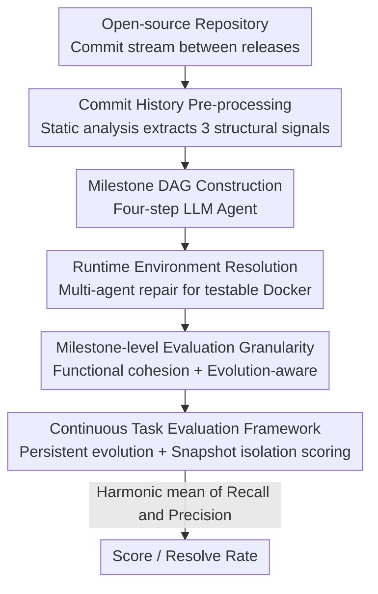

# EvoClaw: Evaluating AI Agents on Continuous Software Evolution

**Conference**: ICML2026  
**arXiv**: [2603.13428](https://arxiv.org/abs/2603.13428)  
**Code**: https://github.com/EvoClaw-Bench/EvoClaw (Includes DeepCommit pipeline, datasets, and the evo-claw.com leaderboard)  
**Area**: Agent  
**Keywords**: Coding Agents, Software Evolution, Long-range Evaluation, Milestone DAG, Technical Debt

## TL;DR
EvoClaw proposes a "milestone-level" software evolution evaluation paradigm. Utilizing the DeepCommit pipeline, it reconstructs noisy commit histories from open-source repositories into executable and verifiable milestone dependency Directed Acyclic Graphs (DAGs). This allows agents to complete a sequence of dependent development tasks on a single persistent codebase. The study reveals that while 12 frontier models can achieve scores $>80\%$ on independent tasks, their performance drops to a maximum of $38\%$ in continuous evolution scenarios, exposing fundamental deficiencies in long-term maintenance and the suppression of error propagation.

## Background & Motivation
**Background**: Coding agents (such as Claude Code, Codex, Gemini CLI, and OpenHands) are increasingly deployed as "long-running systems" tasked with autonomously developing and continuously iterating on environment-oriented software. Corresponding evaluation benchmarks have evolved from early single-function completion (HumanEval) to issue fixing (SWE-bench) and whole-repository generation (Commit0, ProgramBench).

**Limitations of Prior Work**: However, nearly all these benchmarks treat development as a series of **independent, reset-after-completion** snapshot tasks. They either score against ground-truth states at each step or evaluate problems in isolation on clean repositories. Such approaches fail to model the most critical aspects of software evolution—**temporal dependencies between tasks and the accumulation of technical debt**. An agent might take shortcuts to pass immediate tests while quietly embedding debt that compromises long-term maintainability, a failure mode that remains **invisible** in isolated evaluations.

**Key Challenge**: Selecting the task granularity presents a dilemma for replicating real-world evolution. **Release-level** is too coarse: a single release flattens hundreds of interdependent commits into one update, losing the fine-grained dependency structure that drives evolution. **Commit-level** is too fine and imbalanced: many commits involve trivial changes like typos, and a linear commit sequence only encodes "submission order," potentially introducing false dependencies between unrelated changes.

**Goal**: ① Identify a granularity that preserves fine-grained dependencies while carrying coherent functional goals; ② Automatically reconstruct noisy commit histories into **compilable and testable** evolution sequences; ③ Evaluate agents continuously on a persistent codebase to make cross-task error propagation measurable.

**Key Insight**: The authors propose modeling at the **milestone level**. A milestone is a set of commits that are functionally cohesive and together advance a specific development goal. Functional dependencies between milestones naturally form a DAG, preserving genuine prerequisite constraints while allowing independent features to progress in parallel.

**Core Idea**: Use the **DeepCommit** agentic pipeline to reorganize raw git histories into **runtime-verified milestone DAGs**. Then, use EvoClaw to have agents complete task flows along the DAG on a continuously evolving codebase, measuring long-range evolution capability through a score that balances "new feature completion" and "regression safety."

## Method

### Overall Architecture
The work consists of two layers: **DeepCommit** is responsible for "data generation"—automatically reconstructing the commit history between two release tags of an open-source repository into an executable milestone DAG. **EvoClaw** handles the "evaluation"—treating these DAGs as continuous task flows where the agent evolves the codebase over a persistent environment, with scoring performed via snapshot isolation.

DeepCommit itself is a three-phase serial agentic pipeline with quality gates throughout: Phase 1 structs the raw history through static analysis; Phase 2 uses an LLM agent to construct the milestone DAG in four steps; Phase 3 resolves the runtime environment into testable Docker testbeds for each milestone. EvoClaw builds upon this to define a continuous evaluation framework and scoring metrics.

### Key Designs

**1. Milestone-level Granularity: Balancing the Coarseness of Releases and the Fineness of Commits**

This is the foundational thesis of the paper, directly addressing the "granularity dilemma." The authors define a milestone as a group of commits that are "functionally cohesive and maintain dependency constraints." Compared to a release, it preserves fine-grained development dependencies and structural evolution. Compared to a commit, it encapsulates realistic and coherent functional goals, filtering out noise like typos and hotfixes while avoiding false dependencies from linear commit orders. Functional dependencies between milestones form a DAG: $M_i$ is unlocked only after all its prerequisites are completed, encoding real constraints while allowing unrelated features to unfold in parallel. To ensure balanced scales, the pipeline aims for a Coefficient of Variation $\mathrm{CV} < 1.0$ for LoC per milestone, achieving $\mathrm{CV} = 0.96$ in EvoClaw.

**2. DeepCommit Three-phase Reconstruction: Turning Noisy Git History into Executable Evolution Sequences**

The difficulty lies in the fact that "reordering and grouping commits" breaks native git history—patches often fail to compile or lack tests after reordering, threatening the executability of the benchmark. DeepCommit resolves this in three phases. Phase 1 (Pre-processing) models the release interval as a linear commit sequence, collects PR/Issue/Release metadata, and uses static analysis to extract structural signals: `git blame`-based commit-level DAGs (line-level text dependencies), symbol-level modifications (changes to classes/functions), and file-level co-change statistics (evolutionary coupling). Phase 2 constructs the milestone DAG using a four-step LLM agent (see Design 3). Phase 3 (Runtime Environment Resolution) employs a MainAgent to orchestrate multiple agents to cherry-pick commits in topological order, reconstruct the code state, and generate Dockerfiles from CI/CD. It enforces three gates: **source code must compile, the test framework must collect tests, and tests referenced by patches must be included**. Cherry-pick conflicts trigger DAG repairs. Driven by Claude Opus 4.5, the pipeline achieves an average test collection success rate of **87.1%**.

**3. Four-step Milestone DAG Construction: Growing Functionally Cohesive Nodes from Discrete Commits**

Organizing discrete commits into milestones requires combining structural dependencies with code-level reasoning. The authors use four stages: **Seed Discovery**—identifying "seed" commits that introduce independent development themes using commit semantics and structural signals; **Milestone Consolidation**—expanding seeds into milestones based on shared file changes and PR references, with a coordinator agent resolving conflicts where a commit belongs to multiple milestones; **Dependency Inference**—extracting line-level text dependencies and verifying subtle symbol-level or co-change dependencies; **Milestone Decompose**—splitting oversized milestones and merging undersized ones to maintain a valid DAG.

**4. Continuous Evaluation Framework + Score Metric: Measuring Error Propagation and Balancing Innovation with Regression Safety**

EvoClaw's framework consists of a **dependency-driven task flow** (external planner), a **continuous evolution environment** (persistent changes across tasks), and **snapshot isolation evaluation** (implementation state is snapshotted to an isolated container for testing). For metrics, the authors separate performance into two dimensions. Recall measures the completion of new functionality:

$$\text{Recall}_m = \frac{N_{\text{fixed},m}}{N_{\text{required},m}}$$

where $N_{\text{required},m}$ is the total number of Fail-to-Pass (F2P) tests for milestone $m$. Precision measures the reliability of modifications, indicating how many test state changes are improvements rather than regressions:

$$\text{Precision}_m = \frac{N_{\text{fixed},m} + \epsilon}{N_{\text{fixed},m} + N_{\text{broken},m} + \epsilon}$$

$N_{\text{broken},m}$ is the number of Pass-to-Pass (P2P) tests that failed due to the agent's changes, and $\epsilon=1$ is a smoothing term. The milestone score is the harmonic mean $\text{Score}_m = \frac{2 \cdot \text{Precision}_m \cdot \text{Recall}_m}{\text{Precision}_m + \text{Recall}_m}$. They also report a stricter **Resolve Rate**, where a milestone is solved only if all F2P and P2P tests pass.

## Key Experimental Results

### Main Results
The authors evaluated 12 frontier models across 4 agent frameworks, comparing "Continuous vs. Independent" settings. Core finding: scores $>80\%$ on independent tasks drop to a maximum of $38.03\%$ (Claude Opus 4.6) in continuous scenarios, with Resolve Rates falling to single digits.

| Framework / Model | Score⋆ (%) | Precision (%) | Recall (%) | Resolve (%) | Cost ($) |
| :--- | :--- | :--- | :--- | :--- | :--- |
| claude-code / Claude Opus 4.6 | **38.03** | 37.33 | 55.21 | 8.46 | 75.73 |
| claude-code / Claude Opus 4.6 (CC Edition) | 36.29 | 37.84 | 56.32 | 11.57 | 88.22 |
| codex / GPT 5.3-Codex | 28.88 | 27.81 | 49.70 | 9.58 | 25.01 |
| gemini-cli / Gemini 3 Pro | 24.25 | 25.46 | 32.70 | **13.37** | 114.96 |
| claude-code / Claude Sonnet 4.5 | 15.16 | 18.88 | 28.50 | 5.49 | 27.02 |

(⋆ indicates primary metric; Costs for a full evaluation using frontier models average around $500.)

### Key Findings

| Phenomenon | Performance | Implication |
| :--- | :--- | :--- |
| Continuous vs. Independent | $>80\% \rightarrow \le 38.03\%$ | Long-term maintenance is the true bottleneck; isolated evaluation severely overestimates capability. |
| Recall vs. Precision Asymmetry | Recall grows near-linearly; Precision saturates. | Agents can "write new features" but fail to prevent regressions as the system evolves. |
| Error Snowball Effect | Unresolved regressions accumulate faster than fixes. | Early bugs pollute downstream tasks along the dependency chain, eventually stalling development. |
| Behavioral Analysis | Active exploration + strict test validation. | Blind trial-and-error and lack of validation accelerate failure in continuous settings. |

## Highlights & Insights
- **Milestone granularity is a clever choice**: It strikes a balance between release and commit levels, preserving fine-grained dependencies while ensuring coherent functional semantics—a key step in making "software evolution" an evaluable object.
- **Agentic data generation (DeepCommit)**: Using an LLM-based pipeline with static analysis and runtime verification to reconstruct git history is a scalable framework that can be applied to synthetic data generation and regression test suite construction.
- **Recall/Precision decomposition**: Using F2P to measure progress and P2P to measure regression provides much more information than binary pass rates, penalizing both "feature bloat with regressions" and "stagnation for safety."
- **Snapshot isolation design**: The "develop-in-place, evaluate-in-isolation" approach effectively balances the stateful nature of continuous development with the reproducibility required for scoring.

## Limitations & Future Work
- **High Cost**: Evaluations using frontier models are expensive ($500 per run), and DeepCommit reconstruction still requires human expert guidance at key decision points.
- **Human-in-the-loop**: The final quality of the milestone DAG and the solvability of specifications still require expert review, meaning the process is not yet fully end-to-end autonomous.
- **Coverage**: 7 repositories and 98 milestones across 5 languages is still a relatively small sample compared to the vast open-source ecosystem.
- **Future Directions**: Automating human-in-the-loop validation, using cheaper models to drive DeepCommit, and investigating the internal mechanisms of why Precision saturates.

## Related Work & Insights
- **vs. SWE-bench**: SWE-bench uses commit-level, isolated snapshots where each task is independent. EvoClaw uses milestone-level continuous evolution, explicitly modeling cross-task dependencies and cumulative technical debt.
- **vs. SWE-EVO / Commit0**: These attempt long-range scope by increasing single-task size but still evaluate in isolation. EvoClaw uses a DAG to string milestones into stateful task flows.
- **vs. SWE-CI**: While SWE-CI uses commit-level CI rounds, EvoClaw's milestone-level DAG more faithfully models the functionally cohesive nature of real-world development.

## Rating
- **Novelty**: ⭐⭐⭐⭐⭐ (First work to turn "continuous software evolution" into an executable milestone DAG evaluation.)
- **Experimental Thoroughness**: ⭐⭐⭐⭐⭐ (12 models/4 frameworks, continuous/independent control, and rigorous data quality audits.)
- **Writing Quality**: ⭐⭐⭐⭐ (Logical flow and clear metrics; the pipeline details are complex and benefit from careful reading.)
- **Value**: ⭐⭐⭐⭐⭐ (Exposes a critical bottleneck in long-range coding agents that isolated benchmarks miss.)

## Related Papers

- [\[ICML 2026\] SE-GA: Memory-Augmented Self-Evolution for GUI Agents](se-ga_memory-augmented_self-evolution_for_gui_agents.md)
- [\[ICLR 2026\] OpenAgentSafety: A Comprehensive Framework for Evaluating Real-World AI Agent Safety](../../ICLR2026/llm_agent/openagentsafety_a_comprehensive_framework_for_evaluating_real-world_ai_agent_saf.md)
- [\[ACL 2026\] CoEvolve: Training LLM Agents via Agent-Data Mutual Evolution](../../ACL2026/llm_agent/coevolve_training_llm_agents_via_agent-data_mutual_evolution.md)
- [\[ACL 2026\] WebClipper: Efficient Evolution of Web Agents with Graph-based Trajectory Pruning](../../ACL2026/llm_agent/webclipper_efficient_evolution_of_web_agents_with_graph-based_trajectory_pruning.md)
- [\[ICML 2026\] ExCyTIn-Bench: Evaluating LLM Agents on Cyber Threat Investigation](excytin-bench_evaluating_llm_agents_on_cyber_threat_investigation.md)

<!-- RELATED:END -->

<!-- RELATED:START -->

## Related Papers

- [\[ICLR 2026\] InnovatorBench: Evaluating Agents' Ability to Conduct Innovative AI Research](../../ICLR2026/llm_agent/innovatorbench_evaluating_agents_ability_to_conduct_innovative_ai_research.md)
- [\[ICLR 2026\] Programming with Pixels: Can Computer-Use Agents do Software Engineering?](../../ICLR2026/llm_agent/programming_with_pixels_can_computer-use_agents_do_software_engineering.md)
- [\[ICML 2026\] SE-GA: Memory-Augmented Self-Evolution for GUI Agents](se-ga_memory-augmented_self-evolution_for_gui_agents.md)
- [\[ICLR 2026\] OpenAgentSafety: A Comprehensive Framework for Evaluating Real-World AI Agent Safety](../../ICLR2026/llm_agent/openagentsafety_a_comprehensive_framework_for_evaluating_real-world_ai_agent_saf.md)
- [\[ICML 2026\] Towards a Science of AI Agent Reliability](towards_a_science_of_ai_agent_reliability.md)

<!-- RELATED:END -->
