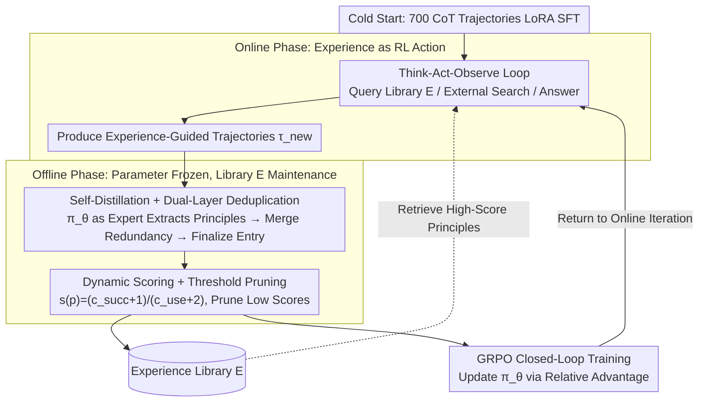

# EvolveR: Self-Evolving LLM Agents through an Experience-Driven Lifecycle

**Conference**: ICML 2026  
**arXiv**: [2510.16079](https://arxiv.org/abs/2510.16079)  
**Code**: https://github.com/Edaizi/EvolveR (Available)  
**Area**: LLM Agent / Continual Learning / Reinforcement Learning  
**Keywords**: Experience Lifecycle, Self-Distillation Principle Library, Dynamic Scoring, GRPO, Multi-hop QA

## TL;DR
EvolveR provides LLM agents with a closed-loop lifecycle: "Online interaction $\rightarrow$ Offline self-distillation into principle libraries $\rightarrow$ GRPO policy evolution." Instead of discarding past trajectories, the agent abstracts successes and failures into a retrievable "principle library" and uses RL to learn **how to utilize its own principles** to solve new tasks. It significantly outperforms RL agent baselines like Search-R1 across 7 multi-hop QA benchmarks.

## Background & Motivation

**Background**: LLM agents (such as ReAct, Reflexion, ExpeL, Search-R1) have demonstrated proficiency in tool utilization. however, most remain "stateless": each task is treated independently, and past experiences are either discarded or temporarily injected as hints distilled by external LLM teachers.

**Limitations of Prior Work**: (1) Reflexion-style methods treat reflection as "one-time hints" without updating the agent's internal policy. (2) Retrieval using raw trajectories (Case-based) tends to overfit to new tasks or results in direct copying of answers rather than abstracting strategies. (3) Distilling experiences via external strong teachers may cause "cognitive misalignment" with the agent's own capability distribution, particularly for small models. (4) RL agents like Search-R1 or O2-Searcher optimize external search strategies well but fail to address the problem of "learning from one's own experience."

**Key Challenge**: Human experts grow through a continuous cycle of "Interaction—Reflection—Abstraction." Existing agent frameworks short-circuit reflection (stateless), abstraction (raw cases), or internalization (prompt-only, no policy update).

**Goal**: Construct a complete closed-loop system where the agent generates its own trajectories, distills reusable strategic principles, and learns to apply these principles via RL, without relying on external teachers.

**Key Insight**: Treat the "Principle Library" as an explicit tool retrievable by the agent (equivalent to a search engine). Allow GRPO to learn both "how to solve problems" and "how to utilize experience."

**Core Idea**: Self-distilled principles + dynamic scoring maintenance + experimental experience as an action—integrating the experience lifecycle with RL policy evolution.

## Method

### Overall Architecture
EvolveR addresses the "forgetting after completion" problem by integrating an alternating two-phase lifecycle into a closed loop. In the **Online Phase**, the agent operates within a Think-Act-Observe loop, capable of three types of actions: `<search_experience>` to query its experience library $\mathcal E$, `<search_knowledge>` for external search, and `<answer>` for the final result. All generated trajectories $\tau_{\text{new}}$ are preserved. In the **Offline Phase**, parameters are frozen, and the agent uses its current policy $\pi_\theta$ to act as an "expert" reviewing the recent batch of trajectories. It distills these into "Success Principles / Failure Principles" (each principle consists of a natural language description + several structured knowledge triples). After deduplication, merging, and scoring, these are updated in $\mathcal E$. Finally, GRPO is used to update $\pi_\theta$ based on these trajectories before returning to the Online Phase. The system does not rely on external teachers and begins with a cold start using ~700 NQ/HotpotQA CoT trajectories via LoRA SFT to stabilize early RL.

### Key Designs

**1. Self-Distillation + Dual-Layer Deduplication of $\mathcal E$: Growing Principles from Trajectories without Bloating**

Standard agents either discard trajectories or rely on external teachers for distillation. However, principles from external teachers often exceed the agent's execution capability (cognitive misalignment), especially for small models. EvolveR has $\pi_\theta$ **itself** extract a candidate principle $p_{\text{cand}}$ from each trajectory $\tau$ following a prompt. Since the distiller and executor share the same policy, principles naturally align with the agent's capability distribution. To manage the resulting redundancy, a dual-layer integration is applied: the first layer merges semantically equivalent principles from multiple GRPO samples of the same problem; the second layer performs embedding retrieval and binary semantic classification across the library $\mathcal E$. If $\max_{p\in\mathcal E}\text{sim}(p_{\text{cand}},p)<\theta_{\text{sim}}$, it is added as a new entry $\mathcal E\leftarrow\mathcal E\cup\{p_{\text{cand}}\}$. Otherwise, the source trajectory $\tau_{\text{src}}$ is merged under the most similar existing entry $p^*$, enriching its evidence without adding redundancy.

**2. Dynamic Scoring + Threshold Pruning: Survival of the Fittest principles**

Merely accumulating principles leads to high-value principles being buried in noise, degrading retrieval. EvolveR assigns two counters to each principle $p$: usage count $c_{\text{use}}(p)$ and subsequent task success count $c_{\text{succ}}(p)$. A score is calculated using Laplace smoothing: $s(p)=\frac{c_{\text{succ}}(p)+1}{c_{\text{use}}(p)+2}$. Principles falling below a threshold $\theta_{\text{prune}}$ are periodically pruned. Laplace smoothing ensures that new principles with low usage counts start with a reasonable default score, preventing premature pruning, while $c_{\text{use}}$ growth allows the score to converge to the true success rate.

**3. Experience as RL Action + GRPO Training: Learning How to Use Experience**

Treating the principle library as a read-only RAG does not evolve the policy. EvolveR defines `<search_experience>` as a first-class action alongside external search. This allows RL gradients to optimize "when to query experience" and "which principles are most useful." The reward is a weighted sum of outcome reward and format reward: $R(\tau)=w_o R_{\text{outcome}}+w_f R_{\text{format}}$. Format rewards encourage cycles of thinking, searching, and answering. The policy is optimized via GRPO, using $G=8$ sampled trajectories per prompt:

$$\mathcal J_{\text{GRPO}}(\theta)=\mathbb E_\tau\Big[\sum_t \min\big(\rho_t \hat A_t,\ \text{clip}(\rho_t,1-\epsilon,1+\epsilon)\hat A_t\big) - \beta D_{\text{KL}}[\pi_\theta\|\pi_{\text{ref}}]\Big]$$

GRPO's ability to perform relative comparisons between "experience-guided" trajectories reinforces the causal link between retrieving a successful principle and task success.

### Loss & Training
Cold start utilizes LLaMA-Factory for LoRA SFT on 700 CoT samples. The RL phase uses the Verl framework for GRPO with a batch of 128 prompts, $G=8$, Adam lr $1\times 10^{-6}$, warmup of 20, and a mini-batch of 128 on 8 A100 GPUs. $R_{\text{format}}$ is defined as $R_{\text{format}}=\mathbb I(\tau_{\text{complete}})\cdot (R_{\text{think}}+R_{\text{search}})/2$.

## Key Experimental Results

### Main Results
Evaluation across 7 QA benchmarks, categorized into In-domain (NQ, HotpotQA) and OOD (TriviaQA, PopQA, 2Wiki, Musique, Bamboogle). EM (Exact Match) is the primary metric.

| Model | Method | NQ | HotpotQA | TriviaQA | PopQA | 2Wiki | Musique | Bamboogle | **Avg** |
|---|---|---|---|---|---|---|---|---|---|
| 3B | Direct | .106 | .149 | .288 | .108 | .244 | .020 | .024 | .134 |
| 3B | RAG | .348 | .255 | .544 | .387 | .226 | .047 | .080 | .270 |
| 3B | Search-R1-instruct | .341 | .324 | .545 | .378 | .319 | .103 | .264 | .325 |
| 3B | **Ours** | **.434** | **.373** | .584 | .434 | **.381** | **.137** | **.328** | **.382** |
| 7B | RAG | .349 | .299 | .585 | — | — | — | — | — |
| 7B | **Ours** | — | — | — | — | — | — | — | **.417** |

(Ours outperforms the strongest baseline Search-R1-instruct by +5.7 EM on average in the 3B scale.)

### Ablation Study

| Configuration | Avg EM Change | Description |
|---|---|---|
| Full Ours | 0.382 (3B) | Complete experience lifecycle |
| Remove self-distillation, use external teacher | 3B drops, 7B stable | Verifies cognitive alignment is more critical for small models |
| Remove deduplication + scoring | Performance drops | Curation/pruning is key |
| Remove `<search_experience>` action | Degenerates to Search-R1 | RL fails to learn "utilizing own experience" |
| Only prompt + raw case retrieval | Significant drop | Abstract principles ≫ raw trajectory |

### Key Findings
- On 3B models, **self-distillation outperforms distillation from stronger external teachers**. This suggests that teacher-provided principles may exceed the agent's execution capacity, rendering them unusable.
- The synergy between experience actions and RL is crucial; using the principle library solely as RAG without updating the policy yields significantly smaller gains.
- Improvements are more pronounced on OOD datasets (e.g., Bamboogle), indicating that distilled "strategic principles" generalize better than specific facts.

## Highlights & Insights
- **Experience as a Learnable Action**: Defining `<search_experience>` as a first-class action allows GRPO to optimize the decision to retrieve experience, distinguishing Ours from prompt-only memory frameworks.
- **Cognitive Alignment**: Self-distillation ensures experiences match the agent's capability distribution, implying that "teachers" in self-improvement systems are not always better when they are stronger.
- **Sustainable Closed-loop**: Dynamic scoring and pruning ensure the library remains maintainable over time, avoiding the "experience contamination" issues seen in prior work like ExpeL.

## Limitations & Future Work
- For 7B models, self-distillation and external distillation show similar performance, suggesting that "cognitive alignment" benefits may diminish as the base model strengthens.
- Experiments focused on multi-hop QA; validation on long-horizon agentic tasks (web navigation, code agents) is still required.
- Engineering concerns such as retrieval latency and embedding drift during long-term training were not fully addressed.
- The heuristic format reward (forcing specific actions) might introduce "hallucinated" calls, and its impact on the truly optimal strategy requires further study.

## Related Work & Insights
- **vs Reflexion / ExpeL**: These store reflections/experiences but do not update the policy; Ours updates the policy via RL driven by experience.
- **vs Search-R1 / O2-Searcher**: These use RL for external knowledge retrieval; Ours extends this to include the agent's own internal experience.
- **vs Mem0 / G-Memory**: While the principle structure (language + triples) is inspired by these, Ours integrates this structure into a complete RL lifecycle.

## Rating
- Novelty: ⭐⭐⭐⭐⭐ 
- Experimental Thoroughness: ⭐⭐⭐⭐ 
- Writing Quality: ⭐⭐⭐⭐ 
- Value: ⭐⭐⭐⭐ 

<!-- RELATED:START -->

## Related Papers

- [\[ICML 2026\] Towards Feedback-to-Plan Decisions for Self-Evolving LLM Agents in CUDA Kernel Generation](towards_feedback-to-plan_decisions_for_self-evolving_llm_agents_in_cuda_kernel_g.md)
- [\[ICML 2026\] Self-evolving LLM agents with in-distribution Optimization](self-evolving_llm_agents_with_in-distribution_optimization.md)
- [\[ICML 2026\] Talk, Judge, Cooperate: Gossip-Driven Indirect Reciprocity in Self-Interested LLM Agents](talk_judge_cooperate_gossip-driven_indirect_reciprocity_in_self-interested_llm_a.md)
- [\[ACL 2026\] Mem²Evolve: Towards Self-Evolving Agents via Co-Evolutionary Capability Expansion and Experience Distillation](../../ACL2026/llm_agent/mem2evolve_towards_self-evolving_agents_via_co-evolutionary_capability_expansion.md)
- [\[ICML 2026\] AutoRPA: Efficient GUI Automation through LLM-Driven Code Synthesis from Interactions](autorpa_efficient_gui_automation_through_llm-driven_code_synthesis_from_interact.md)

<!-- RELATED:END -->
