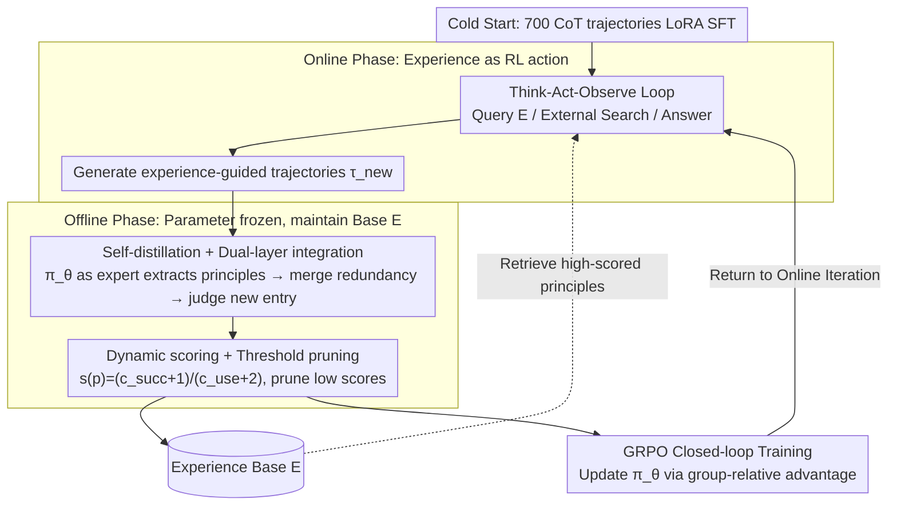

# EvolveR: Self-Evolving LLM Agents through an Experience-Driven Lifecycle

**Conference**: ICML 2026  
**arXiv**: [2510.16079](https://arxiv.org/abs/2510.16079)  
**Code**: https://github.com/Edaizi/EvolveR (Available)  
**Area**: LLM Agent / Continual Learning / Reinforcement Learning  
**Keywords**: Experience Lifecycle, Self-Distillation Principle Library, Dynamic Scoring, GRPO, Multi-hop QA

## TL;DR
EvolveR implements a closed-loop lifecycle for LLM agents: "Online Interaction → Offline Self-Distillation into a Principle Library → GRPO Policy Evolution." Instead of discarding past trajectories, the agent abstracts successes and failures into retrievable "strategic principles," and then uses RL to learn **how to apply its own principles** to solve new problems. It significantly outperforms RL agent baselines like Search-R1 across 7 multi-hop QA benchmarks.

## Background & Motivation

**Background**: LLM agents (ReAct, Reflexion, ExpeL, Search-R1, etc.) have successfully implemented tool-calling capabilities, but most remain "stateless." Each task is handled independently, and past experience is either discarded or distilled by an external LLM teacher as temporary hints.

**Limitations of Prior Work**: (1) Reflexion-style methods treat reflection as a "one-off hint" without updating the agent's internal policy; (2) retrieving raw trajectories (Case-based) leads to overfitting on new tasks or direct copying of answers rather than abstracting strategies; (3) distilling experience using strong external teachers often leads to "cognitive misalignment" with the agent's own capability distribution, especially for small models; (4) RL agents like Search-R1 / O2-Searcher effectively learn external search strategies but fail to address the problem of "learning from self-experience."

**Key Challenge**: Human experts grow through a continuous cycle of "interaction-reflection-abstraction." Existing agent frameworks either short-circuit reflection (stateless), short-circuit abstraction (raw cases), or short-circuit internalization (prompt-only without policy updates).

**Goal**: Construct a complete closed loop where the agent generates trajectories, distills reusable strategic principles, and uses RL to internalize how to use these principles—a system independent of external teachers.

**Key Insight**: Treat the "principle library" as an explicitly retrievable tool for the agent (equal in status to a search engine) and enable GRPO to learn not just "how to solve problems" but also "how to utilize experience."

**Core Idea**: Integrate self-distilled principles, dynamic scoring maintenance, and experimental experience as actions to unify the experience lifecycle with RL policy evolution.

## Method

### Overall Architecture
EvolveR addresses the "forgetting after one task" issue by integrating a two-phase lifecycle into a closed loop. In the **Online Phase**, the agent executes a Think-Act-Observe loop with three types of actions: `<search_experience>` to query its own experience base $\mathcal E$, `<search_knowledge>` for external search, and `<answer>` for the final result. All generated trajectories $\tau_{\text{new}}$ are preserved. In the **Offline Phase**, parameters are frozen. The agent, acting as an "expert" using its current policy $\pi_\theta$, reviews the latest trajectories and distills them into "success/failure principles" (consisting of a natural language description and several structured knowledge triplets). After deduplication, integration, and scoring, these are written back to $\mathcal E$. Finally, GRPO is used to update $\pi_\theta$ based on these trajectories before returning to the Online Phase. The cycle requires no external teachers and begins with a cold start using ~700 NQ/HotpotQA CoT trajectories via LoRA SFT to stabilize early RL.

### Key Designs

**1. Experience Base $\mathcal E$ with Self-distillation + Dual-layer Integration: Growing experiences from trajectories without storage bloat**

Agent trajectories are typically either lost or distilled by strong external teachers, whose principles often exceed the execution capacity of the agent (cognitive misalignment), particularly for small models. EvolveR has $\pi_\theta$ **itself** extract a candidate principle $p_{\text{cand}}$ from each trajectory $\tau$. Since the distiller and executor share the same policy, the principles naturally align with the agent's capability distribution. To handle redundancy from self-distillation, a dual-layer integration is applied: the first layer merges semantically equivalent principles from multiple GRPO samples of the same problem; the second layer performs embedding retrieval and binary semantic classification across the entire base $\mathcal E$. If $\max_{p\in\mathcal E}\text{sim}(p_{\text{cand}},p)<\theta_{\text{sim}}$, it is added as a new entry $\mathcal E\leftarrow\mathcal E\cup\{p_{\text{cand}}\}$; otherwise, the source trajectory $\tau_{\text{src}}$ is merged into the most similar existing entry $p^*$, enriching its evidence without adding redundancy. This bypasses external teacher misalignment while preventing raw case explosion.

**2. Dynamic Scoring + Threshold Pruning: Survival of the fittest for principles**

Filling a library without management leads to high-value principles being buried in noise. EvolveR tracks two counts for each principle $p$: usage count $c_{\text{use}}(p)$ and subsequent task success count $c_{\text{succ}}(p)$. A score is calculated via Laplace smoothing: $s(p)=\frac{c_{\text{succ}}(p)+1}{c_{\text{use}}(p)+2}$. Principles falling below threshold $\theta_{\text{prune}}$ are periodically pruned. Constant smoothing ensures that new principles start with a reasonable default score, preventing premature pruning, while the score converges to the true success rate as $c_{\text{use}}$ increases. High-score principles are prioritized for retrieval, and low-score noise is cleared, preventing the "dirty experience" decay seen in frameworks like ExpeL.

**3. Experience as RL Action + GRPO Closed-loop Training: Learning how to use experience**

Treating the principle base purely as read-only RAG does not evolve the policy. EvolveR designates `<search_experience>` as a first-class action equivalent to external search, allowing RL gradients to directly optimize *when* and *which* experiences to retrieve. The reward $R(\tau)=w_o R_{\text{outcome}}+w_f R_{\text{format}}$ combines outcome reward (EM of answer vs. ground truth) and format reward. Format rewards encourage "think," "search," and "answer" to appear at least once, and both `search_experience` and `search_knowledge` to be invoked. The policy is optimized via GRPO, sampling $G=8$ trajectories per prompt for group-relative advantage estimation:

$$\mathcal J_{\text{GRPO}}(\theta)=\mathbb E_\tau\Big[\sum_t \min\big(\rho_t \hat A_t,\ \text{clip}(\rho_t,1-\epsilon,1+\epsilon)\hat A_t\big) - \beta D_{\text{KL}}[\pi_\theta\|\pi_{\text{ref}}]\Big]$$

GRPO eliminates the need for an additional critic and improves stability. Its ability to compare "experience-guided" trajectories reinforces the causal link between "retrieving a successful principle" and "task success," which is the core of the system's evolution.

### Loss & Training
Cold start uses LLaMA-Factory on 700 CoT samples for LoRA SFT. The RL phase utilizes the Verl framework for GRPO with a batch of 128 prompts, $G=8$, Adam lr $1\times 10^{-6}$, 20 warmup steps, and a mini-batch of 128 across 8 A100 GPUs. The format reward $R_{\text{format}}=\mathbb I(\tau_{\text{complete}})\cdot (R_{\text{think}}+R_{\text{search}})/2$ rewards structural integrity along with reasonable thinking steps and diverse search calls.

## Key Experimental Results

### Main Results
Evaluated on 7 QA benchmarks, categorized as In-domain (NQ, HotpotQA) and OOD (TriviaQA, PopQA, 2Wiki, Musique, Bamboogle). EM is the primary metric, comparing Qwen2.5-3B and 7B.

| Model | Method | NQ | HotpotQA | TriviaQA | PopQA | 2Wiki | Musique | Bamboogle | **Avg** |
|---|---|---|---|---|---|---|---|---|---|
| 3B | Direct | .106 | .149 | .288 | .108 | .244 | .020 | .024 | .134 |
| 3B | RAG | .348 | .255 | .544 | .387 | .226 | .047 | .080 | .270 |
| 3B | Search-R1-instruct | .341 | .324 | .545 | .378 | .319 | .103 | .264 | .325 |
| 3B | **EvolveR** | **.434** | **.373** | .584 | .434 | **.381** | **.137** | **.328** | **.382** |
| 7B | RAG | .349 | .299 | .585 | — | — | — | — | — |
| 7B | **EvolveR** | — | — | — | — | — | — | — | **.417** |

(On 3B, EvolveR averages +5.7 EM over the strongest baseline, Search-R1-instruct.)

### Ablation Study

| Configuration | Change in Avg EM | Description |
|---|---|---|
| Full EvolveR | 0.382 (3B) | Complete experience lifecycle |
| W/O self-distillation (External) | Decrease (3B), Flat (7B) | Verifies cognitive alignment is critical for small models |
| W/O deduplication + scoring | Decrease | Curation is essential to prevent library bloat |
| W/O `<search_experience>` action | Degrades to Search-R1 | RL cannot learn "Experience Usage" |
| Prompt-only + raw case retrieval | Significant decrease | Abstract principles ≫ raw trajectories |

### Key Findings
- **Self-distillation outperforms distillation from stronger external teachers** on 3B models. This suggests that teacher-provided principles may exceed the agent's execution capacity, making them unusable.
- The synergy between experience actions and RL is crucial; using the principle base purely for RAG without updating the policy yields much smaller gains than EvolveR.
- Improvements are more significant on OOD datasets (e.g., adversarial multi-hop Bamboogle), indicating that distilled "strategic principles" generalize better than memorized facts.

## Highlights & Insights
- **Design of "experience as a learnable action"**: By placing `<search_experience>` on par with `<search_knowledge>`, GRPO directly optimizes the decision to query experience, creating a fundamental shift from prompt-only memory frameworks.
- **Cognitive Alignment**: The finding that self-distillation matches the agent's capability distribution suggests that teachers in self-improvement systems are not necessarily better if they are "stronger."
- **Cyclic sustainability**: Dynamic scoring and pruning ensure the library remains maintainable over time, avoiding the collapse common in systems like ExpeL.

## Limitations & Future Work
- The performance gap between self-distillation and external distillation narrows on 7B models, suggesting "cognitive alignment" benefits may diminish as the base model strengthens.
- Experiments focused on multi-hop QA; long-horizon agentic tasks (Web navigation, Code agents) where lifecycles are most critical remain unverified.
- Engineering issues such as retrieval latency and embedding drift as the principle library grows were not fully discussed.
- Format reward engineering (forcing action types) might introduce superficial calls; whether this harms the true optimal strategy warrants further study.

## Related Work & Insights
- **vs. Reflexion / ExpeL**: These store reflections/experience but do not update the policy; EvolveR uses experience to drive both retrieval and RL.
- **vs. Search-R1 / O2-Searcher**: These use RL to learn external search; EvolveR goes further by turning the agent's own experience into a learnable objective.
- **vs. Mem0 / G-Memory**: Principle structures are inspired by these (natural language + triplets), but EvolveR embeds this structure into a complete RL lifecycle rather than just retrieval.

## Rating
- Novelty: ⭐⭐⭐⭐⭐ Integrating experience lifecycle, self-distillation, and GRPO into a closed loop is a rare end-to-end solution for continual agent learning.
- Experimental Thoroughness: ⭐⭐⭐⭐ 7 benchmarks, multi-scale ablations, and cognitive alignment comparisons provide broad coverage.
- Writing Quality: ⭐⭐⭐⭐ Systematic presentation of components; Figure 1 comparison of paradigms is intuitive.
- Value: ⭐⭐⭐⭐ Provides a reproducible engineering paradigm for "agent self-evolution," contributing to the long-horizon agent roadmap.

<!-- RELATED:START -->

## Related Papers

- [\[ICML 2026\] Towards Feedback-to-Plan Decisions for Self-Evolving LLM Agents in CUDA Kernel Generation](towards_feedback-to-plan_decisions_for_self-evolving_llm_agents_in_cuda_kernel_g.md)
- [\[ICML 2026\] Talk, Judge, Cooperate: Gossip-Driven Indirect Reciprocity in Self-Interested LLM Agents](talk_judge_cooperate_gossip-driven_indirect_reciprocity_in_self-interested_llm_a.md)
- [\[ACL 2026\] Mem²Evolve: Towards Self-Evolving Agents via Co-Evolutionary Capability Expansion and Experience Distillation](../../ACL2026/llm_agent/mem2evolve_towards_self-evolving_agents_via_co-evolutionary_capability_expansion.md)
- [\[ICML 2026\] AutoRPA: Efficient GUI Automation through LLM-Driven Code Synthesis from Interactions](autorpa_efficient_gui_automation_through_llm-driven_code_synthesis_from_interact.md)
- [\[ICML 2026\] SE-GA: Memory-Augmented Self-Evolution for GUI Agents](se-ga_memory-augmented_self-evolution_for_gui_agents.md)

<!-- RELATED:END -->
