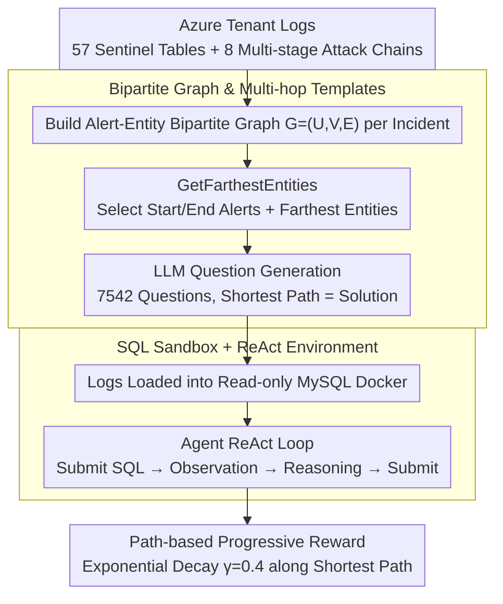

# ExCyTIn-Bench: Evaluating LLM Agents on Cyber Threat Investigation

**Conference**: ICML 2026  
**arXiv**: [2507.14201](https://arxiv.org/abs/2507.14201)  
**Code**: https://github.com/microsoft/ExCyTIn-Bench (SecRL)  
**Area**: LLM Agent / Cybersecurity / Benchmark  
**Keywords**: Threat Investigation, SQL Agent, Bipartite Graph QA, Azure Sentinel, ReAct

## TL;DR
This paper constructs ExCyTIn-Bench, the first benchmark to evaluate LLM agents on end-to-end "cyber threat investigation." Using 57 security log tables from real Azure tenants, 7,542 SQL-based Q&A pairs with evidence chains were automatically generated via alert-entity bipartite graphs. Agents must answer by querying logs and tracing multi-hop evidence in a MySQL environment. Currently, the strongest model, Claude-Opus-4.5, achieves a reward of only 0.606.

## Background & Motivation

**Background**: Cloud-based attacks increased by 75% from 2022 to 2023. Traditional behavioral analysis, signature matching, and anomaly detection are increasingly ineffective. SOC (Security Operations Center) analysts must manually sift through dozens of heterogeneous log tables and perform multi-hop reasoning to localize attacks. Given LLM capabilities in multi-step observation-reasoning-action (as seen in SWE-Bench/AutoGen), applying LLM agents to threat investigation is a promising direction.

**Limitations of Prior Work**: Existing cybersecurity benchmarks (CTIBench, SECURE, SecQA, CyBench, etc.) primarily test "knowledge recall" or "textual understanding"—tasks like mapping CTI reports to MITRE techniques, solving CTF problems, or answering multiple-choice questions. **No benchmark requires agents to proactively query, pivot, and chain evidence starting from a seed alert within an environment containing dozens of log tables.** Consequently, researchers cannot systematically compare model performance on end-to-end investigation.

**Key Challenge**: Real threat investigation is **environment-interactive, long-horizon, and requires domain expertise**, while current evaluation formats (multiple choice/text understanding) naturally bypass these aspects. Filling this gap requires: (1) obtaining real multi-stage attack data with ground-truth (GT); (2) automatically generating large-scale questions with unique answers and interpretable solution paths.

**Goal**: Construct (a) a security log environment based on real multi-stage attacks, (b) a large-scale Q&A set with GT solution paths, and (c) an executable SQL sandbox for agents to perform "investigation via log querying."

**Key Insight**: The authors observe that SOC analysts essentially "traverse" an **implicit alert-entity bipartite graph**: starting from a seed alert, they pivot to adjacent alerts via shared entities (IPs, accounts, domains, etc.) and continue expanding. This graph provides a shortest path from "question source" to "answer target," which can serve as a template for generating multi-hop questions.

**Core Idea**: Eight multi-stage attack chains from a real Azure tenant serve as data sources. Alerts and entities are extracted to form a bipartite graph. By selecting two alerts as start/end points and using the **farthest entities** on the graph as context and answers, LLMs generate questions. This ensures non-repetitive questions, unique GT, and interpretable solution paths.

## Method

### Overall Architecture
ExCyTIn-Bench frames "cyber threat investigation" as an interactive, evaluable loop consisting of data, question generation, and environment layers. The data layer collects 57 Sentinel log tables (EmailEvents, SecurityAlert, etc.) from a fictional Azure tenant used for security demos ("Alpine Ski House"). It includes 8 independent multi-stage attack chains (Manatee Tempest ransomware, BEC account takeover, etc.), with alert counts ranging from 7 to 7,739 over 2 hours to 5 days. The generation layer uses bipartite graphs to create 7,542 questions (589 for testing). The environment layer loads logs into a read-only MySQL Docker. An agent receives a question with seed context and performs a ReAct loop: "Submit SQL → Read table feedback → Reason" until submitting a final answer. Evaluation involves GT entity matching and partial rewards based on intermediate nodes in the solution path.

### Key Designs

**1. Bipartite Graph Construction and Multi-hop Template: Transforming Question Generation into Graph Sampling**

Relying on LLMs to read entire incidents and generate questions often leads to vague queries without unique answers. The authors formalize the SOC workflow as an alert-entity bipartite graph $G=(U,V,E)$, where $U$ are alert nodes and $V$ are entity nodes (IoCs like IP, account). Edges $E$ connect alerts to the entities they contain. For question generation, start/end alert nodes $u_s, u_t$ are selected. `GetFarthestEntities` picks $k=2$ entities farthest from $u_t$ for context $V_s$ and 1 entity $v_e$ from $u_t$ as the answer. The LLM then writes a question based on $(u_s, V_s, v_e, u_t)$. This structures three elements: difficulty (path length), answer (target node), and IoCs (intermediate nodes). This ensures answer uniqueness and path interpretability while being portably applicable to new logs.

**2. SQL Docker Sandbox + ReAct Environment: Deterministic Action Space Modeling SOC Workflows**

End-to-end investigation requires active log querying rather than text reading. Following InterCode, the action space is restricted to SQL: at each step, the agent outputs a SQL query (Action), and the read-only MySQL environment returns the result (Observation) until the agent calls `submit(answer)`. SQL is chosen because: (1) querying via KQL/SQL is standard for SOC analysts; (2) it provides a deterministic interface for "natural language intent → verifiable action," reducing evaluation noise from open tool calls. The environment supports wrappers like ReAct, Best-of-N, and Self-Reflection for comparing test-time scaling strategies.

**3. Path-based Progressive Reward: Decoupling Performance via Decaying Partial Rewards**

Threat investigation is rarely a "one-shot" success. Using binary 0/1 scoring would result in saturated or zero-shot scores. Instead, partial rewards are granted along the shortest solution path $\mathcal{S}=[s_1,\dots,s_n]$. If the final answer is correct, a score of 1 is given. Otherwise, the system backtracks from the target; for each intermediate node $s_i$, the agent's history is checked via `check_step` to see if it was queried. Rewards are accumulated with exponential decay:

$$r=\sum_i d\cdot\gamma^{\,|\mathcal{S}|-i},\quad \gamma=0.4$$

Nodes closer to the final answer have higher weights. This rewards "half-solved" trajectories while penalizing random walks that only hit shallow nodes.

## Key Experimental Results

### Main Results

Average rewards on 589 test questions across 8 incidents:

| Model | Average Reward | Notes |
|------|------------|------|
| Claude-Opus-4.5 | **0.606** | Strongest performer |
| GPT-4.1 | 0.338 | Best standard chat model |
| o4-mini | ~0.39 | Advantage for reasoning models |
| GPT-4o | 0.293 | General flagship |
| Llama4-17B-Maverick | 0.290 | Best open-source |
| GPT-4.1-mini | 0.271 | Small chat |
| Llama4-17B-Scout | 0.262 | |
| o3-mini | 0.296 | Small reasoning model |
| o1-mini | 0.222 | |
| GPT-4o-mini | 0.192 | |
| GPT-4.1-nano | 0.136 | Weakest nano model |
| Phi-4-14B | 0.085 | Ineffective for this task |

Across incidents, difficulty varied significantly: Incident 38 (Fileless Attack, 25 alerts) was relatively easy (rewards 0.2–0.5), while Incident 166 (SAP Financial Manipulation) and Incident 39 (Human-operated intrusion) were the hardest, with rewards dropping to 0.15–0.25 for most models.

### Ablation Study

| Configuration | Average Reward | Key Findings |
|------|------------|----------|
| ReAct (default) | Baseline | Standard multi-step reasoning |
| + Self-Reflection | Slight Increase | Error reflection helps, but gains are limited |
| + Best-of-N | Increase | Compute-to-performance scaling is nearly linear |
| + Expel (Exp. Relay) | Increase | Offline experience extraction is effective |
| Direct Shortest Path | Large Increase | Validates that partial reward design is sound |

### Key Findings
- **Reasoning models are far from saturated**: Even Claude-Opus-4.5 fails ~40% of the questions, proving multi-hop investigation remains a genuine challenge.
- **Small models are nearly unusable**: Phi-4-14B and GPT-4.1-nano show that cyber agent tasks have a high threshold for model capacity; distillation or small models cannot yet match the performance on general benchmarks.
- **Complexity $\neq$ Alert count**: Incident 55 has 7,739 alerts but higher rewards (0.474 for GPT-4.1), while Incident 166 has only 88 alerts but lower scores. The primary challenges are **cross-table joins and entity ambiguity**, not log volume.
- **Test-time scaling has limits**: While Best-of-N and Reflection improve scores, they cannot compensate for a weaker base model, suggesting the bottleneck lies in domain knowledge and long-term planning.

## Highlights & Insights
- **Bipartite graph-based generation** is a sophisticated design, turning empirical question writing into graph sampling. This allows for quantifiable difficulty (path length) and can be adapted to other entity-event domains like medical diagnosis or financial auditing.
- **Decaying partial rewards** effectively differentiate model performance, preventing the "all zeros or all ones" saturation common in agent benchmarks.
- **Real-world fidelity**: Using 8 real-world attack playbooks (Ransomware, BEC, etc.) instead of synthetic data ensures the benchmark aligns with actual SOC workflows.

## Limitations & Future Work
- Data source bias: Focused on a single Azure tenant and Microsoft Sentinel. Portability to AWS GuardDuty, Splunk, or Elastic remains unverified.
- Action space restriction: Real SOC work involves EDR, packet captures, and sandboxes. Limiting the agent to SQL may overestimate the hunting capabilities of "SQL-proficient" LLMs.
- Incident distribution: A small number of incidents contribute to the bulk of the performance delta; expanding to dozens of incidents would improve statistical stability.
- Question type: The graph generation favors "Find the last IoC" questions, potentially overlooking higher-level analysis like intent attribution or APT actor mapping.

## Related Work & Insights
- **vs. CTIBench / SECURE / SecQA**: These test knowledge recall via multiple-choice; ExCyTIn evaluates active discovery within logs.
- **vs. CyBench (CTF)**: CyBench focuses on the attacker perspective; ExCyTIn focuses on forensics/defense, providing a complementary "Blue Team" view.
- **vs. InterCode**: This work adopts the InterCode framework for SQL interaction. The insight is that **providing a generalized environment shell and injecting domain-specific data** is more efficient than building environments from scratch.

## Rating
- Novelty: ⭐⭐⭐⭐ First investigation-specific agent benchmark + bipartite generation paradigm.
- Experimental Thoroughness: ⭐⭐⭐⭐ Comprehensive coverage of 12+ models and 4 prompting strategies.
- Writing Quality: ⭐⭐⭐⭐ Clear motivation and clean structural breakdown.
- Value: ⭐⭐⭐⭐⭐ Fills a critical gap in cyber agent evaluation; the task is far from solved.

<!-- RELATED:START -->

## Related Papers

- [\[ACL 2025\] LegalAgentBench: Evaluating LLM Agents in Legal Domain](../../ACL2025/llm_agent/legalagentbench_evaluating_llm_agents_in_legal_domain.md)
- [\[ACL 2025\] MultiAgentBench: Evaluating the Collaboration and Competition of LLM Agents](../../ACL2025/llm_agent/multiagentbench_evaluating_the_collaboration_and_competition_of_llm_agents.md)
- [\[ICLR 2026\] ZeroDayBench: Evaluating LLM Agents on Unseen Zero-Day Vulnerabilities for Cyberdefense](../../ICLR2026/llm_agent/zerodaybench_evaluating_llm_agents_on_unseen_zero-day_vulnerabilities_for_cyberd.md)
- [\[ICML 2026\] Hunt Instead of Wait: Evaluating Deep Data Research on Large Language Models](hunt_instead_of_wait_evaluating_deep_data_research_on_large_language_models.md)
- [\[NeurIPS 2025\] EU-Agent-Bench: Measuring Illegal Behavior of LLM Agents Under EU Law](../../NeurIPS2025/llm_agent/eu-agent-bench_measuring_illegal_behavior_of_llm_agents_under_eu_law.md)

<!-- RELATED:END -->
