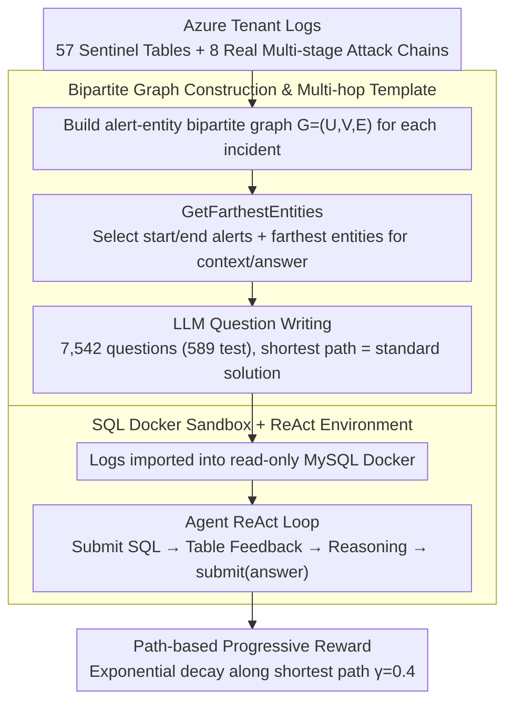

# ExCyTIn-Bench: Evaluating LLM Agents on Cyber Threat Investigation

**Conference**: ICML 2026  
**arXiv**: [2507.14201](https://arxiv.org/abs/2507.14201)  
**Code**: https://github.com/microsoft/ExCyTIn-Bench (SecRL)  
**Area**: LLM Agent / Cybersecurity / Benchmark  
**Keywords**: Threat Investigation, SQL Agent, Bipartite Graph QA, Azure Sentinel, ReAct

## TL;DR
This paper constructs ExCyTIn-Bench, the first benchmark evaluating LLM Agents for end-to-end "cyber threat investigation." Using 57 security log tables from a real Azure tenant, it automatically generates 7,542 SQL Q&A pairs with evidence chains via alert-entity bipartite graphs. It provides a MySQL environment for Agents to answer by querying logs and performing multi-hop evidence tracking. Currently, the strongest model, Claude-Opus-4.5, achieves a reward of only 0.606.

## Background & Motivation

**Background**: Cloud attacks grew by 75% between 2022 and 2023. Traditional behavioral analysis, signature matching, and anomaly detection are increasingly difficult to block attackers. SOC (Security Operations Center) analysts must manually sift through dozens of heterogeneous log tables and perform multi-hop reasoning to localize attacks. LLM Agents have demonstrated multi-step observation-reasoning-action capabilities in tasks like SWE-Bench and AutoGen; naturally, applying LLM Agents to threat investigation is a clear direction.

**Limitations of Prior Work**: Existing cyber-related benchmarks (CTIBench, SECURE, SecQA, CyBench, etc.) mostly test "knowledge recall" or "text understanding"—such as identifying MITRE tactics from CTI reports or answering multiple-choice questions. **No benchmark exists that requires an Agent to actively query, jump, and string evidence together from a seed alert in an environment with dozens of log tables.** Consequently, researchers cannot systematically compare the end-to-end investigation performance of different models.

**Key Challenge**: Real-world threat investigation is an **environment-interactive, long-horizon** task requiring **domain expertise**, whereas existing evaluation formats (multiple-choice/text understanding) naturally bypass these requirements. To fill this gap, the key lies in: (1) obtaining real multi-stage attack data with ground-truth; (2) automatically generating large-scale questions with "unique certain answers" and "interpretable solution paths."

**Goal**: Construct (a) a security log environment based on real multi-stage attacks, (b) a large-scale Q&A set with ground-truth solution paths, and (c) an executable SQL sandbox for Agents to perform "investigation by querying logs."

**Key Insight**: The authors observe that human SOC analysts essentially "walk" on an **implicit alert-entity bipartite graph**: starting from a seed alert, jumping to adjacent alerts via shared entities (IPs, accounts, domains, and other IoCs), and then continuing to diffuse. This graph naturally provides the shortest path from "question source" to "answer destination," which can be used as a template for generating multi-hop questions.

**Core Idea**: Eight multi-stage attack chains from a real Azure tenant serve as the data source. All alerts and entities are extracted to form a bipartite graph. Two alerts are selected as start/end points, and the **farthest entities** on the graph are used as context and answers to let the LLM generate questions. This ensures non-repetitive questions, unique ground truth, and interpretable solution paths.

## Method

### Overall Architecture
ExCyTIn-Bench frames "cyber threat investigation" as an interactive, scorable closed loop consisting of data, question generation, and environment layers. The data layer collects 57 Sentinel log tables (EmailEvents, SecurityAlert, SecurityIncident, etc.) from "Alpine Ski House," a fictional Azure tenant used for security demos. Eight independent multi-stage attack chains (Manatee Tempest ransomware, BEC account takeover, SAP financial manipulation, etc.) are injected, with alert counts ranging from 7 to 7,739 and time spans from 2 hours to 5 days. The generation layer uses alert-entity bipartite graphs to produce 7,542 questions (589 for testing). The environment layer imports all logs into a read-only MySQL Docker. Given a seed alert and context, an Agent performs ReAct loops (SQL query → table feedback → reasoning) until submitting a final answer string. Scoring is based on ground-truth entity matching and partial rewards for intermediate nodes.

### Key Designs

**1. Bipartite Graph Construction and Multi-hop Templates: Transforming Q&A Generation into Graph Sampling**

Directly asking an LLM to generate questions from an incident often results in vague questions without unique answers. The authors explicitly model the SOC analyst workflow: for each incident, $G=(U,V,E)$ is defined where $U$ are alert nodes, $V$ are entity nodes (IoCs like IP, account, domain), and edges $E$ connect alerts to the entities in their "entities" column. Q&A generation picks two alerts $u_s, u_t$, calls `GetFarthestEntities` to select $k=2$ farthest entities from $u_s$ as background $V_s$, and 1 farthest entity $v_e$ from $u_t$ as the answer. The LLM writes a question based on $(u_s, V_s, v_e, u_t)$, where the shortest path between nodes automatically becomes the standard solution. This structures the task: difficulty = path length, answer = destination node, and IoCs = intermediate nodes.

**2. SQL Docker Sandbox + ReAct Interaction: Realistic Action Space**

To evaluate "end-to-end investigation," the model must query logs. Referring to InterCode, the action space is restricted to SQL: the Agent outputs SQL (action), and the read-only MySQL environment returns results (observation). SQL is chosen because KQL/SQL is standard for SOC analysts, and it provides a deterministic interface for "natural language intent → verifiable action," avoiding evaluation noise from open tool calling. Wrappers like ReAct, Best-of-N, Self-Reflection, and Expel are used to compare test-time scaling strategies.

**3. Path-based Progressive Reward: Measuring Model Gap with Decaying Partial Rewards**

Cyber investigation is rarely a single-shot success. Instead of 0/1 binary scoring, this paper applies partial rewards along the shortest solution path. For a solution path $\mathcal{S}=[s_1,\dots,s_n]$, the final answer is checked (reward = 1 if correct). Otherwise, searching backward from the end, each intermediate node $s_i$ is checked via `check_step` against the Agent's history. The reward is accumulated with exponential decay:

$$r=\sum_i d\cdot\gamma^{\,|\mathcal{S}|-i},\quad \gamma=0.4$$

Nodes closer to the final answer have higher weights ($\gamma<1$ dampens far-end nodes). This encourages multi-hop progress and rewards "halfway finished" Agents while avoiding rewarding random walks that hit shallow nodes.

## Key Experimental Results

### Main Results

Average reward across 8 incidents and 589 test questions (higher is better):

| Model | Average Reward | Notes |
|------|------------|------|
| Claude-Opus-4.5 | **0.606** | Strongest current model |
| GPT-4.1 | 0.338 | Best large chat model |
| o4-mini | ~0.39 | Reasoning models show advantages |
| GPT-4o | 0.293 | General flagship |
| Llama4-17B-Maverick | 0.290 | Best open-source |
| GPT-4.1-mini | 0.271 | Small chat model |
| Llama4-17B-Scout | 0.262 | |
| o3-mini | 0.296 | Small reasoning model |
| o1-mini | 0.222 | |
| GPT-4o-mini | 0.192 | |
| GPT-4.1-nano | 0.136 | Weakest nano model |
| Phi-4-14B | 0.085 | Ineffective for this task |

Performance varies significantly by incident: incident 38 (Fileless Attack, 25 alerts) is relatively solvable (0.2–0.5 for most), whereas incident 166 (SAP Financial Manipulation, 88 alerts + many cross-table joins) and incident 39 (Human-operated intrusion, 475 alerts) are the hardest, with rewards dropping to 0.15–0.25.

### Ablation Study

| Configuration | Average Reward | Key Finding |
|------|------------|----------|
| ReAct (default) | Baseline | Standard multi-step reasoning |
| + Self-Reflection | Slight increase | Corrective self-reflection helps minimally |
| + Best-of-N | Increase | Compute-performance scaling is nearly linear |
| + Expel (Experience) | Increase | Offline experience extraction is effective |
| Direct shortest path | Large increase | Validates progressive reward design |

### Key Findings
- **Top reasoning models are far from saturated**: Even Claude-Opus-4.5 reaches only 0.606, meaning it fails to reach the ground truth in ~40% of cases. Long-chain multi-hop investigation remains a real challenge for frontier models.
- **Small models are nearly unusable**: Phi-4-14B (0.085) and GPT-4.1-nano (0.136) indicate that cyber agent tasks have a high entry threshold for model capacity.
- **Incident difficulty $\neq$ alert count**: Incident 55 (7,739 alerts) has a higher reward (0.474 for GPT-4.1) than Incident 166 (88 alerts). The real challenge lies in **cross-table joins and entity ambiguity**, not log volume.
- **Test-time scaling has limits**: Best-of-N and Reflection provide stable gains but cannot bridge the gap created by upgrading the base model. This suggests the bottleneck is "domain knowledge + long-range planning."

## Highlights & Insights
- **Automatic Multi-hop Question Generation via Bipartite Graphs** is a clever design. It shifts Q&A creation from "empirical" to "graph-sampled + LLM-rewritten," ensuring unique answers and quantifiable difficulty (shortest path length). This paradigm can be applied to other "entity-event" domains (medical diagnosis, financial audit, IT operations).
- **Decaying Partial Rewards along the solution path** provides differentiation between models, preventing the benchmark from being either zero-scored by everyone or immediately saturated.
- **Realistic Scenario Selection**: Using 8 **historical attack playbooks** (Manatee Tempest, BEC, SAP intrusion, etc.) instead of synthetic attacks minimizes the gap between the benchmark and real-world SOC workflows.

## Limitations & Future Work
- Data source is limited to one Azure tenant and the Microsoft Sentinel ecosystem. Portability to AWS GuardDuty, Splunk, or Elastic remains unverified as log schemas vary greatly.
- The evaluation focuses only on SQL query actions. Real SOC work involves EDR, network sniffing, and sandbox replay; the narrowed action space may overestimate a model's true threat-hunting capability.
- Difficulty distribution across the 8 incidents is uneven (reward range 0.085–0.491). Expanding to dozens of incidents is needed for more stable model comparisons.
- Bipartite graph questions tend toward "find the last IoC" types, providing less coverage for high-level tasks such as "determining attacker intent" or "attribution to APT groups."

## Related Work & Insights
- **vs CTIBench / SECURE / SecQA**: These are closed-book multiple-choice or text-understanding tasks testing "recalled knowledge." ExCyTIn is an open-book interactive task testing if LLMs can extract answers from logs.
- **vs CyBench (CTF)**: CyBench focuses on the attacker's perspective (CTF); ExCyTIn focuses on the defender's perspective (forensics), making them complementary.
- **vs InterCode**: This paper reuses the SQL interaction design from InterCode. The insight is that using a general environment shell and populating it with domain-specific data is more efficient than building an environment from scratch.

## Rating
- Novelty: ⭐⭐⭐⭐ First cyber investigation agent benchmark with a bipartite graph generation paradigm.
- Experimental Thoroughness: ⭐⭐⭐⭐ 12+ models, 4 prompting strategies, and 8 incidents provide sufficient data.
- Writing Quality: ⭐⭐⭐⭐ Clear motivation and clean benchmark structure.
- Value: ⭐⭐⭐⭐⭐ Fills a gap in cyber agent evaluation; tasks are challenging enough to endure frontier model improvements.

<!-- RELATED:START -->

## Related Papers

- [\[ICLR 2026\] InfoMosaic-Bench: Evaluating Multi-Source Information Seeking in Tool-Augmented Agents](../../ICLR2026/llm_agent/infomosaic-bench_evaluating_multi-source_information_seeking_in_tool-augmented_a.md)
- [\[ICLR 2026\] Cyber-Zero: Training Cybersecurity Agents without Runtime](../../ICLR2026/llm_agent/cyber-zero_training_cybersecurity_agents_without_runtime.md)
- [\[ICML 2026\] MCP-Persona: Evaluating LLM Agent Capabilities in Real-World Personal Applications via Environment Simulation](mcp-persona_benchmarking_llm_agents_on_real-world_personal_applications_via_envi.md)
- [\[ICLR 2026\] Evaluating Memory in LLM Agents via Incremental Multi-Turn Interactions](../../ICLR2026/llm_agent/evaluating_memory_in_llm_agents_via_incremental_multi-turn_interactions.md)
- [\[ICML 2026\] EvoClaw: Evaluating AI Agents on Continuous Software Evolution](evoclaw_evaluating_ai_agents_on_continuous_software_evolution.md)

<!-- RELATED:END -->
