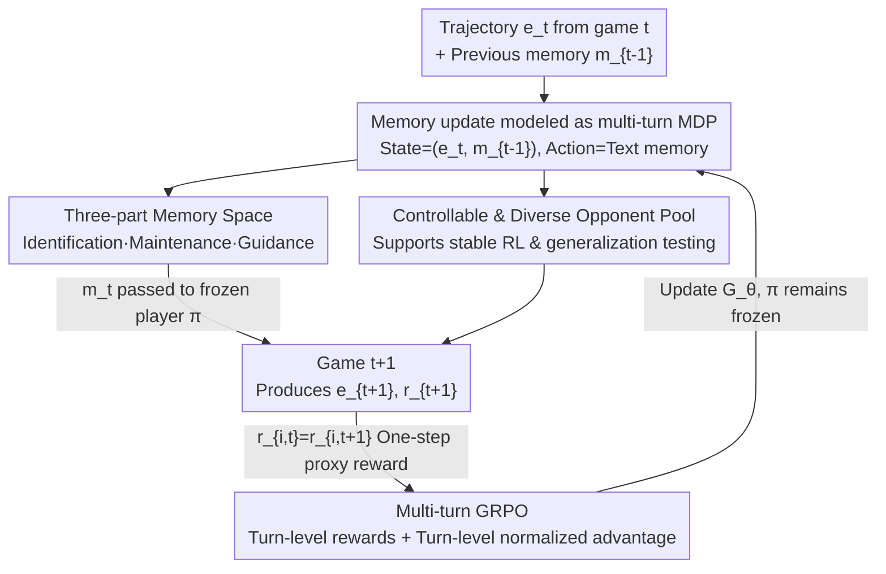

# From Player to Master: Enhancing Test-Time Learning of LLM Agents via Reinforcement Learning over Memory

**Conference**: ICML2026  
**arXiv**: [2606.08656](https://arxiv.org/abs/2606.08656)  
**Code**: Publicly available (as stated in the paper)  
**Area**: LLM Agent / Test-time Learning / Multi-turn Reinforcement Learning  
**Keywords**: Test-time Learning, Memory Update, multi-turn GRPO, Credit Assignment, Plug-and-play Memory

## TL;DR
MemoPilot is a plug-and-play "memory co-pilot"—it keeps the player LLM frozen but trains a separate memory model. It treats "how to update memory after each interaction" as an end-to-end optimizable multi-turn decision problem using multi-turn GRPO. With turn-level rewards and turn-level normalized advantage estimation, a frozen player truly becomes "stronger through play" in repetitive games. It achieves the highest Elo on both Rock-Paper-Scissors and Limit Hold'em testbeds, outperforming all memory baselines and proprietary models including DeepSeek-V3.2.

## Background & Motivation
**Background**: LLM agents are increasingly deployed in "long-term repeated interaction" scenarios. A core capability is **test-time learning (TTL)**—improving through accumulated experience during deployment. The mainstream approach is adding **explicit text memory** to the agent: updating memory after each interaction to guide subsequent decisions (Reflexion, ExpeL, Dynamic Cheatsheet, ReasoningBank, etc.).

**Limitations of Prior Work**: Most of these methods rely on **hand-crafted prompting rules** to update memory rather than end-to-end optimization of memory update strategies. The authors observed in pilot studies that even strong instruction-following LLMs fail to achieve stable improvement in repeated interactions when driven solely by such heuristic mechanisms—the alignment between memory updates and downstream goals is broken.

**Key Challenge**: The quality of memory updates must ultimately be judged by "downstream multi-step task performance." However, heuristic prompt rules neither perceive downstream goals nor perform multi-turn credit assignment. Consequently, there is no training signal to align "writing a lot of memory" with "actually helping the player win." Fundamentally, "learning to become stronger at test time" has rarely been treated as a **trainable capability**.

**Goal**: Transform the memory update process into a trainable object, using the "cumulative performance of the frozen player" as the direct optimization target for memory quality.

**Key Insight**: View memory as an "evolutionary product" refined across multiple interactions. Thus, memory updating is naturally a multi-turn decision problem that can be optimized end-to-end via RL, using player performance as the ready-made reward.

**Core Idea**: Train a standalone memory generation model $G_\theta$ using multi-turn GRPO while keeping the player $\pi$ frozen throughout. The key is introducing **turn-level rewards** and **turn-level normalized advantages** to precisely assign credit to the "most recent memory update," thereby obtaining stable, fine-grained learning signals in stochastic multi-turn environments.

## Method

### Overall Architecture
MemoPilot is configured for sequential game-style TTL: the agent plays $T$ games $\{g_t\}$ sequentially, each producing an interaction trajectory $e_t$ and a scalar reward $r_t$. A **trainable memory model** $G_\theta$ online reads the "previous trajectory + previous memory" to produce a new memory $m_t=G_\theta(e_t,m_{t-1})$, which is then provided to a **frozen player** $\pi$ for use in the next game. The player remains stateless across games, conditioning only on the current memory. All cross-game learning is compressed into the evolving memory while $\pi$ remains unchanged—this is the essence of "plug-and-play."

During training, memory updating is modeled as an MDP and optimized via multi-turn GRPO. The goal is to maximize the cumulative return under memory guidance (since the first game is unguided exploration, returns are calculated from the second game onwards $R(\tau)=\sum_{t=1}^{T-1}r_{t+1}$). To stabilize credit assignment in stochastic multi-turn environments, the authors use "next-game results" as turn-level one-step proxy rewards instead of long-term returns.

### Key Designs

**1. Modeling memory updates as multi-turn MDP: Using "winning the next game" as a training signal for memory**

The limitation is the disconnection between heuristic memory updates and downstream goals. The authors formalize multi-turn memory updating as $\mathcal{M}=(\mathcal{S},\mathcal{A},\mathcal{P},\mathcal{R})$: the state $s_t=(e_t,m_{t-1})$ consists of the "latest trajectory + previous memory"; the action space is the text memory itself; the memory model acts as the policy sampling $m_t\sim G_\theta(\cdot\mid s_t)$. Transitions $\mathcal{P}$ are induced by the frozen player $\pi$ interacting with a new environment instance $E_{t+1}$ (e.g., hole cards, community cards, position in poker), producing the next trajectory and reward. The reward $\mathcal{R}$ directly returns the result of that game. Thus, memory quality is automatically evaluated by "downstream task performance"—whether the memory is good depends on whether the player wins, not on human-defined rules.

**2. Multi-turn GRPO + One-step proxy rewards + Turn-level advantage: Stabilizing credit assignment in stochastic multi-turn environments**

The core mechanism extends GRPO from a "(group, token)" structure to a "(group, turn, token)" structure. In the rollout phase, the old policy $G_{\theta_\text{old}}$ generates $G$ parallel episodes for each opponent strategy $\sigma$, each producing $T-1$ memory generations. Two points are critical:

First, **turn-level one-step proxy rewards**: While the theoretical goal is cumulative return, in practice, the reward assigned to each turn is $R_{i,t}=r_{i,t+1}$, i.e., looking only at "the next game result brought by this memory update." Using long-term returns would couple the learning signal to future stochasticity (e.g., different cards dealt later), amplifying environment noise and destabilizing credit assignment. One-step proxies avoid this, providing cleaner turn-level signals.

Second, **turn-level group-normalized advantages**:

$$
\hat{A}_{i,t}=R_{i,t}-\mathrm{mean}\big(\{R_{i,t}\}_{i=1}^{G}\big),\qquad R_{i,t}=r_{i,t+1}
$$

Advantages are group-normalized "across $G$ rollouts within the same turn $t$" (following Liu et al. 2025b by omitting standard deviation normalization) and applied to all tokens of the memory $m_{i,t}$ for that turn. The loss is a clipped multi-turn proxy objective, where importance sampling weights $r_{i,t,k}(\theta)$ are calculated per token, and the total is averaged at the token level after summing across three layers $(i,t,k)$. This design provides fine-grained credit for each turn's memory update based on "how much better it is compared to other rollouts in the same turn," which is crucial for stable multi-turn TTL training.

**3. Three-part memory space: Supporting the hypothesis-verification cycle via "Diagnosis-Belief-Guidance"**

Memory is not a block of free text but is structured into three components: **Identification (Diagnosis Analysis)**—summarizing recent interaction evidence and updating hypotheses about the opponent's strategy; **Maintenance (Explicit Belief State)**—recording the current hypothesis and its validation/confidence status within a fixed memory budget; **Guidance (Executable Guidance)**—providing concise action suggestions that the frozen player can follow directly in the next game. During inference, these three form an iterative update process: new evidence arrives $\rightarrow$ revise diagnosis and belief $\rightarrow$ update guidance accordingly. The validation/confidence signals in the belief also provide a natural stopping criterion—once a hypothesis is sufficiently confirmed, there is no need to modify the memory further. This concretizes "test-time learning" into a "hypothesize-and-verify" loop: observe evidence $\rightarrow$ propose/refine hypothesis $\rightarrow$ verify with cumulative evidence $\rightarrow$ revise previous conclusions.

**4. Controllable and diverse opponent construction: Enabling TTL with both learnable structure and systematic generalization testing**

To train memory that "learns to exploit opponents," the opponent pool must be controllable, diverse, and separable for training/testing. The authors construct opponents using three principles: **Controllability**—each opponent is specified by executable instructions, ensuring reproducible RL training and evaluation; **Behavioral Diversity**—for LHE, varying action frequency preferences, aggressiveness per street, and deception patterns (e.g., check-raise traps); for RPS, covering open-loop sequences, one-step reaction rules, and multi-step counter patterns; **Mechanized Train-Test Split**—holding out strategies that maintain strategic intent but change trigger conditions or information revelation stages to specifically test whether memory can maintain and revise hypotheses as evidence accumulates. The construction uses a "human-in-the-loop" pipeline: expert players write seed strategies $\rightarrow$ LLM rewrites, expands, and standardizes $\rightarrow$ manual verification of consistency, with Elo estimated via round-robin matches to ensure training/test pools cover a wide range of difficulty.

## Key Experimental Results

### Main Results
Two strategic game testbeds: multi-turn Rock-Paper-Scissors (RPS, 6 rounds per game, full history visible to both) and Limit Hold'em (LHE, involving incomplete information + stochasticity, using "duplicate match" to eliminate card-luck variance). Metrics are RPS@k / LHE@k for the average score/chips per game over $k$ games, unified at mean@64 with a memory budget of 512 tokens. MemoPilot's base is Qwen2.5-14B-Instruct, with separate memory models trained for RPS and LHE.

| Method | RPS@5 (Qwen2.5-14B player) | LHE@5 (Qwen2.5-14B player) | RPS@5 (Qwen3-235B player) | LHE@5 (Qwen3-235B player) |
|------|------|------|------|------|
| No Memory | 0.43 | −1.36 | 0.44 | −1.46 |
| Full History | 0.02 | −1.22 | 0.03 | −1.45 |
| Human Counter-Strategy | 1.0 | 1.08 | 0.57 | 0.39 |
| ReasoningBank | 0.81 | −1.14 | 0.81 | −0.87 |
| Memory w/ DeepSeek-V3.2 | 1.64 | −0.78 | 1.46 | −0.60 |
| **Memory w/ MemoPilot** | **3.28 (+3.10)** | **2.03 (+2.30)** | **3.27 (+2.90)** | **1.31 (+1.60)** |

(Absolute improvement relative to "Memory w/ Qwen2.5-14B" baseline in parentheses.) MemoPilot leads comprehensively across both games and both frozen players, ranking first in Elo (LHE 1762, RPS 1590), outperforming all prompting baselines, memory baselines, and proprietary models.

### Ablation Study / Generalization

| Evaluation | Setting | Key Results |
|------|------|----------|
| Zero-shot Player Swap | Trained with Qwen2.5-14B, evaluated with stronger Qwen3-235B-A22B | RPS@5 reached 3.27, LHE@5 reached 1.31; memory behavior is transferable |
| StreamBench (CoSQL/DS-1000) | Qwen2.5-14B as execution agent, 32 held-out episodes × 5 sequential tasks | Achieved best results on both; Full History gave only marginal gains, prompt memory showed no improvement |

### Key Findings
- **Heuristic memory essentially fails**: Prompting-based memory baselines show limited improvement in RPS and are generally negative in LHE, confirming that "relying on hand-written rules for memory updates" is unreliable for online TTL.
- **Longer history is actually harmful**: Full History performed poorly in RPS and was consistently negative in LHE—simply piling up history introduces noise and dilutes the executable signals needed for the next step; MemoPilot's compression into compact memory retains only the most relevant information, justifying the need for "selective memory."
- **Fast learning and generalization**: MemoPilot improves rapidly within the first few games and maintains similar patterns across different frozen players, indicating it learns robust update behaviors for extracting transferable strategic signals from early experience, rather than fragile model-specific prompt recipes.

## Highlights & Insights
- **Training "Test-time Learning" as a capability**: While previous TTL relied on hand-written rules, this work is the first to train "memory update strategies" end-to-end, with memory quality optimized directly against downstream player performance. The approach is clear and reusable.
- **Smart trade-off with one-step proxy rewards**: In stochastic multi-turn environments, using "next-game results" instead of long-term returns for turn-level credit actively sacrifices long-term signals for low variance and stable training—a trade-off valuable for any multi-turn agent RL.
- **Three-part memory space provides a stopping criterion**: By splitting memory into diagnosis/belief/guidance, the confidence state in the belief naturally provides a mechanism to "stop modifying memory once the hypothesis is confirmed," offering better control than unstructured free text.
- **Plug-and-play + Transferable to frozen players**: The memory model and player are decoupled; training can use a smaller player, while deployment can switch to a larger player with gains maintained, making it highly engineering-friendly.

# Limitations & Future Work
- **Evaluation focuses on strategic games**: Main results are from two controllable games (RPS / LHE). Although StreamBench was added, the "exploitable opponent structure" is a prerequisite in such environments. Generalizing to real-world tasks with no clear opponents, sparse rewards, or long horizons requires further verification.
- **One-step proxy rewards discard long-term credit**: While credit based on next-game results is stable, it may be sub-optimal for strategies that "require setup over multiple games to be effective." Balancing short-term and long-term credit remains an open question.
- **Dependence on human-in-the-loop opponent construction**: The controllable diverse opponent pool depends on expert seeds + LLM rewriting + manual verification, which involves significant construction costs for new domains.
- Training separate memory models for each game, checking for a unified memory strategy across tasks, and testing if the memory budget (512 tokens) suffices for more complex tasks are all areas for further research.

## Related Work & Insights
- **vs Reflexion / ExpeL**: These rely on reflection and experience accumulation to improve iteratively, but their memory updates are heuristic. MemoPilot trains the update strategy end-to-end with signals from downstream performance.
- **vs Dynamic Cheatsheet / ReasoningBank**: These also maintain evolving memories or distill reusable reasoning strategies but still use prompt-driven update rules. MemoPilot's difference lies in optimizing the update process itself via multi-turn GRPO, significantly outperforming ReasoningBank in experiments.
- **vs Full History / Long-context Memory**: Simply stacking history dilutes signals and was negative in LHE. MemoPilot uses structured compressed memory to retain executable information, demonstrating that "selective memory > full history."

## Rating
- Novelty: ⭐⭐⭐⭐ Treating memory updates as a trainable multi-turn decision and combining turn-level rewards with turn-level advantages is a solid new angle for TTL.
- Experimental Thoroughness: ⭐⭐⭐⭐ Two games × two players + Elo + StreamBench cross-domain, with rich baselines; however, the game environments are relatively controlled, with limited coverage of real-world long-horizon tasks.
- Writing Quality: ⭐⭐⭐⭐ The progression from motivation to formalization to training recipes is logical; the three-part memory and opponent construction are well-explained.
- Value: ⭐⭐⭐⭐ Being plug-and-play and transferable across frozen players provides practical utility for the online self-improvement of long-term deployed agents.

<!-- RELATED:START -->

## Related Papers

- [\[ICLR 2026\] EvoTest: Evolutionary Test-Time Learning for Self-Improving Agentic Systems](../../ICLR2026/llm_agent/evotest_evolutionary_test-time_learning_for_self-improving_agentic_systems.md)
- [\[ICML 2026\] AdaMEM: Test-Time Adaptive Memory for Language Agents](adamem_test-time_adaptive_memory_for_language_agents.md)
- [\[ICML 2026\] On Information Self-Locking in Reinforcement Learning for Active Reasoning of LLM Agents](on_information_self-locking_in_reinforcement_learning_for_active_reasoning_of_ll.md)
- [\[ICML 2026\] Agentic Monte Carlo: Simulating Reinforcement Learning for Black-Box Agents](agentic_monte_carlo_simulating_reinforcement_learning_for_black-box_agents.md)
- [\[ICLR 2026\] Reducing Belief Deviation in Reinforcement Learning for Active Reasoning of LLM Agents](../../ICLR2026/llm_agent/reducing_belief_deviation_in_reinforcement_learning_for_active_reasoning.md)

<!-- RELATED:END -->
