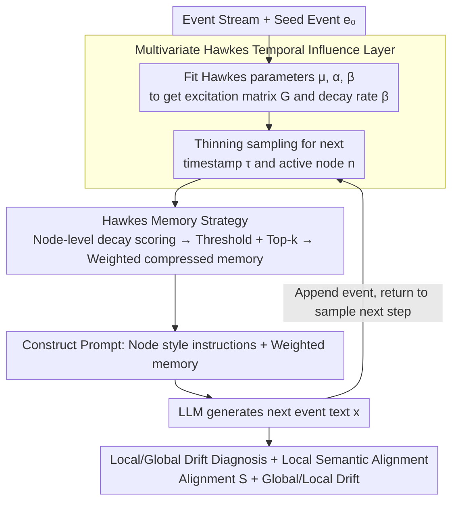

# HawkesLLM: Semantic Uncertainty Propagation in Agentic Text Simulation

**Conference**: ICML 2026  
**arXiv**: [2605.23043](https://arxiv.org/abs/2605.23043)  
**Code**: TBD  
**Area**: LLM Agent / Text Simulation / Uncertainty  
**Keywords**: Hawkes Process, Semantic Uncertainty, Agentic Text Simulation, Cascaded Generation, Memory Selection

## TL;DR
HawkesLLM grafts a multivariate Hawkes point process onto the LLM agent text simulation loop: Hawkes is responsible for scheduling "when and which node generates" and "which historical node outputs serve as compressed memory," while the LLM solely focuses on verbalizing the selected memories into the next event. On the GDELT Artemis II news cascade, it achieved late-stage semantic alignment that increases over time even under compact prompt budgets.

## Background & Motivation
**Background**: Current research on LLM uncertainty primarily focuses on single-turn generation, such as semantic entropy, black-box confidence estimation, internal uncertainty awareness of agents, and tool-use decision-making. These methods treat uncertainty as "a single response to a current problem."

**Limitations of Prior Work**: In "read-while-write" agentic text simulations (e.g., news cascades, social media narratives, multi-step agent interactions), every previously generated text becomes part of the subsequent prompt. Early semantic ambiguity propagates along the trajectory. Single-step uncertainty metrics fail to capture this path dependency, and long-context LLMs have been proven not to utilize all contexts uniformly; indiscriminately stacking history does not solve the problem.

**Key Challenge**: To stabilize subsequent generation, structured signals indicating "which history should enter the prompt" are required. However, relying solely on the LLM for selection is neither interpretable nor controllable. While graph cascade models provide node structure, they lack textual content.

**Goal**: To decouple "temporal influence modeling" from "text generation"—the former determines when and who speaks, and whom to look back at, while the latter handles only the language layer. Furthermore, the goal is to measure semantic uncertainty at the trajectory level rather than just at the end.

**Key Insight**: The authors observe that the Hawkes point process simultaneously provides two things: node intensity (determining which node is next active) and node-to-node cumulative excitation matrices (determining which nodes to look back at). Fitting this to event streams serves as a "reviewable memory scheduling signal."

**Core Idea**: Use a multivariate Hawkes process to drive node selection and prompt memory weighting. This allows the LLM to generate the next event based on "compressed memory selected by temporal influence scores," thereby transforming the propagation of semantic uncertainty into a monitorable trajectory problem.

## Method

### Overall Architecture
The paper models "read-while-write" text cascades on a fixed directed graph $\mathcal{G}_0=(\mathcal{N},\mathcal{E})$, where each node is a "text generation agent" and each event $e_m=(\tau_m, n_m, x_m)$ is a "timestamp-node-text" triplet. The core mechanism is to completely decouple "scheduling" from "verbalization": starting from a seed event $e_0$ for $L$ steps, each step uses a fitted multivariate Hawkes process to determine **when and which node speaks**, and subsequently scores and selects **which historical nodes to look back at** as compressed memory $\mathcal{M}_t$. This memory, along with node style instructions $a_{n_t}$, is concatenated into a prompt $p_t$ for the LLM to sample the next text $x_t \sim g_{\text{LLM}}(\cdot\mid p_t)$. In this pipeline, the LLM is only responsible for writing; time, nodes, and memory are all controlled by Hawkes, framing semantic uncertainty propagation as a monitorable and readable trajectory problem.

### Key Designs

**1. Multivariate Hawkes Temporal Influence Layer: Parametric Point Process for Scheduling**

Traditional methods either let the LLM select history (uninterpretable) or use graph cascade models for structure without text. This work employs a parametric Hawkes process: the conditional intensity of node $i$, $\lambda_i(s) = \mu_i + \sum_{(j,i)\in\mathcal{E}} \sum_{\tau_m<s, n_m=j} \phi_{j,i}(s-\tau_m)$, uses an exponential kernel $\phi_{j,i}(u)=\alpha_{j,i} e^{-\beta u}$ to describe the decaying excitation of historical events, while background intensity $\mu_i$ determines spontaneous frequency. During fitting, a set of $\beta$ candidates is fixed, and $(\boldsymbol{\mu},\boldsymbol{\alpha})$ is maximized under log-likelihood with a shrinkage penalty $\eta\Omega(\boldsymbol{\alpha})$. The best fitting is selected based on "likelihood + stability (controlled spectral radius $\rho(\mathbf{G})$ of the excitation matrix)." Parametric Hawkes is chosen over neural TPPs because it directly yields a readable excitation matrix $G_{j,i}=\alpha_{j,i}/\beta$ and a single decay $\beta$—quantities that can be exposed to the prompt as scheduling signals, enabling controllable memory strategies.

**2. Hawkes Memory Strategy: Node-level Top-$k$ Compression**

Long-context LLMs do not utilize all history uniformly; indiscriminate memory stacking dilutes attention. A structured "whom to look back at" signal is needed. Given sampled $(\tau_t, n_t)$, a node-level decay state $h_{j,t}=\sum_{m<t,n_m=j} e^{-\hat{\beta}(\tau_t-\tau_m)}$ is maintained for each candidate predecessor $j$. The cumulative Hawkes contribution to the current node is calculated as $q_{j,t}=\hat{\alpha}_{j,n_t} h_{j,t}$. After filtering negligible nodes using raw and normalized thresholds ($\epsilon_{\text{raw}}, \epsilon_{\text{norm}}$), the Top-$k$ set $\mathcal{I}_t$ is selected. Weights for retained nodes are normalized as $w_{j,t}=q_{j,t}/\sum_{\ell\in\mathcal{I}_t} q_{\ell,t}$. Crucially, **node-level rather than event-level** aggregation is performed: each retained node provides only its most recent active text (event index $r_t(j)$), with weights included as annotations in the prompt.

**3. Local/Global Drift Diagnosis + Local Semantic Alignment: Trajectory-level Uncertainty Anchors**

Precise continuation is inherently unrecoverable—different media outlets may write different headlines at the same time, making word-for-word accuracy impossible. However, "staying within the topical neighborhood" is comparable. Local semantic alignment is defined using an embedding function $\mathbf{z}(\cdot)$ as $S_t = \cos\!\big(\mathbf{z}(x_t),\ \tfrac{1}{|\mathcal{R}_t|}\sum_{r\in\mathcal{R}_t} \mathbf{z}(r)\big)$, where $\mathcal{R}_t$ contains real held-out texts from the same node within $\pm 12$ hours. Drift is decomposed into two axes: global drift $D_t^{\text{global}}=1-\cos(\mathbf{z}(x_t),\mathbf{z}(x_0))$ (distance from the seed) and local drift $D_t^{\text{local}}=1-\cos(\mathbf{z}(x_t),\bar{\mathbf{z}}_t)$ (distance from the weighted memory provided in the prompt), where the predecessor center $\bar{\mathbf{z}}_t=\sum w_{j,t}\mathbf{z}(x_{r_t(j)})$ reuses the memory weights.

### Loss & Training
The LLM is not fine-tuned and is called via Qwen2.5 / Ollama (temperature 0.35, top-p 0.9, max 75 new tokens). Training occurs only in the Hawkes layer: maximizing the penalized log-likelihood $\ell_\beta(\boldsymbol{\mu},\boldsymbol{\alpha};\mathcal{D})=\sum_m \log\lambda_{n_m}(\tau_m) - \sum_i \int_0^T \lambda_i(s)\,ds$ for a given $\beta$, then selecting $\beta$ based on likelihood and stability. For evaluation, Hawkes is refitted only on the train set (198 events).

## Key Experimental Results

### Main Results
Data consists of 248 unique English events from GDELT covering the Artemis II reporting window (2026-04-01—11) across ~263 hours. Nodes are defined by 5 curated media categories. 198 events are for training and 50 for testing.

| Method | k | Mean $S_t$ | Trend | Late-stage $S_t$ |
|------|---|-----------|------|-----------------|
| **HawkesLLM** | 3 | **0.636** | **Increasing** | **0.682** |
| Chronological last-$k$ | 3 | 0.581 | Decreasing | 0.541 |
| Random-$k$ | 3 | 0.621 | Decreasing | 0.594 |

Ours is the only method where semantic alignment increases over time, outperforming the closest baseline by ~14 percentage points in the late stage.

### Ablation Study ($k$ Sensitivity)

| Method | $k$ | Mean $S_t$ | Trend | Late-stage $S_t$ |
|------|-----|-----------|------|-----------------|
| HawkesLLM | 3 | 0.635 | Increasing | **0.703** |
| HawkesLLM | 5 | 0.634 | Increasing | 0.703 |
| HawkesLLM | 7 | 0.634 | Increasing | 0.703 |
| Chronological | 3 | 0.578 | Decreasing | 0.497 |
| Chronological | 5 | 0.556 | Decreasing | 0.454 |
| Chronological | 7 | 0.694 | Flat | 0.636 |
| Random | 3 | 0.633 | Decreasing | 0.557 |
| Random | 5 | 0.597 | Decreasing | 0.537 |
| Random | 7 | 0.642 | Decreasing | 0.627 |

Drift diagnosis: Global drift $0.450\pm 0.019$, Local drift $0.185\pm 0.072$. All runs satisfy global > local.

### Key Findings
- **Hawkes' sweet spot lies in "compact budgets + late-stage performance"**: As $k$ increases, HawkesLLM remains stable (as most steps have <3 meaningful neighbors), while chronological needs $k=7$ to raise its mean, though its late-stage still loses to Ours.
- **Global drift consistently exceeds local drift**: The trajectory slowly drifts from the seed while remaining close to the immediate prompt memory at each step, confirming the need for tiered path-dependent uncertainty metrics.
- **Unique increasing alignment curve**: Baselines decline over time while HawkesLLM rises, suggesting structured memory scheduling prevents semantic "de-anchoring."

## Highlights & Insights
- **Fitting "when/who/look-back-at" to a readable probabilistic model**: Unlike letting the LLM pick history, Hawkes provides an explicit $\alpha_{j,i}$ matrix and decay $\beta$, turning memory strategy into "read, rank, and truncate."
- **Node-level rather than event-level aggregation**: Each node provides only its latest text, compressing temporal decay into a "one-per-node" format and avoiding attention dilution.
- **Drift decomposition is transferable**: Any agent loop with a "seed text" and "weighted predecessor center" can use this to track long-range drift vs. local decoupling.
- **Decoupling philosophy**: The scheduling layer can be replaced with neural TPPs or graph diffusion without breaking other modules; similarly, upgrading the LLM doesn't require changing Hawkes.

## Limitations & Future Work
- **Hand-curated node categories**: The 5 media categories are event-specific (Artemis II); specialists are sparse in the test set, demanding redesigned nodes for other topics.
- **Embedding-generator colocation**: Using the same model for $\mathbf{z}(\cdot)$ and $g_{\text{LLM}}$ may overestimate self-consistency; independent backends and human evaluation are needed.
- **Limited scope**: The case study uses headline-level text and a single news window. It needs expansion to full-body text, cross-topic, and cross-lingual scenarios.
- **Fixed exponential kernel**: A single global $\beta$ may obscure heterogeneous influence durations.

## Related Work & Insights
- **vs Agent Uncertainty**: While others treat uncertainty as a signal for tool-use, this work focuses on trajectory propagation and how early ambiguity amplifies.
- **vs Semantic Entropy**: Unlike methods comparing candidates for one question, this measures alignment with local reference neighborhoods across a sequence.
- **vs Neural TPP**: Neural TPPs are more expressive but less readable; this work prioritizes "excitation matrices" as interpretable prompt signals.
- **vs Classic RAG**: RAG uses semantic similarity; HawkesLLM uses temporal cascade dynamics as a "retriever."

## Rating
- Novelty: ⭐⭐⭐⭐ Embedding multivariate Hawkes as a memory scheduler and proposing drift diagnosis is a novel combination.
- Experimental Thoroughness: ⭐⭐⭐ Diagnostic evaluation on a single GDELT window; illustrative but not yet a full benchmark.
- Writing Quality: ⭐⭐⭐⭐ Consistent notation, complete algorithms, and clear modular explanation.
- Value: ⭐⭐⭐⭐ Contributes a methodology for decoupled scheduling, interpretable influence matrices, and path-dependent uncertainty measurement.

<!-- RELATED:START -->

## Related Papers

- [\[CVPR 2026\] Vinedresser3D: Towards Agentic Text-guided 3D Editing](../../CVPR2026/llm_agent/vinedresser3d_towards_agentic_text-guided_3d_editing.md)
- [\[CVPR 2026\] ViLoMem: Agentic Learner with Grow-and-Refine Multimodal Semantic Memory](../../CVPR2026/llm_agent/vilomem_agentic_learner_with_grow-and-refine_multimodal_semantic_memory.md)
- [\[AAAI 2026\] BayesAgent: Bayesian Agentic Reasoning Under Uncertainty via Verbalized Probabilistic Graphical Modeling](../../AAAI2026/llm_agent/bayesagent_bayesian_agentic_reasoning_under_uncertainty_via_.md)
- [\[AAAI 2026\] PerTouch: VLM-Driven Agent for Personalized and Semantic Image Retouching](../../AAAI2026/llm_agent/pertouch_vlm-driven_agent_for_personalized_and_semantic_image_retouching.md)
- [\[ACL 2026\] Uncertainty Quantification in LLM Agents: Foundations, Emerging Challenges, and Opportunities](../../ACL2026/llm_agent/uncertainty_quantification_in_llm_agents_foundations_emerging_challenges_and_opp.md)

<!-- RELATED:END -->
