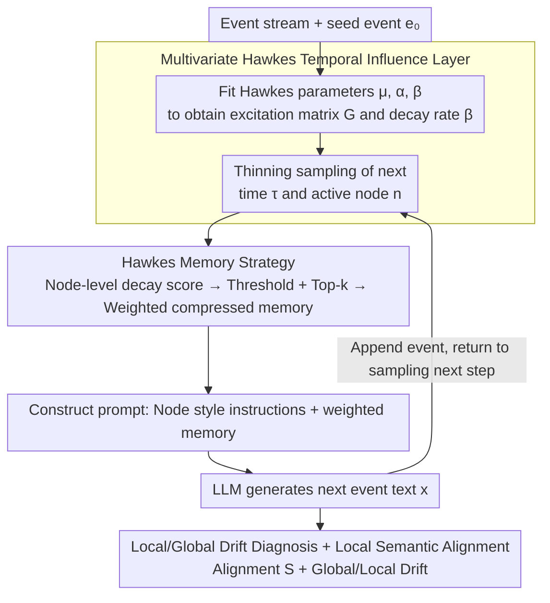

# HawkesLLM: Semantic Uncertainty Propagation in Agentic Text Simulation

**Conference**: ICML 2026  
**arXiv**: [2605.23043](https://arxiv.org/abs/2605.23043)  
**Code**: To be confirmed  
**Area**: LLM Agent / Text Simulation / Uncertainty  
**Keywords**: Hawkes Process, Semantic Uncertainty, Agentic Text Simulation, Cascading Generation, Memory Selection

## TL;DR
HawkesLLM grafts a multivariate Hawkes point process onto the LLM agent text simulation loop: Hawkes is responsible for scheduling "when and which node generates" as well as "which historical node outputs to use as compressed memory." LLMs are only responsible for verbalizing the selected memory into the next event. This approach achieves late-stage semantic alignment that increases over time under compact prompt budgets on GDELT Artemis II news cascades.

## Background & Motivation
**Background**: Current research on LLM uncertainty primarily focuses on the single-turn generation level, such as semantic entropy, black-box confidence estimation, and internal uncertainty awareness/tool-calling decisions within agents. These methods treat uncertainty as "an answer to the current question."

**Limitations of Prior Work**: In "read-while-write" agentic text simulations (e.g., news cascades, social media narratives, multi-step agent interactions), every previously generated text piece becomes part of the subsequent prompt. Early semantic ambiguity propagates along the trajectory. Single-step uncertainty metrics fail to capture this path dependency, and long-context LLMs have been proven not to utilize all context uniformly; indiscriminately stacking history does not solve the problem.

**Key Challenge**: To stabilize subsequent generation, structured signals indicating "which history should enter the prompt" are required. Relying purely on the LLM for selection is neither interpretable nor controllable, while graph cascade models provide node structure but lack text.

**Goal**: To decouple "temporal influence modeling" from "text generation"—the former determines when/who speaks and who to look back at, while the latter handles the language layer. Furthermore, the goal is to measure semantic uncertainty at the trajectory level rather than just at the end.

**Key Insight**: The authors observe that the Hawkes point process simultaneously provides two things: node intensity (deciding the next active node) and the cumulative node-to-node excitation matrix (deciding which nodes to look back at). Fitting this onto event streams serves as an "inspectable memory scheduling signal."

**Core Idea**: Use a multivariate Hawkes process to drive node selection and prompt memory weights. This allows the LLM to generate the next event at each step based on "compressed memory selected by temporal influence scores," thereby transforming semantic uncertainty propagation into a monitorable trajectory problem.

## Method

### Overall Architecture
The paper models "read-while-write" text cascades on a fixed directed graph $\mathcal{G}_0=(\mathcal{N},\mathcal{E})$, where each node is a "text generation agent" and each event $e_m=(\tau_m, n_m, x_m)$ is a "timestamp-node-text" triplet. The core mechanism is the complete separation of "scheduling" and "verbalization." Starting from a seed event $e_0$ and looping for $L$ steps, each step first uses a fitted multivariate Hawkes process to determine **when and which node speaks**, and calculates scores to identify **which historical nodes to look back at** as compressed memory $\mathcal{M}_t$. This memory, along with node style instructions $a_{n_t}$, is concatenated into a prompt $p_t$ for the LLM to sample the next text $x_t \sim g_{\text{LLM}}(\cdot\mid p_t)$. Throughout the pipeline, the LLM only handles writing, while time, nodes, and memory are controlled by Hawkes, framing semantic uncertainty propagation as a monitorable and readable trajectory problem.

### Key Designs

**1. Multivariate Hawkes Temporal Influence Layer: Encoding "who should speak and who influences whom" into a readable parametric point process**

Traditional approaches either let the LLM select history (unexplainable) or use graph cascade models which lack text units. This method uses a parametric Hawkes: the conditional intensity of node $i$, $\lambda_i(s) = \mu_i + \sum_{(j,i)\in\mathcal{E}} \sum_{\tau_m<s, n_m=j} \phi_{j,i}(s-\tau_m)$, uses an exponential kernel $\phi_{j,i}(u)=\alpha_{j,i} e^{-\beta u}$ to describe the decaying excitation of historical events. The background intensity $\mu_i$ determines spontaneous frequency. During fitting, a set of $\beta$ candidates is fixed, and $(\boldsymbol{\mu},\boldsymbol{\alpha})$ is maximized under log-likelihood with shrinkage penalty $\eta\Omega(\boldsymbol{\alpha})$ for each $\beta$. The best stable fit is chosen based on "likelihood + stability (controlled spectral radius $\rho(\mathbf{G})$ of the excitation matrix)." Parametric models are preferred over expressive neural TPPs because they directly output a readable excitation matrix $G_{j,i}=\alpha_{j,i}/\beta$ and a single decay $\beta$—quantities that can be exposed to the prompt as scheduling signals, enabling controllable and auditable memory strategies.

**2. Hawkes Memory Strategy: Compressing "who to look back at and weight" into compact prompts via node-level Top-$k$**

Long-context LLMs do not utilize all history uniformly; indiscriminate memory stacking dilutes attention. Thus, a structured "who to look back at" signal is needed. For sampled $(\tau_t, n_t)$, a node-level decay state $h_{j,t}=\sum_{m<t,n_m=j} e^{-\hat{\beta}(\tau_t-\tau_m)}$ is maintained for each candidate precursor node $j$, followed by calculating its cumulative Hawkes contribution to the current node $q_{j,t}=\hat{\alpha}_{j,n_t} h_{j,t}$. Negligible nodes are filtered using raw threshold $\epsilon_{\text{raw}}$ and normalized threshold $\epsilon_{\text{norm}}$, followed by selecting the Top-$k$ set $\mathcal{I}_t$. The weight of each retained node is normalized as $w_{j,t}=q_{j,t}/\sum_{\ell\in\mathcal{I}_t} q_{\ell,t}$. Crucially, **node-level aggregation** is performed instead of event-level: each retained node provides only its most recent active text (event index $r_t(j)$), with weights included in the prompt as annotations. The Hawkes excitation scores naturally answer "who to look back at and how important," while Top-$k$ and thresholds simply compress this into a compact memory of at most $k$ items. Since the semantic source remains Hawkes, the scheduling and language layers can be audited independently.

**3. Local/Global Drift Diagnosis + Local Semantic Alignment: Decoupling trajectory-level uncertainty into two comparable anchors**

Precise continuation is irrecoverable—multiple media outlets may write different headlines at the same time, making word-for-word accuracy impossible. However, "staying within the topical neighborhood" is comparable. Local semantic alignment is defined using an embedding function $\mathbf{z}(\cdot)$ as $S_t = \cos\!\big(\mathbf{z}(x_t),\ \tfrac{1}{|\mathcal{R}_t|}\sum_{r\in\mathcal{R}_t} \mathbf{z}(r)\big)$, where $\mathcal{R}_t$ is the set of real held-out texts for the same node within $\pm 12$ hours (extended to $\pm 24$ if necessary), measuring if the generated text falls within the local reference neighborhood. Drift is split into two complementary axes: global drift $D_t^{\text{global}}=1-\cos(\mathbf{z}(x_t),\mathbf{z}(x_0))$ measures "distance from the seed," while local drift $D_t^{\text{local}}=1-\cos(\mathbf{z}(x_t),\bar{\mathbf{z}}_t)$ measures "distance from the weighted memory just fed into the prompt," where the precursor center $\bar{\mathbf{z}}_t=\sum w_{j,t}\mathbf{z}(x_{r_t(j)})$ reuses the previous memory weights. Only by looking at both axes can different failure modes—"long-range slow drift" vs. "local sudden decoupling"—be distinguished.

### Loss & Training
The LLM is not fine-tuned and is invoked via Qwen2.5 / Ollama (temperature 0.35, top-p 0.9, max 75 new tokens). Actual training occurs only in the Hawkes layer: maximizing the penalized log-likelihood $\ell_\beta(\boldsymbol{\mu},\boldsymbol{\alpha};\mathcal{D})=\sum_m \log\lambda_{n_m}(\tau_m) - \sum_i \int_0^T \lambda_i(s)\,ds$ for a given $\beta$, then selecting $\beta$ based on likelihood and stability. For held-out evaluation, Hawkes is refitted only on the train segment (198 events) to ensure no leakage from the test segment.

## Key Experimental Results

### Main Results
Data is sourced from GDELT coverage of the Artemis II window (2026-04-01—11), with 248 deduplicated English events spanning approximately 263 hours. Nodes represent 5 curated media categories (local_tv / mass_market / specialist_science_tech / business_finance / general_news). Data is split into 198 train / 50 test events. Each generated event is matched against the real held-out headline set within $\pm 12$h for the same node; all 62 generated events were successfully matched.

| Method | k | Mean $S_t$ | Trend | Late-stage $S_t$ |
|------|---|-----------|------|-----------------|
| **HawkesLLM** | 3 | **0.636** | **Increasing** | **0.682** |
| Chronological last-$k$ | 3 | 0.581 | Decreasing | 0.541 |
| Random-$k$ | 3 | 0.621 | Decreasing | 0.594 |

HawkesLLM is the only method where "semantic alignment increases over time," outperforming the nearest baseline by approximately 14 percentage points in the late stage.

### Ablation Study ($k$ Sensitivity)

| Method | $k$ | Mean $S_t$ | Trend | Late-stage $S_t$ |
|------|-----|-----------|------|-----------------|
| HawkesLLM | 3 | 0.635 | Increasing | **0.703** |
| HawkesLLM | 5 | 0.634 | Increasing | 0.703 |
| HawkesLLM | 7 | 0.634 | Increasing | 0.703 |
| Chronological | 3 | 0.578 | Decreasing | 0.497 |
| Chronological | 5 | 0.556 | Decreasing | 0.454 |
| Chronological | 7 | 0.694 | Flat | 0.636 |
| Random | 3 | 0.633 | Decreasing | 0.557 |
| Random | 5 | 0.597 | Decreasing | 0.537 |
| Random | 7 | 0.642 | Decreasing | 0.627 |

Drift diagnosis (average across runs): Global drift $0.450\pm 0.019$, Local drift $0.185\pm 0.072$. All runs satisfied global > local.

### Key Findings
- **The sweet spot for Hawkes is "compact budget + late-stage performance"**: Increasing $k$ barely affects HawkesLLM (as most steps naturally have fewer than 3 meaningful weighted neighbors), while chronological alignment, even at $k=7$, fails to match HawkesLLM's late-stage performance. This indicates that Hawkes provides structural gains via "who to look back at" rather than simply "providing more context."
- **Global drift consistently exceeds local drift**: The trajectory slowly drifts away from the seed while staying close to the memory recently fed into the prompt. This picture of "local stability + global accumulation" reinforces that path-dependent uncertainty must be measured hierarchically.
- **Unique increasing alignment curve**: While baselines decrease over time, HawkesLLM increases, suggesting that structured memory scheduling delays semantic unanchoring—a rare phenomenon in text-level chain-of-events systems.

## Highlights & Insights
- **Offloads "when/who/lookback" to a fittable, readable probabilistic model**: Instead of letting the LLM select history, Hawkes provides an explicit $\alpha_{j,i}$ matrix and decay $\beta$. Memory strategy becomes a matter of "reading + sorting + truncation," making all scheduling decisions auditable.
- **Node-level vs. Event-level Aggregation**: Each retained node contributes only its latest text, compressing "temporal decay" into a "at most one per node" format. This effectively bypasses the attention dilution issues of long-context LLMs.
- **Drift decomposition is transferable to any agentic loop**: As long as "seed text" and "weighted precursor center" anchors exist, one can track both long-range drift and local decoupling. This is a general tool for diagnosing multi-step agents, RAG, and self-dialogue.
- **Decoupling Philosophy**: Replacing the scheduling layer with a neural TPP or graph diffusion model does not break other modules; similarly, upgrading the language layer to a stronger LLM does not require changing Hawkes. This layering is more scalable than end-to-end "all-in-one" agents.

## Limitations & Future Work
- **Hand-curated small vocabulary for node classification**: The 5 media categories were developed specifically for the Artemis II task; the "specialist_science_tech" category was sparse in the test segment. Redesign is required for generalization to other topics or finer-grained nodes.
- **Self-source for evaluation embedding and generator**: Since both $\mathbf{z}(\cdot)$ and $g_{\text{LLM}}$ use Qwen2.5/Ollama, self-consistency might be overestimated. Independent embedding backends, human evaluation, and fact-checking are recommended.
- **Limited to headline-level text and single news window**: This is a case study, not a benchmark. The text is short, events are few, and only 3 repetitions were performed. Expansion to full-body text, cross-topic, and cross-lingual scenarios is needed.
- **Fixed exponential kernel for time**: A single global decay $\beta$ for all node pairs might mask heterogeneous influence durations; multi-kernel or neural kernels could be used for conditional decay.
- **Engineering parameters for Top-$k$ and thresholds**: Robustness scanning for hyperparameters was not conducted. Overly strict thresholds lose useful memory, while overly loose ones break compactness; calibration methods are needed.

## Related Work & Insights
- **vs. Agentic Uncertainty (Han et al. 2024 / Zhao et al. 2025)**: They treat uncertainty as a control signal for whether an agent should call a tool. Ours shifts the focus to the generation trajectory itself, concerning how early ambiguity scales along the path—a shift from decision layer to state layer.
- **vs. Semantic Entropy / Black-box Confidence (Farquhar et al. 2024, Lin et al. 2023)**: They compare multiple candidate answers for the same question. Ours measures alignment with local reference neighborhoods across a sequence, focusing on trajectory drift rather than single-turn confidence.
- **vs. Neural Temporal Point Processes (Mei & Eisner 2017; Zuo et al. 2020)**: Neural TPPs are more expressive but have unreadable weights. Ours insists on parametric Hawkes so that "excitation matrices" can enter prompts as interpretable signals, prioritizing "auditability > expressiveness."
- **vs. Classic RAG (Lewis et al. 2020)**: RAG uses semantic similarity to retrieve external documents, with state maintained by a retriever. Ours draws memory entirely from its own generated history, scheduled by temporal cascade dynamics rather than semantic similarity—essentially replacing the "retriever" with a "temporal influence estimator."
- **vs. LLM Social Simulation (Park et al. 2023; Sun et al. 2024)**: Those works focus on agent behavior emergence with mostly heuristic scheduling. Ours provides a fittable probabilistic scheduling layer that can be embedded into social simulations to replace ad-hoc rules.

## Rating
- Novelty: ⭐⭐⭐⭐ Explicitly using multivariate Hawkes as a "memory scheduler" in LLM agent loops, combined with proposed local/global drift diagnosis, offers a fresh perspective.
- Experimental Thoroughness: ⭐⭐⭐ Diagnostic evaluation on a single GDELT Artemis II window with 3 runs and headline text makes this a strong case study rather than a full benchmark.
- Writing Quality: ⭐⭐⭐⭐ Uniform notation, complete algorithm blocks, and clear explanations of the "what/why/evaluation" logic. Reproducibility details are abundant.
- Value: ⭐⭐⭐⭐ Methodological contribution to agents, multi-step generation, and news cascade simulation via decoupled scheduling/generation and path-dependent uncertainty metrics.

<!-- RELATED:START -->

## Related Papers

- [\[CVPR 2026\] ViLoMem: Agentic Learner with Grow-and-Refine Multimodal Semantic Memory](../../CVPR2026/llm_agent/vilomem_agentic_learner_with_grow-and-refine_multimodal_semantic_memory.md)
- [\[AAAI 2026\] BayesAgent: Bayesian Agentic Reasoning Under Uncertainty via Verbalized Probabilistic Graphical Modeling](../../AAAI2026/llm_agent/bayesagent_bayesian_agentic_reasoning_under_uncertainty_via_.md)
- [\[ICML 2026\] MCP-Persona: Evaluating LLM Agent Capabilities in Real-World Personal Applications via Environment Simulation](mcp-persona_benchmarking_llm_agents_on_real-world_personal_applications_via_envi.md)
- [\[AAAI 2026\] PerTouch: VLM-Driven Agent for Personalized and Semantic Image Retouching](../../AAAI2026/llm_agent/pertouch_vlm-driven_agent_for_personalized_and_semantic_image_retouching.md)
- [\[ACL 2026\] Uncertainty Quantification in LLM Agents: Foundations, Emerging Challenges, and Opportunities](../../ACL2026/llm_agent/uncertainty_quantification_in_llm_agents_foundations_emerging_challenges_and_opp.md)

<!-- RELATED:END -->
