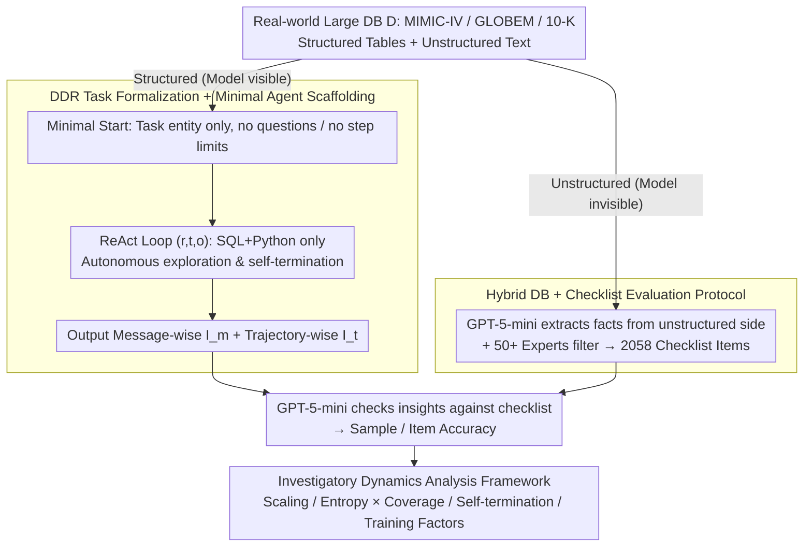

# Hunt Instead of Wait: Evaluating Deep Data Research on Large Language Models

**Conference**: ICML 2026  
**arXiv**: [2602.02039](https://arxiv.org/abs/2602.02039)  
**Code**: TBD  
**Area**: LLM Agent / Agentic Benchmark / Data Science Agent  
**Keywords**: Deep Data Research, Investigatory Intelligence, ReAct Agent, Checklist Evaluation, Long-range Exploration

## TL;DR
This paper proposes Deep Data Research (DDR), an open-ended agentic task paradigm. In this setting, an LLM is provided only with a structured database and a minimal toolset (SQL+Python), without any specific questions or round limits; the model must autonomously explore, propose hypotheses, and decide when to terminate. The authors construct DDR-Bench (MIMIC-IV / GLOBEM / 10-K, covering 291 entities and 2058 checklist items) using verifiable fact checklists extracted from unstructured text to objectively evaluate the "investigatory intelligence" of mainstream LLMs. Results show that even Claude 4.5 Sonnet achieves only a 47.7% average accuracy.

## Background & Motivation

**Background**: Agentic LLMs are already capable of long-range tasks using tools and memory. However, mainstream benchmarks (including LLM4DS and Deep Research) typically provide task objectives in the prompt, requiring models to simply "complete the job according to instructions."

**Limitations of Prior Work**: This setup only measures *executional intelligence* (the ability to achieve predefined goals) and fails to evaluate *investigatory intelligence* (the ability to decide "what should be researched"). Even in "open-ended" LLM4DS report generation, prompts often contain many implicit "investigate what" instructions, and interactions are usually limited to a few dozen steps. Furthermore, deep research benchmarks primarily rely on searching unstructured web pages with restricted tools, often using subjective scoring like LLM-as-a-Judge.

**Key Challenge**: To evaluate authentic agentic investigatory capabilities, three conflicting requirements must be met: the task must be open enough to lack preset questions, the interaction must be long enough to elicit long-range behavior, and the evaluation must be objective and reproducible for industrial use. Achieving all three is difficult: complete openness makes verification hard, while strong constraints reduce the task to simple QA.

**Goal**: To solve these three issues simultaneously by providing an agent task definition that is "question-free, step-limit-free, and scaffold-free," constructing a benchmark on real large-scale databases, and designing an evaluation mechanism that measures open-ended insights with objective scoring.

**Key Insight**: The authors observe that real large-scale databases usually contain both structured tables (numerical) and unstructured text (medical records, annual reports). By extracting verifiable facts from unstructured text as a checklist while allowing the model to explore only the structured portion, they maintain open-ended exploration while gaining ground-truth anchors.

**Core Idea**: A hybrid database design using "structured exploration + unstructured derived checklists" to transform open-ended agentic tasks into a benchmark that is scalable, objective, and resistant to data contamination.

## Method

### Overall Architecture
DDR defines "investigatory intelligence" as an open-ended task for any mainstream LLM, supported by a hybrid database benchmark for objective scoring. The task is formalized as $I = DDR(LLM, D, T)$, where only the database $D$ and toolset $T$ are provided. The system prompt contains no specific questions, only a minimal starting phrase (e.g., "Begin analysis of userid=2048"). The model uses a ReAct-style $(r, t, o)$ loop (reasoning token, tool call, observation) to query the database repeatedly without a round limit, deciding itself when to stop. It eventually outputs two types of insights: message-wise insights $I_m$ produced per round, and trajectory-wise insights $I_t$ synthesized at the end. Scoring relies on a fact checklist pre-extracted from the unstructured text of the database. The model cannot see these facts during exploration; after submission, GPT-5-mini verifies whether the insights support the facts to compute sample-averaged and item-averaged accuracies.

### Key Designs

**1. DDR Task Formalization + Minimal Agent Scaffolding: Decoupling Investigatory Intelligence from Executional Intelligence**

In prior agentic benchmarks, task goals are predefined in prompts, and models often use scaffolds like planners, memory, or complex workflows. Consequently, scores conflate "base model capability" with "prompt engineering." DDR enforces three constraints to remove this confusion: (a) no questions are provided, only a task entity; (b) no round limits, letting the model decide when to stop; and (c) only SQL and Python tools are exposed via MCP, with explicit planning/memory modules disabled. Under this minimal scaffolding, models output $I_m$ (process-level insights per ReAct round) and $I_t = \text{Summarize}(\{(r_i, t_i, o_i)\}_{i=1}^M)$ (global insights). This ensures scores reflect internalized agentic capabilities rather than external scaffolds.

**2. Hybrid DB + Checklist Evaluation Protocol: Decoupling Open Tasks from Subjective Evaluation**

Open-ended exploration and objective scoring are inherently at odds. Traditional QA reduces to executional tasks, while LLM-as-a-Judge is subjective. This paper uses three real large-scale databases containing **both structured tables and unstructured text**: MIMIC-IV (Electronic Health Records), GLOBEM (Wearable signals + mental health surveys), and 10-K (Financial reports). Verifiable facts are extracted from the **unstructured** side to form a checklist, filtered by 50+ domain experts to ensure a "surjective" mapping where every fact can be derived from the **structured** side. The model only sees structured data during exploration, and checklists are only used during evaluation. This provides high-quality ground truth from the unstructured side without imposing a Q&A format, naturally resisting training data contamination. The final benchmark covers 291 task entities and 2058 checklist items.

**3. Investigatory Dynamics Analysis Framework: Beyond Single Accuracy Metrics**

Identical accuracy scores can hide different strategies. The authors introduce four diagnostic dimensions. First, **test-time scaling** analyzes performance against interaction rounds (sigmoid), tokens (cost-heavy later), and USD cost. Second, **exploration patterns** use normalized exploration entropy $H_{\text{norm}} = \frac{-\sum_{i=1}^n p_i \log_2 p_i}{\log_2 n}$ versus database coverage to distinguish breadth and depth. Third, **self-termination** measures the log-probability of generating an end token using $\frac{1}{N}\sum_{i=1}^N \log P(t_i \mid t_1, \dots, t_{i-1}, T_{\text{partial}})$; for instance, Qwen3 shows monotonic confidence growth while Qwen2.5 fluctuates. Finally, **ablation of training factors** decouples the contributions of parameter count, context length, and agentic training across model generations.

### Loss & Training
This work presents a benchmark and evaluation protocol and does not involve model training. The evaluation side utilizes GPT-5-mini for checklist verification and pairwise novelty comparisons (using the Bradley-Terry model to aggregate preferences into global rankings and mitigate position bias).

## Key Experimental Results

### Main Results
8 commercial models and 13 open-source models were evaluated across three DDR-Bench scenarios. The overall score is the mean of four accuracy types (sample/item × $I_m/I_t$):

| Model | MIMIC ($I_m$) | GLOBEM ($I_m$) | 10-K ($I_m$) | Overall Avg |
|------|---------------|----------------|--------------|-------------|
| Claude 4.5 Sonnet | 36.07 | 40.13 | 77.61 | **47.73** |
| GPT-5.2 | 28.85 | 38.81 | 44.89 | 37.09 |
| GPT-5.1 | 28.37 | 38.31 | 37.12 | 36.27 |
| DeepSeek-V3.2 | 28.98 | 38.46 | 60.08 | 38.80 |
| GLM-4.6 | 25.03 | 41.56 | 60.31 | 37.52 |
| Kimi K2 | 33.61 | 37.14 | 51.06 | 36.42 |
| Qwen3-Next-80B-A3B | 18.01 | 35.75 | 44.76 | 30.56 |
| Qwen2.5-72B | 15.65 | 28.83 | 27.13 | 21.08 |
| Llama3.3-70B | 10.59 | 23.99 | 9.91 | 12.30 |

Only Claude 4.5 Sonnet exceeds 40%, showing a dominant lead in 10-K (77.61). The gap between new-generation GPT/Gemini and top open-source models is smaller than in QA benchmarks, highlighting the distinct "autonomous investigation" dimension of DDR.

### Ablation Study

| Configuration | Key Metric | Description |
|------|---------|------|
| Qwen3-Next default reasoning | 10-K 45.58 / GLOBEM 35.40 / MIMIC 16.80 | Avg of only 1.20 reasoning tokens per round (10-K) |
| Qwen3-Next longer reasoning | 10-K 36.40 ↓ / GLOBEM 36.78 ↑ / MIMIC 16.67 ↓ | Reasoning tokens increased to 357, but interaction rounds dropped from 27.93 to 11.89 |
| Qwen3-Next No memory | 10-K Traj 31.10 / MIMIC Traj 20.80 | Default minimal ReAct |
| Qwen3-Next Long-short memory | 10-K Traj 25.21 ↓ / MIMIC Traj 14.34 ↓ | Adding memory made the model more aggressive and prone to early stopping |
| Proactive (DDR) | Avg 32.59 / 28.26 | Autonomous inquiry |
| Reactive (Checklist to query) | Avg 43.21 ↑ | Significant improvement with explicit goals, though not saturated |

### Key Findings
- **Error Analysis**: 58% of errors stem from **insufficient exploration** (lack of breadth or failure to follow up). The remaining 40% in strong models are mostly "over-inference/unfounded hypotheses," while weak models suffer from "context loss/repetitive debugging/summary omissions."
- **Scale alone is not enough**: Increasing parameters 10x yields <3% accuracy gains. Long-context versions (Qwen2.5-7B-1M) do not show systemic improvement. **Agentic capability primarily comes from the training paradigm** (whether reasoning + agency is emphasized in post-training) rather than scale.
- **Token Scaling**: The curve is not sigmoid but reflects a late-stage surge where fewer, more precise tool calls contribute the most performance gain, marking the transition from breadth-first to depth-first exploration.
- **Novelty vs. Accuracy**: Pairwise novelty rankings align closely with checklist accuracy, suggesting the checklist captures "dominant signals" and does not systematically undervalue models focusing on out-of-checklist insights.
- **Hallucination**: Rates are generally low (Claude 4.08% / Gemini < 1%) and show no statistical correlation with checklist accuracy, ruling out "cheating by memorization."

## Highlights & Insights
- **Hybrid database design** is highly effective: utilizing two sides of the same real-world database naturally decouples what the model sees from what the evaluation checks, providing expert-level ground truth at low cost.
- **Quantifying the Investigate-Execute gap**: The ~10% gap between reactive (43.21%) and proactive (32.59%) modes provides a digitized measure of the difficulty of "deciding what to ask."
- **Exploration Entropy × Coverage plot** is an insightful behavior visualization tool, allowing researchers to see if an agent is exploring too broadly, too narrowly, or is in the balance zone.
- **Self-termination diagnostics** via log-probability stability offer a lightweight, transferable metric for assessing an agent's internal confidence.
- The evidence that **agentic capability $\neq$ scale** is cleaned of scaffolding noise, providing a clear signal for future agentic training research.

## Limitations & Future Work
- **GPT-5-mini dependence**: Evaluation relies on a commercial LLM for fact-checking, potentially creating an implicit ceiling for leaderboard performance.
- **Domain breadth**: The current three scenarios focus on "reading databases for insights," not yet covering closed-loop data science tasks like coding experiment pipelines.
- **Tool set limitation**: SQL and Python are the only tools provided; the ability to select from a wider variety of specialized tools is not evaluated.
- **Checklist Bias**: Checklists derive from "what was already written" in unstructured text, favoring the reproduction of existing expert insights over truly original discoveries.
- **Lack of Training Recipes**: While emphasizing training paradigm importance, the paper leaves the specific "how to train" (e.g., specific agentic RL methods) to future work.
- **Memory Architectures**: The memory ablation only tested one long-short note design; more sophisticated architectures (RAG, structured notebooks) warrant systematic study.

## Related Work & Insights
- **vs LLM4DS Report Generation**: Previous works still provide "investigate what" instructions and limit steps. DDR removes these constraints for a purer measure of investigatory intelligence.
- **vs Deep Research Benchmarks**: While others focus on web searching with search/browse tools, DDR uses structured databases and SQL/Python, moving from proxy metrics to verifiable facts.
- **vs Table QA**: Table QA remains an executional task with preset questions; DDR moves from "answering the question" to "discovering the question."
- **vs Agentic Scaffolding**: This work supports the "internalization" of capability into the base model rather than stacking external scaffolds, providing a counter-argument to complex workflow-heavy approaches.

## Rating
- Novelty: ⭐⭐⭐⭐⭐ Decouples investigatory and executional intelligence with a clever hybrid database checklist design.
- Experimental Thoroughness: ⭐⭐⭐⭐⭐ Covers 21 models across multiple scaling and behavioral dimensions with extensive manual error analysis.
- Writing Quality: ⭐⭐⭐⭐ Concepts are clearly defined; visualization analysis is insightful, though some module analysis is data-heavy.
- Value: ⭐⭐⭐⭐⭐ Likely to become a standard benchmark for evaluating autonomous data research capabilities in the agentic LLM era.

<!-- RELATED:START -->

1. **LLM4DS: Benchmarking Language Models for Data Science** (Zhang et al., 2025)
2. **The Gaia Benchmark: Automated Evaluation of Agentic Intelligence** (Mialon et al., 2024)
3. **AgentBench: A Comprehensive Framework for Evaluating Large Language Model Agents** (Liu et al., 2024)

<!-- RELATED:END -->

## Related Papers

- [\[ACL 2025\] ToolHop: A Query-Driven Benchmark for Evaluating Large Language Models in Multi-Hop Tool Use](../../ACL2025/llm_agent/toolhop_multi_hop_tool_use.md)
- [\[ACL 2026\] ImplicitMemBench: Measuring Unconscious Behavioral Adaptation in Large Language Models](../../ACL2026/llm_agent/implicitmembench_measuring_unconscious_behavioral_adaptation_in_large_language_m.md)
- [\[CVPR 2026\] ModularAgent: A Task-Aware Modular Framework for Joint Optimization of Multimodal Large Language Models and World Models](../../CVPR2026/llm_agent/modularagent_a_task-aware_modular_framework_for_joint_optimization_of_multimodal.md)
- [\[ICML 2026\] Probabilistic Modeling of Latent Agentic Substructures in Deep Neural Networks](probabilistic_modeling_of_latent_agentic_substructures_in_deep_neural_networks.md)
- [\[ACL 2026\] Agent-GWO: Collaborative Agents for Dynamic Prompt Optimization in Large Language Models](../../ACL2026/llm_agent/agent-gwo_collaborative_agents_for_dynamic_prompt_optimization_in_large_language.md)

<!-- RELATED:END -->
