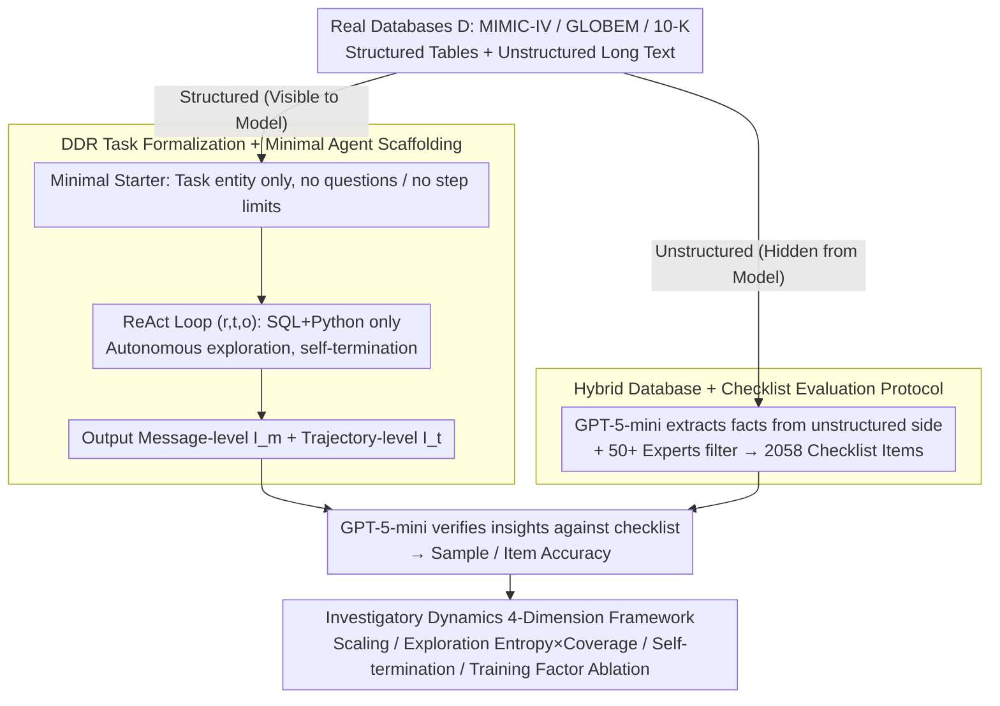

# Hunt Instead of Wait: Evaluating Deep Data Research on Large Language Models

**Conference**: ICML 2026  
**arXiv**: [2602.02039](https://arxiv.org/abs/2602.02039)  
**Code**: TBD  
**Area**: LLM Agent / Agentic Benchmark / Data Science Agent  
**Keywords**: Deep Data Research, Investigatory Intelligence, ReAct Agent, Checklist Evaluation, Long-range Exploration

## TL;DR
This paper introduces Deep Data Research (DDR), an open-ended agentic task paradigm where LLMs are provided only with a structured database and a minimal toolset (SQL+Python), without specific questions or turn limits, requiring the model to autonomously explore, hypothesize, and decide when to stop. The authors construct DDR-Bench (MIMIC-IV / GLOBEM / 10-K, featuring 291 entities and 2058 checklist items) using verifiable fact checklists extracted from unstructured text to objectively evaluate "investigatory intelligence." Results show that even Claude 4.5 Sonnet achieves an average accuracy of only 47.7%.

## Background & Motivation

**Background**: Agentic LLMs are increasingly capable of long-range tasks using tools and memory. However, mainstream benchmarks (including LLM4DS and deep research) typically provide task objectives within the prompt, meaning the model only needs to "finish the job as instructed."

**Limitations of Prior Work**: This setup only measures *executional intelligence* (the ability to achieve predefined goals) and fails to evaluate *investigatory intelligence* (the ability to decide "what should be researched"). Even "open-ended" tasks like LLM4DS report generation often hide "investigate what" instructions in the prompt and involve short interactions. Deep research benchmarks primarily use unstructured web searches with limited tools and rely on subjective scoring like LLM-as-a-Judge.

**Key Challenge**: To evaluate true agentic research capabilities, three conflicting requirements must be met: the task must be open enough to have no preset questions, the interaction must be long enough to elicit long-range behavior, and the evaluation must be objective and reproducible for industrial use. Achieving all three is difficult: total openness hinders verification, while strong constraints degrade the task into simple QA.

**Goal**: Solve these three issues simultaneously by providing an agent task definition with "no questions, no step limits, and no scaffolds"; constructing a benchmark on real-world large-scale databases; and designing an evaluation mechanism that measures open-ended insights while remaining objective.

**Key Insight**: The authors observe that real large-scale databases usually contain both structured tables (numerical) and unstructured text (clinical notes, annual reports). By extracting verifiable facts from unstructured text as a checklist while allowing the model to explore only the structured portion, one can maintain open-ended exploration while having ground-truth anchors.

**Core Idea**: Use a hybrid database design ("structured exploration + unstructured derived checklist") to transform open-ended agentic tasks into a benchmark that is batch-processable, objective, and resistant to data contamination.

## Method

### Overall Architecture
DDR defines "investigatory intelligence" as an open-ended task compatible with any mainstream LLM, paired with a hybrid database benchmark for objective scoring. The task is formalized as $I = DDR(LLM, D, T)$: given only a database $D$ and toolset $T$, the system prompt contains no specific questions but a minimal starter (e.g., "Start analyzing the user with userid=2048"). The model uses ReAct-style $(r, t, o)$ cycles (reasoning, tool call, observation) to query the database repeatedly with no turn limit, deciding itself when to stop. It submits two types of insights: message-wise insights $I_m$ produced per turn, and trajectory-wise insights $I_t$ synthesized at the end. Scoring relies on a fact checklist extracted from unstructured text: the model cannot see these facts during exploration. After submission, GPT-5-mini verifies if the insights support the facts to calculate sample-averaged and item-averaged accuracy.

### Key Designs

**1. DDR Task Formalization + Minimal Agent Scaffolding: Isolating Investigatory Intelligence**

In traditional agentic benchmarks, goals are preset in the prompt, and models often use scaffolds like planners or memory, blurring the line between "base model capability" and "prompt engineering." DDR enforces three constraints to decouple this: (a) No questions, only a task entity; (b) No turn limits, allowing autonomous termination; (c) Only atomic SQL and Python tools via MCP, disabling explicit planning/memory modules. In this minimal setup, the model outputs $I_m$ (process-level insights) and $I_t$ (global synthesis). By stripping it down to ReAct + two tools, the scores reflect internalized agentic capability rather than the effectiveness of external scaffolds.

**2. Hybrid Database + Checklist Evaluation: Solving the Open-ended Evaluation Paradox**

Open exploration and objective scoring are inherently at odds. DDR resolves this by using three real-world databases containing both structured and unstructured data: MIMIC-IV (Electronic Health Records), GLOBEM (Wearable signals + mental health surveys), and 10-K (Financial reports). GPT-5-mini extracts verifiable facts from the **unstructured** side, followed by expert filtering to ensure a "surjective" mapping—every fact must be discoverable from the **structured** side. Since the model only sees the structured data, this mimics a real expert's research process. The evaluation treats the hidden facts as a "recall" task, ensuring the process is automated and resistant to training data contamination.

**3. Investigatory Dynamics 4-Dimension Framework: Beyond Accuracy**

Since identical accuracy scores can hide different strategies, the authors introduce four diagnostics: (a) **Test-time scaling**: Growth across interactions, tokens (often a "flat-then-steep" curve), and cost; (b) **Exploration patterns**: A scatter plot of normalized exploration entropy $H_{\text{norm}}$ vs. database coverage, identifying the balance between breadth and depth; (c) **Self-termination**: Using log probabilities of the "stop" token $\frac{1}{N}\sum_{i=1}^N \log P(t_i \mid \dots)$ to measure stopping confidence; (d) **Training factor ablation**: Decoupling the contributions of parameter count, context length, and agentic training.

### Loss & Training
This work focuses on the benchmark and evaluation protocol and does not train models. The evaluation uses GPT-5-mini for checklist verification and pairwise novelty comparisons (aggregated via a Bradley-Terry model to mitigate position bias).

## Key Experimental Results

### Main Results
Evaluation of 8 commercial and 13 open-source models across DDR-Bench using the mean of four accuracy metrics:

| Model | MIMIC ($I_m$) | GLOBEM ($I_m$) | 10-K ($I_m$) | Overall Avg |
|------|---------------|----------------|--------------|-------------|
| Claude 4.5 Sonnet | 36.07 | 40.13 | 77.61 | **47.73** |
| GPT-5.2 | 28.85 | 38.81 | 44.89 | 37.09 |
| GPT-5.1 | 28.37 | 38.31 | 37.12 | 36.27 |
| DeepSeek-V3.2 | 28.98 | 38.46 | 60.08 | 38.80 |
| GLM-4.6 | 25.03 | 41.56 | 60.31 | 37.52 |
| Kimi K2 | 33.61 | 37.14 | 51.06 | 36.42 |
| Qwen3-Next-80B-A3B | 18.01 | 35.75 | 44.76 | 30.56 |
| Qwen2.5-72B | 15.65 | 28.83 | 27.13 | 21.08 |
| Llama3.3-70B | 10.59 | 23.99 | 9.91 | 12.30 |

Only Claude 4.5 Sonnet exceeds 40%, particularly dominating in 10-K (77.61). The gap between top open-source and commercial models is smaller in DDR than in QA benchmarks, highlighting the unique "investigatory" dimension.

### Ablation Study

| Configuration | Key Metric | Description |
|------|---------|------|
| Qwen3-Next default reasoning | 10-K 45.58 / GLOBEM 35.40 / MIMIC 16.80 | Only 1.20 reasoning tokens per turn (10-K) |
| Qwen3-Next longer reasoning | 10-K 36.40 ↓ / GLOBEM 36.78 ↑ / MIMIC 16.67 ↓ | Reasoning tokens up to 357, but interaction turns dropped |
| Ours w/o memory | 10-K Traj 31.10 / MIMIC Traj 20.80 | Default minimal ReAct |
| Ours w/ long-short memory | 10-K Traj 25.21 ↓ / MIMIC Traj 14.34 ↓ | Memory made models more aggressive and stop earlier |
| Proactive (DDR) | Avg 32.59 / 28.26 | Autonomous questioning |
| Reactive (Checklist to query) | Avg 43.21 ↑ | Significant gain with clear goals, but still un-saturated |

### Key Findings
- **Error Analysis**: 58% of errors stem from "insufficient exploration" (lack of breadth or depth). The remaining 40% in strong models are mostly "over-inference," while in weak models, they are "context loss" or "redundant debugging."
- **Scale ≠ Agency**: Increasing parameters by 10x yielded < 3% gain. Long-context versions didn't help. Agentic capability primarily stems from training paradigms (reasoning + agency emphasis in post-train) rather than raw scale.
- **Token Scaling**: The curve is "flat-then-steep." Late-stage, precise, and complex tool calls contribute the most performance gains, signaling a shift from breadth-first to depth-first exploration.
- **Hallucinations**: Rates are generally low (Claude 4.08% / Gemini < 1%) and uncorrelated with accuracy, ruling out "faking" insights via memory.

## Highlights & Insights
- **The Hybrid DB Design**: Using unstructured text for ground truth and structured tables for exploration is a brilliant way to solve the evaluation deadlock at low cost.
- **Quantifying Investigatory Intelligence**: The ~10 point gap between Reactive (43.21%) and Proactive (32.59%) modes provides the first digital measure of the difficulty of "deciding what to ask."
- **Exploration Entropy × Coverage Plot**: A reusable tool for visualizing agentic behavior, distinguishing between models that explore too broadly versus those that are too narrow.
- **Internalized Capability**: The evidence strongly suggests that agentic intelligence must be trained into the base model rather than just being a result of external scaffolding.

## Limitations & Future Work
- **Evaluation Dependency**: Relying on GPT-5-mini for scoring creates an implicit ceiling and introduces dependency on a proprietary model.
- **Domain Scope**: While diverse, the focus is on "reading and reporting" rather than full data science loops (e.g., training ML pipelines).
- **Tool Selection**: By providing only SQL and Python, the benchmark does not test the model's ability to select from a large tool library.
- **Checklist Bias**: Facts are derived from what experts *already wrote*, potentially under-representing truly "novel" insights not found in existing documents.

## Related Work & Insights
- **vs. LLM4DS**: DDR removes the "investigate what" instructions, turn limits, and subjective rubrics, measuring purer investigatory intelligence.
- **vs. Deep Research**: DDR shifts from web browsing to structured database queries, allowing for verifiable fact-checking instead of proxy metrics like faithfulness.
- **vs. Table QA**: DDR transforms the task from answering a question to discovering the question itself.

## Rating
- Novelty: ⭐⭐⭐⭐⭐ 
- Experimental Thoroughness: ⭐⭐⭐⭐⭐ 
- Writing Quality: ⭐⭐⭐⭐ 
- Value: ⭐⭐⭐⭐⭐ 

<!-- RELATED:START -->

## Related Papers

- [\[ICLR 2026\] Open Data Synthesis for Deep Research](../../ICLR2026/llm_agent/open_data_synthesis_for_deep_research.md)
- [\[ICML 2026\] Towards Diverse Scientific Hypothesis Search with Large Language Models](towards_diverse_scientific_hypothesis_search_with_large_language_models.md)
- [\[ICLR 2026\] Nemotron-Research-Tool-N1: Exploring Tool-Using Language Models with Reinforced Reasoning](../../ICLR2026/llm_agent/nemotron-research-tool-n1_exploring_tool-using_language_models_with_reinforced_r.md)
- [\[ICLR 2026\] Do Large Language Models Know What They Are Capable Of?](../../ICLR2026/llm_agent/do_large_language_models_know_what_they_are_capable_of.md)
- [\[ACL 2026\] ImplicitMemBench: Measuring Unconscious Behavioral Adaptation in Large Language Models](../../ACL2026/llm_agent/implicitmembench_measuring_unconscious_behavioral_adaptation_in_large_language_m.md)

<!-- RELATED:END -->
