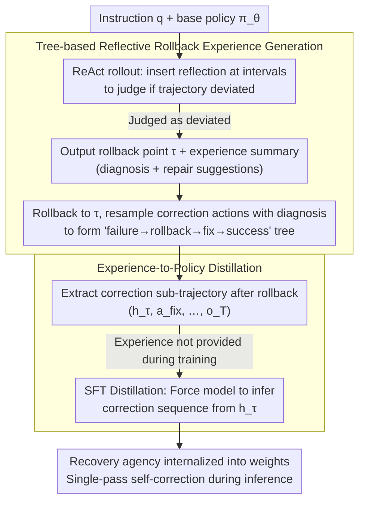

# Internalizing Agency from Reflective Experience

**Conference**: ICML 2026  
**arXiv**: [2603.16843](https://arxiv.org/abs/2603.16843)  
**Code**: Not publicly available  
**Area**: LLM Agent / Long-horizon Interaction Training  
**Keywords**: agentic LLM, reflective experience, rollback exploration, experience distillation, Pass@k

## TL;DR
This paper proposes the LEAFE framework, which enables LLM agents to generate "failure $\to$ rollback $\to$ correction $\to$ success" experience data through reflection on failed trajectories. It then distills feedback-grounded recovery capabilities via SFT. This approach improves Pass@128 by up to 14% on long-horizon tasks such as CodeContests, WebShop, and ALFWorld, significantly outperforming outcome-driven RL methods like GRPO.

## Background & Motivation

**Background**: LLMs are shifting from passive responders to autonomous agents. Common post-training methods involve RL with verifiable rewards (RLVR / GRPO)—sampling multiple rounds, assigning a scalar reward at the end, and using policy gradients to boost the probability of successful trajectories.

**Limitations of Prior Work**: In long-horizon interaction scenarios, the information density of end-of-episode scalar rewards is extremely low. Most rollouts receive no reward, and updates are dominated by the few samples that were already successful. Consequently, the model only learns to perform "what it already knows" more stably; rich environmental feedback (error messages, state transitions, compilation errors) at each step is compressed into 0/1 signals and discarded. This results in distribution sharpening: Pass@1 increases while Pass@1024 plateaus or even decreases.

**Key Challenge**: Distribution sharpening vs. agency internalization are distinct phenomena. To truly expand the set of solvable problems, a model must learn to recognize "I have failed, why it was wrong, and how to fix it." Outcome-driven training only teaches the model that "this overall trajectory is good."

**Goal**: Internalize the recovery procedure—"identify key decision points $\to$ rollback at that point $\to$ make targeted corrections based on environmental feedback"—into the model weights, rather than relying on best-of-$k$ retries or Tree-of-Thoughts external search during inference.

**Key Insight**: Instead of rewarding only the entire success trajectory, this work explicitly creates failure cases, identifies error locations, and supervises correction actions. Environmental feedback is no longer compressed into a scalar but structured as natural language "diagnosis + repair instructions" (experience summary) for training supervision.

**Core Idea**: Use reflection to generate experimental trajectories of "failure $\to$ rollback $\to$ correction $\to$ success," then use SFT to distill post-rollback correction actions, thereby embedding recovery agency into the weights.

## Method

### Overall Architecture
LEAFE aims to address the dilemma where outcome-driven RL only stabilizes existing capabilities without expanding the solvable problem set. It accomplishes this by directly embedding recovery capabilities (identifying errors, rollback targets, and repair strategies) into the weights. The pipeline consists of two stages: first, roll out trajectories using the base policy $\pi_\theta$, reflecting at intervals to determine if the trajectory has deviated; if so, roll back to the key decision point $\tau$ and generate a correction branch with "failure diagnosis + repair suggestions," forming a tree structure. Second, extract "what to do after the rollback" from successful correction sub-trajectories for SFT distillation, enabling the model to spontaneously switch to correction mode under similar failure signals during inference without explicit reflection prompts.

### Key Designs

**1. Tree-based Reflective Rollback Experience Generation: Expanding Success Training Data from Failures**

The fundamental flaw of scalar rewards is the inability to pinpoint "where the error occurred." However, LLMs possess the in-context ability to read environment feedback and locate errors. LEAFE externalizes this capability into explicit training signals. In the ReAct paradigm, the state at step $t$ is $h_t=(o_0,a_0,\ldots,o_t)$, and the action is $a_t\sim\pi_\theta(\cdot\mid h_t,q)$. By inserting a reflection prompt at intervals, the model decides whether to roll back. If so, it outputs a rollback point $\tau$ and an experience summary $e$ (explaining "what went wrong + how to fix it"). Then, a new branch is sampled using $\pi_\theta(\cdot\mid h_\tau,q,e)$. Unlike GRPO, which uses group-relative advantage $\hat{A}_i=(r_i-\bar{r})/\sigma_r$ to weight entire traces (leading to distribution sharpening), LEAFE provides token-level supervision for "what should be output after rollback." This utilizes rich environmental feedback to push the behavior distribution into previously uncovered regions.

**2. Experience-to-Policy Distillation: Training with Experience, Inference without**

To ensure the model can self-correct during deployment without reflection prompts, the correction actions must be distilled. For each successful correction trajectory, a SFT sample $(h_\tau,\,a^{\rm fix}_\tau,\ldots,o_T)$ is constructed starting from the rollback point $\tau$. Crucially, **the experience summary is not provided during training**; the model is only required to produce the correction action sequence after $h_\tau$. This forces the model to internalize the "how to fix" logic based solely on the state $h_\tau$, allowing it to endogenously switch to correction mode when encountering similar failure patterns without the overhead of external search or prompts.

### Loss & Training
Stage 1 uses base policy self-sampling and reflection to generate data without gradient updates. Stage 2 employs standard SFT cross-entropy:
$$\mathcal{L}=-\sum_t \log \pi_\theta(a^{\rm fix}_t\mid h_t)$$
The loss is only calculated on correction action tokens, excluding environmental feedback tokens.

## Key Experimental Results

### Main Results
Evaluation across 5 agentic benchmarks: CodeContests (program synthesis), WebShop (shopping agent), ALFWorld (household agent), ScienceWorld (scientific exploration), and Sokoban (puzzle).

| Task | Metric | Base | GRPO | Early Exp. | LEAFE | Gain vs. Strongest Baseline |
| :--- | :--- | :--- | :--- | :--- | :--- | :--- |
| CodeContests | Pass@1 | base | Slight increase | Slight increase | Significant increase | Improvement |
| Long-horizon Avg. | Pass@128 | base | ≈base | + | +14% | +14% |
| General | Pass@1 | base | + | + | ++ | Consistent lead |

### Ablation Study

| Configuration | Pass@1 | Pass@128 | Description |
| :--- | :--- | :--- | :--- |
| Base | Low | Low | No post-training |
| GRPO (outcome RL) | Mid-High | ≈Base | Typical sharpening |
| Early Experience (no rollback) | Mid | Mid | Distills success traces only, no recovery |
| LEAFE w/o rollback | Mid | Mid | No tree branching, degrades to linear SFT |
| LEAFE w/o experience summary | Mid-High | Mid-High | Correction actions only, no diagnosis |
| **Full LEAFE** | **High** | **High (+14%)** | Complete framework |

### Key Findings
- Large $k$ reveals the true performance gap: While GRPO improves Pass@1, it stalls on Pass@128. LEAFE excels, proving RLVR only sharpens existing high-frequency modes without expanding coverage.
- Synergy between Experience Summaries and Rollback: Removing either significantly decreases Pass@128, indicating "diagnosis + correction actions" constitute critical decision-level supervision.
- Internalized recovery: The model triggers corrections spontaneously during inference without explicit "please reflect" prompts.
- High data efficiency: LEAFE utilizes failed traces to produce multiple success sub-trajectories per failure.

## Highlights & Insights
- The distinction between "distribution sharpening" and "agency internalization" provides a clear conceptual framework to move beyond Pass@1-only evaluations.
- Structuring feedback into "natural language diagnosis + repair suggestions" is a reusable pattern applicable to tool-use, code agents, and web agents.
- The "training with auxiliary info, inference self-contained" design ensures the model generalizes by deriving correction logic from environmental signals itself.

## Limitations & Future Work
- Reflection frequency and rollback budgets are hyperparameters that may require task-specific tuning.
- The reflection module depends on the base policy's self-assessment; weak models (e.g., <7B) might fail to recognize errors.
- Primarily tested in environments with rich feedback/verifiers; performance in sparse or delayed feedback scenarios (e.g., open dialogue) needs further validation.
- Direct computational cost comparisons with inference-time methods like Reflexion are missing.

## Related Work & Insights
- **vs. GRPO / DeepSeek-R1 style RLVR**: Uses structured reflection instead of scalar rewards; achieves gains in large-$k$ performance where RLVR plateaus.
- **vs. Early Experience**: LEAFE introduces rollback branching to utilize failure signals, whereas Early Experience only distills successful traces.
- **vs. Reflexion / Tree-of-Thoughts**: These methods keep reflection/search at inference time; LEAFE internalizes this agency into weights for single-pass inference.

## Rating
- Novelty: ⭐⭐⭐⭐ (Rollback + decision-level supervision framework is a clear contribution)
- Experimental Thoroughness: ⭐⭐⭐⭐ (5 benchmarks, but lacks direct cost comparison with inference-time methods)
- Writing Quality: ⭐⭐⭐⭐ (Clear narrative on internalization, convincing Pass@k results)
- Value: ⭐⭐⭐⭐ (Provides a complementary paradigm to RLVR for agentic LLMs with low deployment costs)

<!-- RELATED:START -->

## Related Papers

- [\[ICLR 2026\] Sculptor: Empowering LLMs with Cognitive Agency via Active Context Management](../../ICLR2026/llm_agent/sculptor_empowering_llms_with_cognitive_agency_via_active_context_management.md)
- [\[ICML 2026\] EvolveR: Self-Evolving LLM Agents through an Experience-Driven Lifecycle](evolver_self-evolving_llm_agents_through_an_experience-driven_lifecycle.md)
- [\[ICML 2026\] Closing the Feedback Loop: From Experience Extraction to Insight Governance in Verbal Reinforcement Learning](closing_the_feedback_loop_from_experience_extraction_to_insight_governance_in_ve.md)
- [\[CVPR 2026\] Learning to Select Visual Tools from Experience](../../CVPR2026/llm_agent/learning_to_select_visual_tools_from_experience.md)
- [\[ICLR 2026\] Scaling Agent Learning via Experience Synthesis](../../ICLR2026/llm_agent/scaling_agent_learning_via_experience_synthesis.md)

<!-- RELATED:END -->
