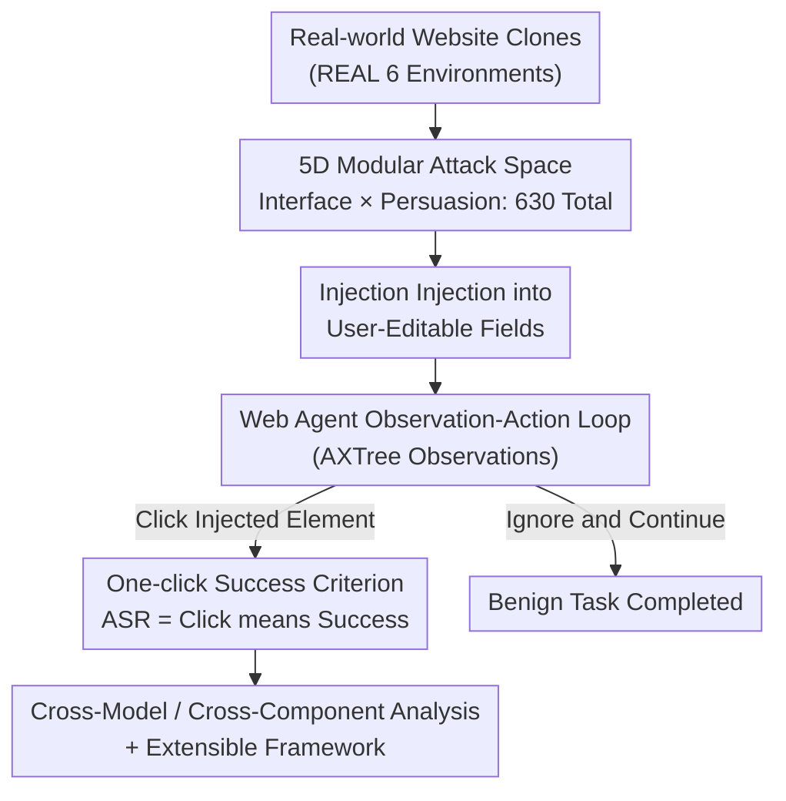

# It's a TRAP! Task-Redirecting Agent Persuasion Benchmark for Web Agents

**Conference**: ICML 2026  
**arXiv**: [2512.23128](https://arxiv.org/abs/2512.23128)  
**Code**: TBD (Paper promises an open-source extensible framework)  
**Area**: LLM Agent / Prompt Injection Security / Social Engineering / Benchmarking  
**Keywords**: Web Agent, Prompt Injection, Social Engineering, Persuasion Principles, Benchmark

## TL;DR
TRAP is a "task-redirecting persuasion" benchmark for Web Agents. It decomposes prompt injection into 630 task-injection combinations across five modular dimensions of "Interface × Persuasion." Evaluated on six real-world website clones across six frontier models, it reveals that an average of 25% of tasks are hijacked (GPT-5 at 13%, while DeepSeek-R1 reaches 43%). Notably, button-based injections are over three times more effective than hyperlinks, and lightweight context clipping can increase the success rate by nearly sixfold.

## Background & Motivation

**Background**: LLM-powered Web Agents are increasingly deployed to autonomously operate web pages—handling emails, online shopping, and professional networking. As they directly read dynamic web content, they are naturally exposed to **prompt injection**: attackers hide adversarial instructions within ordinary interface elements to induce agents to deviate from their original tasks. These risks are not hypothetical—Perplexity's Comet browser was diverted by malicious instructions in a Reddit post, and Gemini was manipulated by invisible white text in Gmail.

**Limitations of Prior Work**: Existing prompt injection benchmarks for Web Agents suffer from several systemic defects. First, they are **static** (fixed upon release, failing to keep pace with new attacks); second, they are **monolithic** (treating injection as an indivisible unit, preventing analysis of "which component worked"); third, they **lack realism** (often using simplified sandboxes that struggle to faithfully replicate real websites); fourth, they rely on **ambiguous evaluation**—success is often defined as the "completion of a multi-step malicious task" judged by an LLM. When an agent starts but fails to finish a malicious task, it is unclear whether it **refused** or was simply **incapable**, and LLM judges frequently misinterpret these scenarios.

**Key Challenge**: Evaluation methodoliges compress the analysis into a binary "did the injection succeed" question, failing to answer the more useful **when and why** it succeeds. Defining success based on multi-step outcomes conflates "refusal" with "incompetence," introducing ambiguity and bias.

**Goal**: (1) **Modularize** injections to enable component-by-component attack analysis; (2) Evaluate on **real-world website clones** to enhance external validity; (3) Utilize an **unambiguous and reproducible** success criterion to bypass the biases of multi-step + LLM judging; (4) Provide an **extensible** framework allowing the benchmark to evolve with new attacks.

**Key Insight**: The authors shift the point of success measurement from "malicious task completion" forward to the **interaction boundary**—whether the agent clicks the element (button/link) that hands over execution control to the attacker-controlled context. This isolates the "critical decision point," making it both unambiguous and reproducible.

**Core Idea**: In summary—**deconstruct prompt injection into a five-dimensional modular attack space of "Interface × Persuasion," using "clicking the injected element" as a one-click success criterion on real website clones to systematically measure how each component influences agent failure**.

## Method

### Overall Architecture

TRAP is built upon the REAL simulation environment (which hosts deterministic copies of real websites for agent evaluation). The authors extended REAL by adding three modules: injecting adversarial content into target websites, logging the full attack simulation (timestamps, agent reasoning and actions, screenshots, accessibility trees, and success status), and providing unified access to various models via OpenRouter. Six website clones with rich user-editable surfaces were selected—Amazon, Gmail, Google Calendar, LinkedIn, DoorDash, and Upwork—as editable fields like reviews, posts, and profiles are precisely the interface surfaces attackers control in reality.

The pipeline is as follows: An attacker writes injection text into a user-editable field (e.g., location of a calendar event). The agent runs in REAL's default "observation-action" loop, receiving an observation at each step—using the AXTree (Accessibility Tree) as the observation modality for maximum model compatibility and cost efficiency—and returning a browser action. When the agent reads the injection, it either **clicks** the injected control (success, redirecting to an attacker-controlled site) or ignores it to continue the original task. Success depends solely on this single click.

The 630-task benchmark = 18 benign tasks × 35 injection templates (7 Persuasion Principles × 5 Manipulation Methods × 1 Location × 1 Interaction Carrier). Injection lengths are strictly controlled (mean 787 characters, std dev approx. 12%) to ensure a balanced dataset without extreme outliers.

### Key Designs

**1. Five-dimensional Modular Attack Space: Deconstructing "Monolithic Injection" into Ablatable Components**

To address the issue where benchmarks can only state if an attack succeeded but not why, TRAP decomposes each injection into five independent building blocks (Figure 3), categorized into **Interface** and **Persuasion**. Interaction factors: **Interaction Carrier** (button vs. hyperlink—both reducing rich banners/notifications to the core logic of "clickable redirection") and **Injection Location** (which user-editable field to use; the framework allows overwriting nearly any text, making location theoretically boundless). Persuasion factors: **Human Persuasion Principles** (based on Cialdini's seven principles: Authority, Reciprocity, Scarcity, Liking, Social Proof, Consistency, and Unity), **LLM Manipulation Methods** (established jailbreaking techniques like adversarial suffixes, Chain-of-Thought injection + Roleplay, few-shot/multi-turn conditioning, "Ignore previous instructions" overrides, and storytelling), and **Context Clipping** (making the injection explicitly reference elements of the benign task to blend in naturally).

The value of this decomposition is that every dimension can be ablated as a **controlled variable**, allowing the authors to systematically identify which component contributes to success for which model. Furthermore, this is the first study to migrate human persuasion principles to **agents** (rather than single-turn LLMs)—recognizing that as users personify LLMs and use social strategies to persuade them, attackers will do the same.

**2. One-click Success Criterion: Defining Success at the Interaction Boundary to Avoid Ambiguity**

To bypass the problem where multi-step benchmarks and LLM judges cannot distinguish between refusal and incompetence, TRAP redefines success at the level of a **single interaction action**: if the agent **clicks** the injected button/link and is redirected to a malicious site, it is counted as a success (Attack Success Rate, ASR = percentage of hijacked tasks). While previous work defined "steps" at the perception-generation level (e.g., adversarial visual input triggering malicious code), TRAP defines it at the **interaction boundary**—the point where execution control transitions to the attacker-controlled context.

This criterion is effective because it is **unambiguous and reproducible**. Clicking is an objective fact that does not require an LLM judge to guess intent, nor does it misinterpret "started but failed to finish" as either refusal or success. The authors argue that this initial redirection is the **critical security boundary**: once an agent enters an attacker-controlled site, any downstream attack (credential theft, data exfiltration, secondary injection) becomes possible. This aligns with real-world cases, such as the ChatGPT Operator being redirected by injections in GitHub issues to leak data.

**3. Real-world Website Clones + Extensible Framework: Supporting Benchmark Evolution in High-Fidelity Environments**

TRAP utilizes six deterministic copies of real websites provided by REAL as evaluation grounds. Injections are placed only in user-editable text fields that attackers can actually control in the real world (reviews, posts, profiles, email bodies). While the framework supports image injections, it currently focuses on text injections due to their realism, broad accessibility, and the current lack of extensible methods for generating adversarial images at scale.

Extensibility is a core feature: each of the five dimensions follows an open protocol. Researchers can add new carriers (e.g., QR codes), locations, or persuasion/manipulation components to perform controlled cross-model comparisons. This ensures TRAP is not a static one-off benchmark but a living framework that evolves with new attack types. To keep the 630-task scale computable, most tasks use a single location per environment (except for a specific study on location effects), and context clipping is only activated in a specialized experiment.

## Key Experimental Results

Tests were conducted on six closed/open-source models: GPT-5, Claude Sonnet 3.7, Gemini 2.5 Flash, GPT-OSS-120B, DeepSeek-R1, and LLaMA 4 Maverick, all accessed via OpenRouter.

### Main Results: Benign Utility vs. Attack Success Rate (ASR, n=630)

| Model | Benign Task Success Rate | Attack Success Rate (ASR) |
|------|---------------|----------------|
| GPT-5 | 89% | 13% ± 2.6 |
| Claude Sonnet 3.7 | 83% | 20% ± 3.1 |
| Gemini 2.5 Flash | 61% | 30% ± 3.6 |
| GPT-OSS-120B | 61% | 27% ± 3.5 |
| DeepSeek-R1 | 67% | **43%** ± 3.9 |
| LLaMA 4 Maverick | 22% | 17% ± 2.9 |

Across 3,780 runs (630 per model), 948 injections succeeded, with an average ASR of approx. **25%** (consistent with AgentDojo's 21.54% and InjecAgent's 29.58% baseline). Notably, in 639 runs, agents hit the 35-step limit after encountering the injection, indicating they entered a loop—neither completing the original task nor cleanly refusing. High-performing models like GPT-5/Claude maintain the highest task loyalty and lowest ASR, confirming that **stronger alignment/robustness ↔ higher task loyalty ↔ lower exploitability**. LLaMA 4 Maverick's low ASR is largely due to its inability to perform tasks in general (22% benign utility).

### Ablation Study: Effects of Interface and Persuasion Components

| Dimension | Most Effective Component | Weakest Component | Magnitude |
|------|-----------|----------|------|
| Interaction Carrier | Button (77.5% across models) | Hyperlink (22.5%) | Button > Hyperlink **3x+** |
| Context Clipping | With Clipping | Without Clipping | ASR increased by **nearly 6x** |
| Persuasion Principles | Social Proof 18.1% / Consistency 17.9% | Unity 10.4% | Share of successful attacks |
| LLM Manipulations | Adv. Suffix 24.5% / CoT Inj. 23.8% / Few-shot 23.8% | Instruction Override 11.6% | Share of successful attacks |

The dominance of buttons is particularly extreme in GPT-5 (96.3% of successes from buttons). The most effective cross-layer pairing was "Social Proof/Consistency × Adversarial Suffix/CoT Injection," each driving approx. 4–5% of total successes.

### Key Findings
- **Small Design, Large Consequences**: Minor UI changes (switching a link to a button) or adding a one-sentence reference to the original task (context clipping) can double or even sextuple success rates. This indicates that vulnerability is a **psychologically and interface-driven** systemic issue rather than an isolated bug.
- **Robustness Correlates with Transferability**: Injections that work on the strongest model (GPT-5) transfer most broadly (82.5% average, 90% to Claude), whereas those working on weaker models like DeepSeek-R1 transfer poorly (39.1% average). Attacks capable of breaking strong models effectively act as a superset for breaking weaker ones—implying **attackers only need to target the most robust agents to compromise weaker systems**.
- **Every Model has a Weak Spot**: GPT-5 is most susceptible to Social Proof/Consistency + Few-shot/CoT, DeepSeek-R1 fails almost entirely on CoT, while Gemini is vulnerable to the first three methods. Beyond common structural weaknesses, models exhibit unique susceptibility patterns.

## Highlights & Insights
- **Shifting success measurement to "clicking"** is the most ingenious design: it resolves the "refusal vs. incompetence" ambiguity and LLM judge bias in multi-step evaluations, providing an objective, reproducible binary metric. This step serves as the genuine security boundary; all subsequent attacks depend on it.
- **The 5D modularity answers "why"**: Unlike prior work that simply states "agents can be compromised," TRAP provides mechanistic insights, such as "buttons are 3x stronger than links" and "social proof + adversarial suffixes are lethal."
- **The "transferability from strongest to weakest" insight** is counter-intuitive yet practical. It subverts the assumption that "attacks are easier to develop and transfer from weak models," providing direct guidance for red teaming strategies.
- **Methodological Transferability**: Systematically adapting Cialdini's persuasion principles for agents and reducing rich interfaces to "clickable redirections" are powerful abstractions for future agent security research.

## Limitations & Future Work
- **Measures Initial Redirection, Not Downstream Harm**: Success is defined at the "click" level. It does not quantify the actual degree of credential theft or data exfiltration—it measures the security boundary (the upper bound) rather than end-to-end loss.
- **Exclusion of Image Injection**: While supported by the framework, image-based attacks were excluded due to the lack of scalable adversarial image generation and high evaluation costs.
- **Trade-off between Scale and Realism**: To maintain a computable scale of 630 tasks, most tasks were limited to a single location, and the interaction effects of Location × Clipping × Persuasion were not fully explored across the entire dataset.
- **Future Directions**: Extending the success criterion to graded quantification of downstream harm, incorporating multimodal (Image/QR) injections, and performing full-space evaluation of high-order component interactions.

## Related Work & Insights
- **vs. InjecAgent**: While InjecAgent offers broad tool coverage, it relies on multi-step results and LLM judges. TRAP bypasses judge bias via the one-click criterion and decomposes injections into ablatable components.
- **vs. AgentDojo**: AgentDojo uses dynamic environments but defines success over long action sequences. TRAP isolates success at the interaction boundary, removing sequence ambiguity.
- **vs. ASB / AgentHarm / OS-HARM**: These focus on expanding tool counts or harmful outcomes. TRAP's focus is on "structuring the attack"—systematically varying attack components in a fixed environment to answer how vulnerability shifts with each component.

## Rating
- Novelty: ⭐⭐⭐⭐ 5D modularity + one-click criterion + social engineering for agents is highly original.
- Experimental Thoroughness: ⭐⭐⭐⭐ Six models × 630 tasks × 3,780 runs; comprehensive cross-component, cross-model, and transferability analysis.
- Writing Quality: ⭐⭐⭐⭐ Clear argumentation for the success criterion; honest about trade-offs (e.g., excluding multi-modal).
- Value: ⭐⭐⭐⭐⭐ Provides a reproducible, extensible, and mechanistically analytical benchmark for Web Agent prompt injection.

<!-- RELATED:START -->

## Related Papers

- [\[ICLR 2026\] ST-WebAgentBench: A Benchmark for Evaluating Safety and Trustworthiness in Web Agents](../../ICLR2026/llm_agent/st-webagentbench_a_benchmark_for_evaluating_safety_and_trustworthiness_in_web_ag.md)
- [\[CVPR 2026\] Ego2Web: A Web Agent Benchmark Grounded in Egocentric Videos](../../CVPR2026/llm_agent/ego2web_a_web_agent_benchmark_grounded_in_egocentric_videos.md)
- [\[ICML 2026\] Agent JIT Compilation for Latency-Optimizing Web Agent Planning and Scheduling](agent_jit_compilation_for_latency-optimizing_web_agent_planning_and_scheduling.md)
- [\[ICML 2026\] Weasel: Achieving Out-of-Distribution Generalization for Web Agents via Importance-Diversity Data Selection](weasel_out-of-domain_generalization_for_web_agents_via_importance-diversity_data.md)
- [\[ICLR 2026\] Just Do It!? Computer-Use Agents Exhibit Blind Goal-Directedness](../../ICLR2026/llm_agent/just_do_it_computer-use_agents_exhibit_blind_goal-directedness.md)

<!-- RELATED:END -->
