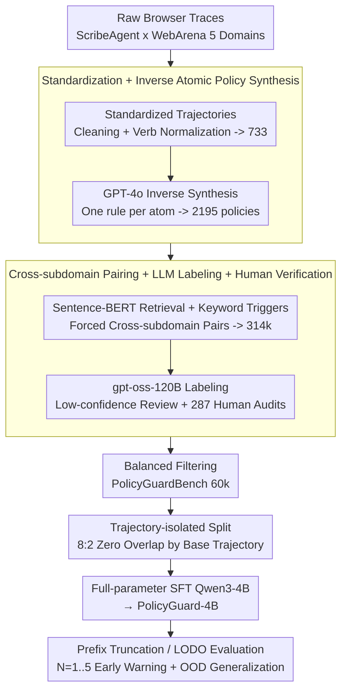

# Learning Efficient Guardrails for Compliance

**Conference**: ICML 2026  
**arXiv**: [2510.03485](https://arxiv.org/abs/2510.03485)  
**Code**: Project Page: learning-efficient-guardrails-for-compliance (link provided in the paper)  
**Area**: LLM Safety / Agent Compliance / Guardrail  
**Keywords**: Policy Compliance, Trajectory Auditing, Guardrail Models, Web Agents, Prefix Detection

## TL;DR
This paper constructs PolicyGuardBench, a 60k-scale dataset (5 domains, 733 standardized trajectories × 2195 atomic policies → 60,000 trajectory-policy pairs, including cross-subdomain and prefix truncation settings). By performing full-parameter SFT on Qwen3-4B-Instruct, the authors develop PolicyGuard-4B, a lightweight guardrail model. It achieves 90.14% accuracy and 87.59% F1 at a latency of 22.5 ms/sample, matching or exceeding 70B-class open-source models and Claude-Sonnet-4, while demonstrating strong cross-domain generalization (LODO OOD F1 $\approx$ 0.91).

## Background & Motivation

**Background**: Current autonomous Web Agents (e.g., ScribeAgent, planning/reasoning work on WebArena) can complete long-horizon tasks but must adhere to external rules during deployment, such as platform policies, enterprise regulations, and ethical or regulatory requirements. Existing guardrail research primarily follows the "safety-oriented" route: the LlamaGuard series and ShieldGemma detect toxic prompts, jailbreaks, or dangerous code, while AGrail, ShieldAgent, and LlamaFirewall focus on OS-level attacks or formal verification.

**Limitations of Prior Work**: The authors' empirical tests show that safety guardrails like LlamaGuard-3/4 and ShieldGemma are nearly unusable for policy compliance tasks—LlamaGuard series models predict almost all inputs as the same class, with accuracy hovering between 42–58% and F1 scores degrading to near 0. Conversely, using 70B+ frontier LLMs as guardrails achieves 88–90% accuracy but with latencies of 200–3600 ms/sample, making online intervention impractical. Furthermore, existing evaluations like ST-WebAgentBench, SafeArena, and WebSuite observe the gap between task completion and policy compliance but lack a large-scale, systematically annotated dataset covering cross-subdomain and early-detection scenarios.

**Key Challenge**: The authors argue that "safety" and "policy compliance" are orthogonal dimensions—the former concerns content toxicity, jailbreaks, or irreversible disasters, while the latter concerns whether a trajectory violates specific business rules (e.g., "total purchase must not exceed $\$200$," "require double confirmation before deletion"). Treating them as the same leads to two failures: using safety guardrails for compliance detection results in severe overfitting to coarse-grained signals like toxicity, while using frontier LLMs is linearly inefficient and unacceptable for online use. Additionally, violations are often cumulative ("adding one cake is fine, adding a second violates the rule"); thus, a good guardrail must predict violations before the trajectory finishes to prevent irreversible actions.

**Goal**: (i) Establish policy-trajectory compliance as an independent task and construct a large-scale benchmark; (ii) train a small guardrail model that is both accurate and fast, proving that the 4B scale is sufficient; (iii) introduce "prefix detection" settings to quantify the model's ability to detect violation signals early in a trajectory.

**Key Insight**: Most Web Agent policy violations can be checked under atomized rules. By standardizing heterogeneous browser events into a uniform action vocabulary (Click, Input, Scroll, etc.) and then using GPT-4o to inversely synthesize "one rule per atom" policies from trajectories, and finally pairing policies with trajectories from different subdomains within the same domain (forcing cross-subdomain negative/positive pairs), compliance detection can be framed as a "binary instruction-following" task. This allows small models to perform effectively without relying on RLHF.

**Core Idea**: Construct 60k high-quality binary data through a four-step process: "standardizing trajectories + inversely synthesizing atomic policies + cross-subdomain pairing + prefix truncation." Then, use single-task SFT to train Qwen3-4B into a specialized guardrail, outperforming 70B+ general LLMs and existing safety guardrails at a 4B scale.

## Method

### Overall Architecture
This solution addresses whether an accurate, fast, and cross-domain generalizable compliance guardrail can be trained without human-written rules or 70B models. The authors split this into data and model components. On the data side, starting from raw browser traces generated by ScribeAgent on five WebArena domains, the process follows four steps: trajectory standardization, inverse policy synthesis, cross-subdomain pairing, and violation annotation. This turns 733 base trajectories and 2,195 policies into 314,556 raw pairs, which are then filtered into PolicyGuardBench with 59,997 label-balanced pairs (42.4% violation / 57.6% compliance, 41.6% cross-subdomain). On the model side, `(policy, standardized action sequence, domain metadata)` is concatenated into an instruction to output a binary label `{violation, no_violation}`. After an 8:2 split based on base trajectories (ensuring zero overlap), Qwen3-4B-Instruct is fine-tuned via full-parameter SFT to obtain PolicyGuard-4B.

### Key Designs

**1. Standardized Trajectories + Inverse Atomic Policy Synthesis: Converging Heterogeneous Rules and Trajectories into a Unified Interface**

The most difficult part of compliance detection is the heterogeneity of both rules and trajectories. The authors' approach is to "atomize and patternize" both. Trajectories are cleaned (removing empty events/duplicate rendering) and normalized (into Click/Input/Scroll/Select/Navigate/Submit). Objects are normalized into names like `link 'My Account'`, and then serialized into sentential text. For rules, instead of human writing, GPT-4o is given the trajectory and outcome to write 2-3 atomic rules with **only one constraint each** (e.g., "Do not click 'Delete' without a prior confirmation step"). After filtering and deduplication, 2,195 rules remain, each with a structured schema containing `source_subdomain` and up to 2 `target_subdomain`. This step is crucial as it compresses the inputs into a single interface for both the LLM annotator and the guardrail model; "one rule per atom" is naturally machine-verifiable.

**2. Cross-subdomain Pairing + LLM Labeling + Human Review: Achieving ~90% Consistency with Two-stage Annotation**

To ensure the guardrail learns transferable patterns rather than memorizing trajectories, cross-subdomain generalization pressure is introduced. The authors use Sentence-BERT for embedding retrieval to recall candidate policies for each trajectory, combined with keyword triggers (e.g., `delete` or `confirm`). Policies are then paired with trajectories from their native subdomain (source) and up to 2 different subdomains (target). Final data is 41.6% cross-subdomain. Negative examples are created by randomly pairing non-violating policies within the same domain. The 60k pairs are labeled by gpt-oss-120B, which provides labels and confidence scores; low-confidence cases are flagged for human review. An independent human audit of 287 pairs showed 89.8% consistency with the original labels.

**3. Trajectory-isolation Splitting + Prefix Truncation Evaluation: Blocking Memory Leakage and Quantifying "Early Warning" Capabilities**

If split randomly by pair, different pairs of the same trajectory would appear on both sides, allowing the model to cheat by memorizing trajectories. Thus, the 8:2 split is anchored on the 733 base trajectories. Two additional evaluation layers are added: (i) Prefix Detection, which truncates violation samples to the first $N$ steps ($N=1,\dots,5$) to force the model to predict before completion; (ii) Leave-one-domain-out (LODO), where one domain is held out as OOD. The former addresses the irreversibility of violations (e.g., deleting a database), and the latter distinguishes "trajectory pattern memorization" from "compliance pattern learning."

### Loss & Training
PolicyGuard-4B uses standard supervised instruction tuning: full-parameter SFT on Qwen3-4B-Instruct. The input is a unified prompt of `(policy, action sequence, domain metadata)`, and the output is strictly formatted as `violation` or `no_violation`. The loss is standard next-token cross-entropy. Decoding temperature is set to 0 for reproducibility. No reward model or multi-task headers were introduced to verify that "small model + clean binary SFT" is sufficient.

## Key Experimental Results

### Main Results: Full-trajectory Compliance Detection (PolicyGuardBench 12k Test Set)

| Model | Type | Size | Accuracy | F1 | Latency (ms/ex) |
|------|------|------|----------|-----|------------------|
| Claude-Sonnet-4 | Closed frontier | – | 0.8983 | 0.8678 | 1238 |
| Gemini-1.5-Pro | Closed frontier | – | 0.8713 | 0.8502 | 596 |
| DeepSeek-V3.1 (non-think) | Open frontier | 685B | 0.8613 | 0.8407 | 3270 |
| Llama-3.3-70B-Instruct | IT | 70B | 0.9054 | 0.8883 | 305 |
| Qwen2.5-72B-Instruct | IT | 72B | 0.8825 | 0.8607 | 205 |
| Gemma-3-12B-IT | IT | 12B | 0.8964 | 0.8773 | 51.3 |
| Qwen3-4B-Instruct (base) | IT | 4B | 0.6897 | 0.5348 | 25.6 |
| LlamaGuard-3 | Safety guardrail | 8B | 0.4246 | 0.5952 | 164.8 |
| LlamaGuard-4 | Safety guardrail | 12B | 0.4239 | 0.5954 | 175.3 |
| ShieldGemma-27B | Safety guardrail | 27B | 0.5555 | 0.1834 | 45.0 |
| **PolicyGuard-4B (Ours)** | **FT** | **4B** | **0.9014** | **0.8759** | **22.5** |

### Prefix Detection (Accuracy under different prefix lengths $N$)

| Model | $N{=}1$ | $N{=}2$ | $N{=}3$ | $N{=}4$ | $N{=}5$ | Average |
|------|------|------|------|------|------|------|
| Llama-3.2-3B-Instruct | 0.9086 | 0.8199 | 0.7348 | 0.6377 | 0.5693 | 0.7341 |
| Qwen3-4B-Instruct (base) | 0.8832 | 0.8231 | 0.8038 | 0.7688 | 0.7330 | 0.8024 |
| Llama-3.3-70B-Instruct | 0.9298 | 0.8441 | 0.8368 | 0.8305 | 0.8191 | 0.8521 |
| Llama-4-Scout-17B | 0.9389 | 0.8854 | 0.8583 | 0.8355 | 0.8237 | 0.8684 |
| Qwen3-235B-A22B | 0.8976 | 0.8752 | 0.8644 | 0.8569 | 0.8498 | 0.8688 |
| Gemini-1.5-Pro | 0.8990 | 0.8779 | 0.8667 | 0.8630 | 0.8543 | 0.8722 |
| **PolicyGuard-4B** | **0.9101** | **0.8648** | **0.8441** | **0.8276** | **0.8190** | **0.8531** |

### Ablation Study: Cross-domain Generalization (LODO)

| Domain | ID Acc | ID F1 | OOD Acc | OOD F1 |
|--------|--------|-------|---------|--------|
| GitLab | 0.9314 | 0.9272 | 0.9116 | 0.9116 |
| Map | 0.9361 | 0.9343 | 0.9020 | 0.9078 |
| Reddit | 0.9326 | 0.9338 | 0.9024 | 0.9055 |
| Shopping | 0.9362 | 0.9370 | 0.9174 | 0.9137 |
| Shopping-Admin | 0.9276 | 0.9288 | 0.9079 | 0.9044 |
| **Average** | **0.9328** | **0.9322** | **0.9083** | **0.9086** |

### Key Findings
- Safety guardrails *fail* entirely: LlamaGuard series F1 scores degenerate to constant predictions, and ShieldGemma-27B has an F1 of 0.18. This empirically supports the authors' claim that toxicity supervision does not transfer to compliance.
- For the same Qwen3-4B-Instruct, the base model achieved 68.97% Acc / 0.5348 F1, while the SFT version achieved 90.14% Acc / 0.8759 F1 (+21pp Acc / +34pp F1), proving that task-specific SFT is more cost-effective than scaling.
- In prefix detection, most models show high accuracy at $N{=}1$, which decreases as $N$ increases. This suggests early violations are often explicit actions, while later ones are cumulative and harder to judge. PolicyGuard-4B performs similarly to Gemini-1.5-Pro on this curve.
- Average OOD F1 is 0.9086, only a ~2.4pp drop from ID, proving that the model learns transferable compliance patterns rather than memorizing trajectories.

## Highlights & Insights
- **The Orthogonality of "Safety $\neq$ Compliance"**: The authors prove through experiments that safety and compliance are distinct, providing a clear new dimension for agent safety research.
- **Inverse Synthesis of Atomic Policies**: This bypasses the high cost of human-written rules and the noise in ToS texts. The "trajectory $\rightarrow$ policy" reverse engineering approach is highly transferable to other domains like API or SQL compliance.
- **Efficiency of 4B SFT**: With 22.5 ms latency and 90% accuracy, this model has virtually no competitors in actual deployment scenarios, demonstrating that for narrow tasks like compliance, high-quality data is more valuable than scaling.

## Limitations & Future Work
- Data is limited to WebArena and ScribeAgent; transferring to enterprise SaaS or mobile apps will require re-standardization.
- Reliance on GPT-4o for synthesis and labeling may introduce LLM biases, such as favoring explicit "prohibitive" rules over timing or race-condition constraints.
- Evaluation remains binary, lacking quantification of violation severity or multi-labeling.
- Prefix detection is "offline truncation"; online sequential decision-making and backtracking after a warning remain to be addressed.
- Absence of adversarial robustness testing (e.g., paraphrasing policy wording or inserting distractors in trajectories).

## Related Work & Insights
- **vs LlamaGuard-3/4, ShieldGemma**: These models focus on prompt/output toxicity; this work addresses trajectory-policy compliance.
- **vs ShieldAgent**: ShieldAgent uses formal verification via probabilistic circuits, which is strong for high-stakes provability but requires hand-written rules. PolicyGuard-4B is more scalable and handles real web complexity.
- **vs AGrail / LlamaFirewall**: These focus on OS/system-level defense, while this work focuses on platform business rules. PolicyGuard-4B could serve as a compliance module within lifelong adaptive guardrails like AGrail.

## Rating
- Novelty: ⭐⭐⭐⭐ (Splitting "compliance" from "safety" and the inverse synthesis pipeline is novel; the model side is standard SFT).
- Experimental Thoroughness: ⭐⭐⭐⭐⭐ (Covers 22 baselines, 5 domains, 5 prefix lengths, LODO, efficiency, and human audit).
- Writing Quality: ⭐⭐⭐⭐ (Clear logic and well-organized figures/tables).
- Value: ⭐⭐⭐⭐⭐ (Directly deployable 4B model and 60k benchmark have high engineering value).

<!-- RELATED:START -->

## Related Papers

- [\[ICML 2026\] Agent-Omit: Adaptive Context Omission for Efficient LLM Agents](agent-omit_adaptive_context_omission_for_efficient_llm_agents.md)
- [\[ICLR 2026\] Efficient Agent Training for Computer Use](../../ICLR2026/llm_agent/efficient_agent_training_for_computer_use.md)
- [\[ACL 2026\] WebClipper: Efficient Evolution of Web Agents with Graph-based Trajectory Pruning](../../ACL2026/llm_agent/webclipper_efficient_evolution_of_web_agents_with_graph-based_trajectory_pruning.md)
- [\[ICML 2026\] On Information Self-Locking in Reinforcement Learning for Active Reasoning of LLM Agents](on_information_self-locking_in_reinforcement_learning_for_active_reasoning_of_ll.md)
- [\[ICML 2026\] AutoRPA: Efficient GUI Automation through LLM-Driven Code Synthesis from Interactions](autorpa_efficient_gui_automation_through_llm-driven_code_synthesis_from_interact.md)

<!-- RELATED:END -->
